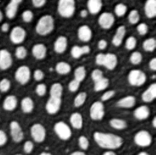
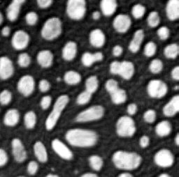

# CLIJ Example: applyVectorFieldMD.ijm

This script demonstrates how to apply a vector field
to an image in order to transform it non-rigidly

Author: Robert Haase, rhaase@mpi-cbg.de
March 2019

Get test data

```java
run("Close All");

// get test image
run("Blobs (25K)");
input = getTitle();

```
<a href="image_1587212184330.png"></a>

Create two images describing local shift

```java
shiftX = "shiftX";
shiftY = "shiftY";
newImage(shiftX, "32-bit black", 256, 254, 1);
newImage(shiftY, "32-bit black", 256, 254, 1);

// Blur the shift to make it smooth in space
selectImage("shiftX");
makeOval(20, 98, 72, 68);
run("Add...", "value=25");
run("Select None");
run("Gaussian Blur...", "sigma=15");
run("Enhance Contrast", "saturated=0.35");

```
<a href="image_1587212188199.png"></a>
<a href="image_1587212188209.png"></a>

## Initialize GPU and push images to GPU memory

```java
run("CLIJ2 Macro Extensions", "cl_device=");
Ext.CLIJ2_push(input);
Ext.CLIJ2_push(shiftX);
Ext.CLIJ2_push(shiftY);

```

## Apply shift; rotate it; apply again in a loop

```java
for (i = 0; i < 36; i += 6) {

	// change the shift from slice to slice
	Ext.CLIJ2_affineTransform2D(shiftX, rotatedShiftX, "-center rotate=" + (i * 10) + " center");
	
	// apply transform
	Ext.CLIJ2_applyVectorField2D(input, rotatedShiftX, shiftY, transformed);

	// get result back from GPU
	Ext.CLIJ2_pull(transformed);
	rename("Angle " + (i * 10) + " deg");
}

```
<a href="image_1587212192189.png"></a>
<a href="image_1587212192239.png"></a>
<a href="image_1587212192294.png"></a>
<a href="image_1587212192343.png"></a>
<a href="image_1587212192392.png"></a>
<a href="image_1587212192452.png"></a>

Cleanup by the end

```java
Ext.CLIJ2_clear();
```


```
```
