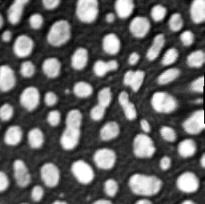

# Warp images
Author: Robert Haase, rhaase@mpi-cbg.de
March 2019

[Source](https://github.com/clij/clij2-docs/tree/master/src/main/macro/applyVectorFieldMD.ijm)

This script demonstrates how to apply a vector field
to an image in order to transform it non-rigidly

Get test data

<pre class="highlight">
run("Close All");

// get test image
run("Blobs (25K)");
input = getTitle();

</pre>

Create two images describing local shift

<pre class="highlight">
shiftX = "shiftX";
shiftY = "shiftY";
newImage(shiftX, "32-bit black", 256, 254, 1);
newImage(shiftY, "32-bit black", 256, 254, 1);

// Blur the shift to make it smooth in space
selectImage("shiftX");
makeOval(20, 98, 72, 68);
run("Add...", "value=25");
run("Select None");
run("Gaussian Blur...", "sigma=15");
run("Enhance Contrast", "saturated=0.35");

</pre>

## Initialize GPU and push images to GPU memory

<pre class="highlight">
run("CLIJ2 Macro Extensions", "cl_device=");
Ext.CLIJ2_push(input);
Ext.CLIJ2_push(shiftX);
Ext.CLIJ2_push(shiftY);

</pre>

## Apply shift; rotate it; apply again in a loop

<pre class="highlight">
for (i = 0; i < 36; i += 6) {

	// change the shift from slice to slice
	Ext.<a href="https://clij.github.io/clij2-docs/reference_affineTransform2D">CLIJ2_affineTransform2D</a>(shiftX, rotatedShiftX, "-center rotate=" + (i * 10) + " center");
	
	// apply transform
	Ext.<a href="https://clij.github.io/clij2-docs/reference_applyVectorField2D">CLIJ2_applyVectorField2D</a>(input, rotatedShiftX, shiftY, transformed);

	// get result back from GPU
	Ext.CLIJ2_pull(transformed);
	rename("Angle " + (i * 10) + " deg");
}

</pre>

Cleanup by the end

<pre class="highlight">
Ext.CLIJ2_clear();
</pre>

