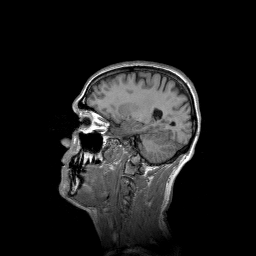
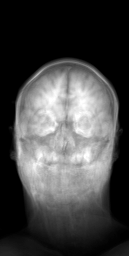
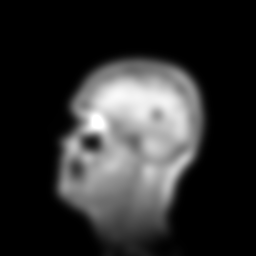
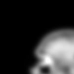
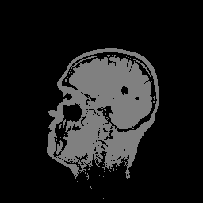

# Basics of image processing with CLIJ

This notebooks introduces how images can be processed with CLIJ. 

Let's start by cleaaning up and opening an example dataset. For this, we use ImageJ-functions:

<pre class="highlight">
// clean up first
run("Close All");
run("Clear Results");

// open the T1 heade example, a 3D MRI image
open("http://imagej.nih.gov/ij/images/t1-head.zip");
</pre>

We now initialize the GPU and push the image as explained in the [basics of clij tutorial](https://clij.github.io/clij2-docs/md/basics/).

<pre class="highlight">
run("CLIJ2 Macro Extensions", "cl_device=");
Ext.<a href="https://clij.github.io/clij2-docs/reference_clear">CLIJ2_clear</a>();

// push image to GPU memory
stack = getTitle();
Ext.<a href="https://clij.github.io/clij2-docs/reference_push">CLIJ2_push</a>(stack);
</pre>

## Images and image stacks
The image we loaded and pushed to the GPU is a 3D image, which can also be called an image stack. CLIJ supports 2D and 3D images only. Time lapses and multi-channel data need to be processed timepoint-by-timepoint and channel by channel.

We can find out how large our current image is by measuring its dimensions and writing them to the results table:

<pre class="highlight">
Ext.<a href="https://clij.github.io/clij2-docs/reference_getDimensions">CLIJ2_getDimensions</a>(stack, width, height, number_of_slices);
setResult("Width", 0, width);
setResult("Height", 0, height);
setResult("Number of slices", 0, number_of_slices);
</pre>
<table>
<tr><th>Width</th><th>Height</th><th>Number of slices</th></tr>
<tr><td>256</td><td>256</td><td>129</td></tr>
</table>

If you want to work with a single slice of such an image, you can retrieve it by copying it out of the stack.
You need to provide a slice number, which counts 0-based. Thus, the first slice has index 0:

<pre class="highlight">
// copy a given slice
slice_index = 50;
Ext.<a href="https://clij.github.io/clij2-docs/reference_copySlice">CLIJ2_copySlice</a>(stack, slice, slice_index);
// show the slice
Ext.<a href="https://clij.github.io/clij2-docs/reference_pull">CLIJ2_pull</a>(slice);
</pre>

Alternatively, you can use projections to reduce a 3D image to a 2D image. This might makes sense for better visualization depending on the data:

<pre class="highlight">
// create projections
Ext.<a href="https://clij.github.io/clij2-docs/reference_maximumZProjection">CLIJ2_maximumZProjection</a>(stack, max_z_projection);
Ext.<a href="https://clij.github.io/clij2-docs/reference_meanXProjection">CLIJ2_meanXProjection</a>(stack, mean_x_projection);
// show projections
Ext.<a href="https://clij.github.io/clij2-docs/reference_pull">CLIJ2_pull</a>(max_z_projection);
Ext.<a href="https://clij.github.io/clij2-docs/reference_pull">CLIJ2_pull</a>(mean_x_projection);
</pre>

## Processing images in 2D and 3D
When processing images, you call a function and hand over at least two images: the input image and an output image.
If the output image doesn't exist yet, it will be created. If the output image exists already, it will be overwritten. 

<pre class="highlight">
// apply a Gaussian blur filter
sigma = 5;
Ext.<a href="https://clij.github.io/clij2-docs/reference_gaussianBlur2D">CLIJ2_gaussianBlur2D</a>(slice, blurred, sigma, sigma);
// show result
Ext.<a href="https://clij.github.io/clij2-docs/reference_pull">CLIJ2_pull</a>(blurred);
</pre>

Note: If the output image exists already but has the wrong size, its size will not be changed. 
We can demonstrate that by creating an image in advance. Note: The size of the image may be misleading when viewing this example in the browser.

<pre class="highlight">
width = 150;
height = 150;
bit_depth = 32;
Ext.<a href="https://clij.github.io/clij2-docs/reference_create2D">CLIJ2_create2D</a>(to_small_image, width, height, bit_depth);
Ext.<a href="https://clij.github.io/clij2-docs/reference_gaussianBlur2D">CLIJ2_gaussianBlur2D</a>(slice, to_small_image, sigma, sigma);
// show result
Ext.<a href="https://clij.github.io/clij2-docs/reference_pull">CLIJ2_pull</a>(to_small_image);
</pre>

Furthermore, when working with some operations, e.g. the Gaussian blur, two versions exist: a 2D filter and a 3D filter.
2D filters cannot be applied to 3D images and vise versa. If you want to apply a filter slice by slice to a 3D image, 
set the radius or sigma parameter in z to 0:

<pre class="highlight">
sigma_z = 0;
Ext.<a href="https://clij.github.io/clij2-docs/reference_gaussianBlur3D">CLIJ2_gaussianBlur3D</a>(stack, blurred_stack, sigma, sigma, sigma_z);
</pre>

Furthermore, there are operations which can be applied in 2D and 3D. Those don't have either in their name. 
For example thresholding operations are dimensionality-agnostic:

<pre class="highlight">
Ext.<a href="https://clij.github.io/clij2-docs/reference_thresholdOtsu">CLIJ2_thresholdOtsu</a>(slice, binary_slice);
Ext.<a href="https://clij.github.io/clij2-docs/reference_thresholdOtsu">CLIJ2_thresholdOtsu</a>(stack, binary_stack);
// show binary masks
Ext.<a href="https://clij.github.io/clij2-docs/reference_pull">CLIJ2_pull</a>(binary_slice);
Ext.<a href="https://clij.github.io/clij2-docs/reference_pull">CLIJ2_pull</a>(binary_stack);
</pre>

