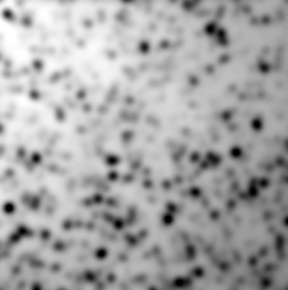

# CLIJ2 basics

Authors: Robert Haase, Daniela Vorkel, April 2020
        
[Source](https://github.com/clij/clij2-docs/tree/master/src/main/macro/basics.ijm)

This macro explains the basics for image processing on graphics processing units (GPUs) using CLIJ2.

## How to start
Before accessing CLIJ2 methods, every macro must contain following line to assign the GPU. By default,
the parameter `cl_device` is left empty, but asking CLIJ to automatically select a GPU. In example, if 
you have a GPU named "nVendor Awesome Intelligent 3000", you can enter its full name behind the quality
sign, written in brakets like `[nVendor Awesome Intelligent 3000]`. But also, you could just enter a part 
of the name, such as `nVendor` or `some`. CLIJ will select the associated GPU as long as there is no other 
GPU containing the same parts of the name.

<pre class="highlight">
run("CLIJ2 Macro Extensions", "cl_device=");
</pre>

## Clean up at the beginning
Furthermore, to assure that the memory of the GPU is empty and fully operable, call the `clear();` command. 
This makes a lot of sense while developing new workflows. In case your macro crashes, the latest images will 
be left in GPU memory. Thus and before starting any macro, you want to clean up first:

<pre class="highlight">
Ext.<a href="https://clij.github.io/clij2-docs/reference_clear">CLIJ2_clear</a>();
</pre>

## Loading images and pushing them into GPU memory

To load images, we use ImageJs functionality. Next, we use the CLIJs `push();` method to send the loaded 
image to GPU memory.

<pre class="highlight">
run("Cell Colony (31K)");

input_image = getTitle();
Ext.<a href="https://clij.github.io/clij2-docs/reference_push">CLIJ2_push</a>(input_image);
</pre>

Now, the image in the GPU is named like its correspondent image on the screen. 
We can request the GPU memory to find out which images are registered there by now: 

<pre class="highlight">
Ext.<a href="https://clij.github.io/clij2-docs/reference_reportMemory">CLIJ2_reportMemory</a>();
</pre>
<pre>
> GPU contains 1 images.
> - Cell_Colony.jpg[net.haesleinhuepf.clij.clearcl.ClearCLPeerPointer@5a72bf01] 161.8 kb
> = 161.8 kb
>  
</pre>

## Processing an image
If we use CLIJ methods to blur the input image, another `result` image gets allocated in GPU memory.

<pre class="highlight">
sigma = 5;
// you can, but you don't have to define the resulting image name:
// result = "blurred_image"; 
Ext.<a href="https://clij.github.io/clij2-docs/reference_gaussianBlur2D">CLIJ2_gaussianBlur2D</a>(input_image, result, sigma, sigma);
</pre>

## Showing a result image
If we want to stop a program just by using the `exit();` method, it won't display any result.

In order to get the `result` back from the GPU, we need to pull it:

<pre class="highlight">
Ext.<a href="https://clij.github.io/clij2-docs/reference_pull">CLIJ2_pull</a>(result);
</pre>

Furthermore, let's ask again which images are known in GPU memory:

<pre class="highlight">
Ext.<a href="https://clij.github.io/clij2-docs/reference_reportMemory">CLIJ2_reportMemory</a>();
</pre>
<pre>
> GPU contains 2 images.
> - Cell_Colony.jpg[net.haesleinhuepf.clij.clearcl.ClearCLPeerPointer@5a72bf01] 161.8 kb
> - CLIJ2_gaussianBlur2D_result397[net.haesleinhuepf.clij.clearcl.ClearCLPeerPointer@627a4e2a] 161.8 kb
> = 323.5 kb
>  
</pre>

## Free memory whenever possible
Obviously, memory is limited. If we would just continue to process images, more and more of them would 
be allocated in the GPU until its memory is full. At full memory, it will show an error message like 
`CL_OUT_OF_RESOURCES` or `CL_OUT_OF_HOST_MEMORY`. Thus, we need to release an image to free GPU memory. 

<pre class="highlight">
Ext.<a href="https://clij.github.io/clij2-docs/reference_release">CLIJ2_release</a>(input_image);

Ext.<a href="https://clij.github.io/clij2-docs/reference_reportMemory">CLIJ2_reportMemory</a>();
</pre>
<pre>
> GPU contains 1 images.
> - CLIJ2_gaussianBlur2D_result397[net.haesleinhuepf.clij.clearcl.ClearCLPeerPointer@627a4e2a] 161.8 kb
> = 161.8 kb
>  
</pre>

It is a good strategy to remove image A as soon as an image B has been processed out of it and image A isn't 
needed anymore. However, it is also a bit annoying to release images all the time. Thus, as long as GPU memory 
isn't full, one can just continue processing and create new images. As soon as processing runs into trouble, 
use the `reportMemory();` method to find out which images are currently occupying a lot of space within memory.
And when needed for your workflow, release some of them.

## Clean up when you're done
Furthermore, by the end of your macro, be a good programmer and clean up GPU. ;-)

<pre class="highlight">

Ext.<a href="https://clij.github.io/clij2-docs/reference_clear">CLIJ2_clear</a>();
Ext.<a href="https://clij.github.io/clij2-docs/reference_reportMemory">CLIJ2_reportMemory</a>();

</pre>
<pre>
> GPU contains 0 images.
> = 0.0 b
>  
</pre>

