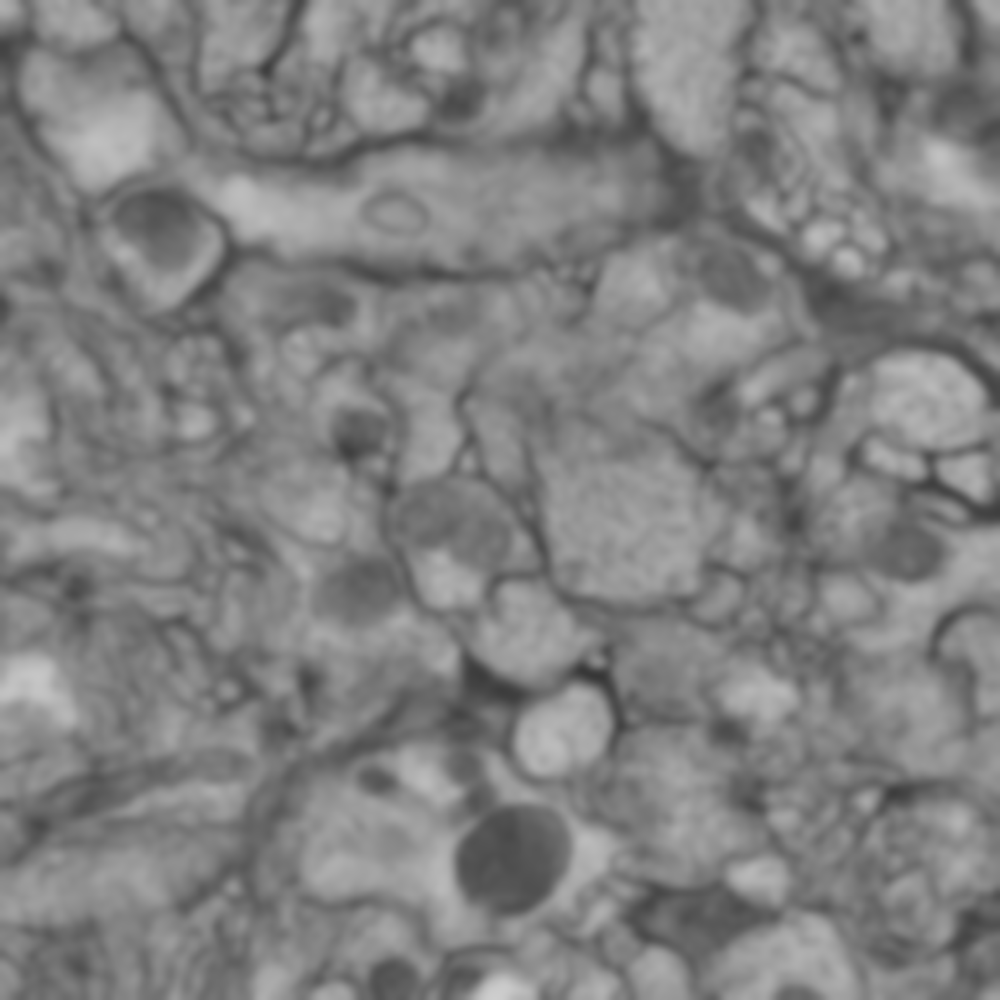
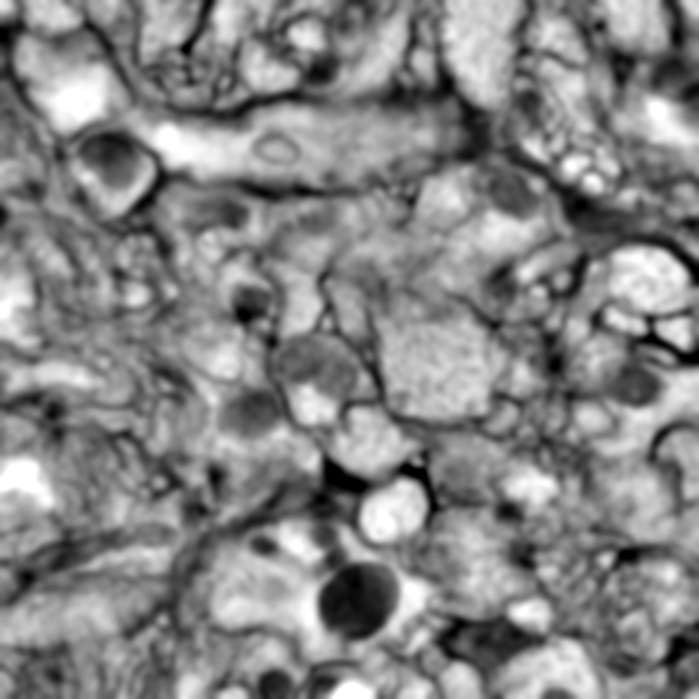

# Measure speedup (Benchmarking)
Author: Robert Haase
 
        April 2020

[Source](https://github.com/clij/clij2-docs/tree/master/src/main/macro/benchmarking.ijm)

This macro shows how to measure performance of image processing in ImageJ on the CPU 
and CLIJ2 on the GPU.

Let's get some test data first. 
We use an electron microscopy dataset from ["Segmented anisotropic ssTEM dataset of neural tissue." Stephan Gerhard, Jan Funke, Julien Martel, Albert Cardona, Richard Fetter. figshare. Retrieved 16:09, Nov 20, 2013 (GMT)](http://dx.doi.org/10.6084/m9.figshare.856713)

```java
run("Image Sequence...", "open=C:/structure/data/unidesigner_groundtruth-drosophila-vnc/stack1/raw/00.tif sort");
input = getTitle();

```
<a href="image_1587649616046.png"></a>

## Measure processing time on the CPU

We start with measuring processing time of standard ImageJ operations which are executed 
on the central processing unit (CPU). Note that we execute this operation several times
to get some insight on different processing times when calling the same operation 
subsequently. Especially the first exection could be slower because of the 
[warm-up effect](https://stackoverflow.com/questions/36198278/why-does-the-jvm-require-warmup).
We measure the processing time by saving the current time in the variable `time` before 
processing and printing `(getTime() - time)` after processing:

```java

// Local mean filter in CPU
for (i = 1; i <= 10; i++) {
	time = getTime();
	run("Mean 3D...", "x=3 y=3 z=3");
	print("CPU mean filter no " + i + " took " + (getTime() - time) + " msec");
}
```
<pre>
> CPU mean filter no 1 took 6456 msec
> CPU mean filter no 2 took 7233 msec
> CPU mean filter no 3 took 9386 msec
> CPU mean filter no 4 took 9595 msec
> CPU mean filter no 5 took 9834 msec
> CPU mean filter no 6 took 9597 msec
> CPU mean filter no 7 took 9671 msec
> CPU mean filter no 8 took 9482 msec
> CPU mean filter no 9 took 9580 msec
> CPU mean filter no 10 took 11088 msec
</pre>
<a href="image_1587649708300.png"></a>

## Measure processing time on the GPU
We perform the same strategy to measure processing time on the GPU. As the performance of
GPU-accelerated processing also depends on the data transfer time between CPU and GPU memory,
we also measure the time `push()` and `pull()` commands take.

Let's start with initializin the GPU.

```java
run("CLIJ2 Macro Extensions", "cl_device=");
Ext.CLIJ2_clear();

```

##
# Push images to GPU

```java
time = getTime();
Ext.CLIJ2_push(input);
print("Pushing one image to the GPU took " + (getTime() - time) + " msec");

// cleanup ImageJ
run("Close All");

```
<pre>
> Pushing one image to the GPU took 63 msec
</pre>

### Process images on the GPU using CLIJ2

```java
// Local mean filter in GPU
for (i = 1; i <= 10; i++) {
	time = getTime();
	Ext.CLIJ2_mean3DBox(input, blurred, 3, 3, 3);
	print("CLIJ2 GPU mean filter no " + i + " took " + (getTime() - time) + " msec");
}
```
<pre>
> CLIJ2 GPU mean filter no 1 took 2137 msec
> CLIJ2 GPU mean filter no 2 took 65 msec
> CLIJ2 GPU mean filter no 3 took 66 msec
> CLIJ2 GPU mean filter no 4 took 67 msec
> CLIJ2 GPU mean filter no 5 took 68 msec
> CLIJ2 GPU mean filter no 6 took 68 msec
> CLIJ2 GPU mean filter no 7 took 69 msec
> CLIJ2 GPU mean filter no 8 took 70 msec
> CLIJ2 GPU mean filter no 9 took 70 msec
> CLIJ2 GPU mean filter no 10 took 297 msec
</pre>

### Compare CLIJ2 with its predecessor, [CLIJ](https://www.nature.com/articles/s41592-019-0650-1)

```java
// Local mean filter in GPU
for (i = 1; i <= 10; i++) {
	time = getTime();
	Ext.CLIJ_mean3DBox(input, blurred, 3, 3, 3);
	print("CLIJ GPU mean filter no " + i + " took " + (getTime() - time) + " msec");
}
```
<pre>
> CLIJ GPU mean filter no 1 took 2937 msec
> CLIJ GPU mean filter no 2 took 68 msec
> CLIJ GPU mean filter no 3 took 68 msec
> CLIJ GPU mean filter no 4 took 67 msec
> CLIJ GPU mean filter no 5 took 67 msec
> CLIJ GPU mean filter no 6 took 67 msec
> CLIJ GPU mean filter no 7 took 68 msec
> CLIJ GPU mean filter no 8 took 71 msec
> CLIJ GPU mean filter no 9 took 71 msec
> CLIJ GPU mean filter no 10 took 74 msec
</pre>

### Pull result image from the GPU

```java

time = getTime();
Ext.CLIJ2_pull(blurred);

print("Pulling one image from the GPU took " + (getTime() - time) + " msec");

```
<pre>
> Pulling one image from the GPU took 127 msec
</pre>
<a href="image_1587649715555.png"></a>

For documentation purposes, we should also report which GPU was used

```java
Ext.CLIJ2_getGPUProperties(gpu, memory, opencl_version);
print("GPU: " + gpu);
print("Memory in GB: " + (memory / 1024 / 1024 / 1024) );
print("OpenCL version: " + opencl_version);

```
<pre>
> GPU: Intel(R) UHD Graphics 620
> Memory in GB: 6.3017
> OpenCL version: 2
</pre>

Cleanup GPU 
by the end.

```java
Ext.CLIJ2_clear();
```


```
```
