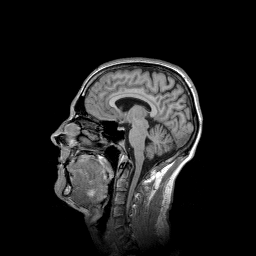

# Measure speedup (Benchmarking)
Author: Robert Haase
, April 2020

[Source](https://github.com/clij/clij2-docs/tree/master/src/main/macro/benchmarking.ijm)

This macro shows how to measure performance of image processing in ImageJ on the CPU 
and CLIJ2 on the GPU.

Let's get some test data first. 

<pre class="highlight">
run("T1 Head (2.4M, 16-bits)");
input = getTitle();

// visualise the center plane
run("Duplicate...", "duplicate range=64-64");
</pre>

## Measure processing time on the CPU

We start with measuring processing time of standard ImageJ operations which are executed 
on the central processing unit (CPU). Note that we execute this operation several times
to get some insight on different processing times when calling the same operation 
subsequently. Especially the first exection could be slower because of the 
[warm-up effect](https://stackoverflow.com/questions/36198278/why-does-the-jvm-require-warmup).
We measure the processing time by saving the current time in the variable `time` before 
processing and printing `(getTime() - time)` after processing:

<pre class="highlight">

// Local mean filter in CPU
for (i = 1; i <= 10; i++) {
	// we duplicate the original image to not blur the blurred image again and again
	selectWindow(input);
	run("Duplicate...", "duplicate range=1-129");
	
	// actual blur operation
	time = getTime();
	run("Mean 3D...", "x=3 y=3 z=3");
	print("CPU mean filter no " + i + " took " + (getTime() - time) + " msec");
	
	// keep first blurred image and close the duplicates
	if (i == 1) {
		blurred_image = getTitle();
	} else {
		close();
	}
}
selectWindow(blurred_image);

// visualise the center plane
run("Duplicate...", "duplicate range=64-64");
</pre>
<pre>
> CPU mean filter no 1 took 2317 msec
> CPU mean filter no 2 took 2698 msec
> CPU mean filter no 3 took 3905 msec
> CPU mean filter no 4 took 4706 msec
> CPU mean filter no 5 took 4621 msec
> CPU mean filter no 6 took 4447 msec
> CPU mean filter no 7 took 4484 msec
> CPU mean filter no 8 took 4400 msec
> CPU mean filter no 9 took 4517 msec
> CPU mean filter no 10 took 4837 msec
</pre>

## Measure processing time on the GPU
We perform the same strategy to measure processing time on the GPU. As the performance of
GPU-accelerated processing also depends on the data transfer time between CPU and GPU memory,
we also measure the time `push()` and `pull()` commands take.

Let's start with initializin the GPU.

<pre class="highlight">
run("CLIJ2 Macro Extensions", "cl_device=");
Ext.CLIJ2_clear();

</pre>

##
# Push images to GPU

<pre class="highlight">
time = getTime();
Ext.CLIJ2_push(input);
print("Pushing one image to the GPU took " + (getTime() - time) + " msec");

// cleanup ImageJ
run("Close All");

</pre>
<pre>
> Pushing one image to the GPU took 36 msec
</pre>

### Process images on the GPU using CLIJ2

<pre class="highlight">
// Local mean filter in GPU
for (i = 1; i <= 10; i++) {
	time = getTime();
	Ext.<a href="https://clij.github.io/clij2-docs/reference_mean3DBox">CLIJ2_mean3DBox</a>(input, blurred, 3, 3, 3);
	print("CLIJ2 GPU mean filter no " + i + " took " + (getTime() - time) + " msec");
}
</pre>
<pre>
> CLIJ2 GPU mean filter no 1 took 10 msec
> CLIJ2 GPU mean filter no 2 took 7 msec
> CLIJ2 GPU mean filter no 3 took 8 msec
> CLIJ2 GPU mean filter no 4 took 8 msec
> CLIJ2 GPU mean filter no 5 took 9 msec
> CLIJ2 GPU mean filter no 6 took 9 msec
> CLIJ2 GPU mean filter no 7 took 9 msec
> CLIJ2 GPU mean filter no 8 took 9 msec
> CLIJ2 GPU mean filter no 9 took 8 msec
> CLIJ2 GPU mean filter no 10 took 9 msec
</pre>

### Compare CLIJ2 with its predecessor, [CLIJ](https://www.nature.com/articles/s41592-019-0650-1)

<pre class="highlight">
// Local mean filter in GPU
for (i = 1; i <= 10; i++) {
	time = getTime();
	Ext.CLIJ_mean3DBox(input, blurred, 3, 3, 3);
	print("CLIJ GPU mean filter no " + i + " took " + (getTime() - time) + " msec");
}
</pre>
<pre>
> CLIJ GPU mean filter no 1 took 9 msec
> CLIJ GPU mean filter no 2 took 9 msec
> CLIJ GPU mean filter no 3 took 8 msec
> CLIJ GPU mean filter no 4 took 9 msec
> CLIJ GPU mean filter no 5 took 8 msec
> CLIJ GPU mean filter no 6 took 9 msec
> CLIJ GPU mean filter no 7 took 8 msec
> CLIJ GPU mean filter no 8 took 8 msec
> CLIJ GPU mean filter no 9 took 8 msec
> CLIJ GPU mean filter no 10 took 9 msec
</pre>

### Pull result image from the GPU

<pre class="highlight">

time = getTime();
Ext.CLIJ2_pull(blurred);

print("Pulling one image from the GPU took " + (getTime() - time) + " msec");

// visualise the center plane
run("Duplicate...", "duplicate range=64-64");

</pre>
<pre>
> Pulling one image from the GPU took 62 msec
</pre>

For documentation purposes, we should also report which GPU was used

<pre class="highlight">
Ext.CLIJ2_getGPUProperties(gpu, memory, opencl_version);
print("GPU: " + gpu);
print("Memory in GB: " + (memory / 1024 / 1024 / 1024) );
print("OpenCL version: " + opencl_version);

</pre>
<pre>
> GPU: GeForce RTX 2060 SUPER
> Memory in GB: 8
> OpenCL version: 1.2
</pre>

Cleanup GPU 
by the end.

<pre class="highlight">
Ext.CLIJ2_clear();
</pre>

