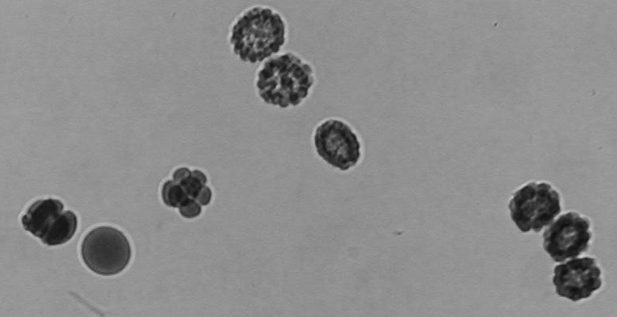
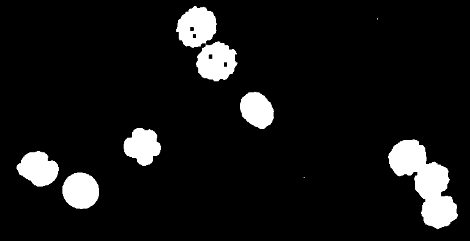

# Binary image operations
Authors: Robert Haase, Daniela Vorkel, April 2020

[Source](https://github.com/clij/clij2-docs/tree/master/src/main/macro/binary_processing.ijm)

This macro shows how to deal with operations on binary images, e.g. 
thresholding, dilation, erosion, fill holes, in the GPU.

All demonstrated operations work in 2D and 3D. For demonstration 
purpose, we use a 2D example.

<pre class="highlight">
// clean up first
run("Close All");

</pre>

## Get test data

<pre class="highlight">
run("Embryos (42K)");
run("8-bit");
makeRectangle(714, 14, 768, 394);
run("Crop", " ");
input = getTitle();

</pre>

Initialize GPU and push image to GPU memory:

<pre class="highlight">
run("CLIJ Macro Extensions", "cl_device=");
Ext.CLIJ2_clear();

// push data to GPU
Ext.CLIJ2_push(input);

</pre>

## Thresholding
We create a binary mask image with white objects on black background, using the Otsu's 
tresholding method. As the image has a bright background, we need to invert it first.

<pre class="highlight">
Ext.<a href="https://clij.github.io/clij2-docs/reference_subtractImageFromScalar">CLIJ2_subtractImageFromScalar</a>(input, inverted, 255);

// apply threshold method
Ext.<a href="https://clij.github.io/clij2-docs/reference_thresholdOtsu">CLIJ2_thresholdOtsu</a>(inverted, thresholded);

// show thresholding result
Ext.CLIJ2_pull(thresholded);

</pre>

## Binary opening using erosion and dilation
First, we apply binary opening: it consists of binary erosion, followed by binary dilation.
By hand, we apply each step twice to obtain two iterations.

<pre class="highlight">
Ext.<a href="https://clij.github.io/clij2-docs/reference_erodeBox">CLIJ2_erodeBox</a>(thresholded, temp);
Ext.<a href="https://clij.github.io/clij2-docs/reference_erodeBox">CLIJ2_erodeBox</a>(temp, intermediate_result);

// show intermediate result
Ext.CLIJ2_pull(intermediate_result);
</pre>

<pre class="highlight">
Ext.<a href="https://clij.github.io/clij2-docs/reference_dilateBox">CLIJ2_dilateBox</a>(intermediate_result, temp);
Ext.<a href="https://clij.github.io/clij2-docs/reference_dilateBox">CLIJ2_dilateBox</a>(temp, opening_result);

// show result
Ext.CLIJ2_pull(opening_result);

</pre>

## Binary closing using dilation and erosion
Given the number of dilation/erosion steps we want to apply, we can call a direct method, too. 

<pre class="highlight">
number_of_iterations = 2;
Ext.<a href="https://clij.github.io/clij2-docs/reference_closingBox">CLIJ2_closingBox</a>(thresholded, closing_result, number_of_iterations);
// show result
Ext.CLIJ2_pull(closing_result);

</pre>

## Fill holes
It is also possible to fill holes:

<pre class="highlight">
Ext.<a href="https://clij.github.io/clij2-docs/reference_binaryFillHoles">CLIJ2_binaryFillHoles</a>(thresholded, holes_filled);
// show result
Ext.CLIJ2_pullBinary(holes_filled);

</pre>

## Edge detection
We can retrieve an edge-detected image like this:

<pre class="highlight">
Ext.<a href="https://clij.github.io/clij2-docs/reference_binaryEdgeDetection">CLIJ2_binaryEdgeDetection</a>(thresholded, edges);
// show result
Ext.CLIJ2_pullBinary(edges);

</pre>

Finally, clean up:

<pre class="highlight">
Ext.CLIJ2_clear();

</pre>

