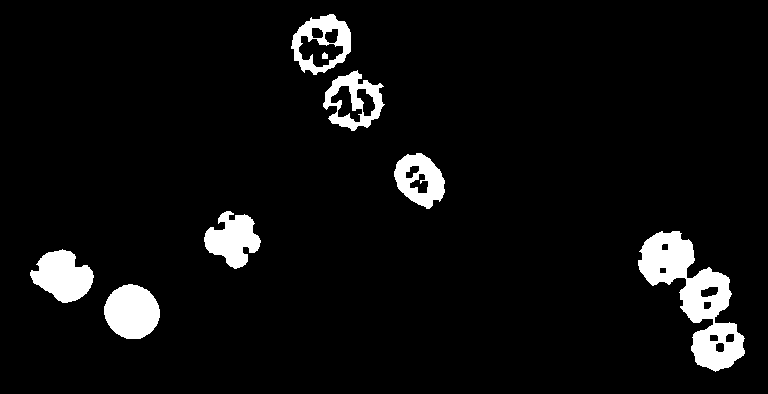
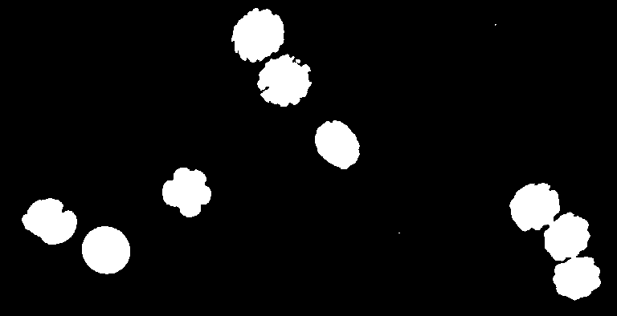
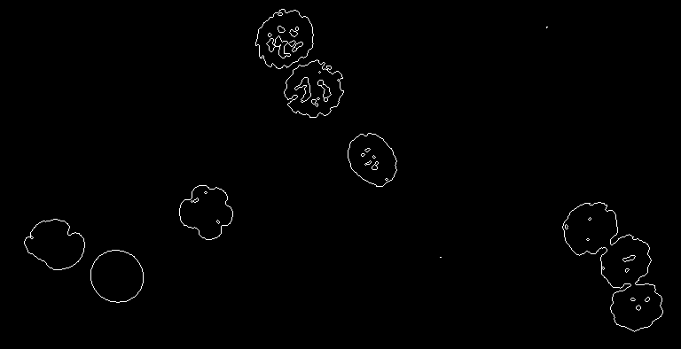

# Binary operations
Author: Robert Haase
        April 2020

This macro shows how to deal with binary images, e.g. 
thresholding, dilation, erosion, file holes etc in the GPU.

All demonstrated operations work in 2D and 3D. We use a 2D 
example here for demonstration purposes.


```java
// clean up first
run("Close All");

```

## Get test data

```java
run("Embryos (42K)");
run("8-bit");
makeRectangle(714, 14, 768, 394);
run("Crop", " ");
input = getTitle();

```
<a href="image_1587575243351.png"></a>

Initialize GPU and push image to GPU memory

```java
run("CLIJ Macro Extensions", "cl_device=");
Ext.CLIJ2_clear();

// push data to GPU
Ext.CLIJ2_push(input);


```

## Thresholding
We create a binary mask image using a Otsus tresholding method threshold
. 
As the image has a bright background, we invert the image first

```java
Ext.CLIJ2_subtractImageFromScalar(input, inverted, 255);

// apply threshold method
Ext.CLIJ2_thresholdOtsu(inverted, thresholded);

// show thresholding result
Ext.CLIJ2_pull(thresholded);

```
<a href="image_1587575243809.png"></a>

## Binary opening using erosion and dilation
We do binary opening by hand: It consists of binary erosion and dilation, applied twice each.


```java
Ext.CLIJ2_erodeBox(thresholded, temp);
Ext.CLIJ2_erodeBox(temp, intermediate_result);

// show intermediate result
Ext.CLIJ2_pull(intermediate_result);
```
<a href="image_1587575243891.png"></a>


```java
Ext.CLIJ2_dilateBox(intermediate_result, temp);
Ext.CLIJ2_dilateBox(temp, opening_result);

// show result
Ext.CLIJ2_pull(opening_result);

```
<a href="image_1587575243983.png"></a>

## Binary closing
For binary closing and opening, on can also call methods directly: 
Given on the number of erosions/dilations we want to apply, we can also use these methods:

```java
number_of_iterations = 2;
Ext.CLIJ2_closingBox(thresholded, closing_result, number_of_iterations);
// show result
Ext.CLIJ2_pull(closing_result);

```
<a href="image_1587575244072.png"></a>

## Fill holes
It is also possible to fill holes:

```java
Ext.CLIJ2_binaryFillHoles(thresholded, holes_filled);
// show result
Ext.CLIJ2_pullBinary(holes_filled);

```
<a href="image_1587575244211.png"></a>

## Edge detection
We can retrieve an edge image like this:

```java
Ext.CLIJ2_binaryEdgeDetection(thresholded, edges);
// show result
Ext.CLIJ2_pullBinary(edges);

```
<a href="image_1587575244295.png"></a>

Finally, always clean up:

```java
Ext.CLIJ2_clear();

```


```
```
