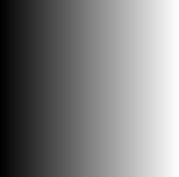
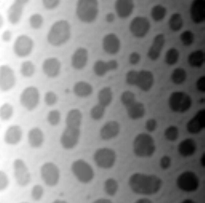

# Combining CLIJ and CLIJ2 
Author: Robert Haase
        February 2020

[Source](https://github.com/clij/clij2-docs/tree/master/src/main/macro/clij1_clij2_combination.ijm)

This macro shows how to combine CLIJ1 and CLIJ2

<pre class="highlight">
// clean up first 
run("Close All"); 
 
// Get test data 
run("Blobs (25K)"); 
run("8-bit");
rename("original");
getDimensions(width, height, channels, slices, frames)
original = getTitle();

newImage("background", "16-bit ramp", width, height, slices);
 background = getTitle();
</pre>

## Initialize GPU and push image data to GPU memory

<pre class="highlight">
run("CLIJ2 Macro Extensions", "cl_device="); 
Ext.CLIJ2_clear(); 
 
// push images to GPU using CLIJ2
Ext.CLIJ2_push(original);
// push images to GPU using CLIJ
Ext.CLIJ_push(background);

// cleanup imagej 
run("Close All"); 

</pre>

Create output image with 32 bits using CLIJ

<pre class="highlight">
originalWithBackground = "originalWithBackground";
Ext.CLIJ_create2D(originalWithBackground, width, height, 32);

</pre>

add images using CLIJ2

<pre class="highlight">
 Ext.<a href="https://clij.github.io/clij2-docs/reference_addImagesWeighted">CLIJ2_addImagesWeighted</a>(original, background, originalWithBackground, 1, 0.01);
 
// show result  using CLIJ2
Ext.CLIJ2_pull(originalWithBackground); 
run("Invert LUT"); 

</pre>

Clean up finally using CLIJ

<pre class="highlight">
Ext.CLIJ_clear();

</pre>

