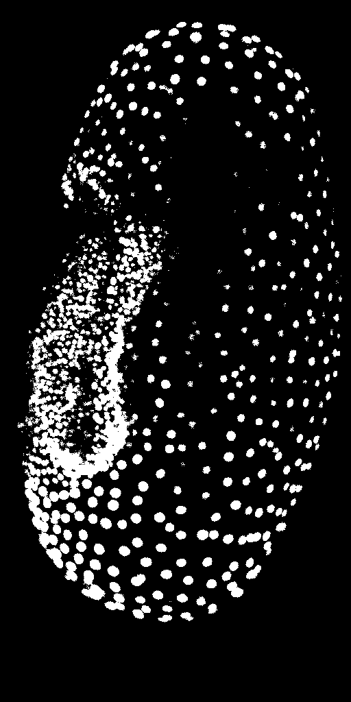

# Comparing Workflows: ImageJ vs CLIJ
Authors: Robert Haase, Daniela Vorkel, March 2020

[Source](https://github.com/clij/clij2-docs/tree/master/src/main/macro/compare_workflows.ijm)

This macro shows how to compare an ImageJ based workflow and its 
translation using CLIJ. 

Let's start with ImageJ:  we have a workflow to load an image and 
to process it with background subtraction and thresholding. Note 
the two lines using the `getTime();` command.

<pre class="highlight">
run("Close All");

// get test data
open("https://github.com/clij/clij2-docs/raw/master/src/main/resources/Lund_MAX_001300.tif");
rename("input_imagej");

start_time_imagej = getTime();

// subtract background in the image
run("Duplicate...", "title=background_subtracted_imagej");
run("Subtract Background...", "rolling=25");

// threshold the image
run("Duplicate...", "title=thresholded_imagej");
setAutoThreshold("Default dark");
setOption("BlackBackground", true);
run("Convert to Mask");

end_time_imagej = getTime();

</pre>

Now, we run the same workflow with CLIJ methods:

<pre class="highlight">

// get test data
open("https://github.com/clij/clij2-docs/raw/master/src/main/resources/Lund_MAX_001300.tif");
input_clij = getTitle();

start_time_clij = getTime();

// init GPU
run("CLIJ2 Macro Extensions", "cl_device=RTX");
Ext.CLIJ2_clear();

// push data to GPU
Ext.CLIJ2_push(input_clij);

// subtract background in the image
radius = 25;
background_subtracted_clij = "background_subtracted_clij";
Ext.<a href="https://clij.github.io/clij2-docs/reference_topHatBox">CLIJ2_topHatBox</a>(input_clij, background_subtracted_clij, 25, 25, 0);
Ext.CLIJ2_pull(background_subtracted_clij);

// threshold the image
thresholded_clij = "thresholded_clij";
Ext.<a href="https://clij.github.io/clij2-docs/reference_automaticThreshold">CLIJ2_automaticThreshold</a>(background_subtracted_clij, thresholded_clij, "Default");
Ext.CLIJ2_pullBinary(thresholded_clij);

end_time_clij = getTime();

</pre>

The results look similar. There are differences, because the 
implementation of ImageJ background subtraction is close but
not identical to the CLIJs topHatBox filter. Furthermore, CPUs and GPUs
run computations a bit differently.

## Quantitative image comparison

You may have noticed that all intermediate images got new names. 
This allows us to compare them, now.

Let's start with quantitative measurements on images and take the duration time for processing.

<pre class="highlight">
// clean up and configure measurements
run("Set Measurements...", "area mean standard min redirect=None decimal=3");
run("Clear Results");

// measure the image using the ImageJ workflow
selectWindow("background_subtracted_imagej");
run("Measure");
selectWindow("thresholded_imagej");
run("Measure");

// measure the image using the CLIJ workflow
selectWindow("background_subtracted_clij");
run("Measure");
selectWindow("thresholded_clij");
run("Measure");

// Table.rename("Results", "Quantitative measurements");

</pre>

From these measurements, we conclude that there are small differences 
between background-subtracted images, and apparently smaller differences 
between binary result images. 

We can verify that by visualizing the differences. Note that we choose to save the subtracted images 
in 32-bit, because 8-bit images don't support negative values.

## Visual differences between background-subtracted images

<pre class="highlight">
imageCalculator("Subtract create 32-bit", "background_subtracted_imagej", background_subtracted_clij);

</pre>

## Visual differences between thresholded images

<pre class="highlight">
imageCalculator("Subtract create 32-bit", "thresholded_imagej", thresholded_clij);

</pre>

The visualization confirms our assumption: The background-subtracted images 
are slightly different, while the binary result images are not.

## Comparing processing time

Also, let's compare the different processing times:

<pre class="highlight">

print("ImageJ took " + (end_time_imagej - start_time_imagej) + "ms.");
print("CLIJ took " + (end_time_clij - start_time_clij) + "ms.");

</pre>
<pre>
> ImageJ took 410ms.
> CLIJ took 93ms.
</pre>

The shown numbers depend on the used GPU hardware. Therefore, it's
a good practice to document which GPU was used:

<pre class="highlight">

Ext.CLIJ2_getGPUProperties(gpu, memory, opencl_version);
print("GPU: " + gpu);
print("Memory in GB: " + (memory / 1024 / 1024 / 1024) );
print("OpenCL version: " + opencl_version);

</pre>
<pre>
> GPU: GeForce RTX 2060 SUPER
> Memory in GB: 8
> OpenCL version: 1.2
</pre>

Note: If you run this script a second time, the shown numbers may differ a bit,
especially when CLIJ becomes faster, because the so called warmup period is over.
During the first period, code gets compiled. This compilation takes time and thus,
when done for a second time, the processing can be significantly faster. 
Furthermore, there are always fluctations in time measurements. Therefore,
it is recommended to run such workflows many times in a loop, and doing
statistics on its derived measurements.

Last but not least, clean up by closing all windows and empty GPU memory:

<pre class="highlight">

run("Close All");
Ext.CLIJ2_clear();
</pre>

