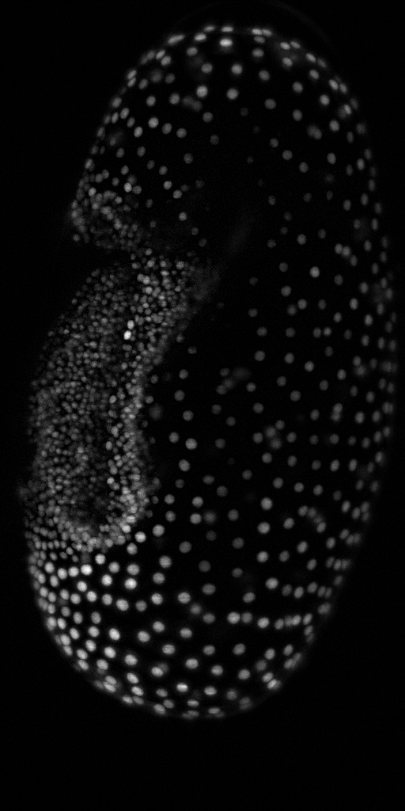
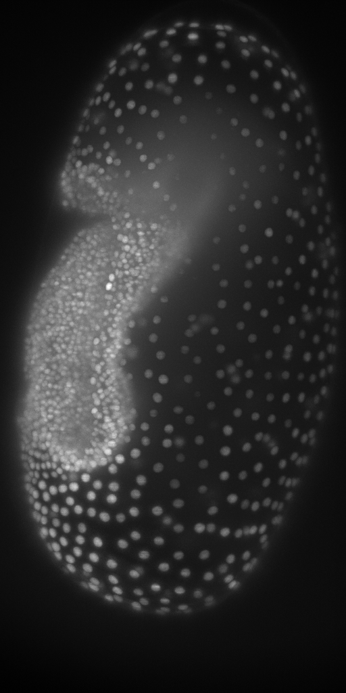

# Comparing Workflows: ImageJ versus CLIJ
Robert Haase, March 2020

This page shows how to compare ImageJ based workflow with their 
translations using CLIJ. 

Let's start with ImageJ. We have a workflow loading an image, 
processing with background subtracting and thresholding. Note 
the two lines using the `getTime()`.

```java
run("Close All");

// Get test data
open("https://github.com/clij/clij2-docs/raw/master/src/main/resources/Lund_MAX_001300.tif");
rename("input_imagej");

start_time_imagej = getTime();

// subtract background in the image
run("Duplicate...", "title=background_subtracted_imagej");
run("Subtract Background...", "rolling=25");

// theshold the image
run("Duplicate...", "title=thresholded_imagej");
setAutoThreshold("Default dark");
setOption("BlackBackground", true);
run("Convert to Mask");

end_time_imagej = getTime();
```
<a href="image_1587403428665.png"></a>
<a href="image_1587403429085.png"></a>
<a href="image_1587403430094.png"></a>


Now we run the same workflow with CLIJ

```java

// Get test data
open("https://github.com/clij/clij2-docs/raw/master/src/main/resources/Lund_MAX_001300.tif");
input_clij = getTitle();

start_time_clij = getTime();

// Init GPU
run("CLIJ2 Macro Extensions", "cl_device=");
Ext.CLIJ2_clear();

// push data to GPU
Ext.CLIJ2_push(input_clij);

// subtract background in the image
radius = 25;
background_subtracted_clij = "background_subtracted_clij";
Ext.<a href="https://clij.github.io/clij2-docs/reference_topHatBox">CLIJ2_topHatBox</a>(input_clij, background_subtracted_clij, 25, 25, 0);
Ext.CLIJ2_pull(background_subtracted_clij);

// threshold the image
thresholded_clij = "thresholded_clij";
Ext.<a href="https://clij.github.io/clij2-docs/reference_automaticThreshold">CLIJ2_automaticThreshold</a>(background_subtracted_clij, thresholded_clij, "Default");
Ext.CLIJ2_pullBinary(thresholded_clij);

end_time_clij = getTime();

```
<a href="image_1587403431241.png"></a>
<a href="image_1587403431661.png"></a>
<a href="image_1587403432269.png"></a>

The results look similar. There are difference because the 
implementation of ImageJ background subtraction is close to but
not identical to CLIJs topHatBox filter. Furthermore, CPU and GPUs
do computation a bit differently.

## Quantitative image comparison

You may have noticed already, all intermediate images got new names. 
This allows us now to compare them.

Let's start with quantitative measurements on the images and 
processing durations.

```java
// configure measurents, clean up before
run("Set Measurements...", "area mean standard min redirect=None decimal=3");
run("Clear Results");

// measure in the image from the imagej workflow
selectWindow("background_subtracted_imagej");
run("Measure");
selectWindow("thresholded_imagej");
run("Measure");

// measure in the image from the imagej workflow
selectWindow("background_subtracted_clij");
run("Measure");
selectWindow("thresholded_clij");
run("Measure");

//Table.rename("Results", "Quantitative measurements");

```

From these measurements we can conclude that there are small differences 
between the background subtracted images, but apparently smaller differences 
between the binary result images. 

We can verify that by visualising 
differences visually. Note that we choose to save the subtraction images 
in 32-bit because 8-bit images don't support negative values.

## Visual differences between background_subtracted images

```java
imageCalculator("Subtract create 32-bit", "background_subtracted_imagej", background_subtracted_clij);

```
<a href="image_1587403432583.png"></a>

## Visual differences between thresholded images

```java
imageCalculator("Subtract create 32-bit", "thresholded_imagej", thresholded_clij);

```
<a href="image_1587403433221.png"></a>

This confirms visually our assumption: The background_subtracted images 
are a bit different while the binary result images are not.

## Comparing processing time

Let`s now also compare the different processing times:

```java

print("ImageJ took " + (end_time_imagej - start_time_imagej) + "ms.");
print("CLIJ took " + (end_time_clij - start_time_clij) + "ms.");

```
<pre>
> ImageJ took 288ms.
> CLIJ took 112ms.
</pre>

The numbers shown here depend on used GPU hardware. Let's therefore it's
good practice to document which GPU was used:

```java

Ext.CLIJ2_getGPUProperties(gpu, memory, opencl_version);
print("GPU: " + gpu);
print("Memory in GB: " + (memory / 1024 / 1024 / 1024) );
print("OpenCL version: " + opencl_version);

```
<pre>
> GPU: GeForce RTX 2060 SUPER
> Memory in GB: 8
> OpenCL version: 1.2
</pre>

Note: If you run this script a second time, numbers may be a bit different,
especially CLIJ becomes faster because the so called warmup period is over.
During this period, code is compiled. This compilation takes time and thus,
when doing it a second time, processing can be significantly faster. 
Furthermore, there are always fluctations in time measurements. Thus,
it is recommended to run such workflows many times in a loop and doing
statistics on derived measurements.

Last but not least, let's clean up by closing all windows and emptying
GPU memory:

```java

run("Close All");
Ext.CLIJ2_clear();
```


```
```
