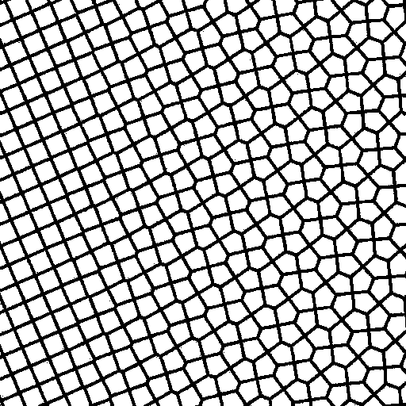
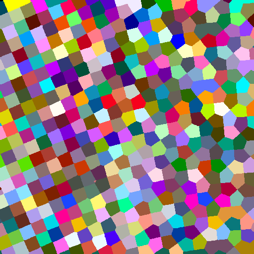
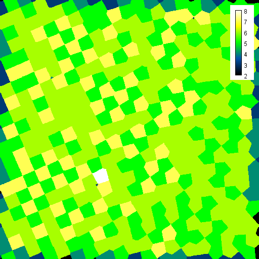
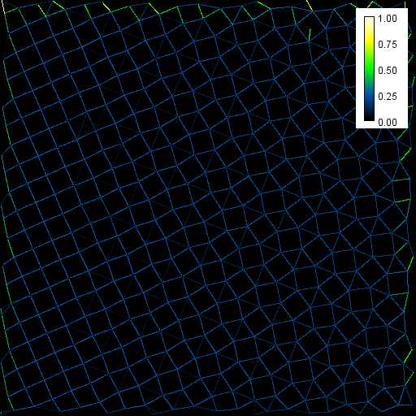
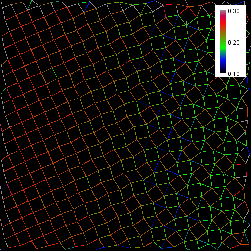
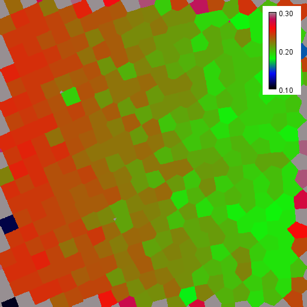
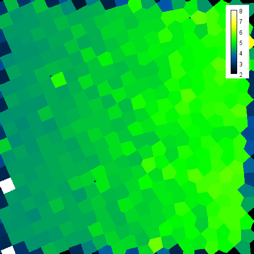

# Counting neighbors in grids of cells

This notebooks introduces two techniques for counting neighbors in grids of cells.

[Source](https://github.com/clij/clij2-docs/tree/master/src/main/macro/count_neighbors.ijm)

Let's start by cleaaning up and opening an example dataset. 
The dataset was made by Craig S. Kaplan ([@cs_kaplan](https://twitter.com/cs_kaplan)) and [shared via Twitter](https://twitter.com/cs_kaplan/status/1359945996806029321?s=20)
For cleaning up and loading the image, we use ImageJ-functions:

<pre class="highlight">
// clean up first
run("Close All");
run("Clear Results");

// open a binary image
open("C:/structure/code/clij2-docs/md/count_neighbors/mesh_sim_from_cs_kaplan.tif");
//open("https://github.com/clij/clij2-docs/blob/master/md/count_neighbors/mesh_sim_from_cs_kaplan.tif?raw=true");
</pre>

We now initialize the GPU and push the image as explained in the [basics of clij tutorial](https://clij.github.io/clij2-docs/md/basics/).

<pre class="highlight">
run("CLIJ2 Macro Extensions", "cl_device=");
Ext.<a href="https://clij.github.io/clij2-docs/reference_clear">CLIJ2_clear</a>();

// push image to GPU memory
input_binary = getTitle();
Ext.<a href="https://clij.github.io/clij2-docs/reference_push">CLIJ2_push</a>(input_binary);
</pre>

# Label objects and count neighbors
We will now label the white objects in the image and generate a parametric image visualizing the number of touching neighbors similarly as explained in the section about [label images and parametric images](https://clij.github.io/clij2-docs/md/image_types/).

<pre class="highlight">
Ext.<a href="https://clij.github.io/clij2-docs/reference_voronoiLabeling">CLIJ2_voronoiLabeling</a>(input_binary, label_image);
// show label image
Ext.<a href="https://clij.github.io/clij2-docs/reference_pull">CLIJ2_pull</a>(label_image);
run("glasbey_on_dark");
</pre>

<pre class="highlight">
Ext.CLIJx_touchingNeighborCountMap(label_image, neighbor_count_map);
Ext.<a href="https://clij.github.io/clij2-docs/reference_pull">CLIJ2_pull</a>(neighbor_count_map);
run("Green Fire Blue");
setMinAndMax(2, 8);
run("Calibration Bar...", "location=[Upper Right] fill=White label=Black number=7 decimal=0 font=12 zoom=1 overlay");
</pre>

Obviously, the neighbor-count sufferes from positional noise of labeled pixels with different labels.
We need to try a different approach.

## Measuring touch-portion
Touch-portion describes the number of edges pixels between two labels. 
For example, in a perfect grid of squared labeled objects, as shown on the left, all labels touch by 0.25, or 25%.
If a cell has five neighbors, touch-portion is 0.2 or 20%. 
We can visualize touch-portion as a mesh between label centroids:

<pre class="highlight">
Ext.CLIJx_drawTouchPortionMeshBetweenTouchingLabels(label_image, touch_portion_mesh);
Ext.<a href="https://clij.github.io/clij2-docs/reference_pull">CLIJ2_pull</a>(touch_portion_mesh);
run("Green Fire Blue");
setMinAndMax(0, 1);
run("Calibration Bar...", "location=[Upper Right] fill=White label=Black number=5 decimal=2 font=12 zoom=1 overlay");
</pre>

By changing brightness, contrast and the lookup-table we can highlight differences between the left and the right region: 

<pre class="highlight">
run("Duplicate...", "title=copy");
run("Rainbow RGB");
setMinAndMax(0.1, 0.3);
run("Calibration Bar...", "location=[Upper Right] fill=White label=Black number=3 decimal=2 font=12 zoom=1 overlay");
</pre>

The median touch-portion per labeled object gives us an impression of the distribution in space:

<pre class="highlight">
Ext.CLIJx_medianTouchPortionMap(label_image, median_touch_portion_map);
Ext.<a href="https://clij.github.io/clij2-docs/reference_pull">CLIJ2_pull</a>(median_touch_portion_map);
run("Rainbow RGB");
setMinAndMax(0.1, 0.3);
run("Calibration Bar...", "location=[Upper Right] fill=White label=Black number=3 decimal=2 font=12 zoom=1 overlay");
</pre>

This map can be used to draw a map of estimated, continous neighbor-count. 
We know labels in a symmetric grid with 4 neighbors have a median touch-portion of 0.25, and if they have 5 neighbors, median touch-portion is typicall 0.2.
Thus, we can estimate neighbor_count = 1 / median_touch_portion:

<pre class="highlight">
Ext.CLIJx_divideScalarByImage(median_touch_portion_map, estimated_neighbor_count, 1.0);
Ext.<a href="https://clij.github.io/clij2-docs/reference_pull">CLIJ2_pull</a>(estimated_neighbor_count);
run("Green Fire Blue");
setMinAndMax(2, 8);
run("Calibration Bar...", "location=[Upper Right] fill=White label=Black number=7 decimal=0 font=12 zoom=1 overlay");
</pre>

