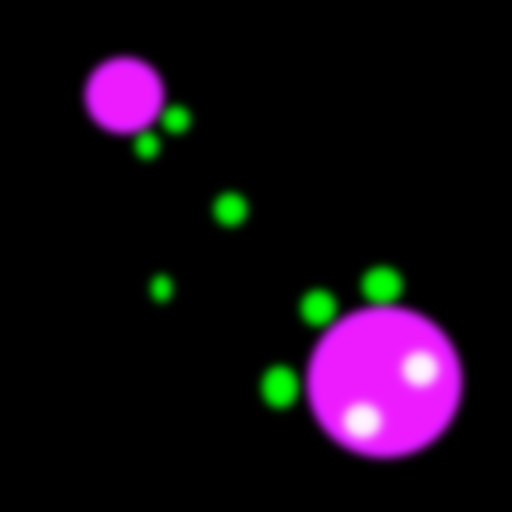
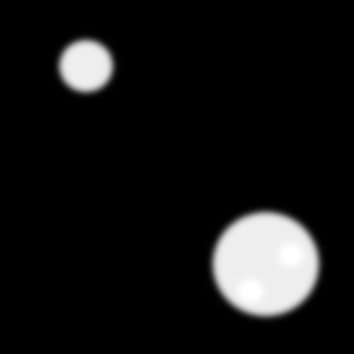
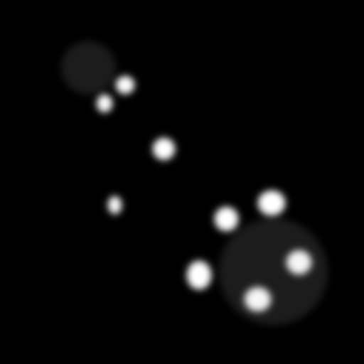
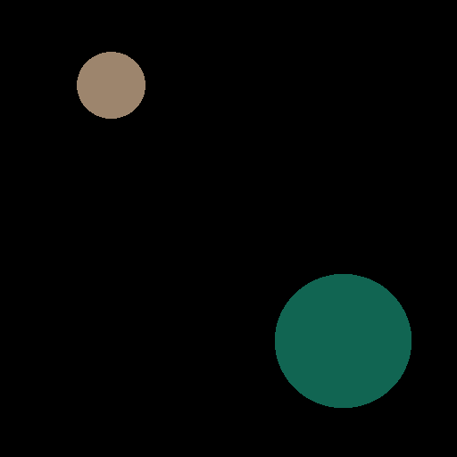
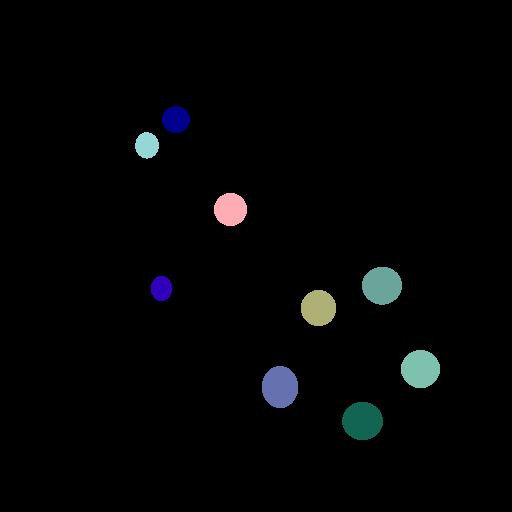
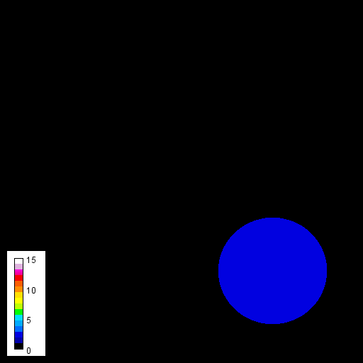
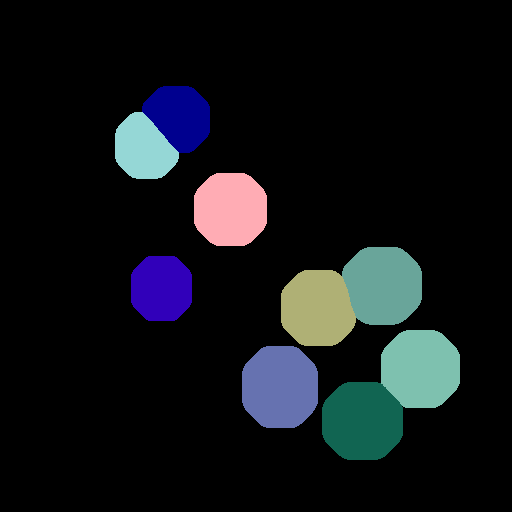
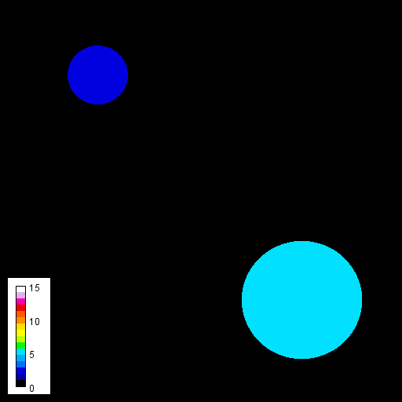

# Measuring presence of objects between channels
This notebook explains how to count labeled objects in one channel that overlap with
objects in another channel. It also shows how to count those objects that are within
a certain distance range.

[Source](https://github.com/clij/clij2-docs/tree/master/src/main/macro/count_overlap_between_channels.ijm) 

We start by cleaning up and initializing the GPU.

<pre class="highlight">
close("*");
run("Clear Results");

// Init GPU
run("CLIJ2 Macro Extensions", "cl_device=");
Ext.<a href="https://clij.github.io/clij2-docs/reference_clear">CLIJ2_clear</a>();

</pre>

We now load an example image. You find it [online](https://github.com/clij/clij2-docs/tree/master/src/main/macro/artificial_nuclei_and_granules.tif) as well.

<pre class="highlight">

// Load image from disc 
open("C:/structure/code/clij2-docs/src/main/macro/artificial_nuclei_and_granules.tif");
// open("https://github.com/clij/clij2-docs/tree/master/src/main/macro/artificial_nuclei_and_granules.tif")
input_image = getTitle();
</pre>

# Push channel images to the GPU
We now push this image twice to the GPU, while having different channels selected, and copy it. 
Afterwards, we will have two images corresponding to the two channels.   

<pre class="highlight">

// Copy nuclei channel
Stack.setChannel(1);
Ext.<a href="https://clij.github.io/clij2-docs/reference_pushCurrentSlice">CLIJ2_pushCurrentSlice</a>(input_image);
Ext.<a href="https://clij.github.io/clij2-docs/reference_copy">CLIJ2_copy</a>(input_image, nuclei_channel);

// Copy granules channel
Stack.setChannel(2);
Ext.<a href="https://clij.github.io/clij2-docs/reference_pushCurrentSlice">CLIJ2_pushCurrentSlice</a>(input_image);
Ext.<a href="https://clij.github.io/clij2-docs/reference_copy">CLIJ2_copy</a>(input_image, granules_channel);

// show both; just for demonstration purposes
Ext.<a href="https://clij.github.io/clij2-docs/reference_pull">CLIJ2_pull</a>(nuclei_channel);
Ext.<a href="https://clij.github.io/clij2-docs/reference_pull">CLIJ2_pull</a>(granules_channel);

</pre>

# Image segmentation
We now segment the objects in both channels and label them. 
In these label images, object have different colors because their pixels have different values.
E.g. the first object has label 1, the second label and pixel value 2.

<pre class="highlight">
// Threshold Otsu
Ext.<a href="https://clij.github.io/clij2-docs/reference_thresholdOtsu">CLIJ2_thresholdOtsu</a>(nuclei_channel, nuclei_binary);
Ext.<a href="https://clij.github.io/clij2-docs/reference_thresholdOtsu">CLIJ2_thresholdOtsu</a>(granules_channel, granules_binary);

// Connected Components Labeling
Ext.<a href="https://clij.github.io/clij2-docs/reference_connectedComponentsLabelingBox">CLIJ2_connectedComponentsLabelingBox</a>(nuclei_binary, nuclei_labels);
Ext.<a href="https://clij.github.io/clij2-docs/reference_connectedComponentsLabelingBox">CLIJ2_connectedComponentsLabelingBox</a>(granules_binary, granules_labels);

// show both; just for demonstration purposes
Ext.<a href="https://clij.github.io/clij2-docs/reference_pull">CLIJ2_pull</a>(nuclei_labels);
run("glasbey_on_dark");
Ext.<a href="https://clij.github.io/clij2-docs/reference_pull">CLIJ2_pull</a>(granules_labels);
run("glasbey_on_dark");
</pre>

# Count overlap between channels
We will now count for every nucleus, how many granules are in it. On object is not visible, because the granule count is 0, corresponding to black.

<pre class="highlight">
Ext.CLIJx_labelOverlapCountMap(nuclei_labels, granules_labels, granules_per_nucleus_count_map);

// Visualize the count in an image with a calibration bar
Ext.<a href="https://clij.github.io/clij2-docs/reference_pull">CLIJ2_pull</a>(granules_per_nucleus_count_map);
setMinAndMax(0,15);
run("16 colors");
run("Calibration Bar...", "location=[Lower Left] fill=White label=Black number=4 decimal=0 font=12 zoom=1 overlay");

</pre>

# Count objects in the proximity
We will now count the objects in proximity, a given distance range. 
As distance measure, we use the distance betweeen centroids.

<pre class="highlight">
min_distance = 0;
max_distance = 120;
Ext.CLIJx_labelProximalNeighborCountMap(nuclei_labels, granules_labels, granules_close_to_nucleus_count_map, min_distance, max_distance);

// Visualize the count in an image with a calibration bar
Ext.<a href="https://clij.github.io/clij2-docs/reference_pull">CLIJ2_pull</a>(granules_close_to_nucleus_count_map);
setMinAndMax(0,15);
run("16 colors");
run("Calibration Bar...", "location=[Lower Left] fill=White label=Black number=4 decimal=0 font=12 zoom=1 overlay");

</pre>

# Quantitative measurements
If you want to have measurements in tables, the easiest way is read the intensities from the maps we just created and putting them into a table.
Note that the first line in that table corresponds to background measurements which are set to zero in this case.

<pre class="highlight">
Ext.CLIJx_readIntensitiesFromMap(nuclei_labels, granules_close_to_nucleus_count_map, granules_close_to_nucleus_count);
Ext.CLIJx_readIntensitiesFromMap(nuclei_labels, granules_per_nucleus_count_map, granules_per_nucleus_count);
// put the measurements in a table
Ext.CLIJx_pullToResultsTableColumn(granules_per_nucleus_count, "Granules_in_nucleus", false);
Ext.CLIJx_pullToResultsTableColumn(granules_close_to_nucleus_count, "Granules_in_proximity_of_nucleus", false);
</pre>
<table>
<tr><th>Granules_in_nucleus</th><th>Granules_in_proximity_of_nucleus</th></tr>
<tr><td>0</td><td>0</td></tr>
<tr><td>0</td><td>2</td></tr>
<tr><td>2</td><td>5</td></tr>
</table>

# Advanced measurements
In combination with label-extension, one can also measure how many objects are overlapping between channels.

For example, we artifically extend the granules to make them virtually overlap with the nuclei.

<pre class="highlight">
radius = 20;
Ext.CLIJx_extendLabelsWithMaximumRadius(granules_labels, granules_labels_extended, radius);

// visualize the extended granules
Ext.<a href="https://clij.github.io/clij2-docs/reference_pull">CLIJ2_pull</a>(granules_labels_extended);
run("glasbey_on_dark");
</pre>

We then measure the overlap of nuclei and extended granules extactly the same way as above.

<pre class="highlight">
Ext.CLIJx_labelOverlapCountMap(nuclei_labels, granules_labels_extended, granules_extended_per_nucleus_count_map);

// Visualize the count in an image with a calibration bar
Ext.<a href="https://clij.github.io/clij2-docs/reference_pull">CLIJ2_pull</a>(granules_extended_per_nucleus_count_map);
setMinAndMax(0,15);
run("16 colors");
run("Calibration Bar...", "location=[Lower Left] fill=White label=Black number=4 decimal=0 font=12 zoom=1 overlay");
</pre>

Furthermore, we can just print out the measurements:

<pre class="highlight">
print("Number of extended granules overlapping with nuclei (ignore the first value, it represents label 0):");
Ext.CLIJx_readIntensitiesFromMap(nuclei_labels, granules_extended_per_nucleus_count_map, granules_extended_close_to_nucleus_count);
Ext.<a href="https://clij.github.io/clij2-docs/reference_print">CLIJ2_print</a>(granules_extended_close_to_nucleus_count);
</pre>
<pre>
> Number of extended granules overlapping with nuclei (ignore the first value, it represents label 0):
> 0.0 2.0 5.0
</pre>

By the end, we should always clean up

<pre class="highlight">
Ext.<a href="https://clij.github.io/clij2-docs/reference_clear">CLIJ2_clear</a>();
</pre>

