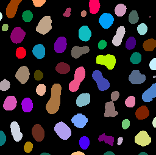
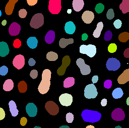
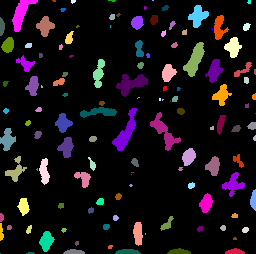
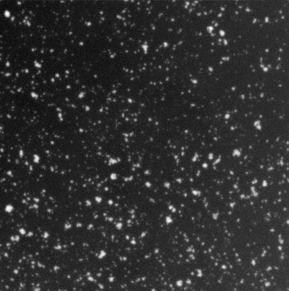
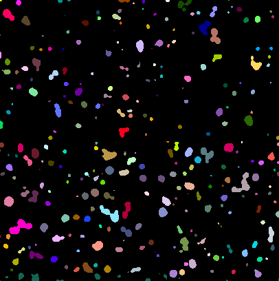

# Custom clij macro functions
[Source](https://github.com/clij/clij2-docs/tree/master/src/main/macro/custom_clij_macro_functions.ijm)

This notebook demonstrates how you can write your own clij macro functions. 
Goal is to formulate a custom function `my_image_segmentation(image, sigma, radius)` 
function for image segmentation that can be reused.

We start by cleaning up, initializing the GPU, loading an example image and pushing it to the GPU:

<pre class="highlight">
// clean up first
run("Close All");
run("Clear Results");

// initialize GPU
run("CLIJ2 Macro Extensions", "cl_device=");
Ext.<a href="https://clij.github.io/clij2-docs/reference_clear">CLIJ2_clear</a>();

// open an example image
open("http://imagej.nih.gov/ij/images/blobs.gif");

// push it to GPU memory
input = getTitle();
Ext.<a href="https://clij.github.io/clij2-docs/reference_push">CLIJ2_push</a>(input);
</pre>

Assume, we have a workflow with binarizes and the labels the image nicely.

<pre class="highlight">
sigma = 2;
Ext.<a href="https://clij.github.io/clij2-docs/reference_gaussianBlur2D">CLIJ2_gaussianBlur2D</a>(input, blurred, sigma, sigma);
radius = 10;
Ext.<a href="https://clij.github.io/clij2-docs/reference_topHatBox">CLIJ2_topHatBox</a>(blurred, background_subtracted, radius, radius, radius);
Ext.<a href="https://clij.github.io/clij2-docs/reference_thresholdOtsu">CLIJ2_thresholdOtsu</a>(background_subtracted, binary);
Ext.<a href="https://clij.github.io/clij2-docs/reference_connectedComponentsLabelingBox">CLIJ2_connectedComponentsLabelingBox</a>(binary, labels);
// show result
Ext.<a href="https://clij.github.io/clij2-docs/reference_pull">CLIJ2_pull</a>(labels);
run("glasbey_on_dark");
</pre>

## Define custom functions
We can now formulate a function, that takes an image, sigma and radius as parameters 
and performs this operation. 
Note the added release commands we are using to free memory of intermediate results. 
When working with many custom functions it is recommended to work like this to minimize 
memory consumption.

<pre class="highlight">
function my_image_segmentation(image, sigma, radius) {
	// This functions denoises an image, subtracts its background, thresholds it 
	// and labels objects in the given image. The sigma parameter controls the 
	// Gaussian blur function used for denoising. The radius parameter controls 
	// the background subtraction.
	sigma = 2;
	Ext.<a href="https://clij.github.io/clij2-docs/reference_gaussianBlur2D">CLIJ2_gaussianBlur2D</a>(image, blurred, sigma, sigma);
	Ext.<a href="https://clij.github.io/clij2-docs/reference_topHatBox">CLIJ2_topHatBox</a>(blurred, background_subtracted, radius, radius, radius);
	Ext.<a href="https://clij.github.io/clij2-docs/reference_release">CLIJ2_release</a>(blurred);
	Ext.<a href="https://clij.github.io/clij2-docs/reference_thresholdOtsu">CLIJ2_thresholdOtsu</a>(background_subtracted, binary);
	Ext.<a href="https://clij.github.io/clij2-docs/reference_release">CLIJ2_release</a>(background_subtracted);
	Ext.<a href="https://clij.github.io/clij2-docs/reference_connectedComponentsLabelingBox">CLIJ2_connectedComponentsLabelingBox</a>(binary, labels);
	Ext.<a href="https://clij.github.io/clij2-docs/reference_release">CLIJ2_release</a>(binary);
	return labels;
}
</pre>

## Call custom functions
We can then call the custom function, e.g. with different sigma and radius parameters.

<pre class="highlight">
segmented = my_image_segmentation(input, 2, 15);
// show result
Ext.<a href="https://clij.github.io/clij2-docs/reference_pull">CLIJ2_pull</a>(segmented);
run("glasbey_on_dark");

segmented = my_image_segmentation(input, 15, 5);
// show result
Ext.<a href="https://clij.github.io/clij2-docs/reference_pull">CLIJ2_pull</a>(segmented);
run("glasbey_on_dark");
</pre>

Furthermore, we can also use the same function to process other images. 
That keeps the image processing code short and easier to overview.
Furthermore, reusing functions is efficient and makes macro writing more sustainable.
Consider publishing useful functions, e.g. as 
[pull request to the clij2-docs repository](https://github.com/clij/clij2-docs/pulls).

<pre class="highlight">
// clean up first
Ext.<a href="https://clij.github.io/clij2-docs/reference_clear">CLIJ2_clear</a>();

// load a new image
open("http://imagej.nih.gov/ij/images/Cell_Colony.jpg");
run("Invert");
</pre>

<pre class="highlight">
// push it to GPU memory
input = getTitle();
Ext.<a href="https://clij.github.io/clij2-docs/reference_push">CLIJ2_push</a>(input);

// process the image
result = my_image_segmentation(input, 1, 10);
// show result
Ext.<a href="https://clij.github.io/clij2-docs/reference_pull">CLIJ2_pull</a>(result);
run("glasbey_on_dark");
</pre>

Clean up by the end

<pre class="highlight">
Ext.<a href="https://clij.github.io/clij2-docs/reference_clear">CLIJ2_clear</a>();
</pre>

