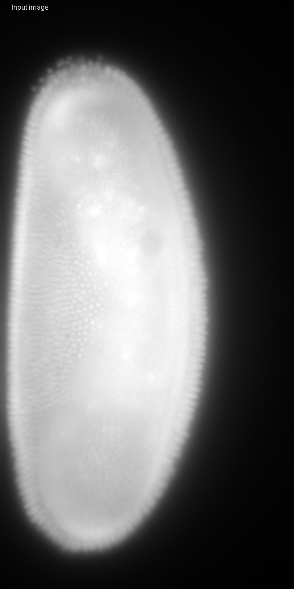
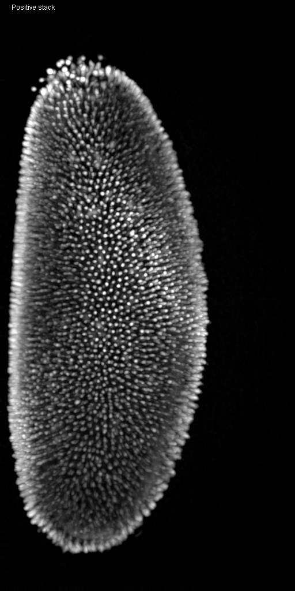
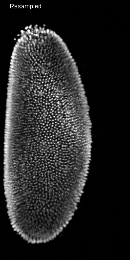
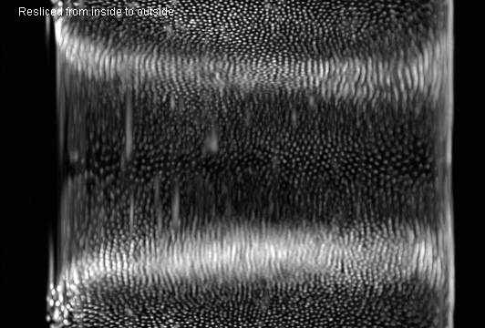

# Drosophila cell counting
Author: Robert Haase, Myers lab, MPI CBG, rhaase@mpi-cbg.de
        April 2020

In this example workflow we estimate nuclei count in a Droshophila melanogaster 
using spot detection on a cylindrical maximum intensity projection.

The workflow was originally published with the [CLIJ paper](https://doi.org/10.1038/s41592-019-0650-1).
This is an adapted version using CLIJ2.

The workflow mainly processed 3D image stacks. For visualisation purposes, this
notebook shows maximum projections.

Initialize GPU

<pre class="highlight">

run("CLIJ2 Macro Extensions", "cl_device=");
Ext.CLIJ2_clear();

</pre>

## The dataset
We process a dataset of a Drosophila melanogaster embryo expressing histone-RFP 
([Flybase 23651](http://flybase.org/reports/FBst0023651)). 
It was acquired using a custom multiview light sheet microscope from two opposing
perspectives. The data was fused and downsampled by a factor of two on the fly 
resulting in a voxel size of 0.52x0.52x2 microns. The image is taken from a timelapse
recording where three embryos in an FEP tube where acquired subsequently.
The full dataset is available 
[online](https://bds.mpi-cbg.de/CLIJ_benchmarking_data/000300.raw.tif).

Load data and push it to GPU memory

<pre class="highlight">
// Clean up first
run("Close All");

// load a specific time point
timepoint = 300;
folder = "C:/Users/Rober/Downloads/";
strNumber = "000000" + timepoint;
filename = substring(strNumber, lengthOf(strNumber) - 6) + ".raw.tif";
print(folder + filename);
open(folder + filename);
input = getTitle();

// Measure start time of the whole workflow
startTime = getTime();

// Push the image to GPU memory
Ext.CLIJ2_push(input);
Ext.CLIJ2_reportMemory();

// Close the window showing the dataset
close();

</pre>
<pre>
> C:/Users/Rober/Downloads/000300.raw.tif
> GPU contains 1 images.
> - 000300.raw.tif[net.haesleinhuepf.clij.clearcl.ClearCLPeerPointer@73c7d0cf] 121.0 Mb
> = 121.0 Mb
>  
</pre>

## Bit-Depth conversion
We convert the image to 32-bit float in order to make subsequent processing 
steps deliver smooth results.

<pre class="highlight">
Ext.CLIJ2_convertFloat(input, input_float);
Ext.CLIJ2_reportMemory();
show(input_float, "Input image");

</pre>
<pre>
> GPU contains 2 images.
> - 000300.raw.tif[net.haesleinhuepf.clij.clearcl.ClearCLPeerPointer@73c7d0cf] 121.0 Mb
> - CLIJ2_convertFloat_result211[net.haesleinhuepf.clij.clearcl.ClearCLPeerPointer@17284254] 242.0 Mb
> = 363.0 Mb
>  
</pre>

## Noise and background removal
We use the difference-of-Gaussian (DoG) technique to remove noise and 
background intensity. As the voxel size is quite different in X/Y compared to Z,
we only perform the Gaussian blur in X/Y-plane. We do this by setting both sigmas
in Z to 0:

<pre class="highlight">
sigma1 = 2;
sigma2 = 6;
Ext.<a href="https://clij.github.io/clij2-docs/reference_differenceOfGaussian3D">CLIJ2_differenceOfGaussian3D</a>(input_float, background_subtracted, sigma1, sigma1, 0, sigma2, sigma2, 0);
show(background_subtracted, "Background subtracted");
</pre>

We remove negative and zero pixel intensities so that later only maxima above zero intensity are detected. 

<pre class="highlight">
Ext.<a href="https://clij.github.io/clij2-docs/reference_maximumImageAndScalar">CLIJ2_maximumImageAndScalar</a>(background_subtracted, positive_stack, 1.0);
show(positive_stack, "Positive stack");
</pre>

## Resampling
All following transforms become mathematically easier to perform by resampling the
dataset initially so that it consists of isotropic voxels. Therefore, we resample
it with the voxel dimensions:

<pre class="highlight">
resampleX = 1.0 / 0.52;
resampleY = 1.0 / 0.52;
resampleZ = 1.0 / 2.0;
linearInterpolation = true;

Ext.<a href="https://clij.github.io/clij2-docs/reference_resample">CLIJ2_resample</a>(positive_stack, resampled, resampleX, resampleY, resampleZ, linearInterpolation);
show(resampled, "Resampled")
</pre>

## Spatial trnansforms 
Goal of this workflow is to perform a maximum projection from the center of the embryo to the surface. 
Therefore we interpret the embryo as a cylinder with the axis in anterior-posterior direction.
The maximum projection from the center to the hull consists of a radial projection and a maximum projection.
In order to apply a radial projection, which is performed in X-Y plane, we need to rotate the embryo first.

### Rescling X-Y planes along anterior-posterior direction

<pre class="highlight">
Ext.<a href="https://clij.github.io/clij2-docs/reference_resliceTop">CLIJ2_resliceTop</a>(resampled, reslicedFromTop);
show(reslicedFromTop, "Resliced from top");

</pre>

### Radial reslicing

<pre class="highlight">
number_of_angles = 360;
angle_step = 1;
startAngleDegrees = 0;
Ext.<a href="https://clij.github.io/clij2-docs/reference_getDimensions">CLIJ2_getDimensions</a>(reslicedFromTop, width, height, depth);
// we do this off-center because the embryo is not centered in the dataset
centerX = width / 2 - 50; 
centerY = height / 2;
scaleFactorX = 1.0;
scaleFactorY = 1.0;
Ext.<a href="https://clij.github.io/clij2-docs/reference_resliceRadial">CLIJ2_resliceRadial</a>(reslicedFromTop, radialResliced, number_of_angles, angle_step, startAngleDegrees, centerX, centerY, scaleFactorX, scaleFactorY);
show(radialResliced, "Radial projection");

</pre>

### Reslicing from inside to outside

<pre class="highlight">
Ext.<a href="https://clij.github.io/clij2-docs/reference_resliceLeft">CLIJ2_resliceLeft</a>(radialResliced, reslicedFromLeft);
show(reslicedFromLeft, "Resliced from inside to outside");

</pre>

## Maximum projection

<pre class="highlight">

Ext.<a href="https://clij.github.io/clij2-docs/reference_maximumZProjection">CLIJ2_maximumZProjection</a>(reslicedFromLeft, maxProjected);

</pre>

## Spot detection
For spot detection we use ImageJs `Find Maxima` method. Therefore, we need to get
the image back from GPU memory to CPU memory.

<pre class="highlight">

// pull result image back from GPU
Ext.CLIJ_pull(maxProjected);

// Spot detection
noiseThreshold = 5;
run("Find Maxima...", "noise=" + noiseThreshold + " output=[Point Selection]");
run("Flatten");

// Count spots
run("Clear Results");
run("Measure");
print("Number of spots found:" + nResults());
run("Clear Results");

</pre>
<pre>
> Number of spots found:1
</pre>

# Performance evaluation
Finally a time measurement. Note that performing this workflow with ImageJ macro markdown is slower 
as intermediate results are save to disc.

<pre class="highlight">
print("The whole workflow took " + (getTime() - startTime) + " msec");

</pre>
<pre>
> The whole workflow took 4011 msec
</pre>

Also let's see how much memory this workflow used. Cleaning up by the end is also important.

<pre class="highlight">
Ext.CLIJ2_reportMemory();

// clean up finally.
Ext.CLIJ2_clear();

</pre>
<pre>
> GPU contains 9 images.
> - CLIJ2_resample_result217[net.haesleinhuepf.clij.clearcl.ClearCLPeerPointer@335ac5bf] 130.6 Mb
> - CLIJ2_resliceTop_result219[net.haesleinhuepf.clij.clearcl.ClearCLPeerPointer@3e7e1c9c] 130.6 Mb
> - CLIJ2_resliceLeft_result223[net.haesleinhuepf.clij.clearcl.ClearCLPeerPointer@662c67ee] 130.8 Mb
> - CLIJ2_maximumImageAndScalar_result215[net.haesleinhuepf.clij.clearcl.ClearCLPeerPointer@34ba2507] 242.0 Mb
> - 000300.raw.tif[net.haesleinhuepf.clij.clearcl.ClearCLPeerPointer@73c7d0cf] 121.0 Mb
> - CLIJ2_maximumZProjection_result225[net.haesleinhuepf.clij.clearcl.ClearCLPeerPointer@51a87912] 748.1 kb
> - CLIJ2_resliceRadial_result221[net.haesleinhuepf.clij.clearcl.ClearCLPeerPointer@1ffc0547] 130.8 Mb
> - CLIJ2_convertFloat_result211[net.haesleinhuepf.clij.clearcl.ClearCLPeerPointer@17284254] 242.0 Mb
> - CLIJ2_differenceOfGaussian3D_result213[net.haesleinhuepf.clij.clearcl.ClearCLPeerPointer@1a6a0241] 242.0 Mb
> = 1.3 Gb
>  
</pre>

The following are convienence methods for proper visualisation in a noteboook:

<pre class="highlight">
function show(input, text) {
	Ext.<a href="https://clij.github.io/clij2-docs/reference_maximumZProjection">CLIJ2_maximumZProjection</a>(input, max_projection);
	Ext.CLIJ2_pull(max_projection);
	setColor(100000);
	drawString(text, 20, 20);
	Ext.CLIJ2_release(max_projection);
}
</pre>

