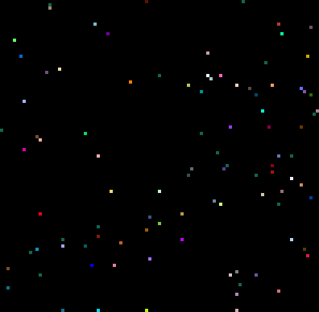
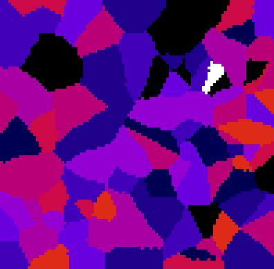
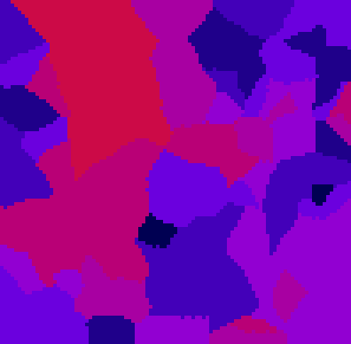

# CLIJ2 Tutorial: Filtering in graphs

This macro shows how to apply a filter to values 
in a graph

Author: Robert Haase
         April 2020

```java

// Initialize GPU
run("CLIJ2 Macro Extensions", "cl_device=[GeForce RTX 2060 SUPER]");
Ext.CLIJ2_clear();

run("Close All");

```

## Define a list of point coordinates and push them to the GPU 

```java

// make a pointlist with random coordinated on the GPU
number_of_points = 100;
number_of_dimensions = 2;
bit_depth = 32;
Ext.CLIJ2_create2D(pointlist, number_of_points, number_of_dimensions, bit_depth);
random_min = 0;
random_max = 100;
seed = getTime();
Ext.[CLIJ2_setRandom](https://clij.github.io/clij2-docs/reference_setRandom)(pointlist, random_min, random_max, seed);
Ext.CLIJ2_pull(pointlist);
zoom(10);

```
<a href="image_1587398512655.png"></a>

## Draw the spots labelled (1, 2, 3, ...) in 2D space

```java
Ext.[CLIJ2_pointlistToLabelledSpots](https://clij.github.io/clij2-docs/reference_pointlistToLabelledSpots)(pointlist, spots_image);
Ext.CLIJ2_pull(spots_image);
zoom(4);
run("glasbey_on_dark");

```
<a href="image_1587398512785.png"></a>

## Partition the space between the points.

```java
Ext.CLIJ2_labelVoronoiOctagon(spots_image, labelled_voronoi);
Ext.CLIJ2_pull(labelled_voronoi);
zoom(4);
run("glasbey_on_dark");;

```
<a href="image_1587398512924.png"></a>

## Distribute a random measurement in space - with one outlier

```java
measurement_array = newArray(number_of_points);
for (i = 0; i < number_of_points; i += 1) {
	measurement_array[i] = random() * 10;
}
measurement_array[number_of_points / 2] = 20;

Ext.[CLIJ2_pushArray](https://clij.github.io/clij2-docs/reference_pushArray)(measurement, measurement_array, number_of_points, 1, 1);
Ext.CLIJ2_pull(measurement);
zoom(10);

```
<a href="image_1587398513021.png"></a>

## Make a parametric image showing measurements in 2D space

```java
Ext.[CLIJ2_replaceIntensities](https://clij.github.io/clij2-docs/reference_replaceIntensities)(labelled_voronoi, measurement, parametric_image);
Ext.CLIJ2_pull(parametric_image);
zoom(4);
setMinAndMax(0, 20);
run("Fire");

```
<a href="image_1587398513137.png"></a>

## Calculate the median measurement for every node in graph, the median of its neighbors

```java

// determine the touch matrix
Ext.[CLIJ2_generateTouchMatrix](https://clij.github.io/clij2-docs/reference_generateTouchMatrix)(labelled_voronoi, touch_matrix);

/// determine median value of each nodes neighbors
Ext.[CLIJ2_medianOfTouchingNeighbors](https://clij.github.io/clij2-docs/reference_medianOfTouchingNeighbors)(measurement, touch_matrix, median_measurement);

// draw the median measurement, again as parametric image
Ext.[CLIJ2_replaceIntensities](https://clij.github.io/clij2-docs/reference_replaceIntensities)(labelled_voronoi, median_measurement, parametric_image);
Ext.CLIJ2_pull(parametric_image);
zoom(4);
setMinAndMax(0, 20);
run("Fire");

```
<a href="image_1587398513278.png"></a>

As you can see, the outlier is gone :-)

```java

```

Clean up by the end

```java
Ext.CLIJ2_clear();

```

This is just a utility function to make the visualisation in the notebook nice.

```java
function zoom(factor) {
	getDimensions(width, height, channels, slices, frames);
	before = getTitle();	
	run("Scale...", "x=" + factor + " y=" + factor + " width=" + (width * factor) + " height=" + (height* factor) + " interpolation=None average create");
	selectWindow(before);
	close();
}


```


```
```
