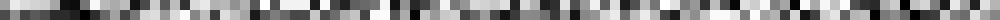
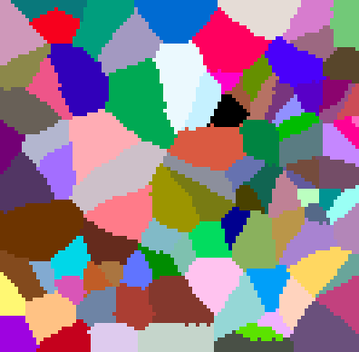
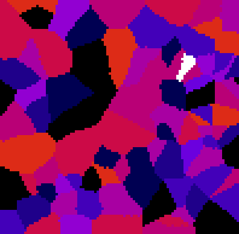
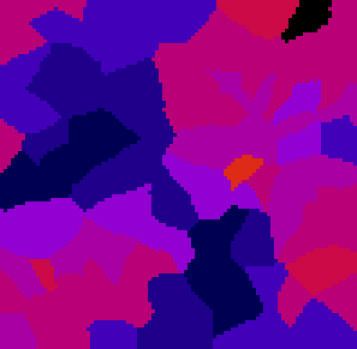

# Filtering in graphs
Authors: Robert Haase, Daniela Vorkel, April 2020

[Source](https://github.com/clij/clij2-docs/tree/master/src/main/macro/filtering_in_graphs.ijm)

This macro shows how to apply a filter to values 
of a graph.

<pre class="highlight">

// initialize GPU
run("CLIJ2 Macro Extensions", "cl_device=[GeForce RTX 2060 SUPER]");
Ext.CLIJ2_clear();

run("Close All");

</pre>

## Define a list of point coordinates and push them to the GPU 

<pre class="highlight">

// make a pointlist of random coordinates in the GPU
number_of_points = 100;
number_of_dimensions = 2;
bit_depth = 32;
Ext.CLIJ2_create2D(pointlist, number_of_points, number_of_dimensions, bit_depth);
random_min = 0;
random_max = 100;
seed = getTime();
Ext.<a href="https://clij.github.io/clij2-docs/reference_setRandom">CLIJ2_setRandom</a>(pointlist, random_min, random_max, seed);
Ext.CLIJ2_pull(pointlist);
zoom(10);

</pre>

## Draw labelled spots (1, 2, 3, ...) in 2D space

<pre class="highlight">
Ext.<a href="https://clij.github.io/clij2-docs/reference_pointlistToLabelledSpots">CLIJ2_pointlistToLabelledSpots</a>(pointlist, spots_image);
Ext.CLIJ2_pull(spots_image);
zoom(4);
run("glasbey_on_dark");

</pre>

## Partition the space between points

<pre class="highlight">
Ext.<a href="https://clij.github.io/clij2-docs/reference_labelVoronoiOctagon">CLIJ2_labelVoronoiOctagon</a>(spots_image, labelled_voronoi);
Ext.CLIJ2_pull(labelled_voronoi);
zoom(4);
run("glasbey_on_dark");;

</pre>

## Distribute random measurements in space - with one outlier

<pre class="highlight">
measurement_array = newArray(number_of_points);
for (i = 0; i < number_of_points; i += 1) {
	measurement_array[i] = random() * 10;
}
measurement_array[number_of_points / 2] = 20;

Ext.<a href="https://clij.github.io/clij2-docs/reference_pushArray">CLIJ2_pushArray</a>(measurement, measurement_array, number_of_points, 1, 1);
Ext.CLIJ2_pull(measurement);
zoom(10);

</pre>

## Create a parametric image showing measurements in 2D space

<pre class="highlight">
Ext.<a href="https://clij.github.io/clij2-docs/reference_replaceIntensities">CLIJ2_replaceIntensities</a>(labelled_voronoi, measurement, parametric_image);
Ext.CLIJ2_pull(parametric_image);
zoom(4);
setMinAndMax(0, 20);
run("Fire");

</pre>

## Calculate the median of every node and its neighbors in the graph

<pre class="highlight">

// determine the touch matrix
Ext.<a href="https://clij.github.io/clij2-docs/reference_generateTouchMatrix">CLIJ2_generateTouchMatrix</a>(labelled_voronoi, touch_matrix);

/// determine the median value of each neighboring nodes
Ext.<a href="https://clij.github.io/clij2-docs/reference_medianOfTouchingNeighbors">CLIJ2_medianOfTouchingNeighbors</a>(measurement, touch_matrix, median_measurement);

// draw measurements of the median, again as parametric image
Ext.<a href="https://clij.github.io/clij2-docs/reference_replaceIntensities">CLIJ2_replaceIntensities</a>(labelled_voronoi, median_measurement, parametric_image);
Ext.CLIJ2_pull(parametric_image);
zoom(4);
setMinAndMax(0, 20);
run("Fire");

</pre>

As you can see, the outlier is gone! :-)

<pre class="highlight">

</pre>

At the end of the macro, clean up:

<pre class="highlight">
Ext.CLIJ2_clear();

</pre>

This is just a useful function to get a nice visualization in the notebook:

<pre class="highlight">
function zoom(factor) {
	getDimensions(width, height, channels, slices, frames);
	before = getTitle();	
	run("Scale...", "x=" + factor + " y=" + factor + " width=" + (width * factor) + " height=" + (height* factor) + " interpolation=None average create");
	selectWindow(before);
	close();
}

</pre>

