# 3D Image Segmentation
[Source](https://github.com/clij/clij2-docs/tree/master/src/main/macro/count_neighbors.ijm)

Image segmentation in 3D is challenging for several reasons: In many microscopy imaging techniques, image quality varies in space: For example intensity and/or contrast degrades the deeper you image inside a sample. Furthermore,

To demonstrate the workflow, we're using cropped and resampled image data from the [Broad Bio Image Challenge](https://bbbc.broadinstitute.org/BBBC032): 
Ljosa V, Sokolnicki KL, Carpenter AE (2012). Annotated high-throughput microscopy image sets for validation. Nature Methods 9(7):637 / doi. PMID: 22743765 PMCID: PMC3627348. 
Available at [http://dx.doi.org/10.1038/nmeth.2083](http://dx.doi.org/10.1038/nmeth.2083)

We start by cleaning up ImageJ, opening an example image and configuring an interesting sub-region.

<pre class="highlight">
// clean up first
run("Close All");
run("Clear Results");

// open example image stack [available online](https://github.com/clEsperanto/pyclesperanto_prototype/blob/master/demo/segmentation/BBBC032_v1_dataset/BMP4blastocystC3-cropped_resampled_8bit.tif?raw=true)
open("C:/structure/data/BMP4blastocystC3-cropped_resampled_8bit.tif")
</pre>
<a href="image_1614507091328.png">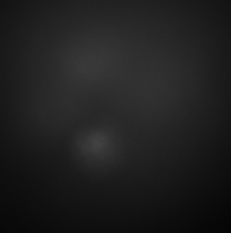</a>

Next, we initialize the GPU, push the image to GPU memory and read out its size.

<pre class="highlight">
run("CLIJ2 Macro Extensions", "cl_device=");
Ext.<a href="https://clij.github.io/clij2-docs/reference_clear">CLIJ2_clear</a>();

stack = getTitle();
Ext.<a href="https://clij.github.io/clij2-docs/reference_push">CLIJ2_push</a>(stack);

// read out image size
Ext.<a href="https://clij.github.io/clij2-docs/reference_getDimensions">CLIJ2_getDimensions</a>(stack, width, height, depth);
print("Image size:", width, height, depth );
</pre>
<pre>
> Image size: 393 396 86
</pre>

For convenience, we make a function for visualizing the image in projections from three sides:

<pre class="highlight">
function show(image_to_show, is_label_image) {
	Ext.<a href="https://clij.github.io/clij2-docs/reference_maximumXProjection">CLIJ2_maximumXProjection</a>(image_to_show, max_x_projection);
	Ext.<a href="https://clij.github.io/clij2-docs/reference_maximumYProjection">CLIJ2_maximumYProjection</a>(image_to_show, max_y_projection);
	Ext.<a href="https://clij.github.io/clij2-docs/reference_maximumZProjection">CLIJ2_maximumZProjection</a>(image_to_show, max_z_projection);

	// show the images, potentially using the glasbey lookup table
	Ext.<a href="https://clij.github.io/clij2-docs/reference_pull">CLIJ2_pull</a>(max_x_projection);
	if (is_label_image) {
		run("glasbey_on_dark");	
	}
	Ext.<a href="https://clij.github.io/clij2-docs/reference_pull">CLIJ2_pull</a>(max_y_projection);
	if (is_label_image) {
		run("glasbey_on_dark");	
	}
	Ext.<a href="https://clij.github.io/clij2-docs/reference_pull">CLIJ2_pull</a>(max_z_projection);
	if (is_label_image) {
		run("glasbey_on_dark");	
	}
}

// show the image
show(stack, false);
</pre>
<a href="image_1614507091871.png">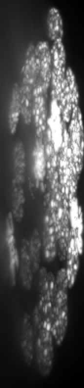</a>

Obviously, voxel size is not isotropic. Thus, we scale the image with the voxel size as scaling factor to get an image stack with isotropic voxels.

<pre class="highlight">
// read voxel size from original image using ImageJ functions
selectWindow(stack);
getVoxelSize(voxel_width, voxel_height, voxel_depth, unit);

// create another stack of different size
Ext.<a href="https://clij.github.io/clij2-docs/reference_create3D">CLIJ2_create3D</a>(isotropic_stack, width * voxel_width, height * voxel_height, depth * voxel_depth, bitDepth());

// Scale the image so that it becomes [isotropic](https://en.wikipedia.org/wiki/Isotropy)
Ext.<a href="https://clij.github.io/clij2-docs/reference_scale3D">CLIJ2_scale3D</a>(stack, isotropic_stack, voxel_width, voxel_height, voxel_depth, false);

show(isotropic_stack, false);
</pre>
<a href="image_1614507092300.png">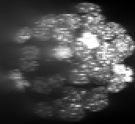</a>
<a href="image_1614507092316.png">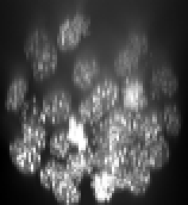</a>
<a href="image_1614507092348.png">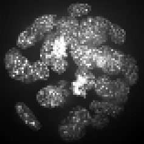</a>

## Intensity and background correction
As we can see, intensity is decreasing in Z-direction (from slice to slice) and contrast as well. 
At least the intensity decay can be corrected.

<pre class="highlight">
reference_slice = depth / 2;
Ext.<a href="https://clij.github.io/clij2-docs/reference_equalizeMeanIntensitiesOfSlices">CLIJ2_equalizeMeanIntensitiesOfSlices</a>(isotropic_stack, equalized_intensities_stack , reference_slice);

show (equalized_intensities_stack, false);
</pre>
<a href="image_1614507092546.png">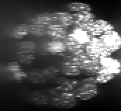</a>
<a href="image_1614507092570.png">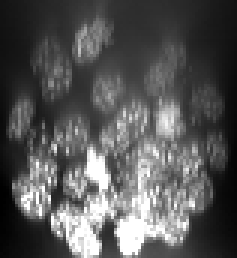</a>
<a href="image_1614507092594.png">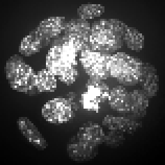</a>

Furthermore, background intensity appears to increase, potentially a result if more scattering deep in the sample. We can compensate for that by using a background subtraction technique:

<pre class="highlight">
radius = 5;
Ext.<a href="https://clij.github.io/clij2-docs/reference_topHatBox">CLIJ2_topHatBox</a>(equalized_intensities_stack, backgrund_subtracted , radius, radius, radius);

show(backgrund_subtracted, false);
</pre>
<a href="image_1614507092807.png">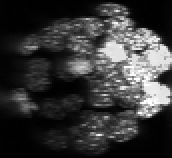</a>
<a href="image_1614507092823.png">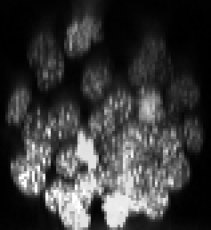</a>
<a href="image_1614507092847.png">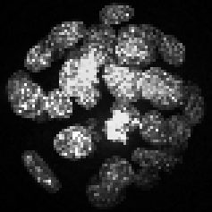</a>

# Segmentation
For segmentation, we use a combination of thresholding, spot detection and seeded watershed, called [Voronoi-Otsu-Labeling](https://github.com/clEsperanto/pyclesperanto_prototype/tree/master/demo/segmentation/voronoi_otsu_labeling.ipynb)

<pre class="highlight">
spot_sigma=3;
outline_sigma=1;
Ext.CLIJx_voronoiOtsuLabeling(backgrund_subtracted, segmented, spot_sigma, outline_sigma);
show(segmented, true);
</pre>
<a href="image_1614507093246.png">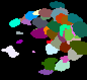</a>
<a href="image_1614507093262.png">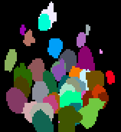</a>

If you run this macro from ImageJ, the last two opening windows allows to tip and tilt the view by clicking and dragging:

<pre class="highlight">
synchronized_views = true;
Ext.CLIJx_show3DWithTipTilt(backgrund_subtracted, "backgrund subtracted", synchronized_views);
run("In [+]");
run("In [+]");
run("In [+]");
Ext.CLIJx_show3DWithTipTilt(segmented, "segmented", synchronized_views);
run("In [+]");
run("In [+]");
run("In [+]");
run("glasbey_on_dark");
</pre>

<a href="image_1614507093516.png">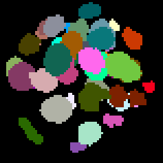</a>

In this case, cleaning up by the end would break the tip-tilt-viewer. 
If you're not using it, please clean up by the end:

<pre class="highlight">
//Ext.<a href="https://clij.github.io/clij2-docs/reference_clear">CLIJ2_clear</a>();
</pre>

