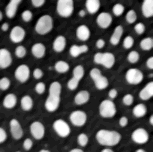
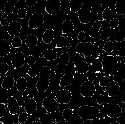
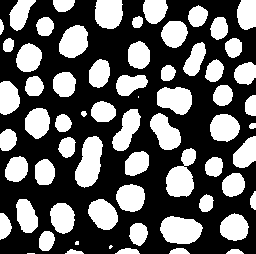
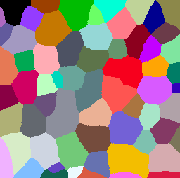
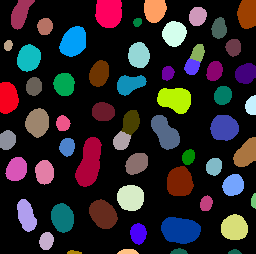
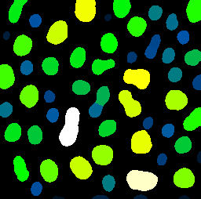
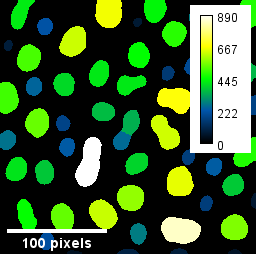

# Images, binary images, label images and parametric images
This notebooks introduces different image types and how they can be processed with CLIJ.

Let's start by cleaaning up and opening an example image. For this, we use ImageJ-functions:

<pre class="highlight">
// clean up first
run("Close All");
run("Clear Results");

// open the T1 heade example, a 3D MRI image
open("http://imagej.nih.gov/ij/images/blobs.gif");
run("Invert LUT");
</pre>

We now initialize the GPU and push the image as explained in the [basics of clij tutorial](https://clij.github.io/clij2-docs/md/basics/).

<pre class="highlight">
run("CLIJ2 Macro Extensions", "cl_device=");
Ext.<a href="https://clij.github.io/clij2-docs/reference_clear">CLIJ2_clear</a>();

// push image to GPU memory
blobs = getTitle();
Ext.<a href="https://clij.github.io/clij2-docs/reference_push">CLIJ2_push</a>(blobs);
</pre>

# Filtering images
Images can be filtered. [Filters](https://en.wikipedia.org/wiki/Filter_(signal_processing)) typically result in another image.
We demonstrate that using a local median filter. As pixel neighborhood, we use "Box" which is also known as the [8-connected, or Moore neighborhood](https://en.wikipedia.org/wiki/Moore_neighborhood). Alternatively, the diamond-neighborhood coul be used, which is also known as the [4-connected, or von Neumann neighborhood](https://en.wikipedia.org/wiki/Von_Neumann_neighborhood).

<pre class="highlight">
radius = 3;
Ext.<a href="https://clij.github.io/clij2-docs/reference_median2DBox">CLIJ2_median2DBox</a>(blobs, denoised_blobs, radius, radius);
// show result
Ext.<a href="https://clij.github.io/clij2-docs/reference_pull">CLIJ2_pull</a>(denoised_blobs);
</pre>

# Binarizing images
Operations which lead from any kind of image to binary images, binarze the given data. A binary images, or mask, has typically two values: 0 and 1.
A common description of these two numbers is that 1 represents objects and 0 represents background. 
In CLIJ you can binarze images using mathematical operation such as comparison of pixels with a constant:

<pre class="highlight">
// compare if pixels are qual than a given value:
value = 72;
Ext.<a href="https://clij.github.io/clij2-docs/reference_equalConstant">CLIJ2_equalConstant</a>(blobs, binary, value);
Ext.<a href="https://clij.github.io/clij2-docs/reference_pull">CLIJ2_pull</a>(binary);
</pre>

Note that we overwrite the results of the former operation when writing to the same "binary" image again using a different operation:

<pre class="highlight">
// compare if pixels are larger than a given value:
value = 100;
Ext.<a href="https://clij.github.io/clij2-docs/reference_greaterConstant">CLIJ2_greaterConstant</a>(blobs, binary, value);
Ext.<a href="https://clij.github.io/clij2-docs/reference_pull">CLIJ2_pull</a>(binary);
</pre>

In order eliminate the need for specifying such a threshold value manually, automatic thresholding algorithms have been developed, for example [Otsu's method](https://en.wikipedia.org/wiki/Otsu%27s_method):

<pre class="highlight">
Ext.<a href="https://clij.github.io/clij2-docs/reference_thresholdOtsu">CLIJ2_thresholdOtsu</a>(blobs, binary);
Ext.<a href="https://clij.github.io/clij2-docs/reference_pull">CLIJ2_pull</a>(binary);
</pre>

## Labeling images
Operations which result in images where objects are numbered, are labeling the image data. 
One common operation for this is called [connected component labeling](https://en.wikipedia.org/wiki/Connected-component_labeling).
It takes a binary image as input:

<pre class="highlight">
Ext.<a href="https://clij.github.io/clij2-docs/reference_connectedComponentsLabelingBox">CLIJ2_connectedComponentsLabelingBox</a>(binary, labeled_blobs);
Ext.<a href="https://clij.github.io/clij2-docs/reference_pull">CLIJ2_pull</a>(labeled_blobs);
// use a special [lookup-table](https://en.wikipedia.org/wiki/Lookup_table#Lookup_tables_in_image_processing) to visualize it:
run("glasbey_on_dark");
</pre>

There are more operations for labeling images, for example using a [Voronoi diagram](https://en.wikipedia.org/wiki/Voronoi_diagram) for separting the space between the white binary objects:

<pre class="highlight">
Ext.<a href="https://clij.github.io/clij2-docs/reference_voronoiLabeling">CLIJ2_voronoiLabeling</a>(binary, labeled_blobs);
Ext.<a href="https://clij.github.io/clij2-docs/reference_pull">CLIJ2_pull</a>(labeled_blobs);
run("glasbey_on_dark");
</pre>

A shortcut for skipping filtering, thresholding, including a [seeded watershed](https://en.wikipedia.org/wiki/Watershed_(image_processing)) and labeling allows to go from an image to a label image directly. 
The method called Voronoi-Otsu-Labeling is explained in more detail [here](https://github.com/clEsperanto/pyclesperanto_prototype/blob/master/demo/segmentation/voronoi_otsu_labeling.ipynb).

<pre class="highlight">
sigma_spot_finder = 4;
sigma_outline_finder = 2;
Ext.CLIJx_voronoiOtsuLabeling(blobs, labeled_blobs, sigma_spot_finder, sigma_outline_finder);
Ext.<a href="https://clij.github.io/clij2-docs/reference_pull">CLIJ2_pull</a>(labeled_blobs);
run("glasbey_on_dark");
</pre>

## Paramtric images
For visualization of quantitative measurements, parametric images can be used. 
Their pixel values represent a measurment that was taken from the labeled objects:

<pre class="highlight">
Ext.CLIJx_labelPixelCountMap(labeled_blobs, pixel_count_map);
Ext.<a href="https://clij.github.io/clij2-docs/reference_pull">CLIJ2_pull</a>(pixel_count_map);
// use a different look-up table for visualization
run("Green Fire Blue");
</pre>

When working with parametric images, we should use ImageJ's functionality to add a calibration bar and a scale bar:

<pre class="highlight">
run("Calibration Bar...", "location=[Upper Right] fill=White label=Black number=5 decimal=0 font=12 zoom=1");
run("Scale Bar...", "width=100 height=4 font=14 color=White background=None location=[Lower Left] bold overlay");

</pre>

