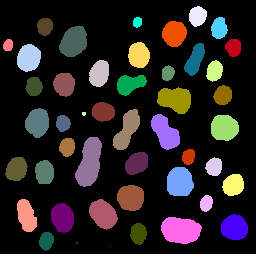

# Labelling
Author: Robert Haase
June 2019

[Source](https://github.com/clij/clij2-docs/tree/master/src/main/macro/labeling.ijm)

This macro shows how to apply an automatic 
threshold method and connected components labeling
to an image on the GPU

<pre class="highlight">
//Get test data
run("Blobs (25K)");
input = getTitle();
</pre>

## Init GPU
 and push image data to the GPU memory

<pre class="highlight">
run("CLIJ2 Macro Extensions", "cl_device=");
Ext.CLIJ2_clear();

// push data to GPU
Ext.CLIJ2_push(input);

// cleanup ImageJ
run("Close All");
</pre>

## Create a mask using a fixed threshold

<pre class="highlight">
Ext.<a href="https://clij.github.io/clij2-docs/reference_automaticThreshold">CLIJ2_automaticThreshold</a>(input, mask, "Otsu");
Ext.CLIJ2_pull(mask);
</pre>

## Label connected components

<pre class="highlight">
Ext.<a href="https://clij.github.io/clij2-docs/reference_connectedComponentsLabelingBox">CLIJ2_connectedComponentsLabelingBox</a>(mask, labelmap);

Ext.CLIJ2_pull(labelmap);
run("glasbey on dark");

</pre>

## Remove labels touching image borders

<pre class="highlight">
Ext.<a href="https://clij.github.io/clij2-docs/reference_excludeLabelsOnEdges">CLIJ2_excludeLabelsOnEdges</a>(labelmap, labels_not_touching_image_borders);
Ext.CLIJ2_pull(labels_not_touching_image_borders);
run("glasbey on dark");

</pre>

Clean up by the end.

<pre class="highlight">

Ext.CLIJ2_clear();

</pre>

