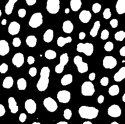

# CLIJ example macro: labeling.ijm

This macro shows how to apply an automatic 
threshold method and connected components labeling
to an image on the GPU

Author: Robert Haase
June 2019


// Get test data

```java
run("Blobs (25K)");
//open("C:/structure/data/blobs.gif");
input = getTitle();


```
<a href="image_1587210890936.png"></a>

Init GPU
 and push image data to the GPU memory

```java
run("CLIJ2 Macro Extensions", "cl_device=");
Ext.CLIJ2_clear();

// push data to GPU
Ext.CLIJ2_push(input);

// cleanup ImageJ
run("Close All");

```

Create a mask using a fixed threshold and label connected components

```java
Ext.[CLIJ2_automaticThreshold](https://clij.github.io/clij2-docs/reference_automaticThreshold)(input, mask, "Otsu");

// label
Ext.[CLIJ2_connectedComponentsLabelingBox](https://clij.github.io/clij2-docs/reference_connectedComponentsLabelingBox)(mask, labelmap);

// show result
Ext.CLIJ2_pull(mask);
Ext.CLIJ2_pull(labelmap);
run("glasbey on dark");


```
<a href="image_1587210894992.png"></a>
<a href="image_1587210895025.png"></a>

Clean up by the end.

```java

Ext.CLIJ2_clear();


```


```
```
