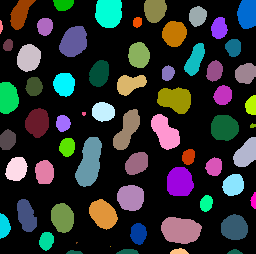

# CLIJ example macro: labeling.ijm

Author: Robert Haase
June 2019

[Source](https://github.com/clij/clij2-docs/tree/master/src/main/macro/labeling.ijm)

This macro shows how to apply an automatic 
threshold method and connected components labeling
to an image on the GPU


```java
//Get test data
run("Blobs (25K)");
input = getTitle();


```
<a href="image_1587652528521.png"></a>

## Init GPU
 and push image data to the GPU memory

```java
run("CLIJ2 Macro Extensions", "cl_device=");
Ext.CLIJ2_clear();

// push data to GPU
Ext.CLIJ2_push(input);

// cleanup ImageJ
run("Close All");

```

## Create a mask using a fixed threshold

```java
Ext.CLIJ2_automaticThreshold(input, mask, "Otsu");
Ext.CLIJ2_pull(mask);

```
<a href="image_1587652528671.png"></a>

## Label connected components

```java
Ext.CLIJ2_connectedComponentsLabelingBox(mask, labelmap);

Ext.CLIJ2_pull(labelmap);
run("glasbey on dark");


```
<a href="image_1587652528795.png"></a>

Clean up by the end.

```java

Ext.CLIJ2_clear();


```


```
```
