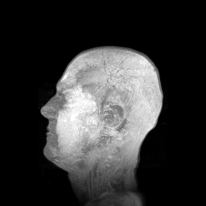
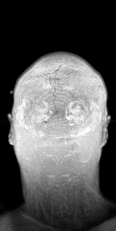

# Maximum projections
Authors: Robert Haase, Daniela Vorkel, April 2020

[Source](https://github.com/clij/clij2-docs/tree/master/src/main/macro/maximumProjection.ijm)

This macro shows how a maximum projection 
can be done in the GPU.

## Start
Let's clean up first and load some 3D example data:

<pre class="highlight">
run ("Close All");

// get test data
run("T1 Head (2.4M, 16-bits)");

</pre>

We then initialize the GPU and send the image to its memory:

<pre class="highlight">
run("CLIJ2 Macro Extensions", "cl_device=");
Ext.CLIJ2_clear();

// push images to GPU
input = getTitle();
Ext.CLIJ2_push(input);

// clean up ImageJ
close();
</pre>

## Maximum projections
We can use the classic maximum intensity projection in Z:

<pre class="highlight">
Ext.<a href="https://clij.github.io/clij2-docs/reference_maximumZProjection">CLIJ2_maximumZProjection</a>(input, maximum_z_projected);
Ext.CLIJ2_pull(maximum_z_projected);
</pre>

But also, we can project maximum intensity in X and Y direction:

<pre class="highlight">
Ext.<a href="https://clij.github.io/clij2-docs/reference_maximumYProjection">CLIJ2_maximumYProjection</a>(input, maximum_y_projected);
Ext.CLIJ2_pull(maximum_y_projected);

Ext.<a href="https://clij.github.io/clij2-docs/reference_maximumXProjection">CLIJ2_maximumXProjection</a>(input, maximum_x_projected);
Ext.CLIJ2_pull(maximum_x_projected);
</pre>

Furthermore, we can frame the range from which the projection is drawn:

<pre class="highlight">
min_z = 90;
max_z = 100;
Ext.<a href="https://clij.github.io/clij2-docs/reference_maximumZProjectionBounded">CLIJ2_maximumZProjectionBounded</a>(input, bound_projection, min_z, max_z);
Ext.CLIJ2_pull(bound_projection);
</pre>

At the end of the macro, clean up:

<pre class="highlight">
Ext.CLIJ2_clear();
</pre>

