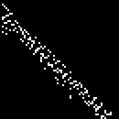
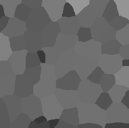
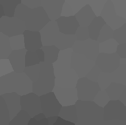
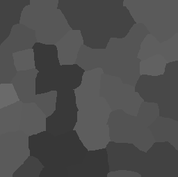
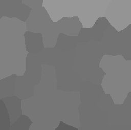

# Filtering between touching neighbors
Author: Robert Haase, March 2020

[Source](https://github.com/clij/clij2-docs/tree/master/src/main/macro/mean_of_touching_neighbors.ijm)

This macro shows how to apply an get a
voronoi image of a binary image in the GPU.

Clean up first and get test data

```java
run("Close All");


run("Blobs (25K)");
//open("C:/structure/data/blobs.gif");
input = getTitle();

```
<a href="image_1621870363843.png"></a>

Init GPU
 and data

```java
run("CLIJ2 Macro Extensions", "cl_device=");
Ext.CLIJ2_clear();

// push data to GPU
Ext.CLIJ2_push(input);

// cleanup ImageJ
run("Close All");

```

Create a mask using the Otsu threshold algorithm

```java
Ext.CLIJ2_thresholdOtsu(input, mask);
Ext.CLIJ2_pull(mask);

```
<a href="image_1621870363976.png"></a>

Draw a Voronoi diagram and invert it

```java

Ext.CLIJ2_voronoiOctagon(mask, voronoi_diagram);
// invert
Ext.CLIJ2_binaryNot(voronoi_diagram, inverted_voronoi);

Ext.CLIJ2_pullBinary(voronoi_diagram);
Ext.CLIJ2_pullBinary(inverted_voronoi);

```
<a href="image_1621870364143.png"></a>
<a href="image_1621870364175.png"></a>

Generate a label map and extend it to make labels touch

```java
Ext.CLIJ2_connectedComponentsLabelingBox(inverted_voronoi, labelled);

// Extend labels so that they touch
Ext.CLIJ2_maximum2DBox(labelled, labelled_extended, 2, 2);

Ext.CLIJ2_pull(labelled);
Ext.CLIJ2_pull(labelled_extended);

```
<a href="image_1621870364325.png"></a>
<a href="image_1621870364340.png"></a>

Determine touch matrix

```java
Ext.CLIJ2_generateTouchMatrix(labelled_extended, touch_matrix);
Ext.CLIJ2_pullBinary(touch_matrix);

```
<a href="image_1621870364414.png"></a>

Do statistics on the label map
 and push the mean intensity column back to the GPU

```java
run("Clear Results");
Ext.CLIJ2_statisticsOfBackgroundAndLabelledPixels(input, labelled_extended);

Ext.CLIJ2_resultsTableColumnToImage(intensity_values, "MEAN_INTENSITY");
run("Clear Results");
```


Show Mean intensity per label as parametric image

```java
Ext.CLIJ2_replaceIntensities(labelled_extended, intensity_values, intensity_map);
Ext.CLIJ2_pull(intensity_map);
rename("label intensity");
setMinAndMax(0, 255);

```
<a href="image_1621870364513.png"></a>

Determine mean (mean) intensity of local neighbors and draw another parametric image

```java
Ext.CLIJ2_meanOfTouchingNeighbors(intensity_values, touch_matrix, local_mean_intensity_values);
Ext.CLIJ2_replaceIntensities(labelled_extended, local_mean_intensity_values, local_mean_intensity_map);
Ext.CLIJ2_pull(local_mean_intensity_map);
rename("mean neighbor intensity");
setMinAndMax(0, 255);
```
<a href="image_1621870364603.png"></a>

Determine min and max (mean) intensity of local neighbors and draw two more parametric image

```java

// min
Ext.CLIJ2_minimumOfTouchingNeighbors(intensity_values, touch_matrix, local_minimum_intensity_values);
Ext.CLIJ2_replaceIntensities(labelled_extended, local_minimum_intensity_values, local_minimum_intensity_map);
Ext.CLIJ2_pull(local_minimum_intensity_map);
rename("minimum neighbor intensity");
setMinAndMax(0, 255);

// max
Ext.CLIJ2_maximumOfTouchingNeighbors(intensity_values, touch_matrix, local_maximum_intensity_values);
Ext.CLIJ2_replaceIntensities(labelled_extended, local_maximum_intensity_values, local_maximum_intensity_map);
Ext.CLIJ2_pull(local_maximum_intensity_map);
rename("maximum neighbor intensity");
setMinAndMax(0, 255);

```
<a href="image_1621870364721.png"></a>
<a href="image_1621870364752.png"></a>

Clean up by the end.

```java
Ext.CLIJ2_clear();
```


```
```
