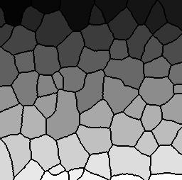
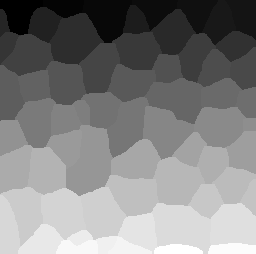
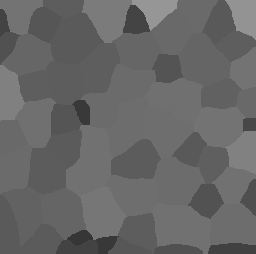
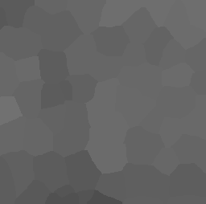
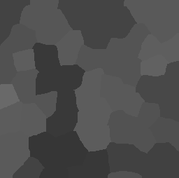
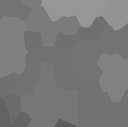

# Filtering between touching neighbors
Author: Robert Haase, March 2020

[Source](https://github.com/clij/clij2-docs/tree/master/src/main/macro/mean_of_touching_neighbors.ijm)

This macro shows how to apply an get a
voronoi image of a binary image in the GPU.

Clean up first and get test data

<pre class="highlight">
run("Close All");

run("Blobs (25K)");
//open("C:/structure/data/blobs.gif");
input = getTitle();

</pre>

Init GPU
 and data

<pre class="highlight">
run("CLIJ2 Macro Extensions", "cl_device=");
Ext.CLIJ2_clear();

// push data to GPU
Ext.CLIJ2_push(input);

// cleanup ImageJ
run("Close All");

</pre>

Create a mask using the Otsu threshold algorithm

<pre class="highlight">
Ext.<a href="https://clij.github.io/clij2-docs/reference_thresholdOtsu">CLIJ2_thresholdOtsu</a>(input, mask);
Ext.CLIJ2_pull(mask);

</pre>

Draw a Voronoi diagram and invert it

<pre class="highlight">

Ext.<a href="https://clij.github.io/clij2-docs/reference_voronoiOctagon">CLIJ2_voronoiOctagon</a>(mask, voronoi_diagram);
// invert
Ext.<a href="https://clij.github.io/clij2-docs/reference_binaryNot">CLIJ2_binaryNot</a>(voronoi_diagram, inverted_voronoi);

Ext.CLIJ2_pullBinary(voronoi_diagram);
Ext.CLIJ2_pullBinary(inverted_voronoi);

</pre>

Generate a label map and extend it to make labels touch

<pre class="highlight">
Ext.<a href="https://clij.github.io/clij2-docs/reference_connectedComponentsLabelingBox">CLIJ2_connectedComponentsLabelingBox</a>(inverted_voronoi, labelled);

// Extend labels so that they touch
Ext.<a href="https://clij.github.io/clij2-docs/reference_maximum2DBox">CLIJ2_maximum2DBox</a>(labelled, labelled_extended, 2, 2);

Ext.CLIJ2_pull(labelled);
Ext.CLIJ2_pull(labelled_extended);

</pre>

Determine touch matrix

<pre class="highlight">
Ext.<a href="https://clij.github.io/clij2-docs/reference_generateTouchMatrix">CLIJ2_generateTouchMatrix</a>(labelled_extended, touch_matrix);
Ext.CLIJ2_pullBinary(touch_matrix);

</pre>

Do statistics on the label map
 and push the mean intensity column back to the GPU

<pre class="highlight">
run("Clear Results");
Ext.<a href="https://clij.github.io/clij2-docs/reference_statisticsOfBackgroundAndLabelledPixels">CLIJ2_statisticsOfBackgroundAndLabelledPixels</a>(input, labelled_extended);

Ext.<a href="https://clij.github.io/clij2-docs/reference_resultsTableColumnToImage">CLIJ2_resultsTableColumnToImage</a>(intensity_values, "MEAN_INTENSITY");

</pre>

Show Mean intensity per label as parametric image

<pre class="highlight">
Ext.<a href="https://clij.github.io/clij2-docs/reference_replaceIntensities">CLIJ2_replaceIntensities</a>(labelled_extended, intensity_values, intensity_map);
Ext.CLIJ2_pull(intensity_map);
rename("label intensity");
setMinAndMax(0, 255);

</pre>

Determine mean (mean) intensity of local neighbors and draw another parametric image

<pre class="highlight">

Ext.<a href="https://clij.github.io/clij2-docs/reference_meanOfTouchingNeighbors">CLIJ2_meanOfTouchingNeighbors</a>(intensity_values, touch_matrix, local_mean_intensity_values);
Ext.<a href="https://clij.github.io/clij2-docs/reference_replaceIntensities">CLIJ2_replaceIntensities</a>(labelled_extended, local_mean_intensity_values, local_mean_intensity_map);
Ext.CLIJ2_pull(local_mean_intensity_map);
rename("mean neighbor intensity");
setMinAndMax(0, 255);

</pre>

Determine min and max (mean) intensity of local neighbors and draw two more parametric image

<pre class="highlight">

// min
Ext.<a href="https://clij.github.io/clij2-docs/reference_minimumOfTouchingNeighbors">CLIJ2_minimumOfTouchingNeighbors</a>(intensity_values, touch_matrix, local_minimum_intensity_values);
Ext.<a href="https://clij.github.io/clij2-docs/reference_replaceIntensities">CLIJ2_replaceIntensities</a>(labelled_extended, local_minimum_intensity_values, local_minimum_intensity_map);
Ext.CLIJ2_pull(local_minimum_intensity_map);
rename("minimum neighbor intensity");
setMinAndMax(0, 255);

// max
Ext.<a href="https://clij.github.io/clij2-docs/reference_maximumOfTouchingNeighbors">CLIJ2_maximumOfTouchingNeighbors</a>(intensity_values, touch_matrix, local_maximum_intensity_values);
Ext.<a href="https://clij.github.io/clij2-docs/reference_replaceIntensities">CLIJ2_replaceIntensities</a>(labelled_extended, local_maximum_intensity_values, local_maximum_intensity_map);
Ext.CLIJ2_pull(local_maximum_intensity_map);
rename("maximum neighbor intensity");
setMinAndMax(0, 255);

</pre>

Clean up by the end.

<pre class="highlight">
Ext.CLIJ2_clear();
</pre>

