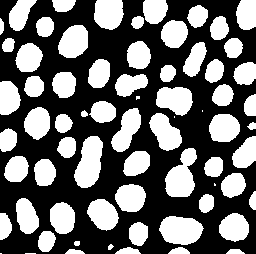

# Measure overlap
Authors: Robert Haase, Daniela Vorkel, April 2020

[Source](https://github.com/clij/clij2-docs/tree/master/src/main/macro/measure_overlap.ijm)


This macro shows how to measure an overlap 
of two binary images in the GPU.

Get test data:

```java
run("Blobs (25K)");
// open("C:/structure/data/blobs.gif");
input = getTitle();

```
<a href="image_1588707322243.png"></a>

## Init GPU
and push image data to GPU memory:

```java
run("CLIJ2 Macro Extensions", "cl_device=");
Ext.CLIJ2_clear();

// push data to GPU
Ext.CLIJ2_push(input);

// clean up ImageJ
run("Close All");


```

## Create a mask by using two different threshold methods

```java

Ext.CLIJ2_automaticThreshold(input, mask1, "Otsu");
Ext.CLIJ2_automaticThreshold(input, mask2, "MinError");

Ext.CLIJ2_pullBinary(mask1);
Ext.CLIJ2_pullBinary(mask2);

```
<a href="image_1588707322448.png"></a>
<a href="image_1588707322482.png"></a>

## Measure the overlap between two masks

```java
Ext.CLIJ2_getJaccardIndex(mask1, mask2, jaccardIndex);
Ext.CLIJ2_getSorensenDiceCoefficient(mask1, mask2, diceIndex);

// output result
IJ.log("Overlap (Jaccard index): " + (jaccardIndex*100) + "%");
IJ.log("Overlap (Sorensen / Dice coefficient): " + (diceIndex*100) + "%");


```
<pre>
> Overlap (Jaccard index): 81.9294%
> Overlap (Sorensen / Dice coefficient): 90.0672%
</pre>

At the end of the macro, clean up:

```java
Ext.CLIJ2_clear();
```


```
```
