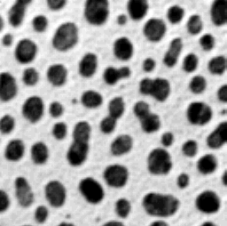
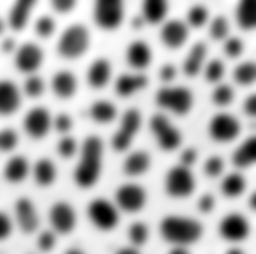
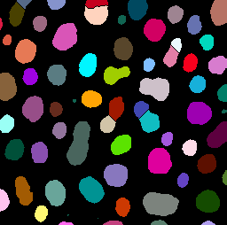

# Classic Watershed (MorphoLibJ extension)
Author: Robert Haase, May 2021

[Source](https://github.com/clij/clij2-docs/tree/master/src/main/macro/morpholibj_classic_watershed.ijm)

This tutorial demonstrates the use of the Classic Watershed plugin as CLIJx extension.

See also
* [Classic watershed in the ImageJ Wiki](https://imagej.net/Classic_Watershed)

To make this script run, please activate the update sites clij, clij2 and 
install the [clijx-assistant-extensions](https://clij.github.io/assistant/installation#extensions) 
in your Fiji.

We cleanup first and load the blobs image as example.

<pre class="highlight">
close("*");

// Init GPU
run("CLIJ2 Macro Extensions", "cl_device=");
Ext.<a href="https://clij.github.io/clij2-docs/reference_clear">CLIJ2_clear</a>();

// Load image from disc 
run("Blobs (25K)");
blobs_image = getTitle();
Ext.<a href="https://clij.github.io/clij2-docs/reference_pushCurrentZStack">CLIJ2_pushCurrentZStack</a>(blobs_image);
</pre>

The algorithm expects a grey value image representing hills (high values, white) and valleys (low values, dark).
Thus, we need to invert the input image. 

<pre class="highlight">
// invert
Ext.<a href="https://clij.github.io/clij2-docs/reference_subtractImageFromScalar">CLIJ2_subtractImageFromScalar</a>(blobs_image, inverted_image, 255);

Ext.<a href="https://clij.github.io/clij2-docs/reference_pull">CLIJ2_pull</a>(inverted_image);
</pre>

Furthermore, the authors suggest to use a blurred version of the image and optionally a binary image as mask. 
The clijx-assistant-extension for that algorithm has the binary image as mandatory input. 
Thus, we need to provide it.

<pre class="highlight">
sigma = 4;
Ext.<a href="https://clij.github.io/clij2-docs/reference_gaussianBlur2D">CLIJ2_gaussianBlur2D</a>(inverted_image, blurred_image, sigma, sigma);
Ext.<a href="https://clij.github.io/clij2-docs/reference_pull">CLIJ2_pull</a>(blurred_image);

// threshold
Ext.<a href="https://clij.github.io/clij2-docs/reference_thresholdOtsu">CLIJ2_thresholdOtsu</a>(blobs_image, binary_image);
Ext.<a href="https://clij.github.io/clij2-docs/reference_pullBinary">CLIJ2_pullBinary</a>(binary_image);
</pre>

The result will be a label image.

<pre class="highlight">
// Classic Watershed
h_min = 1.0;
h_max = 3.4028235E38;
Ext.CLIJx_morphoLibJClassicWatershed(blurred_image, binary_image, watershed_label_image, h_min, h_max);

Ext.<a href="https://clij.github.io/clij2-docs/reference_pull">CLIJ2_pull</a>(watershed_label_image);
run("glasbey_on_dark");
</pre>
<pre>
>   Extracting pixel values (h_min = 1.0, h_max = 255.0)...
>   Extraction took 1 ms.
>   Sorting pixels by value...
>   Sorting took 5 ms.
>   Flooding...
>   Flooding took: 4 ms
> Watershed 3d took 13 ms.
</pre>

Clean up by the end

<pre class="highlight">
Ext.<a href="https://clij.github.io/clij2-docs/reference_clear">CLIJ2_clear</a>();
</pre>

