# Filtering between touching neighbors
Author: Robert Haase, May 2021

[Source](https://github.com/clij/clij2-docs/tree/master/src/main/macro/nieghborhood_definitions.ijm)

This macro shows how to apply an get a
voronoi image of a binary image in the GPU.

Clean up first and get test data: An image showing simulated tissue and 
another image with measurements for every cell where one cell has an 
increased value.

<pre class="highlight">
run("Close All");

open("C:/structure/code/clij2-docs/src/main/resources/tissue.tif");
label_image = getTitle();
open("C:/structure/code/clij2-docs/src/main/resources/measurements.tif");
measurements_image = getTitle();
configure_visualization();
</pre>
<a href="image_1621872533782.png">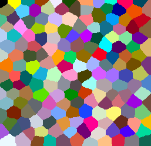</a>

Init GPU
 and data

<pre class="highlight">
run("CLIJ2 Macro Extensions", "cl_device=");
Ext.<a href="https://clij.github.io/clij2-docs/reference_clear">CLIJ2_clear</a>();

// push data to GPU
Ext.<a href="https://clij.github.io/clij2-docs/reference_push">CLIJ2_push</a>(label_image);
Ext.<a href="https://clij.github.io/clij2-docs/reference_push">CLIJ2_push</a>(measurements_image);
</pre>

## Visualizing local properties
As cells in tissues communicate with each other via membranes, we can measure 
regional properties of cells across their boundaries. For example local maximum of the given measurement.

<pre class="highlight">
radius = 1;
ignore_background = true;
Ext.<a href="https://clij.github.io/clij2-docs/reference_maximumOfTouchingNeighborsMap">CLIJ2_maximumOfTouchingNeighborsMap</a>(measurements_image, label_image, local_maximum_map, radius, ignore_background);
show(local_maximum_map);
</pre>

## Types of neighborhoods
### Touching neighbors
You can use differen types for neighborhoods: touching neighbors, n-nearest neighbors and proximal neighbors.

When producing maps of measurements of touching neighbors, the radius parameter can be used to define 
* no neigbors (radius = 0), 
* direct neighbors (radius = 1),
* neighbors of neighbors (radius = 2) and 
* neighbors of neighbors of neighbors (radius = 3)
to be taken into account for summarizing measurements.

<pre class="highlight">
for (radius = 0; radius < 4; radius += 1) {
    Ext.<a href="https://clij.github.io/clij2-docs/reference_maximumOfTouchingNeighborsMap">CLIJ2_maximumOfTouchingNeighborsMap</a>(measurements_image, label_image, local_maximum_map, radius, ignore_background);
    show(local_maximum_map);
}
</pre>

<a href="image_1621872534238.png">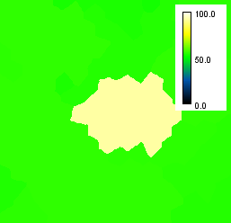</a>
<a href="image_1621872534269.png">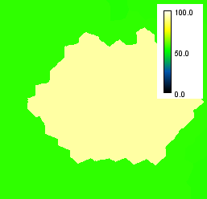</a>

### N nearest neighbors
Similarily, n-nearest neighbors can be used to describe a neighborhood:

<pre class="highlight">
for (n = 10; n <= 30; n += 10) {
    Ext.<a href="https://clij.github.io/clij2-docs/reference_maximumOfNNearestNeighborsMap">CLIJ2_maximumOfNNearestNeighborsMap</a>(measurements_image, label_image, local_maximum_map, n);
    show(local_maximum_map);
}
</pre>
<a href="image_1621872534528.png">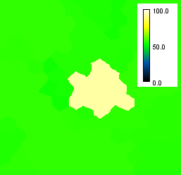</a>
<a href="image_1621872534559.png">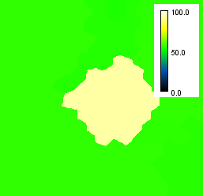</a>
<a href="image_1621872534575.png">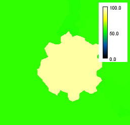</a>

Note, when determining the local maximum, the neighborhood of the target pixel of the signal is relevant, 
not the source. Thus, unintuitive results can appear. Furthermore, per definition n=0 delivers the original
parametric image: 

<pre class="highlight">
for (n = 0; n < 3; n += 1) {
    Ext.<a href="https://clij.github.io/clij2-docs/reference_maximumOfNNearestNeighborsMap">CLIJ2_maximumOfNNearestNeighborsMap</a>(measurements_image, label_image, local_maximum_map, n);
    show(local_maximum_map);
}
</pre>

<a href="image_1621872534881.png">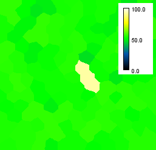</a>
<a href="image_1621872534897.png">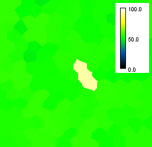</a>

### Proximal neighbors
You can also select neighbors according to the distance between their centroids. Also here, a distamce d=0
leads to the original parametric image as ouput.

<pre class="highlight">
for (d = 0; d <= 50; d += 10) {
	min_distance = 0;
	max_distance = d;
    Ext.<a href="https://clij.github.io/clij2-docs/reference_maximumOfProximalNeighborsMap">CLIJ2_maximumOfProximalNeighborsMap</a>(measurements_image, label_image, local_maximum_map, min_distance, max_distance);
    show(local_maximum_map);
}

</pre>

<a href="image_1621872535475.png">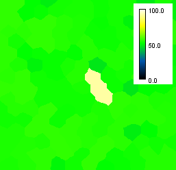</a>
<a href="image_1621872535506.png">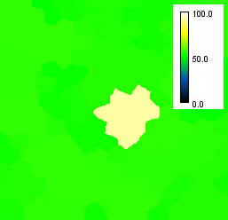</a>
<a href="image_1621872535521.png">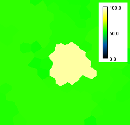</a>
<a href="image_1621872535537.png">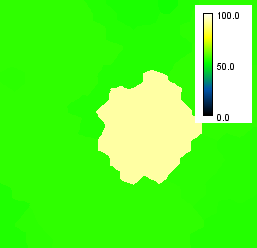</a>

Clean up by the end.

<pre class="highlight">
Ext.<a href="https://clij.github.io/clij2-docs/reference_clear">CLIJ2_clear</a>();
</pre>

These are just convenience functions used further up.

<pre class="highlight">
function configure_visualization() {
	run("Green Fire Blue");
	setMinAndMax(0, 100);
 	run("Calibration Bar...", "location=[Upper Right] fill=White label=Black number=3 decimal=1 font=12 zoom=0.8 overlay");
}
function show(image) {
	Ext.<a href="https://clij.github.io/clij2-docs/reference_pull">CLIJ2_pull</a>(image);
	configure_visualization();
}
</pre>

