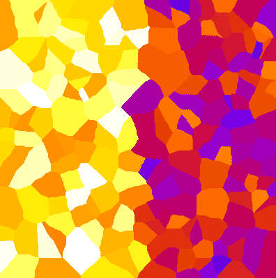
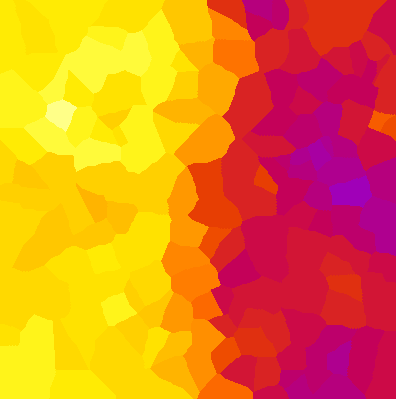
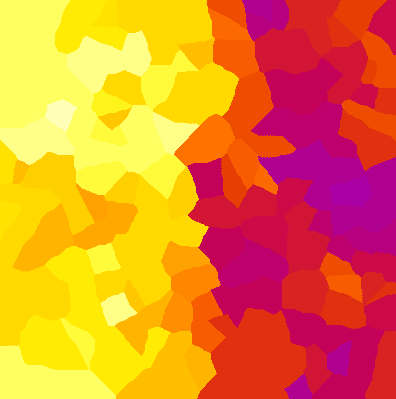
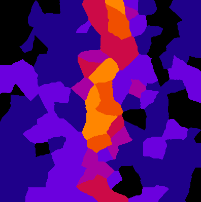
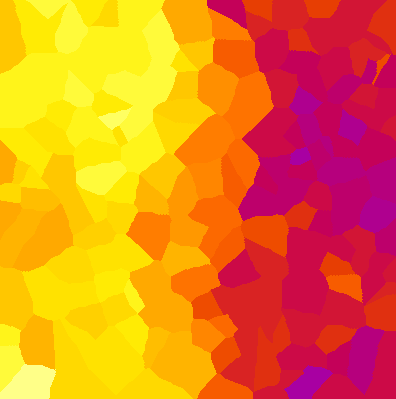

# Neighbors of neighbors
Author: Robert Haase, April 2020

[Source](https://github.com/clij/clij2-docs/tree/master/src/main/macro/neighbors_of_neighbors.ijm)

This macro shows how to apply a filters to values in a graph considering neighbors of neighbors

<pre class="highlight">

// Initialize GPU
run("CLIJ2 Macro Extensions", "cl_device=[GeForce RTX 2060 SUPER]");
Ext.CLIJ2_clear();

run("Close All");

</pre>

## The dataset
We start with a list of random point coordinates, to draw a spots image 
and partion the image space between these points. 

<pre class="highlight">

// make a pointlist with random coordinates on the GPU
number_of_points = 200;
number_of_dimensions = 2;
bit_depth = 32;
Ext.CLIJ2_create2D(pointlist, number_of_points, number_of_dimensions, bit_depth);
random_min = 0;
random_max = 400;
seed = getTime();
Ext.<a href="https://clij.github.io/clij2-docs/reference_setRandom">CLIJ2_setRandom</a>(pointlist, random_min, random_max, seed);

// Draw the spots labelled (1, 2, 3, ...) in 2D space
Ext.<a href="https://clij.github.io/clij2-docs/reference_pointlistToLabelledSpots">CLIJ2_pointlistToLabelledSpots</a>(pointlist, spots_image);

// Partition the space between the points.
Ext.<a href="https://clij.github.io/clij2-docs/reference_labelVoronoiOctagon">CLIJ2_labelVoronoiOctagon</a>(spots_image, label_map);
Ext.CLIJ2_pull(label_map);
run("glasbey_on_dark");
</pre>

Before we can run operations on neighbors, we need to determine which labels
in our label map are neighbors. Furthermore, we can draw the neighborhood relationships as graph/mesh.

<pre class="highlight">
// determine the touch matrix
Ext.<a href="https://clij.github.io/clij2-docs/reference_generateTouchMatrix">CLIJ2_generateTouchMatrix</a>(label_map, touch_matrix);

// daw mesh
Ext.<a href="https://clij.github.io/clij2-docs/reference_touchMatrixToMesh">CLIJ2_touchMatrixToMesh</a>(pointlist, touch_matrix, mesh);
Ext.CLIJ2_pull(mesh);
</pre>

## Distribute values in space
We get the center of mass of the objects in our label map and generate a vector of 
measurement values which are a bit random, but also different on the left and on 
the right side of the image.

<pre class="highlight">
run("Clear Results");
Ext.<a href="https://clij.github.io/clij2-docs/reference_statisticsOfBackgroundAndLabelledPixels">CLIJ2_statisticsOfBackgroundAndLabelledPixels</a>(label_map, label_map);
for (i = 0; i < nResults(); i++) {
	offset = 80;
	if (getResult("MASS_CENTER_X", i) > 200) {
		offset = 60;
	}
	setResult("Measurement", i, offset + random() * 20);
}
Ext.<a href="https://clij.github.io/clij2-docs/reference_pushResultsTableColumn">CLIJ2_pushResultsTableColumn</a>(measurement, "Measurement");
run("Clear Results");

</pre>

## Make a parametric image showing measurements in 2D space

<pre class="highlight">
drawResult(label_map, measurement);

function drawResult(label_map, measurement) {
	// replace the labels in the label map with the corresponding measurement
	Ext.<a href="https://clij.github.io/clij2-docs/reference_replaceIntensities">CLIJ2_replaceIntensities</a>(label_map, measurement, parametric_image);
	// show the parametric image
	Ext.CLIJ2_pull(parametric_image);
	setMinAndMax(50, 100);
	run("Fire");
}

</pre>

## Smoothing between neighbors
We can apply smoothing operations, e.g. a mean filter:

<pre class="highlight">
// determine mean value of each nodes neighbors
Ext.<a href="https://clij.github.io/clij2-docs/reference_meanOfTouchingNeighbors">CLIJ2_meanOfTouchingNeighbors</a>(measurement, touch_matrix, mean_measurement);
drawResult(label_map, mean_measurement);
</pre>

To prevent the orange stripe in the center, we need to use the median filter:

<pre class="highlight">
/// determine median value of each nodes neighbors
Ext.<a href="https://clij.github.io/clij2-docs/reference_medianOfTouchingNeighbors">CLIJ2_medianOfTouchingNeighbors</a>(measurement, touch_matrix, median_measurement);
drawResult(label_map, median_measurement);
</pre>

From that image, we can make the border visible:

<pre class="highlight">
/// determine standard deviation between neighbors
Ext.<a href="https://clij.github.io/clij2-docs/reference_standardDeviationOfTouchingNeighbors">CLIJ2_standardDeviationOfTouchingNeighbors</a>(median_measurement, touch_matrix, stddev_measurement);
drawResult(label_map, stddev_measurement);
setMinAndMax(0, 10);

</pre>

## Increasing the radius of the operation
We can further increase the radius of the operation by using `neighborsOfNeighbors()`.
One can see that because there is a wider orange stripe in the middle when applying
the mean filter.

<pre class="highlight">

Ext.<a href="https://clij.github.io/clij2-docs/reference_neighborsOfNeighbors">CLIJ2_neighborsOfNeighbors</a>(touch_matrix, neighbor_matrix);
Ext.<a href="https://clij.github.io/clij2-docs/reference_meanOfTouchingNeighbors">CLIJ2_meanOfTouchingNeighbors</a>(measurement, neighbor_matrix, mean_measurement);
drawResult(label_map, mean_measurement);

</pre>

Clean up by the end

<pre class="highlight">
Ext.CLIJ2_clear();

</pre>

