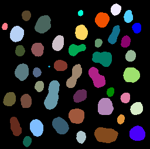
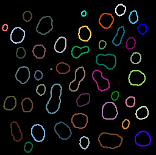
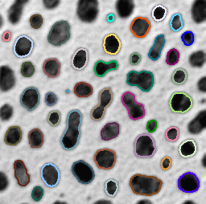
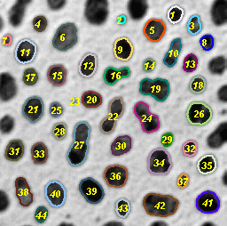

# Adding label outlines and numbers as overlay 
Authors: Robert Haase and Bram van den Broek, March 2021

[Source](https://github.com/clij/clij2-docs/tree/master/src/main/macro/outlines_numbers_overlay.ijm)

This macro shows how to label outlines of segmented objects 
and how to draw label numbers to the image as overlay.

<pre class="highlight">
// clean up first
close("*");
</pre>
get test data 
<pre class="highlight">
run("Blobs (25K)");
input = getTitle();
</pre>

## Image segmentation using CLIJ
First we initialize the GPU and push image data to the GPU memory:

<pre class="highlight">
run("CLIJ2 Macro Extensions", "cl_device=");
Ext.<a href="https://clij.github.io/clij2-docs/reference_clear">CLIJ2_clear</a>();

// push data to GPU
Ext.<a href="https://clij.github.io/clij2-docs/reference_push">CLIJ2_push</a>(input);

// Blur the image and create a mask using a fixed threshold
Ext.<a href="https://clij.github.io/clij2-docs/reference_gaussianBlur2D">CLIJ2_gaussianBlur2D</a>(input, input_blurred, 1, 1);
// binarization
Ext.<a href="https://clij.github.io/clij2-docs/reference_thresholdOtsu">CLIJ2_thresholdOtsu</a>(input_blurred, mask);
// label connected components
Ext.<a href="https://clij.github.io/clij2-docs/reference_connectedComponentsLabelingBox">CLIJ2_connectedComponentsLabelingBox</a>(mask, labelmap);
// Remove labels touching image borders
Ext.<a href="https://clij.github.io/clij2-docs/reference_excludeLabelsOnEdges">CLIJ2_excludeLabelsOnEdges</a>(labelmap, labels_not_touching_image_borders);
Ext.<a href="https://clij.github.io/clij2-docs/reference_pull">CLIJ2_pull</a>(labels_not_touching_image_borders);
run("glasbey on dark");
resetMinAndMax;
</pre>

## Create thick label outlines
We now take the label image an generate an image where only 
the label outlines are highlighted.

<pre class="highlight">
// determine label borders
Ext.<a href="https://clij.github.io/clij2-docs/reference_detectLabelEdges">CLIJ2_detectLabelEdges</a>(labels_not_touching_image_borders, labelmap_edges);
// make borders a bit wider
Ext.<a href="https://clij.github.io/clij2-docs/reference_dilateBox">CLIJ2_dilateBox</a>(labelmap_edges, labelmap_edges_dilated);
// bring label numbers (colours) to the label edge image 
Ext.<a href="https://clij.github.io/clij2-docs/reference_mask">CLIJ2_mask</a>(labels_not_touching_image_borders, labelmap_edges_dilated, labelmap_outlines);
// visualize labeled image
Ext.<a href="https://clij.github.io/clij2-docs/reference_pull">CLIJ2_pull</a>(labelmap_outlines);
run("glasbey_on_dark");
resetMinAndMax;

</pre>

## Add the label outlines as overlay to the original image

<pre class="highlight">
selectWindow(input);
run("Add Image...", "image=["+labelmap_outlines+"] x=0 y=0 opacity=100 zero");

</pre>

## Add label numbers as overlay to the input image
Count labels and measure the label statistics

<pre class="highlight">
run("Clear Results");
// measure maximum intensity in the label image which equals 
// the number of labeled objects
Ext.<a href="https://clij.github.io/clij2-docs/reference_getMaximumOfAllPixels">CLIJ2_getMaximumOfAllPixels</a>(labels_not_touching_image_borders, number_of_labels);
// determine mass center (and other statistics)
Ext.<a href="https://clij.github.io/clij2-docs/reference_statisticsOfLabelledPixels">CLIJ2_statisticsOfLabelledPixels</a>(labels_not_touching_image_borders, labels_not_touching_image_borders);

// configure font for drawing text
labelFontSize = 11;
labelFontColor = "yellow";
style = "bold italic";
setFont("SansSerif", labelFontSize, style);
setColor(labelFontColor);

// Draw the label numbers as overlays. The x,y coordinates 
// are retrieved from the label statistics in the results table.
selectWindow(input);
for (i = 0; i < number_of_labels; i++) {
	x = getResult("MASS_CENTER_X", i);
	y = getResult("MASS_CENTER_Y", i);
	Overlay.drawString(i+1, x - labelFontSize/2, y + labelFontSize/2);
}
// clean up results table
run("Clear Results");
Overlay.show();

</pre>

At the end of the macro, clean up:

<pre class="highlight">
Ext.<a href="https://clij.github.io/clij2-docs/reference_clear">CLIJ2_clear</a>();
</pre>

</pre>
</pre>
