# Parametric images
Author: Robert Haase, May 2021

[Source](https://github.com/clij/clij2-docs/tree/master/src/main/macro/parametric_images.ijm)

Parametric images are images where the intensity expresses a measured property of the given object. 
With those images, one can express shape, size and intensity as an image. 
Furthermore, properties such as number of neighboring cells can be visualized.
Beyond visualization, such images can also be used to differentiate cells and generate label 
images with and without certain types of cells.

To make this script run, please activate the update sites clij, clij2 and 
[clijx-assistant-extensions](https://clij.github.io/assistant/installation#extensions) in your Fiji.

We start by cleaning up first and initializing the GPU.

```java
run("Close All");
// Init GPU
run("CLIJ2 Macro Extensions", "cl_device=");
Ext.CLIJ2_clear();

```

## Load image and segment it
The example image of vascular bundle within a maize tissue section was [shared by David Legland](https://github.com/dlegland/mathematical_morphology_with_MorphoLibJ/tree/master/sampleImages) under [CC-BY 4.0](https://github.com/dlegland/mathematical_morphology_with_MorphoLibJ/blob/master/LICENSE)
For segmentation, we're using [MorpholibJs Morphological segmentation](https://imagej.net/Morphological_Segmentation) and its [clijx-assistant extension](https://clij.github.io/assistant/installation#extensions).

```java
// open("../resources/maize/maize_clsm.tif");
open("C:/structure/code/clij2-docs/src/main/resources/maize/maize_clsm.tif");
input_image = getTitle();
Ext.CLIJ2_pushCurrentZStack(input_image);

// noise removal
sigma = 1.5;
Ext.CLIJ2_gaussianBlur2D(input_image, blurred_image, sigma, sigma);

// Morphological Segmentation Label Border Image
tolerance_threshold = 20.0;
Ext.CLIJx_morphoLibJMorphologicalSegmentationLabelBorderImage(blurred_image, label_image, tolerance_threshold);

Ext.CLIJ2_pull(label_image);
run("glasbey_on_dark");
resetMinAndMax();
```
<pre>
>   Extracting voxel values...
>   Extraction took 203 ms.
>   Flooding from 15856 voxels...
>   Flooding took: 156 ms
</pre>
<a href="image_1621872487124.png">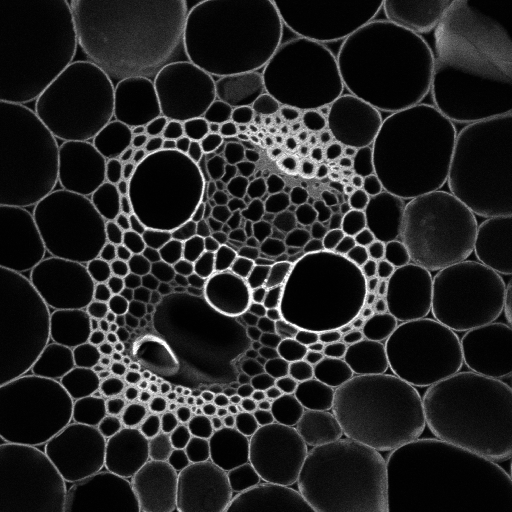</a>
<a href="image_1621872487327.png">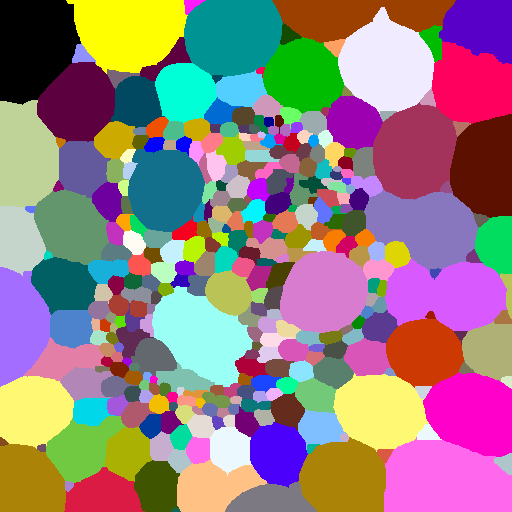</a>

## Extension Ratio Map
The extension ratio is a shape descriptor. It is computed from the maximum distance of any pixel within a given label from the label centroid divided by the average distance of all pixels inside the label to the label centroid.
You can visualize

```java
Ext.CLIJ2_extensionRatioMap(label_image, image_extension_ratio_map);
show(image_extension_ratio_map, "Extension ratio", "Green Fire Blue", 1, 3);
```

## Pixel Count Map
 and Log Pixel Count map
The pixel count map shows the size (2D or 3D) expressed in colour.
In ImageJ/Fiji, hover with your mouse ove the image to see how many pixels the objects contain.

```java
Ext.CLIJ2_pixelCountMap(label_image, pixel_count_map);
show(pixel_count_map, "Pixel count", "Green Fire Blue", 0, 0);


Ext.CLIJ2_logarithm(pixel_count_map, log_pixel_count_map);
show(log_pixel_count_map, "Log pixel count", "Green Fire Blue", 0, 0);
```
<a href="image_1621872489657.png">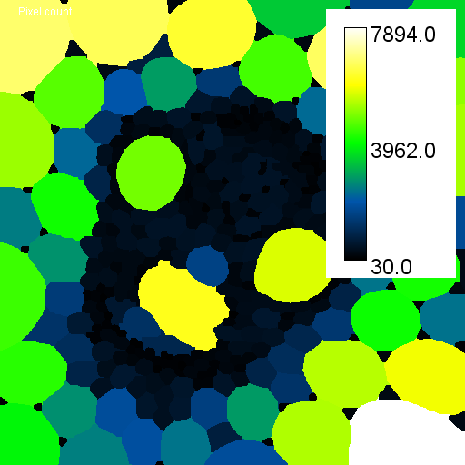</a>
<a href="image_1621872489704.png">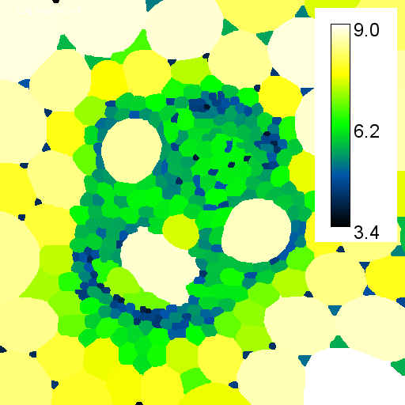</a>

## Touching neighbor count map

```java
Ext.CLIJ2_touchingNeighborCountMap(label_image, touching_neighbor_count_map);
show(touching_neighbor_count_map, "Touching neighbor count",  "Green Fire Blue", 0, 0);
```
<a href="image_1621872490779.png">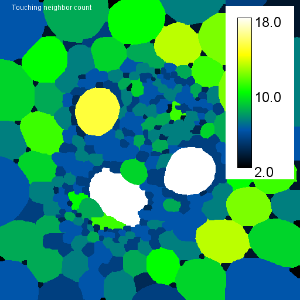</a>

## Proximal neighbor count map
If you want to know how many cells are close by any cell, you can use this method.

```java
min_distance = 0;
max_distance = 25;
Ext.CLIJ2_proximalNeighborCountMap(label_image, proximal_neighbor_count_map, min_distance, max_distance);
show(proximal_neighbor_count_map, "Proximal neighbor count", "Green Fire Blue", 0, 0);
```
<a href="image_1621872492397.png">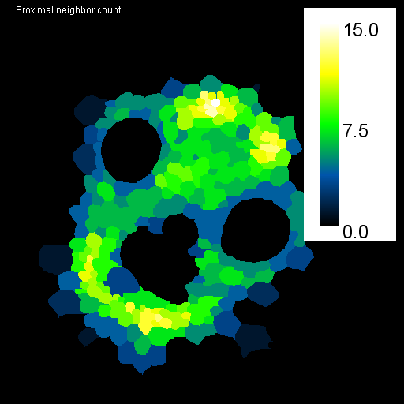</a>

## MorphoLibJ Analysis Maps
We can also use [MorphoLibJs' Region Analysis](https://imagej.net/MorphoLibJ.html#Region_analysis) 
and visualize the results as parametric images, for example showing convexity and circularity.

```java
// measure shape using MorphoLibJ.
selectWindow(label_image);
run("Analyze Regions", "circularity convexity");
// Read measurments from table and submit to GPU
Table.rename(label_image + "-Morphometry", "Results");
Ext.CLIJ2_pushResultsTableColumn(convexity_vector, "Convexity");
Ext.CLIJ2_pushResultsTableColumn(circularity_vector, "Circularity");
// clean up table
run("Clear Results");
// the convexity vector doesn't contain a value for background. 
// Thus, we need to subtract 1 from the labels_image so that the 
// line indices in the table and vector correspond to pixel values
// in the label image
Ext.CLIJ2_addImageAndScalar(label_image, label_image_without_background, -1);
// generate parametric images by replacing labels with measurements
Ext.CLIJ2_replaceIntensities(label_image_without_background, convexity_vector, convexity_map);
show(convexity_map, "Convexity", "Green Fire Blue", 0, 1);
Ext.CLIJ2_replaceIntensities(label_image_without_background, circularity_vector, circularity_map);
show(circularity_map, "Circularity", "Green Fire Blue", 0, 1);
```
<a href="image_1621872493592.png">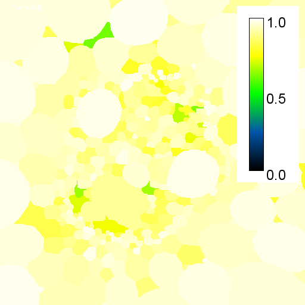</a>
<a href="image_1621872493639.png">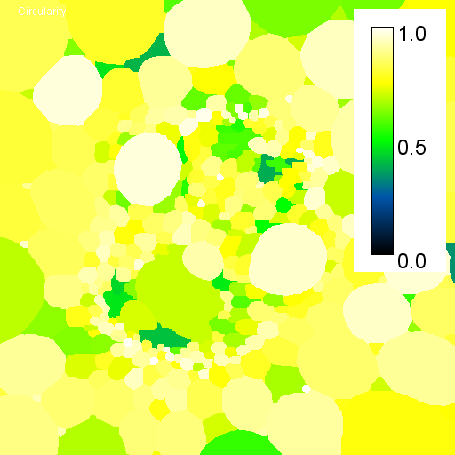</a>


## Parametric images for tissue differentiation
We can use measured parameters for differentiating cells and tissues. 
For example, we can create a new label image only containing the cells in a given size range:

```java
Ext.CLIJ2_excludeLabelsOutsideSizeRange(label_image, small_label_image, 0, 1000);
show(small_label_image, "Small cells", "glasbey_on_dark", 0, 0);
```
<a href="image_1621872495298.png">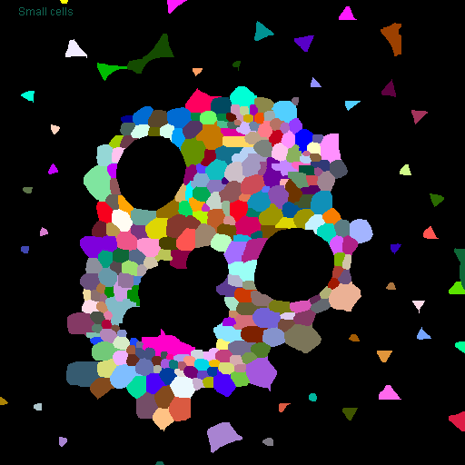</a>

Obviously, this also segments triangular objects that might not be real "cells". 
We can also remove them, e.g. by filtering for number of neighbors. Therefore, we need to count number of neighbors again:

```java
Ext.CLIJ2_touchingNeighborCountMap(small_label_image, touching_neighbor_count_map);
show(touching_neighbor_count_map, "Touching neighbor count",  "Green Fire Blue", 0, 0);
```
<a href="image_1621872495929.png">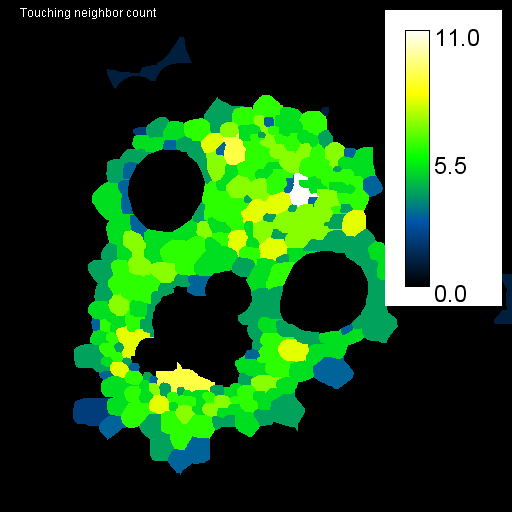</a>

Then, we can filter the label image by values from the neighbor count map:

```java
minimum_number_of_neighbors = 2;
maximum_number_of_neighbors = 1000;
Ext.CLIJ2_excludeLabelsWithValuesOutOfRange(touching_neighbor_count_map, small_label_image, remaining_labels, minimum_number_of_neighbors, maximum_number_of_neighbors);
show(remaining_labels, "Remaining labels",  "glasbey_on_dark", 0, 0);
```
<a href="image_1621872498067.png">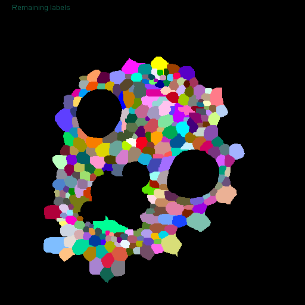</a>

Clean up by the end

```java
Ext.CLIJ2_clear();
```

This is just a convenience function for visualization used above

```java
function show(image, text, lut, min_display_value, max_display_value) {
    Ext.CLIJ2_pull(image);
    run(lut);
    if (max_display_value == max_display_value) {
        setMinAndMax(min_display_value, max_display_value);		
    } else {
        resetMinAndMax();
    }
    if (lut != "glasbey_on_dark") {
    	run("Calibration Bar...", "location=[Upper Right] fill=White label=Black number=3 decimal=1 font=12 zoom=2 overlay");
    }
    setColor(10000);
    drawString(text, 20, 20);
}
```


```
```
