# Process multi-channel time-lapse data

This notebook demonstrates how image data can be processed that has multiple channels and time points.

[Source](https://github.com/clij/clij2-docs/tree/master/src/main/macro/process_multichannel_timelapse.ijm)

Let's start by cleaaning up and opening an example dataset. 

For cleaning up and loading the image, we use ImageJ-functions:

<pre class="highlight">
// clean up first
run("Close All");
run("Clear Results");

// open a the Mitosis example image
open("http://imagej.nih.gov/ij/images/Spindly-GFP.zip");
</pre>
<a href="image_1614453943963.png">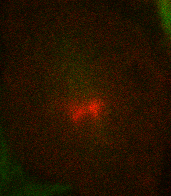</a>

We now initialize the GPU and push the image as explained in the [basics of clij tutorial](https://clij.github.io/clij2-docs/md/basics/).

<pre class="highlight">
run("CLIJ2 Macro Extensions", "cl_device=");
Ext.<a href="https://clij.github.io/clij2-docs/reference_clear">CLIJ2_clear</a>();
</pre>

## Processing multiple channels
Pushing an image to GPU means in this context, that only the currently selected channel and time point are pushed.

<pre class="highlight">
// push current Z-stack image to GPU memory
input = getTitle();
Stack.setChannel(1);
Ext.<a href="https://clij.github.io/clij2-docs/reference_pushCurrentZStack">CLIJ2_pushCurrentZStack</a>(input);
</pre>

We can then process the channel, e.g. by projecting it in Z:

<pre class="highlight">
Ext.<a href="https://clij.github.io/clij2-docs/reference_maximumZProjection">CLIJ2_maximumZProjection</a>(input, max_projection_c1);
Ext.<a href="https://clij.github.io/clij2-docs/reference_pull">CLIJ2_pull</a>(max_projection_c1);
run("Red");
</pre>
<a href="image_1614453944153.png">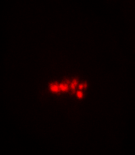</a>

Afterwards, we can do the same with the other channel:

<pre class="highlight">
selectWindow(input);
Stack.setChannel(2);
Ext.<a href="https://clij.github.io/clij2-docs/reference_pushCurrentZStack">CLIJ2_pushCurrentZStack</a>(input);
Ext.<a href="https://clij.github.io/clij2-docs/reference_maximumZProjection">CLIJ2_maximumZProjection</a>(input, max_projection_c2);
Ext.<a href="https://clij.github.io/clij2-docs/reference_pull">CLIJ2_pull</a>(max_projection_c2);
run("Green");
</pre>
<a href="image_1614453944280.png">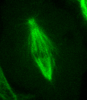</a>

Channels can then be merged using ImageJs functionality

<pre class="highlight">
run("Merge Channels...", "c1=" + max_projection_c1 + " c2=" + max_projection_c2 + " create");
</pre>

## Processing time-lapse data
We can apply the same procedure to the whole time-lapse using a for-loop:

<pre class="highlight">

selectWindow(input);
// find out how many frames the time-lapse has
getDimensions(_, _, _, _, frames);

// loop over time points
for (t = 0; t < frames; t += 5) {
	// move forward in time in the dataset
	selectWindow(input);
	Stack.setFrame(t + 1); // ImageJ's frame-counter is 1-based
	
	// process channel 1
	Stack.setChannel(1);
	Ext.<a href="https://clij.github.io/clij2-docs/reference_pushCurrentZStack">CLIJ2_pushCurrentZStack</a>(input);
	Ext.<a href="https://clij.github.io/clij2-docs/reference_maximumZProjection">CLIJ2_maximumZProjection</a>(input, max_projection_c1);
	Ext.<a href="https://clij.github.io/clij2-docs/reference_pull">CLIJ2_pull</a>(max_projection_c1);
	run("Red");
	
	// process channel 2
	selectWindow(input);
	Stack.setChannel(2);
	Ext.<a href="https://clij.github.io/clij2-docs/reference_pushCurrentZStack">CLIJ2_pushCurrentZStack</a>(input);
	Ext.<a href="https://clij.github.io/clij2-docs/reference_maximumZProjection">CLIJ2_maximumZProjection</a>(input, max_projection_c2);
	Ext.<a href="https://clij.github.io/clij2-docs/reference_pull">CLIJ2_pull</a>(max_projection_c2);
	run("Green");

	// merge channels
	run("Merge Channels...", "c1=" + max_projection_c1 + " c2=" + max_projection_c2 + " create");
}
</pre>
<a href="image_1614453946468.png">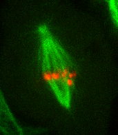</a>

<a href="image_1614453946620.png">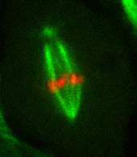</a>
<a href="image_1614453946635.png">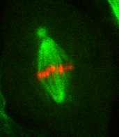</a>
<a href="image_1614453946651.png">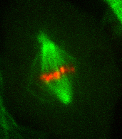</a>
<a href="image_1614453946667.png">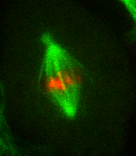</a>
<a href="image_1614453946682.png">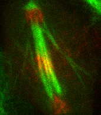</a>

<a href="image_1614453946698.png">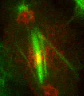</a>
<a href="image_1614453946714.png">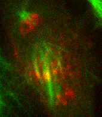</a>
<a href="image_1614453946729.png">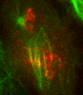</a>

Depending on how large data is, you may not want to show all results on screen. 
Instead, consider saving results of a 3D stack:

<pre class="highlight">
Ext.<a href="https://clij.github.io/clij2-docs/reference_saveAsTIF">CLIJ2_saveAsTIF</a>(max_projection_c2, "max_projection_c2_f" + t + ".tif");

</pre>
Clean up by the end 
<pre class="highlight">
Ext.<a href="https://clij.github.io/clij2-docs/reference_clear">CLIJ2_clear</a>();

</pre>

