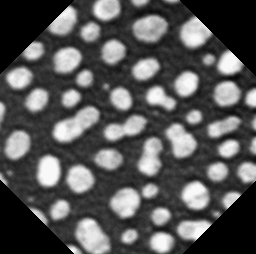
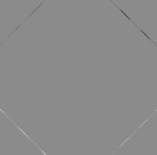

# CLIJ example macro: rotate_comparison_IJ_CLIJ.ijm

This macro shows how stacks can be rotated in the GPU
and how different results are between CLIJ and ImageJ.

Author: Robert Haase
July 2019

## Get test data

<pre class="highlight">
run("Close All");

run("Blobs (25K)");
run("Invert LUT");

input = getTitle();

</pre>

## Initialize GPU and push image data to GPU memory

<pre class="highlight">
run("CLIJ Macro Extensions", "cl_device=1070");
Ext.CLIJ2_clear();

// push data to GPU
Ext.CLIJ2_push(input);

</pre>

## Rotate image on CPU

<pre class="highlight">
run("Duplicate...", " ");
run("Rotate... ", "angle=45 grid=1 interpolation=Bilinear");
rotated_cpu = getTitle();

</pre>

## Rotate image on GPU

<pre class="highlight">
Ext.<a href="https://clij.github.io/clij2-docs/reference_affineTransform2D">CLIJ2_affineTransform2D</a>(input, rotated_gpu, "-center rotate=45 center");

// show results
Ext.CLIJ2_pull(rotated_gpu);

</pre>

## Calculate difference image between CPU and GPU

<pre class="highlight">
imageCalculator("Subtract create 32-bit", rotated_cpu, rotated_gpu);

</pre>

Clean up by the end

<pre class="highlight">
Ext.CLIJ2_clear();
</pre>

</pre>
</pre>
