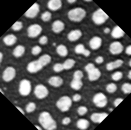
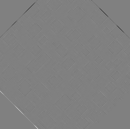

# Rotation comparison ImageJ versus CLIJ
Author: Robert Haase
July 2019


This macro shows how stacks can be rotated in the GPU
and how different results are between CLIJ and ImageJ.


## Get test data

```java
run("Close All");


run("Blobs (25K)");
run("Invert LUT");

input = getTitle();


```
<a href="image_1587653828332.png"></a>

## Initialize GPU and push image data to GPU memory

```java
run("CLIJ Macro Extensions", "cl_device=1070");
Ext.CLIJ2_clear();

// push data to GPU
Ext.CLIJ2_push(input);

```

## Rotate image on CPU

```java
run("Duplicate...", " ");
run("Rotate... ", "angle=45 grid=1 interpolation=Bilinear");
rotated_cpu = getTitle();

```
<a href="image_1587653828457.png"></a>

## Rotate image on GPU

```java
Ext.CLIJ2_affineTransform2D(input, rotated_gpu, "-center rotate=45 center");

// show results
Ext.CLIJ2_pull(rotated_gpu);


```
<a href="image_1587653828521.png"></a>

## Calculate difference image between CPU and GPU

```java
imageCalculator("Subtract create 32-bit", rotated_cpu, rotated_gpu);

```
<a href="image_1587653828620.png"></a>

Clean up by the end

```java
Ext.CLIJ2_clear();
```


```
```
