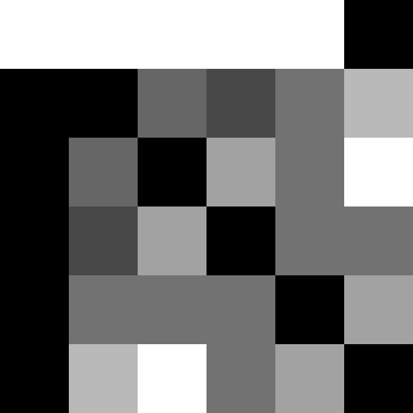
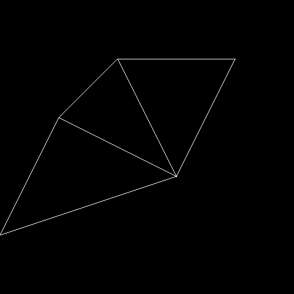
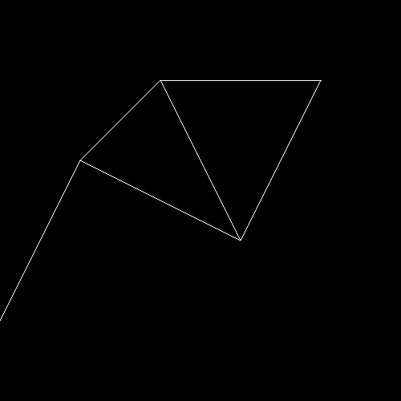

# CLIJ2 tutorial: Working with spots, pointlists, matrixes and tables

This macro demonstrates working with
spot images, pointlists, distance matrixes and
touch matrices on the GPU.

Author: Robert Haase
        April 2020


```java
// init GPU
run("CLIJ2 Macro Extensions", "cl_device=[GeForce RTX 2060 SUPER]");
Ext.CLIJ2_clear();

run("Close All");

```

## Define a small array represending a spot-detection result and push it to the GPU

```java
array = newArray(
	0, 0, 0, 0, 0,
	0, 0, 1, 0, 1,
	0, 1, 0, 0, 0,
	0, 0, 0, 1, 0,
	1, 0, 0, 0, 0);

width = 5;
height = 5;
depth = 1;

Ext.[CLIJ2_pushArray](https://clij.github.io/clij2-docs/reference_pushArray)(spots_image, array, width, height, depth);
Ext.CLIJ2_pull(spots_image);
zoom(100);

```
<a href="image_1587391710191.png"></a>

## Convert the spots image to a point list

```java
Ext.[CLIJ2_spotsToPointList](https://clij.github.io/clij2-docs/reference_spotsToPointList)(spots_image, pointlist);
Ext.CLIJ2_pull(pointlist);
zoom(100);
```
<a href="image_1587391710307.png"></a>

## Determine the distance from every spot to every spot and write it in a distance matrix. 

```java
Ext.[CLIJ2_generateDistanceMatrix](https://clij.github.io/clij2-docs/reference_generateDistanceMatrix)(pointlist, pointlist, distance_matrix);
Ext.CLIJ2_pull(distance_matrix);
zoom(100);

```
<a href="image_1587391710407.png"></a>

## Label all spots

```java
Ext.[CLIJ2_labelSpots](https://clij.github.io/clij2-docs/reference_labelSpots)(spots_image, labelled_spots);
Ext.CLIJ2_pull(labelled_spots);
zoom(100);
run("glasbey_on_dark");

```
<a href="image_1587391710538.png"></a>

## Blow up the labels until they touch; similar to a Voronoi diagrom

```java
Ext.CLIJ2_labelVoronoiOctagon(labelled_spots, label_voronoi);
Ext.CLIJ2_pull(label_voronoi);
zoom(100);

```
<a href="image_1587391710644.png"></a>

## Analyse which label touches which other labels and save it in a touch matrix

```java
Ext.[CLIJ2_generateTouchMatrix](https://clij.github.io/clij2-docs/reference_generateTouchMatrix)(label_voronoi, touch_matrix);
Ext.CLIJ2_pull(touch_matrix);
zoom(100);

```
<a href="image_1587391710744.png"></a>

## Count neighbors for every node

```java
Ext.[CLIJ2_countTouchingNeighbors](https://clij.github.io/clij2-docs/reference_countTouchingNeighbors)(touch_matrix, count_vector);
Ext.CLIJ2_pull(count_vector);
zoom(100);

```
<a href="image_1587391710841.png"></a>

## Do pixel statistics on the labelled image

```java
run("Clear Results");
Ext.[CLIJ2_statisticsOfLabelledPixels](https://clij.github.io/clij2-docs/reference_statisticsOfLabelledPixels)(spots_image, label_voronoi);

```
<table>
<tr><th>IDENTIFIER</th><th>BOUNDING_BOX_X</th><th>BOUNDING_BOX_Y</th><th>BOUNDING_BOX_Z</th><th>BOUNDING_BOX_END_X</th><th>BOUNDING_BOX_END_Y</th><th>BOUNDING_BOX_END_Z</th><th>BOUNDING_BOX_WIDTH</th><th>BOUNDING_BOX_HEIGHT</th><th>BOUNDING_BOX_DEPTH</th><th>MINIMUM_INTENSITY</th><th>MAXIMUM_INTENSITY</th><th>MEAN_INTENSITY</th><th>SUM_INTENSITY</th><th>STANDARD_DEVIATION_INTENSITY</th><th>PIXEL_COUNT</th><th>SUM_INTENSITY_TIMES_X</th><th>SUM_INTENSITY_TIMES_Y</th><th>SUM_INTENSITY_TIMES_Z</th><th>MASS_CENTER_X</th><th>MASS_CENTER_Y</th><th>MASS_CENTER_Z</th><th>SUM_X</th><th>SUM_Y</th><th>SUM_Z</th><th>CENTROID_X</th><th>CENTROID_Y</th><th>CENTROID_Z</th></tr>
<tr><td>1</td><td>1</td><td>0</td><td>0</td><td>2</td><td>1</td><td>0</td><td>2</td><td>2</td><td>1</td><td>0</td><td>1</td><td>0.333</td><td>1</td><td>0.471</td><td>3</td><td>2</td><td>1</td><td>0</td><td>2</td><td>1</td><td>0</td><td>5</td><td>1</td><td>0</td><td>1.667</td><td>0.333</td><td>0</td></tr>
<tr><td>2</td><td>3</td><td>0</td><td>0</td><td>4</td><td>1</td><td>0</td><td>2</td><td>2</td><td>1</td><td>0</td><td>1</td><td>0.250</td><td>1</td><td>0.433</td><td>4</td><td>4</td><td>1</td><td>0</td><td>4</td><td>1</td><td>0</td><td>14</td><td>2</td><td>0</td><td>3.500</td><td>0.500</td><td>0</td></tr>
<tr><td>3</td><td>0</td><td>0</td><td>0</td><td>1</td><td>2</td><td>0</td><td>2</td><td>3</td><td>1</td><td>0</td><td>1</td><td>0.200</td><td>1</td><td>0.400</td><td>5</td><td>1</td><td>2</td><td>0</td><td>1</td><td>2</td><td>0</td><td>2</td><td>6</td><td>0</td><td>0.400</td><td>1.200</td><td>0</td></tr>
<tr><td>4</td><td>2</td><td>2</td><td>0</td><td>4</td><td>4</td><td>0</td><td>3</td><td>3</td><td>1</td><td>0</td><td>1</td><td>0.111</td><td>1</td><td>0.314</td><td>9</td><td>3</td><td>3</td><td>0</td><td>3</td><td>3</td><td>0</td><td>27</td><td>27</td><td>0</td><td>3.000</td><td>3.000</td><td>0</td></tr>
<tr><td>5</td><td>0</td><td>3</td><td>0</td><td>1</td><td>4</td><td>0</td><td>2</td><td>2</td><td>1</td><td>0</td><td>1</td><td>0.250</td><td>1</td><td>0.433</td><td>4</td><td>0</td><td>4</td><td>0</td><td>0</td><td>4</td><td>0</td><td>2</td><td>14</td><td>0</td><td>0.500</td><td>3.500</td><td>0</td></tr>
</table>


## Push results table as image to the GPU

```java
Ext.[CLIJ2_pushResultsTable](https://clij.github.io/clij2-docs/reference_pushResultsTable)(table_image);
Ext.CLIJ2_pull(table_image);
zoom(100);

```
<a href="image_1587391711005.png"></a>

## Push a single column of the results table to the GPU

```java
Ext.[CLIJ2_pushResultsTableColumn](https://clij.github.io/clij2-docs/reference_pushResultsTableColumn)(mean_intensity_vector, "MEAN_INTENSITY");
Ext.CLIJ2_pull(mean_intensity_vector);
zoom(100);

```
<a href="image_1587391711159.png"></a>

## Multiply the pointlist with a scalar makes the points virtually more distant

```java
zoom_factor = 100;
Ext.[CLIJ2_multiplyImageAndScalar](https://clij.github.io/clij2-docs/reference_multiplyImageAndScalar)(pointlist, pointlist_multiplied, zoom_factor);
Ext.CLIJ2_pull(pointlist_multiplied);
zoom(100);

```
<a href="image_1587391711259.png"></a>

## Draw a mesh of touching neighbors and corresponding spots

```java
Ext.CLIJ2_create2D(mesh, width * zoom_factor, height * zoom_factor, 32);
Ext.[CLIJ2_touchMatrixToMesh](https://clij.github.io/clij2-docs/reference_touchMatrixToMesh)(pointlist_multiplied, touch_matrix, mesh);
Ext.CLIJ2_pull(mesh);

```
<a href="image_1587391711316.png"></a>

## Draw a showing all edges shorter than a given value

```java
Ext.CLIJ2_create2D(mesh2, width * zoom_factor, height * zoom_factor, 32);
Ext.[CLIJ2_distanceMatrixToMesh](https://clij.github.io/clij2-docs/reference_distanceMatrixToMesh)(pointlist_multiplied, distance_matrix, mesh2, 2.5);
Ext.CLIJ2_pull(mesh2);

```
<a href="image_1587391711369.png"></a>

Clean up by the end

```java
Ext.CLIJ2_clear();

```

This is just a utility function to make the visualisation in the notebook nice.

```java
function zoom(factor) {
	getDimensions(width, height, channels, slices, frames);
	before = getTitle();	
	run("Scale...", "x=" + factor + " y=" + factor + " width=" + (width * factor) + " height=" + (height* factor) + " interpolation=None average create");
	selectWindow(before);
	close();
}
```


```
```
