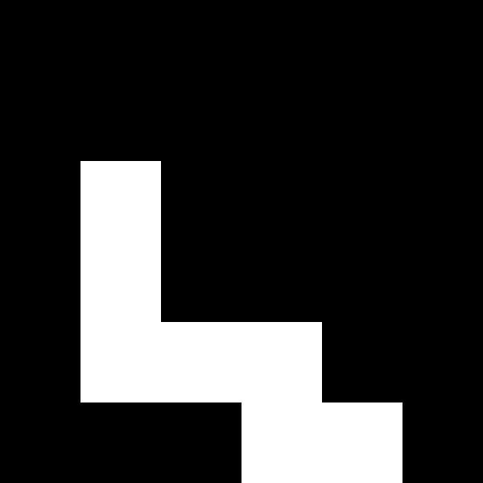
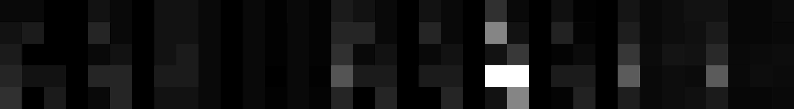

# Working with spots, pointlists, matrixes and tables

Authors: Robert Haase, Daniela Vorkel, April 2020

[Source](https://github.com/clij/clij2-docs/tree/master/src/main/macro/spots_pointlists_matrices_tables.ijm)

This macro demonstrates how to operate on
spot images, pointlists, distance matrices and
touch matrices in the GPU.

</pre>

## Initialize GPU

<pre class="highlight">
// init GPU
run("CLIJ2 Macro Extensions", "cl_device=[GeForce RTX 2060 SUPER]");
Ext.CLIJ2_clear();

run("Close All");

</pre>

## Define a small array representing a spot detection result and push it to the GPU

<pre class="highlight">
array = newArray(
	0, 0, 0, 0, 0,
	0, 0, 1, 0, 1,
	0, 1, 0, 0, 0,
	0, 0, 0, 1, 0,
	1, 0, 0, 0, 0);

width = 5;
height = 5;
depth = 1;

Ext.<a href="https://clij.github.io/clij2-docs/reference_pushArray">CLIJ2_pushArray</a>(spots_image, array, width, height, depth);
Ext.CLIJ2_pull(spots_image);
zoom(100);

</pre>

## Convert the spot image into a point list

<pre class="highlight">
Ext.<a href="https://clij.github.io/clij2-docs/reference_spotsToPointList">CLIJ2_spotsToPointList</a>(spots_image, pointlist);
Ext.CLIJ2_pull(pointlist);
zoom(100);
</pre>

## Determine the distance between all spots and write the result as distance matrix. 

<pre class="highlight">
Ext.<a href="https://clij.github.io/clij2-docs/reference_generateDistanceMatrix">CLIJ2_generateDistanceMatrix</a>(pointlist, pointlist, distance_matrix);
Ext.CLIJ2_pull(distance_matrix);
zoom(100);

</pre>

## Label all spots

<pre class="highlight">
Ext.<a href="https://clij.github.io/clij2-docs/reference_labelSpots">CLIJ2_labelSpots</a>(spots_image, labelled_spots);
Ext.CLIJ2_pull(labelled_spots);
zoom(100);
run("glasbey_on_dark");

</pre>

## Blow labels up, until they touch (similar to Voronoi diagram)

<pre class="highlight">
Ext.<a href="https://clij.github.io/clij2-docs/reference_labelVoronoiOctagon">CLIJ2_labelVoronoiOctagon</a>(labelled_spots, label_voronoi);
Ext.CLIJ2_pull(label_voronoi);
zoom(100);

</pre>

## Analyze touching labels and save it as a touch matrix

<pre class="highlight">
Ext.<a href="https://clij.github.io/clij2-docs/reference_generateTouchMatrix">CLIJ2_generateTouchMatrix</a>(label_voronoi, touch_matrix);
Ext.CLIJ2_pull(touch_matrix);
zoom(100);

</pre>

## Count neighbors for every touching node

<pre class="highlight">
Ext.<a href="https://clij.github.io/clij2-docs/reference_countTouchingNeighbors">CLIJ2_countTouchingNeighbors</a>(touch_matrix, count_vector);
Ext.CLIJ2_pull(count_vector);
zoom(100);

</pre>

## Get pixel statistics from the labelled image

<pre class="highlight">
run("Clear Results");
Ext.<a href="https://clij.github.io/clij2-docs/reference_statisticsOfLabelledPixels">CLIJ2_statisticsOfLabelledPixels</a>(spots_image, label_voronoi);

</pre>
<table>
<tr><th>IDENTIFIER</th><th>BOUNDING_BOX_X</th><th>BOUNDING_BOX_Y</th><th>BOUNDING_BOX_Z</th><th>BOUNDING_BOX_END_X</th><th>BOUNDING_BOX_END_Y</th><th>BOUNDING_BOX_END_Z</th><th>BOUNDING_BOX_WIDTH</th><th>BOUNDING_BOX_HEIGHT</th><th>BOUNDING_BOX_DEPTH</th><th>MINIMUM_INTENSITY</th><th>MAXIMUM_INTENSITY</th><th>MEAN_INTENSITY</th><th>SUM_INTENSITY</th><th>STANDARD_DEVIATION_INTENSITY</th><th>PIXEL_COUNT</th><th>SUM_INTENSITY_TIMES_X</th><th>SUM_INTENSITY_TIMES_Y</th><th>SUM_INTENSITY_TIMES_Z</th><th>MASS_CENTER_X</th><th>MASS_CENTER_Y</th><th>MASS_CENTER_Z</th><th>SUM_X</th><th>SUM_Y</th><th>SUM_Z</th><th>CENTROID_X</th><th>CENTROID_Y</th><th>CENTROID_Z</th><th>SUM_DISTANCE_TO_MASS_CENTER</th><th>MEAN_DISTANCE_TO_MASS_CENTER</th><th>MAX_DISTANCE_TO_MASS_CENTER</th><th>MAX_MEAN_DISTANCE_TO_MASS_CENTER_RATIO</th><th>SUM_DISTANCE_TO_CENTROID</th><th>MEAN_DISTANCE_TO_CENTROID</th><th>MAX_DISTANCE_TO_CENTROID</th><th>MAX_MEAN_DISTANCE_TO_CENTROID_RATIO</th></tr>
<tr><td>1</td><td>1</td><td>0</td><td>0</td><td>2</td><td>1</td><td>0</td><td>2</td><td>2</td><td>1</td><td>0</td><td>1</td><td>0.333</td><td>1</td><td>0.471</td><td>3</td><td>2</td><td>1</td><td>0</td><td>2</td><td>1</td><td>0</td><td>5</td><td>1</td><td>0</td><td>1.667</td><td>0.333</td><td>0</td><td>2.414</td><td>0.805</td><td>1.414</td><td>1.757</td><td>1.962</td><td>0.654</td><td>0.745</td><td>1.140</td></tr>
<tr><td>2</td><td>3</td><td>0</td><td>0</td><td>4</td><td>1</td><td>0</td><td>2</td><td>2</td><td>1</td><td>0</td><td>1</td><td>0.250</td><td>1</td><td>0.433</td><td>4</td><td>4</td><td>1</td><td>0</td><td>4</td><td>1</td><td>0</td><td>14</td><td>2</td><td>0</td><td>3.500</td><td>0.500</td><td>0</td><td>3.414</td><td>0.854</td><td>1.414</td><td>1.657</td><td>2.828</td><td>0.707</td><td>0.707</td><td>1.000</td></tr>
<tr><td>3</td><td>0</td><td>0</td><td>0</td><td>1</td><td>2</td><td>0</td><td>2</td><td>3</td><td>1</td><td>0</td><td>1</td><td>0.200</td><td>1</td><td>0.400</td><td>5</td><td>1</td><td>2</td><td>0</td><td>1</td><td>2</td><td>0</td><td>2</td><td>6</td><td>0</td><td>0.400</td><td>1.200</td><td>0</td><td>5.650</td><td>1.130</td><td>2.236</td><td>1.979</td><td>4.239</td><td>0.848</td><td>1.265</td><td>1.492</td></tr>
<tr><td>4</td><td>2</td><td>2</td><td>0</td><td>4</td><td>4</td><td>0</td><td>3</td><td>3</td><td>1</td><td>0</td><td>1</td><td>0.111</td><td>1</td><td>0.314</td><td>9</td><td>3</td><td>3</td><td>0</td><td>3</td><td>3</td><td>0</td><td>27</td><td>27</td><td>0</td><td>3.000</td><td>3.000</td><td>0</td><td>9.657</td><td>1.073</td><td>1.414</td><td>1.318</td><td>9.657</td><td>1.073</td><td>1.414</td><td>1.318</td></tr>
<tr><td>5</td><td>0</td><td>3</td><td>0</td><td>1</td><td>4</td><td>0</td><td>2</td><td>2</td><td>1</td><td>0</td><td>1</td><td>0.250</td><td>1</td><td>0.433</td><td>4</td><td>0</td><td>4</td><td>0</td><td>0</td><td>4</td><td>0</td><td>2</td><td>14</td><td>0</td><td>0.500</td><td>3.500</td><td>0</td><td>3.414</td><td>0.854</td><td>1.414</td><td>1.657</td><td>2.828</td><td>0.707</td><td>0.707</td><td>1.000</td></tr>
</table>

## Push the results table as an image to the GPU

<pre class="highlight">
Ext.<a href="https://clij.github.io/clij2-docs/reference_pushResultsTable">CLIJ2_pushResultsTable</a>(table_image);
Ext.CLIJ2_pull(table_image);
zoom(100);

</pre>

## Push a single column of the results table to the GPU

<pre class="highlight">
Ext.<a href="https://clij.github.io/clij2-docs/reference_pushResultsTableColumn">CLIJ2_pushResultsTableColumn</a>(mean_intensity_vector, "MEAN_INTENSITY");
Ext.CLIJ2_pull(mean_intensity_vector);
zoom(100);

</pre>

## Multiply the pointlist with a scalar to get points virtually more distant

<pre class="highlight">
zoom_factor = 100;
Ext.<a href="https://clij.github.io/clij2-docs/reference_multiplyImageAndScalar">CLIJ2_multiplyImageAndScalar</a>(pointlist, pointlist_multiplied, zoom_factor);
Ext.CLIJ2_pull(pointlist_multiplied);
zoom(100);

</pre>

## Draw a mesh of touching neighbors and corresponding spots

<pre class="highlight">
Ext.CLIJ2_create2D(mesh, width * zoom_factor, height * zoom_factor, 32);
Ext.<a href="https://clij.github.io/clij2-docs/reference_touchMatrixToMesh">CLIJ2_touchMatrixToMesh</a>(pointlist_multiplied, touch_matrix, mesh);
Ext.CLIJ2_pull(mesh);

</pre>

## Draw a mesh showing shorter edges than from given value

<pre class="highlight">
Ext.CLIJ2_create2D(mesh2, width * zoom_factor, height * zoom_factor, 32);
Ext.<a href="https://clij.github.io/clij2-docs/reference_distanceMatrixToMesh">CLIJ2_distanceMatrixToMesh</a>(pointlist_multiplied, distance_matrix, mesh2, 2.5);
Ext.CLIJ2_pull(mesh2);

</pre>

At the end of the macro, clean up:

<pre class="highlight">
Ext.CLIJ2_clear();

</pre>

This is just a useful function to get a nice visualization in the notebook:

<pre class="highlight">
function zoom(factor) {
	getDimensions(width, height, channels, slices, frames);
	before = getTitle();	
	run("Scale...", "x=" + factor + " y=" + factor + " width=" + (width * factor) + " height=" + (height* factor) + " interpolation=None average create");
	selectWindow(before);
	close();
}
</pre>

