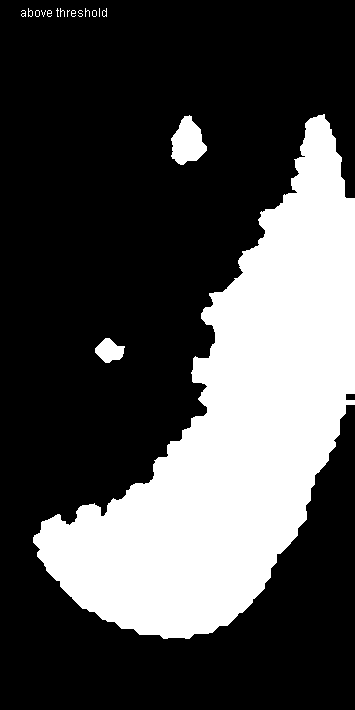
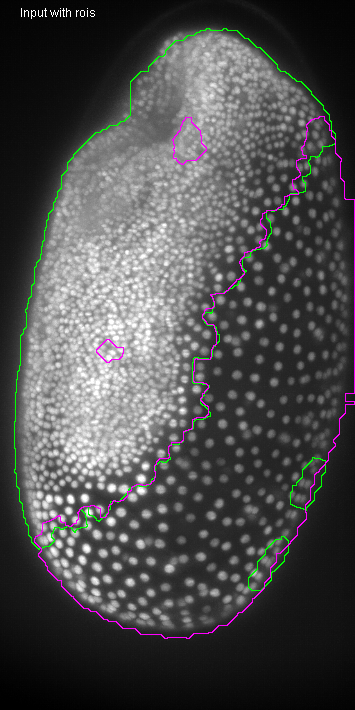

# Superpixel segmentation
Author: Robert Haase
        April 2020

[Source](https://github.com/clij/clij2-docs/tree/master/src/main/macro/superpixel_segmentation.ijm)

Initialize/clean up ImageJ and graphics card:

<pre class="highlight">
run("Close All");

run("CLIJ2 Macro Extensions", "cl_device=[GeForce RTX 2060 SUPER]");
Ext.CLIJ2_clear();

// time measurements
time = getTime();
Ext.CLIJ2_startTimeTracing();
</pre>

## Load a data set
The raw dataset is available [online](https://git.mpi-cbg.de/rhaase/neubias_academy_clij2/blob/master/data/lund1051_resampled.tif).
It shows a Tribolium castaneum embryo imaged using a custom light sheet microscope using a wavelength of 488nm (Imaging credits: Daniela Vorkel, Myers lab, MPI CBG). 
The data set has been resampled to a voxel size of 1x1x1 microns. The embryo expresses nuclei-GFP. We will use it for detecting nuclei and generating an estimated cell-segmentation first.

Furthermore, we use a label map of segmented cells, which was generated using [this macro](https://github.com/clij/clij2-docs/tree/master/src/main/macro/tribolium_morphometry.ijm).

All processing steps are performed in 3D, for visualisation purposes, we're looking at maximum intensity projections in Z: 

<pre class="highlight">
path = "C:/structure/teaching/neubias_academy_clij2/data/";

// load data
open(path + "lund1051_resampled.tif");
input = getTitle();
open(path + "lund1051_labelled.tif");
labels = getTitle();

// push images to GPU
Ext.CLIJ2_push(input);
Ext.CLIJ2_push(labels);

// clean up imageJ
run("Close All");
</pre>

## Inspecting input data
The processed data is 3D, for visualisation purposes, we look at maximum projections:

<pre class="highlight">
show(input, "input");
show(labels, "labels");
run("glasbey_on_dark");
</pre>

## Determine neighborhood relationships between segmented objects
To process neighboring pixels, we need to derive a touch-matrix from the label map:

<pre class="highlight">
Ext.<a href="https://clij.github.io/clij2-docs/reference_generateTouchMatrix">CLIJ2_generateTouchMatrix</a>(labels, touch_matrix);

// visualise the touch matrix
Ext.CLIJ2_pull(touch_matrix);
</pre>

## Measure statistics
We now measure statistics of labelled objects. The statistis are shown in a results table. From this table, we push the column PIXEL_SIZE back to the GPU as image:

<pre class="highlight">
run("Clear Results");
Ext.<a href="https://clij.github.io/clij2-docs/reference_statisticsOfBackgroundAndLabelledPixels">CLIJ2_statisticsOfBackgroundAndLabelledPixels</a>(input, labels);
Ext.<a href="https://clij.github.io/clij2-docs/reference_pushResultsTableColumn">CLIJ2_pushResultsTableColumn</a>(pixel_count, "PIXEL_COUNT");
run("Clear Results");

// show the pixel count vector image
Ext.CLIJ2_pull(pixel_count);
</pre>

## Visualise measurements in space
We now colour code the measurents on the label map: 

<pre class="highlight">
Ext.<a href="https://clij.github.io/clij2-docs/reference_replaceIntensities">CLIJ2_replaceIntensities</a>(labels, pixel_count, pixel_count_map);
show(pixel_count_map, "pixel count map");
run("Fire");

</pre>

## Thresholding based on derived features
We segment the image now by differentiating large and small objects using a pixel count threshold. 
The visualised binary images overlap, because we look at maximum projections of three dimensional binary image stacks:

<pre class="highlight">
pixel_count_threshold = 4000;

threshold_vector_and_visualise(pixel_count, labels, pixel_count_threshold);

// This function takes a vector, binarizes it using a threshold and 
// visualises the results as parametric image using a given labelmap
function threshold_vector_and_visualise(vector, labelmap, threshold) {

	// threshold the vector in two vectors:
	Ext.<a href="https://clij.github.io/clij2-docs/reference_smallerConstant">CLIJ2_smallerConstant</a>(vector, small_objects, threshold);
	Ext.<a href="https://clij.github.io/clij2-docs/reference_greaterOrEqualConstant">CLIJ2_greaterOrEqualConstant</a>(vector, large_objects, threshold);
	// alternative: use binaryNot
	
	// visualise resulting binary images
	Ext.<a href="https://clij.github.io/clij2-docs/reference_replaceIntensities">CLIJ2_replaceIntensities</a>(labelmap, small_objects, small_objects_map);
	Ext.<a href="https://clij.github.io/clij2-docs/reference_replaceIntensities">CLIJ2_replaceIntensities</a>(labelmap, large_objects, large_objects_map);
	show(small_objects_map, "below threshold");
	show(large_objects_map, "above threshold");
}
</pre>

## Improving segmentation results using filtering superpixels
We can make the difference between the two regions in the dataset more clear by filtering the pixel count factor
using the corresponding neighborhood:

<pre class="highlight">

// for every object, determine the minimum pixel count in its local neighbor hood
Ext.<a href="https://clij.github.io/clij2-docs/reference_minimumOfTouchingNeighbors">CLIJ2_minimumOfTouchingNeighbors</a>(pixel_count, touch_matrix, filtered_pixel_count);

// we also make a parametric image out of that filtered vector
Ext.<a href="https://clij.github.io/clij2-docs/reference_replaceIntensities">CLIJ2_replaceIntensities</a>(labels, filtered_pixel_count, filtered_pixel_count_map);
show(filtered_pixel_count_map, "filtered pixel count map");
run("Fire");
</pre>

## Thresholding filtered features
For thresholding the filtered vector, we reuse the macro function from above:

<pre class="highlight">
threshold_vector_and_visualise(filtered_pixel_count, labels, pixel_count_threshold);
</pre>

## Renumbering label maps

<pre class="highlight">
// threshold the feature vector
Ext.<a href="https://clij.github.io/clij2-docs/reference_greaterOrEqualConstant">CLIJ2_greaterOrEqualConstant</a>(filtered_pixel_count,  binary_vector, pixel_count_threshold);
// we now remove the labels above the threshold from the labelmap
Ext.<a href="https://clij.github.io/clij2-docs/reference_excludeLabels">CLIJ2_excludeLabels</a>(binary_vector, labels, labels_embryo);
show(labels_embryo, "labels_embryo");
run("glasbey_on_dark");

</pre>

## Visualisation of segmentation as ROIs
We can also show the different regions using ImageJs ROIs and Overlays

<pre class="highlight">
threshold_vector_and_visualise_as_rois(filtered_pixel_count, labels, input, pixel_count_threshold);

// This function takes a vector, binarizes it using a threshold and 
// visualises the results as regions of interest
function threshold_vector_and_visualise_as_rois(vector, labelmap, input_image, threshold) {

	// threshold the vector in two vectors:
	Ext.<a href="https://clij.github.io/clij2-docs/reference_smallerConstant">CLIJ2_smallerConstant</a>(vector, small_objects, threshold);
	Ext.<a href="https://clij.github.io/clij2-docs/reference_greaterOrEqualConstant">CLIJ2_greaterOrEqualConstant</a>(vector, large_objects, threshold);
	// alternative: use binaryNot

	show(input, "Input with rois");
	
	// visualise resulting binary images
	Ext.<a href="https://clij.github.io/clij2-docs/reference_replaceIntensities">CLIJ2_replaceIntensities</a>(labelmap, small_objects, small_objects_map);
	Ext.<a href="https://clij.github.io/clij2-docs/reference_replaceIntensities">CLIJ2_replaceIntensities</a>(labelmap, large_objects, large_objects_map);

	Ext.<a href="https://clij.github.io/clij2-docs/reference_maximumZProjection">CLIJ2_maximumZProjection</a>(small_objects_map, small_objects_map_projected);
	Ext.<a href="https://clij.github.io/clij2-docs/reference_maximumZProjection">CLIJ2_maximumZProjection</a>(large_objects_map, large_objects_map_projected);

	// pull a binary image from the GPU as ROI
	Ext.<a href="https://clij.github.io/clij2-docs/reference_pullAsROI">CLIJ2_pullAsROI</a>(small_objects_map_projected);
	run("Enlarge...", "enlarge=-1"); // prevent overlapping outlines
	Overlay.addSelection("green");

	// pull a binary image from the GPU as ROI
	Ext.<a href="https://clij.github.io/clij2-docs/reference_pullAsROI">CLIJ2_pullAsROI</a>(large_objects_map_projected);
	run("Enlarge...", "enlarge=-1"); // prevent overlapping outlines
	Overlay.addSelection("magenta");

	temp = getTitle();
	run("Flatten");
	selectWindow(temp);
	close();
}
</pre>

## Performance evaluation
Finally a time measurement. Note that performing this workflow with ImageJ macro markdown is slower 
as intermediate results are save to disc.

<pre class="highlight">
print("The whole workflow took " + (getTime() - time) + " msec");
</pre>
<pre>
> The whole workflow took 3463 msec
</pre>

### Detailed time tracing for all operations

<pre class="highlight">
Ext.CLIJ2_stopTimeTracing();
Ext.CLIJ2_getTimeTracing(time_traces);
print(time_traces);
</pre>
<pre>
> > timeTracing
>  > MaximumZProjection
>  < MaximumZProjection           1.6646 ms
>  > MaximumZProjection
>  < MaximumZProjection           1.1578 ms
>  > GenerateTouchMatrix
>   > Set
>   < Set                         1.041 ms
>  < GenerateTouchMatrix          3.8744 ms
>  > StatisticsOfBackgroundAndLabelledPixels
>   > MaximumOfAllPixels
>    > MaximumZProjection
>    < MaximumZProjection         1.4014 ms
>    > MaximumYProjection
>    < MaximumYProjection         0.2969 ms
>    > MaximumXProjection
>    < MaximumXProjection         0.1987 ms
>   < MaximumOfAllPixels          2.5808 ms
>   > StatisticsOfLabelledPixels
>    > CopySlice
>    < CopySlice                  1.329 ms
>    > CopySlice
>    < CopySlice                  0.7898 ms
>    > CopySlice
>    < CopySlice                  0.6656 ms
>    > CopySlice
>    < CopySlice                  0.2232 ms
>    > CopySlice
>    < CopySlice                  0.7439 ms
>    > CopySlice
>    < CopySlice                  0.2872 ms
>    > CopySlice
>    < CopySlice                  0.9552 ms
>    > CopySlice
>    < CopySlice                  0.4482 ms
>    > CopySlice
>    < CopySlice                  0.6735 ms
>    > CopySlice
>    < CopySlice                  0.2231 ms
>    > CopySlice
>    < CopySlice                  0.6439 ms
>    > CopySlice
>    < CopySlice                  0.2124 ms
>    > CopySlice
>    < CopySlice                  0.6803 ms
>    > CopySlice
>    < CopySlice                  0.2061 ms
>    > CopySlice
>    < CopySlice                  0.6477 ms
>    > CopySlice
>    < CopySlice                  0.1884 ms
>    > CopySlice
>    < CopySlice                  0.6907 ms
>    > CopySlice
>    < CopySlice                  0.2169 ms
>    > CopySlice
>    < CopySlice                  0.6603 ms
>    > CopySlice
>    < CopySlice                  0.2773 ms
>    > CopySlice
>    < CopySlice                  1.1202 ms
>    > CopySlice
>    < CopySlice                  0.23 ms
>    > CopySlice
>    < CopySlice                  0.6169 ms
>    > CopySlice
>    < CopySlice                  0.1795 ms
>    > CopySlice
>    < CopySlice                  0.5855 ms
>    > CopySlice
>    < CopySlice                  0.1933 ms
>    > CopySlice
>    < CopySlice                  0.6261 ms
>    > CopySlice
>    < CopySlice                  0.219 ms
>    > CopySlice
>    < CopySlice                  0.6646 ms
>    > CopySlice
>    < CopySlice                  0.1821 ms
>    > CopySlice
>    < CopySlice                  0.5566 ms
>    > CopySlice
>    < CopySlice                  0.2309 ms
>    > CopySlice
>    < CopySlice                  0.9415 ms
>    > CopySlice
>    < CopySlice                  0.1898 ms
>    > CopySlice
>    < CopySlice                  0.6729 ms
>    > CopySlice
>    < CopySlice                  0.2041 ms
>    > CopySlice
>    < CopySlice                  0.8838 ms
>    > CopySlice
>    < CopySlice                  0.2141 ms
>    > CopySlice
>    < CopySlice                  0.6108 ms
>    > CopySlice
>    < CopySlice                  0.2022 ms
>    > CopySlice
>    < CopySlice                  0.6281 ms
>    > CopySlice
>    < CopySlice                  0.2231 ms
>    > CopySlice
>    < CopySlice                  0.6405 ms
>    > CopySlice
>    < CopySlice                  0.2072 ms
>    > CopySlice
>    < CopySlice                  0.6545 ms
>    > CopySlice
>    < CopySlice                  0.2319 ms
>    > CopySlice
>    < CopySlice                  0.7097 ms
>    > CopySlice
>    < CopySlice                  0.217 ms
>    > CopySlice
>    < CopySlice                  0.6861 ms
>    > CopySlice
>    < CopySlice                  0.2141 ms
>    > CopySlice
>    < CopySlice                  0.799 ms
>    > CopySlice
>    < CopySlice                  0.1992 ms
>    > CopySlice
>    < CopySlice                  0.6984 ms
>    > CopySlice
>    < CopySlice                  0.2057 ms
>    > CopySlice
>    < CopySlice                  0.5687 ms
>    > CopySlice
>    < CopySlice                  0.2079 ms
>    > CopySlice
>    < CopySlice                  0.6938 ms
>    > CopySlice
>    < CopySlice                  0.2156 ms
>    > CopySlice
>    < CopySlice                  0.6843 ms
>    > CopySlice
>    < CopySlice                  0.2082 ms
>    > CopySlice
>    < CopySlice                  0.6653 ms
>    > CopySlice
>    < CopySlice                  0.2169 ms
>    > CopySlice
>    < CopySlice                  0.6407 ms
>    > CopySlice
>    < CopySlice                  0.1767 ms
>    > CopySlice
>    < CopySlice                  0.6434 ms
>    > CopySlice
>    < CopySlice                  0.2084 ms
>    > CopySlice
>    < CopySlice                  0.6269 ms
>    > CopySlice
>    < CopySlice                  0.1997 ms
>    > CopySlice
>    < CopySlice                  0.6558 ms
>    > CopySlice
>    < CopySlice                  0.2193 ms
>    > CopySlice
>    < CopySlice                  0.6849 ms
>    > CopySlice
>    < CopySlice                  0.1899 ms
>    > CopySlice
>    < CopySlice                  0.6228 ms
>    > CopySlice
>    < CopySlice                  0.1999 ms
>    > CopySlice
>    < CopySlice                  0.5644 ms
>    > CopySlice
>    < CopySlice                  0.2319 ms
>    > CopySlice
>    < CopySlice                  0.6369 ms
>    > CopySlice
>    < CopySlice                  0.2249 ms
>    > CopySlice
>    < CopySlice                  0.6143 ms
>    > CopySlice
>    < CopySlice                  0.1849 ms
>    > CopySlice
>    < CopySlice                  0.6201 ms
>    > CopySlice
>    < CopySlice                  0.2055 ms
>    > CopySlice
>    < CopySlice                  0.5719 ms
>    > CopySlice
>    < CopySlice                  0.1902 ms
>    > CopySlice
>    < CopySlice                  0.6541 ms
>    > CopySlice
>    < CopySlice                  0.1814 ms
>    > CopySlice
>    < CopySlice                  0.9017 ms
>    > CopySlice
>    < CopySlice                  0.2001 ms
>    > CopySlice
>    < CopySlice                  0.5935 ms
>    > CopySlice
>    < CopySlice                  0.1936 ms
>    > CopySlice
>    < CopySlice                  0.6204 ms
>    > CopySlice
>    < CopySlice                  0.2116 ms
>    > CopySlice
>    < CopySlice                  0.8041 ms
>    > CopySlice
>    < CopySlice                  0.1747 ms
>    > CopySlice
>    < CopySlice                  0.6112 ms
>    > CopySlice
>    < CopySlice                  0.2579 ms
>    > CopySlice
>    < CopySlice                  0.6731 ms
>    > CopySlice
>    < CopySlice                  0.2113 ms
>    > CopySlice
>    < CopySlice                  0.6023 ms
>    > CopySlice
>    < CopySlice                  0.2481 ms
>    > CopySlice
>    < CopySlice                  0.5772 ms
>    > CopySlice
>    < CopySlice                  0.1709 ms
>    > CopySlice
>    < CopySlice                  0.6411 ms
>    > CopySlice
>    < CopySlice                  0.2153 ms
>    > CopySlice
>    < CopySlice                  0.5786 ms
>    > CopySlice
>    < CopySlice                  0.2721 ms
>    > CopySlice
>    < CopySlice                  0.6484 ms
>    > CopySlice
>    < CopySlice                  0.2759 ms
>    > CopySlice
>    < CopySlice                  0.6341 ms
>    > CopySlice
>    < CopySlice                  0.2107 ms
>    > CopySlice
>    < CopySlice                  0.6239 ms
>    > CopySlice
>    < CopySlice                  0.2203 ms
>    > CopySlice
>    < CopySlice                  0.6627 ms
>    > CopySlice
>    < CopySlice                  0.1821 ms
>    > CopySlice
>    < CopySlice                  0.6395 ms
>    > CopySlice
>    < CopySlice                  0.2135 ms
>    > CopySlice
>    < CopySlice                  0.8445 ms
>    > CopySlice
>    < CopySlice                  0.1841 ms
>    > CopySlice
>    < CopySlice                  0.622 ms
>    > CopySlice
>    < CopySlice                  0.2063 ms
>    > CopySlice
>    < CopySlice                  0.6591 ms
>    > CopySlice
>    < CopySlice                  0.2428 ms
>    > CopySlice
>    < CopySlice                  0.8078 ms
>    > CopySlice
>    < CopySlice                  0.2204 ms
>    > CopySlice
>    < CopySlice                  0.9411 ms
>    > CopySlice
>    < CopySlice                  0.2163 ms
>    > CopySlice
>    < CopySlice                  0.6593 ms
>    > CopySlice
>    < CopySlice                  0.2234 ms
>    > CopySlice
>    < CopySlice                  0.6188 ms
>    > CopySlice
>    < CopySlice                  0.1812 ms
>    > CopySlice
>    < CopySlice                  0.651 ms
>    > CopySlice
>    < CopySlice                  0.2099 ms
>    > CopySlice
>    < CopySlice                  0.8221 ms
>    > CopySlice
>    < CopySlice                  0.2095 ms
>    > CopySlice
>    < CopySlice                  0.7036 ms
>    > CopySlice
>    < CopySlice                  0.1982 ms
>    > CopySlice
>    < CopySlice                  0.681 ms
>    > CopySlice
>    < CopySlice                  0.1731 ms
>    > CopySlice
>    < CopySlice                  0.6151 ms
>    > CopySlice
>    < CopySlice                  0.2342 ms
>    > CopySlice
>    < CopySlice                  0.6345 ms
>    > CopySlice
>    < CopySlice                  0.2221 ms
>    > CopySlice
>    < CopySlice                  0.6473 ms
>    > CopySlice
>    < CopySlice                  0.1925 ms
>    > CopySlice
>    < CopySlice                  0.633 ms
>    > CopySlice
>    < CopySlice                  0.2032 ms
>    > CopySlice
>    < CopySlice                  0.7416 ms
>    > CopySlice
>    < CopySlice                  0.2444 ms
>    > CopySlice
>    < CopySlice                  0.9165 ms
>    > CopySlice
>    < CopySlice                  0.2739 ms
>    > CopySlice
>    < CopySlice                  0.6464 ms
>    > CopySlice
>    < CopySlice                  0.2014 ms
>    > CopySlice
>    < CopySlice                  0.7838 ms
>    > CopySlice
>    < CopySlice                  0.2825 ms
>    > CopySlice
>    < CopySlice                  0.5814 ms
>    > CopySlice
>    < CopySlice                  0.1978 ms
>    > CopySlice
>    < CopySlice                  0.5717 ms
>    > CopySlice
>    < CopySlice                  0.1902 ms
>    > CopySlice
>    < CopySlice                  0.6543 ms
>    > CopySlice
>    < CopySlice                  0.247 ms
>    > CopySlice
>    < CopySlice                  0.667 ms
>    > CopySlice
>    < CopySlice                  0.2587 ms
>    > CopySlice
>    < CopySlice                  0.6668 ms
>    > CopySlice
>    < CopySlice                  0.2033 ms
>    > CopySlice
>    < CopySlice                  0.6866 ms
>    > CopySlice
>    < CopySlice                  0.2673 ms
>    > CopySlice
>    < CopySlice                  0.7695 ms
>    > CopySlice
>    < CopySlice                  0.2206 ms
>    > CopySlice
>    < CopySlice                  0.6607 ms
>    > CopySlice
>    < CopySlice                  0.249 ms
>    > CopySlice
>    < CopySlice                  0.8334 ms
>    > CopySlice
>    < CopySlice                  0.2303 ms
>    > CopySlice
>    < CopySlice                  0.6867 ms
>    > CopySlice
>    < CopySlice                  0.2582 ms
>    > CopySlice
>    < CopySlice                  0.639 ms
>    > CopySlice
>    < CopySlice                  0.2139 ms
>    > CopySlice
>    < CopySlice                  0.7539 ms
>    > CopySlice
>    < CopySlice                  0.2112 ms
>    > CopySlice
>    < CopySlice                  0.8202 ms
>    > CopySlice
>    < CopySlice                  0.2507 ms
>    > CopySlice
>    < CopySlice                  0.666 ms
>    > CopySlice
>    < CopySlice                  0.2154 ms
>    > CopySlice
>    < CopySlice                  0.5705 ms
>    > CopySlice
>    < CopySlice                  0.1858 ms
>    > CopySlice
>    < CopySlice                  0.6545 ms
>    > CopySlice
>    < CopySlice                  0.2605 ms
>    > CopySlice
>    < CopySlice                  0.6971 ms
>    > CopySlice
>    < CopySlice                  0.1843 ms
>    > CopySlice
>    < CopySlice                  0.5942 ms
>    > CopySlice
>    < CopySlice                  0.2223 ms
>    > CopySlice
>    < CopySlice                  0.5574 ms
>    > CopySlice
>    < CopySlice                  0.1733 ms
>    > CopySlice
>    < CopySlice                  0.6297 ms
>    > CopySlice
>    < CopySlice                  0.292 ms
>    > CopySlice
>    < CopySlice                  0.5723 ms
>    > CopySlice
>    < CopySlice                  0.1969 ms
>    > CopySlice
>    < CopySlice                  0.6074 ms
>    > CopySlice
>    < CopySlice                  0.2109 ms
>    > CopySlice
>    < CopySlice                  0.6537 ms
>    > CopySlice
>    < CopySlice                  0.1801 ms
>    > CopySlice
>    < CopySlice                  0.5667 ms
>    > CopySlice
>    < CopySlice                  0.1981 ms
>    > CopySlice
>    < CopySlice                  0.5399 ms
>    > CopySlice
>    < CopySlice                  0.1931 ms
>    > CopySlice
>    < CopySlice                  0.6827 ms
>    > CopySlice
>    < CopySlice                  0.2123 ms
>    > CopySlice
>    < CopySlice                  0.643 ms
>    > CopySlice
>    < CopySlice                  0.1947 ms
>    > CopySlice
>    < CopySlice                  0.6398 ms
>    > CopySlice
>    < CopySlice                  0.2002 ms
>    > CopySlice
>    < CopySlice                  0.691 ms
>    > CopySlice
>    < CopySlice                  0.207 ms
>    > CopySlice
>    < CopySlice                  0.8441 ms
>    > CopySlice
>    < CopySlice                  0.2068 ms
>    > CopySlice
>    < CopySlice                  0.7178 ms
>    > CopySlice
>    < CopySlice                  0.1998 ms
>    > CopySlice
>    < CopySlice                  0.6803 ms
>    > CopySlice
>    < CopySlice                  0.1842 ms
>    > CopySlice
>    < CopySlice                  0.6324 ms
>    > CopySlice
>    < CopySlice                  0.1922 ms
>    > CopySlice
>    < CopySlice                  0.6254 ms
>    > CopySlice
>    < CopySlice                  0.2116 ms
>    > CopySlice
>    < CopySlice                  0.6604 ms
>    > CopySlice
>    < CopySlice                  0.2129 ms
>    > CopySlice
>    < CopySlice                  0.6292 ms
>    > CopySlice
>    < CopySlice                  0.1816 ms
>    > CopySlice
>    < CopySlice                  0.6138 ms
>    > CopySlice
>    < CopySlice                  0.2193 ms
>    > CopySlice
>    < CopySlice                  0.6105 ms
>    > CopySlice
>    < CopySlice                  0.1808 ms
>    > CopySlice
>    < CopySlice                  0.5631 ms
>    > CopySlice
>    < CopySlice                  0.1764 ms
>    > CopySlice
>    < CopySlice                  0.5154 ms
>    > CopySlice
>    < CopySlice                  0.1832 ms
>    > CopySlice
>    < CopySlice                  0.6903 ms
>    > CopySlice
>    < CopySlice                  0.2283 ms
>    > CopySlice
>    < CopySlice                  0.6372 ms
>    > CopySlice
>    < CopySlice                  0.221 ms
>    > CopySlice
>    < CopySlice                  0.6908 ms
>    > CopySlice
>    < CopySlice                  0.2137 ms
>    > CopySlice
>    < CopySlice                  0.6102 ms
>    > CopySlice
>    < CopySlice                  0.1747 ms
>    > CopySlice
>    < CopySlice                  0.6248 ms
>    > CopySlice
>    < CopySlice                  0.2295 ms
>    > CopySlice
>    < CopySlice                  0.8936 ms
>    > CopySlice
>    < CopySlice                  0.2167 ms
>    > CopySlice
>    < CopySlice                  0.9402 ms
>    > CopySlice
>    < CopySlice                  0.1931 ms
>    > CopySlice
>    < CopySlice                  0.8763 ms
>    > CopySlice
>    < CopySlice                  0.1905 ms
>    > CopySlice
>    < CopySlice                  0.9067 ms
>    > CopySlice
>    < CopySlice                  0.2254 ms
>    > CopySlice
>    < CopySlice                  0.7164 ms
>    > CopySlice
>    < CopySlice                  0.2143 ms
>    > CopySlice
>    < CopySlice                  0.6665 ms
>    > CopySlice
>    < CopySlice                  0.1989 ms
>    > CopySlice
>    < CopySlice                  1.0606 ms
>    > CopySlice
>    < CopySlice                  0.2234 ms
>    > CopySlice
>    < CopySlice                  0.6502 ms
>    > CopySlice
>    < CopySlice                  0.1978 ms
>    > CopySlice
>    < CopySlice                  0.7001 ms
>    > CopySlice
>    < CopySlice                  0.2284 ms
>    > CopySlice
>    < CopySlice                  0.6411 ms
>    > CopySlice
>    < CopySlice                  0.1855 ms
>    > CopySlice
>    < CopySlice                  0.6945 ms
>    > CopySlice
>    < CopySlice                  0.2164 ms
>    > CopySlice
>    < CopySlice                  0.6951 ms
>    > CopySlice
>    < CopySlice                  0.3344 ms
>    > CopySlice
>    < CopySlice                  0.6966 ms
>    > CopySlice
>    < CopySlice                  0.2222 ms
>    > CopySlice
>    < CopySlice                  0.593 ms
>    > CopySlice
>    < CopySlice                  0.2044 ms
>    > CopySlice
>    < CopySlice                  0.6502 ms
>    > CopySlice
>    < CopySlice                  0.2504 ms
>    > CopySlice
>    < CopySlice                  0.6612 ms
>    > CopySlice
>    < CopySlice                  0.211 ms
>    > CopySlice
>    < CopySlice                  0.6521 ms
>    > CopySlice
>    < CopySlice                  0.1999 ms
>    > CopySlice
>    < CopySlice                  0.6199 ms
>    > CopySlice
>    < CopySlice                  0.1796 ms
>    > CopySlice
>    < CopySlice                  0.6124 ms
>    > CopySlice
>    < CopySlice                  0.1993 ms
>    > CopySlice
>    < CopySlice                  0.613 ms
>    > CopySlice
>    < CopySlice                  0.2025 ms
>    > CopySlice
>    < CopySlice                  0.6687 ms
>    > CopySlice
>    < CopySlice                  0.212 ms
>    > CopySlice
>    < CopySlice                  0.7471 ms
>    > CopySlice
>    < CopySlice                  0.2582 ms
>    > CopySlice
>    < CopySlice                  0.7016 ms
>    > CopySlice
>    < CopySlice                  0.2016 ms
>    > CopySlice
>    < CopySlice                  0.6624 ms
>    > CopySlice
>    < CopySlice                  0.2015 ms
>    > CopySlice
>    < CopySlice                  0.5875 ms
>    > CopySlice
>    < CopySlice                  0.2158 ms
>    > CopySlice
>    < CopySlice                  0.8796 ms
>    > CopySlice
>    < CopySlice                  0.1814 ms
>    > CopySlice
>    < CopySlice                  0.5611 ms
>    > CopySlice
>    < CopySlice                  0.1787 ms
>    > CopySlice
>    < CopySlice                  0.6322 ms
>    > CopySlice
>    < CopySlice                  0.2595 ms
>    > CopySlice
>    < CopySlice                  0.7079 ms
>    > CopySlice
>    < CopySlice                  0.2149 ms
>    > CopySlice
>    < CopySlice                  0.571 ms
>    > CopySlice
>    < CopySlice                  0.1948 ms
>    > CopySlice
>    < CopySlice                  0.5334 ms
>    > CopySlice
>    < CopySlice                  0.2066 ms
>    > CopySlice
>    < CopySlice                  0.6096 ms
>    > CopySlice
>    < CopySlice                  0.2113 ms
>    > CopySlice
>    < CopySlice                  0.9173 ms
>    > CopySlice
>    < CopySlice                  0.3464 ms
>    > CopySlice
>    < CopySlice                  0.8659 ms
>    > CopySlice
>    < CopySlice                  0.1792 ms
>    > CopySlice
>    < CopySlice                  0.7295 ms
>    > CopySlice
>    < CopySlice                  0.2207 ms
>    > CopySlice
>    < CopySlice                  0.6334 ms
>    > CopySlice
>    < CopySlice                  0.254 ms
>    > CopySlice
>    < CopySlice                  0.6161 ms
>    > CopySlice
>    < CopySlice                  0.1872 ms
>    > CopySlice
>    < CopySlice                  0.5859 ms
>    > CopySlice
>    < CopySlice                  0.2099 ms
>    > CopySlice
>    < CopySlice                  0.6062 ms
>    > CopySlice
>    < CopySlice                  0.2115 ms
>    > CopySlice
>    < CopySlice                  0.6542 ms
>    > CopySlice
>    < CopySlice                  0.2113 ms
>    > CopySlice
>    < CopySlice                  0.6418 ms
>    > CopySlice
>    < CopySlice                  0.3045 ms
>    > CopySlice
>    < CopySlice                  0.709 ms
>    > CopySlice
>    < CopySlice                  0.3078 ms
>    > CopySlice
>    < CopySlice                  0.75 ms
>    > CopySlice
>    < CopySlice                  0.1728 ms
>    > CopySlice
>    < CopySlice                  0.5416 ms
>    > CopySlice
>    < CopySlice                  0.2257 ms
>    > CopySlice
>    < CopySlice                  0.583 ms
>    > CopySlice
>    < CopySlice                  0.214 ms
>    > CopySlice
>    < CopySlice                  0.5456 ms
>    > CopySlice
>    < CopySlice                  0.1756 ms
>    > CopySlice
>    < CopySlice                  0.5707 ms
>    > CopySlice
>    < CopySlice                  0.2028 ms
>    > CopySlice
>    < CopySlice                  0.5722 ms
>    > CopySlice
>    < CopySlice                  0.2504 ms
>    > CopySlice
>    < CopySlice                  0.6101 ms
>    > CopySlice
>    < CopySlice                  0.2366 ms
>    > CopySlice
>    < CopySlice                  0.5308 ms
>    > CopySlice
>    < CopySlice                  0.1744 ms
>    > CopySlice
>    < CopySlice                  0.5421 ms
>    > CopySlice
>    < CopySlice                  0.1698 ms
>    > CopySlice
>    < CopySlice                  0.6632 ms
>    > CopySlice
>    < CopySlice                  0.2056 ms
>    > CopySlice
>    < CopySlice                  0.6861 ms
>    > CopySlice
>    < CopySlice                  0.2236 ms
>    > CopySlice
>    < CopySlice                  0.5389 ms
>    > CopySlice
>    < CopySlice                  0.2008 ms
>    > CopySlice
>    < CopySlice                  0.5659 ms
>    > CopySlice
>    < CopySlice                  0.2148 ms
>    > CopySlice
>    < CopySlice                  0.6653 ms
>    > CopySlice
>    < CopySlice                  0.2006 ms
>    > CopySlice
>    < CopySlice                  0.6109 ms
>    > CopySlice
>    < CopySlice                  0.1948 ms
>    > CopySlice
>    < CopySlice                  0.5073 ms
>    > CopySlice
>    < CopySlice                  0.1933 ms
>    > CopySlice
>    < CopySlice                  0.5403 ms
>    > CopySlice
>    < CopySlice                  0.1737 ms
>    > CopySlice
>    < CopySlice                  0.5963 ms
>    > CopySlice
>    < CopySlice                  0.2014 ms
>    > CopySlice
>    < CopySlice                  0.6281 ms
>    > CopySlice
>    < CopySlice                  0.1845 ms
>    > CopySlice
>    < CopySlice                  0.5027 ms
>    > CopySlice
>    < CopySlice                  0.1997 ms
>    > CopySlice
>    < CopySlice                  0.6156 ms
>    > CopySlice
>    < CopySlice                  0.2312 ms
>    > CopySlice
>    < CopySlice                  0.8862 ms
>    > CopySlice
>    < CopySlice                  0.1734 ms
>    > CopySlice
>    < CopySlice                  0.6448 ms
>    > CopySlice
>    < CopySlice                  0.178 ms
>    > CopySlice
>    < CopySlice                  0.5352 ms
>    > CopySlice
>    < CopySlice                  0.2065 ms
>    > CopySlice
>    < CopySlice                  0.6228 ms
>    > CopySlice
>    < CopySlice                  0.3096 ms
>    > CopySlice
>    < CopySlice                  0.8403 ms
>    > CopySlice
>    < CopySlice                  0.204 ms
>    > CopySlice
>    < CopySlice                  0.5508 ms
>    > CopySlice
>    < CopySlice                  0.1844 ms
>    > CopySlice
>    < CopySlice                  0.5599 ms
>    > CopySlice
>    < CopySlice                  0.1893 ms
>    > CopySlice
>    < CopySlice                  0.5604 ms
>    > CopySlice
>    < CopySlice                  0.2099 ms
>    > CopySlice
>    < CopySlice                  0.6493 ms
>    > CopySlice
>    < CopySlice                  0.2083 ms
>    > CopySlice
>    < CopySlice                  0.6352 ms
>    > CopySlice
>    < CopySlice                  0.1766 ms
>    > CopySlice
>    < CopySlice                  0.5992 ms
>    > CopySlice
>    < CopySlice                  0.1818 ms
>    > CopySlice
>    < CopySlice                  0.5863 ms
>    > CopySlice
>    < CopySlice                  0.1981 ms
>    > CopySlice
>    < CopySlice                  0.5983 ms
>    > CopySlice
>    < CopySlice                  0.1946 ms
>    > CopySlice
>    < CopySlice                  0.6722 ms
>    > CopySlice
>    < CopySlice                  0.1866 ms
>    > CopySlice
>    < CopySlice                  0.6693 ms
>    > CopySlice
>    < CopySlice                  0.2257 ms
>    > CopySlice
>    < CopySlice                  0.6081 ms
>    > CopySlice
>    < CopySlice                  0.1981 ms
>    > CopySlice
>    < CopySlice                  0.5721 ms
>    > CopySlice
>    < CopySlice                  0.2138 ms
>    > CopySlice
>    < CopySlice                  0.6612 ms
>    > CopySlice
>    < CopySlice                  0.2743 ms
>    > CopySlice
>    < CopySlice                  0.5804 ms
>    > CopySlice
>    < CopySlice                  0.1868 ms
>    > CopySlice
>    < CopySlice                  0.5611 ms
>    > CopySlice
>    < CopySlice                  0.1824 ms
>    > CopySlice
>    < CopySlice                  0.5943 ms
>    > CopySlice
>    < CopySlice                  0.2563 ms
>    > CopySlice
>    < CopySlice                  0.6588 ms
>    > CopySlice
>    < CopySlice                  0.2456 ms
>    > CopySlice
>    < CopySlice                  0.5516 ms
>    > CopySlice
>    < CopySlice                  0.1737 ms
>    > CopySlice
>    < CopySlice                  0.5452 ms
>    > CopySlice
>    < CopySlice                  0.1974 ms
>    > CopySlice
>    < CopySlice                  0.6214 ms
>    > CopySlice
>    < CopySlice                  0.2181 ms
>    > CopySlice
>    < CopySlice                  0.7646 ms
>    > CopySlice
>    < CopySlice                  0.2184 ms
>    > CopySlice
>    < CopySlice                  0.7279 ms
>    > CopySlice
>    < CopySlice                  0.1901 ms
>    > CopySlice
>    < CopySlice                  0.5615 ms
>    > CopySlice
>    < CopySlice                  0.2565 ms
>   < StatisticsOfLabelledPixels  816.8588 ms
>  < StatisticsOfBackgroundAndLabelledPixels821.1235 ms
>  > PushResultsTableColumn
>   > Copy
>   < Copy                        0.3383 ms
>  < PushResultsTableColumn       1.0741 ms
>  > ReplaceIntensities
>  < ReplaceIntensities           7.7908 ms
>  > MaximumZProjection
>  < MaximumZProjection           0.814 ms
>  > SmallerConstant
>  < SmallerConstant              0.4579 ms
>  > GreaterOrEqualConstant
>  < GreaterOrEqualConstant       0.4707 ms
>  > ReplaceIntensities
>  < ReplaceIntensities           8.3586 ms
>  > ReplaceIntensities
>  < ReplaceIntensities           7.7973 ms
>  > MaximumZProjection
>  < MaximumZProjection           0.8561 ms
>  > MaximumZProjection
>  < MaximumZProjection           0.8186 ms
>  > MinimumOfTouchingNeighbors
>  < MinimumOfTouchingNeighbors   1.3968 ms
>  > ReplaceIntensities
>  < ReplaceIntensities           8.4356 ms
>  > MaximumZProjection
>  < MaximumZProjection           0.7966 ms
>  > SmallerConstant
>  < SmallerConstant              0.3368 ms
>  > GreaterOrEqualConstant
>  < GreaterOrEqualConstant       0.3198 ms
>  > ReplaceIntensities
>  < ReplaceIntensities           8.8922 ms
>  > ReplaceIntensities
>  < ReplaceIntensities           8.1392 ms
>  > MaximumZProjection
>  < MaximumZProjection           0.9114 ms
>  > MaximumZProjection
>  < MaximumZProjection           1.0035 ms
>  > GreaterOrEqualConstant
>  < GreaterOrEqualConstant       0.4007 ms
>  > ExcludeLabels
>   > ReplaceIntensities
>   < ReplaceIntensities          8.2478 ms
>  < ExcludeLabels                8.5974 ms
>  > MaximumZProjection
>  < MaximumZProjection           0.9011 ms
>  > SmallerConstant
>  < SmallerConstant              0.3097 ms
>  > GreaterOrEqualConstant
>  < GreaterOrEqualConstant       0.2478 ms
>  > MaximumZProjection
>  < MaximumZProjection           0.7315 ms
>  > ReplaceIntensities
>  < ReplaceIntensities           8.5806 ms
>  > ReplaceIntensities
>  < ReplaceIntensities           8.7063 ms
>  > MaximumZProjection
>  < MaximumZProjection           0.8165 ms
>  > MaximumZProjection
>  < MaximumZProjection           0.7606 ms
>  > PullAsROI
>  < PullAsROI                    7.7233 ms
>  > PullAsROI
>  < PullAsROI                    5.6049 ms
> < timeTracing                   3467.2337 ms
>  
</pre>

Also let's see how much memory this workflow used. Cleaning up by the end is also important.

<pre class="highlight">
Ext.CLIJ2_reportMemory();

// clean up finally.
Ext.CLIJ2_clear();
</pre>
<pre>
> GPU contains 23 images.
> - CLIJ2_replaceIntensities_result93[net.haesleinhuepf.clij.clearcl.ClearCLPeerPointer@839425b] 204.8 Mb
> - CLIJ2_replaceIntensities_result92[net.haesleinhuepf.clij.clearcl.ClearCLPeerPointer@21ad17b0] 204.8 Mb
> - CLIJ2_greaterOrEqualConstant_result91[net.haesleinhuepf.clij.clearcl.ClearCLPeerPointer@721cece0] 5.9 kb
> - CLIJ2_pushResultsTableColumn_result87[net.haesleinhuepf.clij.clearcl.ClearCLPeerPointer@3a9ad6df] 5.9 kb
> - CLIJ2_replaceIntensities_result97[net.haesleinhuepf.clij.clearcl.ClearCLPeerPointer@7873604d] 204.8 Mb
> - CLIJ2_greaterOrEqualConstant_result105[net.haesleinhuepf.clij.clearcl.ClearCLPeerPointer@31aaf864] 5.9 kb
> - CLIJ2_excludeLabels_result106[net.haesleinhuepf.clij.clearcl.ClearCLPeerPointer@2444695d] 204.8 Mb
> - CLIJ2_maximumZProjection_result114[net.haesleinhuepf.clij.clearcl.ClearCLPeerPointer@48847f24] 984.6 kb
> - CLIJ2_maximumZProjection_result113[net.haesleinhuepf.clij.clearcl.ClearCLPeerPointer@2b960f71] 984.6 kb
> - lund1051_labelled.tif[net.haesleinhuepf.clij.clearcl.ClearCLPeerPointer@4d99bbbf] 204.8 Mb
> - CLIJ2_replaceIntensities_result88[net.haesleinhuepf.clij.clearcl.ClearCLPeerPointer@4a103dd0] 204.8 Mb
> - lund1051_resampled.tif[net.haesleinhuepf.clij.clearcl.ClearCLPeerPointer@210606e9] 204.8 Mb
> - CLIJ2_greaterOrEqualConstant_result100[net.haesleinhuepf.clij.clearcl.ClearCLPeerPointer@3a70783f] 5.9 kb
> - CLIJ2_generateTouchMatrix_result86[net.haesleinhuepf.clij.clearcl.ClearCLPeerPointer@3ab4788d] 8.6 Mb
> - CLIJ2_smallerConstant_result108[net.haesleinhuepf.clij.clearcl.ClearCLPeerPointer@71012cb6] 5.9 kb
> - CLIJ2_replaceIntensities_result101[net.haesleinhuepf.clij.clearcl.ClearCLPeerPointer@60a14d31] 204.8 Mb
> - CLIJ2_replaceIntensities_result112[net.haesleinhuepf.clij.clearcl.ClearCLPeerPointer@59a9709a] 204.8 Mb
> - CLIJ2_minimumOfTouchingNeighbors_result96[net.haesleinhuepf.clij.clearcl.ClearCLPeerPointer@40c00b32] 5.9 kb
> - CLIJ2_replaceIntensities_result102[net.haesleinhuepf.clij.clearcl.ClearCLPeerPointer@385ceb00] 204.8 Mb
> - CLIJ2_smallerConstant_result90[net.haesleinhuepf.clij.clearcl.ClearCLPeerPointer@52fee1ff] 5.9 kb
> - CLIJ2_replaceIntensities_result111[net.haesleinhuepf.clij.clearcl.ClearCLPeerPointer@4041669a] 204.8 Mb
> - CLIJ2_greaterOrEqualConstant_result109[net.haesleinhuepf.clij.clearcl.ClearCLPeerPointer@187c3b] 5.9 kb
> - CLIJ2_smallerConstant_result99[net.haesleinhuepf.clij.clearcl.ClearCLPeerPointer@5fc393d3] 5.9 kb
> = 2.2 Gb
>  
</pre>

The following are convienence methods for proper visualisation in a noteboook:

<pre class="highlight">
function show(input, text) {
	Ext.<a href="https://clij.github.io/clij2-docs/reference_maximumZProjection">CLIJ2_maximumZProjection</a>(input, max_projection);
	Ext.CLIJ2_pull(max_projection);
	setColor(100000);
	drawString(text, 20, 20);
	Ext.CLIJ2_release(max_projection);
}
</pre>

