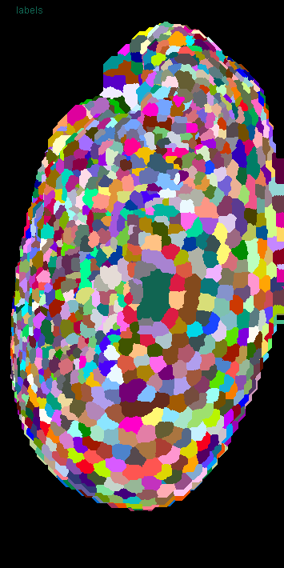
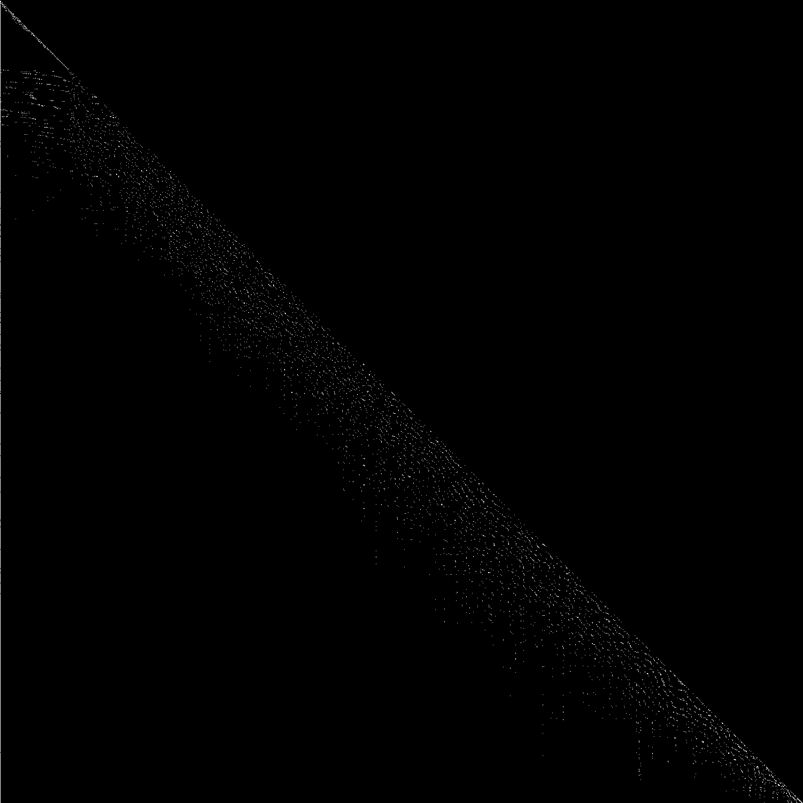
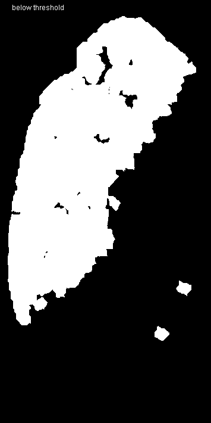
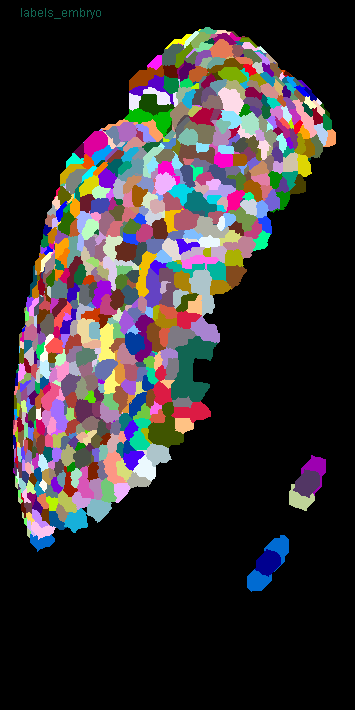

# Superpixel segmentation
Authors: Robert Haase, Daniela Vorkel, April 2020

[Source](https://github.com/clij/clij2-docs/tree/master/src/main/macro/superpixel_segmentation.ijm)

Clean up ImageJ and initialize GPU:

```java
run("Close All");

run("CLIJ2 Macro Extensions", "cl_device=[GeForce RTX 2060 SUPER]");
Ext.CLIJ2_clear();

// time measurements
time = getTime();
Ext.CLIJ2_startTimeTracing();
```

## Load a data set
The dataset is available [online](https://git.mpi-cbg.de/rhaase/clij2_example_data/blob/master/lund1051_resampled.tif).
It shows a *Tribolium castaneum* embryo, imaged by a custom light sheet microscope, at a wavelength of 488nm (Imaging credits: Daniela Vorkel, Myers lab, MPI CBG). 
The data set has been resampled to a voxel size of 1x1x1 microns. The embryo expresses nuclei-GFP. We will use the dataset to detect nuclei and to generate an estimated cell-segmentation.

In addition, we use a label map of segmented cells, which got generated using [this macro](https://github.com/clij/clij2-docs/tree/master/src/main/macro/tribolium_morphometry.ijm).

All processing steps are performed in 3D space. For visualization purpose, we are using the maximum intensity projection in Z: 

```java
path = "C:/structure/teaching/clij2_example_data/";

// load data
open(path + "lund1051_resampled.tif");
input = getTitle();
open(path + "lund1051_labelled.tif");
labels = getTitle();

// push images to GPU
Ext.CLIJ2_push(input);
Ext.CLIJ2_push(labels);

// clean up ImageJ
run("Close All");
```

## Viewing input data
Processed 3D-data will be shown in 2D, using maximum projections in Z:

```java
show(input, "input");
show(labels, "labels");
run("glasbey_on_dark");
```
<a href="image_1588707795876.png"></a>
<a href="image_1588707796002.png"></a>

## Determine neighborhood relationships between segmented objects
From the label map, we derive a touch-matrix to process neighboring pixel :

```java
Ext.CLIJ2_generateTouchMatrix(labels, touch_matrix);

// visualize the touch matrix
Ext.CLIJ2_pull(touch_matrix);
```
<a href="image_1588707796170.png"></a>

## Measure statistics
Now, we get statistics of labelled objects, in the form of a results table. From this table, we push the column PIXEL_SIZE as image back to the GPU:

```java
run("Clear Results");
Ext.CLIJ2_statisticsOfBackgroundAndLabelledPixels(input, labels);
Ext.CLIJ2_pushResultsTableColumn(pixel_count, "PIXEL_COUNT");
run("Clear Results");

// show the pixel count vector image
Ext.CLIJ2_pull(pixel_count);
```
<a href="image_1588707797604.png"></a>


## Visualize measurements in space
Next, we color-code measurements based on the label map: 

```java
Ext.CLIJ2_replaceIntensities(labels, pixel_count, pixel_count_map);
show(pixel_count_map, "pixel count map");
run("Fire");

```
<a href="image_1588707797696.png"></a>

## Thresholding based on derived features
Using a pixel count threshold, we segment the image by differentiating large and small objects. 
Thresholded 2D binary images overlap, because we look at maximum projections of 3D binary image stacks:

```java
pixel_count_threshold = 4000;

threshold_vector_and_visualise(pixel_count, labels, pixel_count_threshold);

// This function takes a vector, binarizes it by using a threshold and 
// visualizes the results as parametric image by the given label map:
function threshold_vector_and_visualise(vector, labelmap, threshold) {

	// threshold the vector in two vectors:
	Ext.CLIJ2_smallerConstant(vector, small_objects, threshold);
	Ext.CLIJ2_greaterOrEqualConstant(vector, large_objects, threshold);
	// alternative: use binaryNot
	
	// visualise resulting binary images
	Ext.CLIJ2_replaceIntensities(labelmap, small_objects, small_objects_map);
	Ext.CLIJ2_replaceIntensities(labelmap, large_objects, large_objects_map);
	show(small_objects_map, "below threshold");
	show(large_objects_map, "above threshold");
}
```
<a href="image_1588707797852.png"></a>
<a href="image_1588707797876.png"></a>

## Improving segmentation by superpixel filtering
Having two regions in the dataset, we can differentiate them more clearly by filtering the 
pixel count factor, using corresponding neighborhood relationships:

```java

// for all objects, determine the minimum pixel count in its local neighborhood
Ext.CLIJ2_minimumOfTouchingNeighbors(pixel_count, touch_matrix, filtered_pixel_count);

// create a parametric image out of the filtered vector
Ext.CLIJ2_replaceIntensities(labels, filtered_pixel_count, filtered_pixel_count_map);
show(filtered_pixel_count_map, "filtered pixel count map");
run("Fire");
```
<a href="image_1588707798001.png"></a>

## Thresholding filtered features
To apply a threshold on a filtered vector, we reuse the macro command from above:

```java
threshold_vector_and_visualise(filtered_pixel_count, labels, pixel_count_threshold);
```
<a href="image_1588707798140.png"></a>
<a href="image_1588707798160.png"></a>

## Renumbering label maps
Based on thresholded features, labels can get excluded and resorted within the label map. 

```java
// threshold the feature vector
Ext.CLIJ2_greaterOrEqualConstant(filtered_pixel_count, binary_vector, pixel_count_threshold);
// remove all labels above the threshold from the label map
Ext.CLIJ2_excludeLabels(binary_vector, labels, labels_embryo);
show(labels_embryo, "labels_embryo");
run("glasbey_on_dark");


```
<a href="image_1588707798252.png"></a>

## Visualization of segmented ROIs
We can also show different regions using ImageJs ROIs and Overlays:

```java
threshold_vector_and_visualise_as_rois(filtered_pixel_count, labels, input, pixel_count_threshold);

// This function takes a vector, binarizes it by thresholding 
// and visualizes the results as regions of interests:
function threshold_vector_and_visualise_as_rois(vector, labelmap, input_image, threshold) {

	// threshold the vector in two vectors:
	Ext.CLIJ2_smallerConstant(vector, small_objects, threshold);
	Ext.CLIJ2_greaterOrEqualConstant(vector, large_objects, threshold);
	// alternative: use binaryNot

	show(input, "Input with rois");
	
	// visualise resulting binary images
	Ext.CLIJ2_replaceIntensities(labelmap, small_objects, small_objects_map);
	Ext.CLIJ2_replaceIntensities(labelmap, large_objects, large_objects_map);

	Ext.CLIJ2_maximumZProjection(small_objects_map, small_objects_map_projected);
	Ext.CLIJ2_maximumZProjection(large_objects_map, large_objects_map_projected);

	// pull a binary image from the GPU as ROI
	Ext.CLIJ2_pullAsROI(small_objects_map_projected);
	run("Enlarge...", "enlarge=-1"); // prevent overlapping outlines
	Overlay.addSelection("green");

	// pull a binary image from the GPU as ROI
	Ext.CLIJ2_pullAsROI(large_objects_map_projected);
	run("Enlarge...", "enlarge=-1"); // prevent overlapping outlines
	Overlay.addSelection("magenta");

	temp = getTitle();
	run("Flatten");
	selectWindow(temp);
	close();
}
```
<a href="image_1588707798693.png"></a>

## Performance evaluation
Finally, a time measurement. Note that performing this workflow in ImageJ macro markdown is slower, 
because intermediate results are saved to disc.

```java
print("The whole workflow took " + (getTime() - time) + " msec");
```
<pre>
> The whole workflow took 4390 msec
</pre>

### Detailed time tracing for all operations

```java
Ext.CLIJ2_stopTimeTracing();
Ext.CLIJ2_getTimeTracing(time_traces);
print(time_traces);
```
<pre>
> > timeTracing
>  > MaximumZProjection
>  < MaximumZProjection           18.816 ms
>  > MaximumZProjection
>  < MaximumZProjection           1.7192 ms
>  > GenerateTouchMatrix
>   > Set
>   < Set                         14.2843 ms
>  < GenerateTouchMatrix          17.1836 ms
>  > StatisticsOfBackgroundAndLabelledPixels
>   > MaximumOfAllPixels
>    > MaximumZProjection
>    < MaximumZProjection         1.579 ms
>    > MaximumYProjection
>    < MaximumYProjection         12.9777 ms
>    > MaximumXProjection
>    < MaximumXProjection         13.0664 ms
>   < MaximumOfAllPixels          28.4014 ms
>   > StatisticsOfLabelledPixels
>    > CopySlice
>    < CopySlice                  0.8603 ms
>    > CopySlice
>    < CopySlice                  0.2365 ms
>    > CopySlice
>    < CopySlice                  0.7719 ms
>    > CopySlice
>    < CopySlice                  0.2576 ms
>    > CopySlice
>    < CopySlice                  0.7953 ms
>    > CopySlice
>    < CopySlice                  0.3884 ms
>    > CopySlice
>    < CopySlice                  0.7982 ms
>    > CopySlice
>    < CopySlice                  0.2437 ms
>    > CopySlice
>    < CopySlice                  0.7158 ms
>    > CopySlice
>    < CopySlice                  0.2344 ms
>    > CopySlice
>    < CopySlice                  2.9421 ms
>    > CopySlice
>    < CopySlice                  0.2828 ms
>    > CopySlice
>    < CopySlice                  0.6794 ms
>    > CopySlice
>    < CopySlice                  0.2201 ms
>    > CopySlice
>    < CopySlice                  0.6428 ms
>    > CopySlice
>    < CopySlice                  0.2202 ms
>    > CopySlice
>    < CopySlice                  0.6541 ms
>    > CopySlice
>    < CopySlice                  0.2216 ms
>    > CopySlice
>    < CopySlice                  1.3088 ms
>    > CopySlice
>    < CopySlice                  0.2722 ms
>    > CopySlice
>    < CopySlice                  1.0033 ms
>    > CopySlice
>    < CopySlice                  0.2957 ms
>    > CopySlice
>    < CopySlice                  0.721 ms
>    > CopySlice
>    < CopySlice                  0.2373 ms
>    > CopySlice
>    < CopySlice                  0.6134 ms
>    > CopySlice
>    < CopySlice                  0.1978 ms
>    > CopySlice
>    < CopySlice                  0.7361 ms
>    > CopySlice
>    < CopySlice                  0.276 ms
>    > CopySlice
>    < CopySlice                  0.6377 ms
>    > CopySlice
>    < CopySlice                  0.1921 ms
>    > CopySlice
>    < CopySlice                  0.6129 ms
>    > CopySlice
>    < CopySlice                  0.1911 ms
>    > CopySlice
>    < CopySlice                  0.6211 ms
>    > CopySlice
>    < CopySlice                  0.1886 ms
>    > CopySlice
>    < CopySlice                  0.7783 ms
>    > CopySlice
>    < CopySlice                  0.2712 ms
>    > CopySlice
>    < CopySlice                  0.8488 ms
>    > CopySlice
>    < CopySlice                  0.5745 ms
>    > CopySlice
>    < CopySlice                  1.3508 ms
>    > CopySlice
>    < CopySlice                  0.2968 ms
>    > CopySlice
>    < CopySlice                  0.6131 ms
>    > CopySlice
>    < CopySlice                  0.1819 ms
>    > CopySlice
>    < CopySlice                  0.5963 ms
>    > CopySlice
>    < CopySlice                  0.1896 ms
>    > CopySlice
>    < CopySlice                  0.6839 ms
>    > CopySlice
>    < CopySlice                  0.1865 ms
>    > CopySlice
>    < CopySlice                  0.6539 ms
>    > CopySlice
>    < CopySlice                  0.2128 ms
>    > CopySlice
>    < CopySlice                  0.641 ms
>    > CopySlice
>    < CopySlice                  0.2093 ms
>    > CopySlice
>    < CopySlice                  0.6258 ms
>    > CopySlice
>    < CopySlice                  0.192 ms
>    > CopySlice
>    < CopySlice                  0.6017 ms
>    > CopySlice
>    < CopySlice                  0.1782 ms
>    > CopySlice
>    < CopySlice                  0.6035 ms
>    > CopySlice
>    < CopySlice                  0.1826 ms
>    > CopySlice
>    < CopySlice                  0.657 ms
>    > CopySlice
>    < CopySlice                  0.1888 ms
>    > CopySlice
>    < CopySlice                  0.5751 ms
>    > CopySlice
>    < CopySlice                  0.1938 ms
>    > CopySlice
>    < CopySlice                  0.5794 ms
>    > CopySlice
>    < CopySlice                  0.1975 ms
>    > CopySlice
>    < CopySlice                  0.5485 ms
>    > CopySlice
>    < CopySlice                  0.1723 ms
>    > CopySlice
>    < CopySlice                  0.5923 ms
>    > CopySlice
>    < CopySlice                  0.1806 ms
>    > CopySlice
>    < CopySlice                  0.5451 ms
>    > CopySlice
>    < CopySlice                  0.1786 ms
>    > CopySlice
>    < CopySlice                  0.5188 ms
>    > CopySlice
>    < CopySlice                  0.1686 ms
>    > CopySlice
>    < CopySlice                  0.6287 ms
>    > CopySlice
>    < CopySlice                  0.2616 ms
>    > CopySlice
>    < CopySlice                  0.5532 ms
>    > CopySlice
>    < CopySlice                  0.1694 ms
>    > CopySlice
>    < CopySlice                  0.5619 ms
>    > CopySlice
>    < CopySlice                  0.1739 ms
>    > CopySlice
>    < CopySlice                  0.5289 ms
>    > CopySlice
>    < CopySlice                  0.1896 ms
>    > CopySlice
>    < CopySlice                  0.5329 ms
>    > CopySlice
>    < CopySlice                  0.1762 ms
>    > CopySlice
>    < CopySlice                  0.5341 ms
>    > CopySlice
>    < CopySlice                  0.2073 ms
>    > CopySlice
>    < CopySlice                  0.5467 ms
>    > CopySlice
>    < CopySlice                  0.172 ms
>    > CopySlice
>    < CopySlice                  0.5337 ms
>    > CopySlice
>    < CopySlice                  0.2597 ms
>    > CopySlice
>    < CopySlice                  0.5441 ms
>    > CopySlice
>    < CopySlice                  0.2308 ms
>    > CopySlice
>    < CopySlice                  0.5312 ms
>    > CopySlice
>    < CopySlice                  0.1694 ms
>    > CopySlice
>    < CopySlice                  0.5315 ms
>    > CopySlice
>    < CopySlice                  0.1748 ms
>    > CopySlice
>    < CopySlice                  0.5731 ms
>    > CopySlice
>    < CopySlice                  0.2184 ms
>    > CopySlice
>    < CopySlice                  0.5788 ms
>    > CopySlice
>    < CopySlice                  0.1757 ms
>    > CopySlice
>    < CopySlice                  0.5358 ms
>    > CopySlice
>    < CopySlice                  0.1701 ms
>    > CopySlice
>    < CopySlice                  0.5161 ms
>    > CopySlice
>    < CopySlice                  0.1745 ms
>    > CopySlice
>    < CopySlice                  0.5194 ms
>    > CopySlice
>    < CopySlice                  0.2523 ms
>    > CopySlice
>    < CopySlice                  0.608 ms
>    > CopySlice
>    < CopySlice                  0.2144 ms
>    > CopySlice
>    < CopySlice                  0.6039 ms
>    > CopySlice
>    < CopySlice                  0.1792 ms
>    > CopySlice
>    < CopySlice                  0.5982 ms
>    > CopySlice
>    < CopySlice                  0.2295 ms
>    > CopySlice
>    < CopySlice                  0.6042 ms
>    > CopySlice
>    < CopySlice                  0.1866 ms
>    > CopySlice
>    < CopySlice                  0.6206 ms
>    > CopySlice
>    < CopySlice                  0.2897 ms
>    > CopySlice
>    < CopySlice                  0.536 ms
>    > CopySlice
>    < CopySlice                  0.1763 ms
>    > CopySlice
>    < CopySlice                  0.5144 ms
>    > CopySlice
>    < CopySlice                  0.1692 ms
>    > CopySlice
>    < CopySlice                  0.5397 ms
>    > CopySlice
>    < CopySlice                  0.2491 ms
>    > CopySlice
>    < CopySlice                  0.5443 ms
>    > CopySlice
>    < CopySlice                  0.1742 ms
>    > CopySlice
>    < CopySlice                  0.5314 ms
>    > CopySlice
>    < CopySlice                  0.1728 ms
>    > CopySlice
>    < CopySlice                  0.6147 ms
>    > CopySlice
>    < CopySlice                  0.1703 ms
>    > CopySlice
>    < CopySlice                  0.5792 ms
>    > CopySlice
>    < CopySlice                  0.1803 ms
>    > CopySlice
>    < CopySlice                  0.544 ms
>    > CopySlice
>    < CopySlice                  0.1756 ms
>    > CopySlice
>    < CopySlice                  0.5463 ms
>    > CopySlice
>    < CopySlice                  0.2634 ms
>    > CopySlice
>    < CopySlice                  0.5304 ms
>    > CopySlice
>    < CopySlice                  0.1888 ms
>    > CopySlice
>    < CopySlice                  0.5068 ms
>    > CopySlice
>    < CopySlice                  0.2416 ms
>    > CopySlice
>    < CopySlice                  0.5065 ms
>    > CopySlice
>    < CopySlice                  0.1686 ms
>    > CopySlice
>    < CopySlice                  0.5122 ms
>    > CopySlice
>    < CopySlice                  0.1676 ms
>    > CopySlice
>    < CopySlice                  0.676 ms
>    > CopySlice
>    < CopySlice                  0.1919 ms
>    > CopySlice
>    < CopySlice                  0.7422 ms
>    > CopySlice
>    < CopySlice                  0.2458 ms
>    > CopySlice
>    < CopySlice                  0.6326 ms
>    > CopySlice
>    < CopySlice                  0.2224 ms
>    > CopySlice
>    < CopySlice                  0.708 ms
>    > CopySlice
>    < CopySlice                  0.1975 ms
>    > CopySlice
>    < CopySlice                  0.676 ms
>    > CopySlice
>    < CopySlice                  0.2094 ms
>    > CopySlice
>    < CopySlice                  0.6613 ms
>    > CopySlice
>    < CopySlice                  0.2107 ms
>    > CopySlice
>    < CopySlice                  0.7997 ms
>    > CopySlice
>    < CopySlice                  0.3181 ms
>    > CopySlice
>    < CopySlice                  0.5702 ms
>    > CopySlice
>    < CopySlice                  0.247 ms
>    > CopySlice
>    < CopySlice                  0.6833 ms
>    > CopySlice
>    < CopySlice                  0.2197 ms
>    > CopySlice
>    < CopySlice                  1.0132 ms
>    > CopySlice
>    < CopySlice                  0.229 ms
>    > CopySlice
>    < CopySlice                  0.6578 ms
>    > CopySlice
>    < CopySlice                  0.2718 ms
>    > CopySlice
>    < CopySlice                  0.6065 ms
>    > CopySlice
>    < CopySlice                  0.1937 ms
>    > CopySlice
>    < CopySlice                  0.6462 ms
>    > CopySlice
>    < CopySlice                  0.2375 ms
>    > CopySlice
>    < CopySlice                  0.6941 ms
>    > CopySlice
>    < CopySlice                  0.211 ms
>    > CopySlice
>    < CopySlice                  0.6905 ms
>    > CopySlice
>    < CopySlice                  0.2225 ms
>    > CopySlice
>    < CopySlice                  0.7558 ms
>    > CopySlice
>    < CopySlice                  0.2119 ms
>    > CopySlice
>    < CopySlice                  0.7142 ms
>    > CopySlice
>    < CopySlice                  0.2191 ms
>    > CopySlice
>    < CopySlice                  0.586 ms
>    > CopySlice
>    < CopySlice                  0.1852 ms
>    > CopySlice
>    < CopySlice                  0.5575 ms
>    > CopySlice
>    < CopySlice                  0.2073 ms
>    > CopySlice
>    < CopySlice                  0.6916 ms
>    > CopySlice
>    < CopySlice                  0.2205 ms
>    > CopySlice
>    < CopySlice                  0.5861 ms
>    > CopySlice
>    < CopySlice                  0.2124 ms
>    > CopySlice
>    < CopySlice                  0.6027 ms
>    > CopySlice
>    < CopySlice                  0.1941 ms
>    > CopySlice
>    < CopySlice                  0.623 ms
>    > CopySlice
>    < CopySlice                  0.2038 ms
>    > CopySlice
>    < CopySlice                  0.5897 ms
>    > CopySlice
>    < CopySlice                  0.2015 ms
>    > CopySlice
>    < CopySlice                  0.5743 ms
>    > CopySlice
>    < CopySlice                  0.1977 ms
>    > CopySlice
>    < CopySlice                  0.5627 ms
>    > CopySlice
>    < CopySlice                  0.2017 ms
>    > CopySlice
>    < CopySlice                  0.7999 ms
>    > CopySlice
>    < CopySlice                  0.2158 ms
>    > CopySlice
>    < CopySlice                  0.6257 ms
>    > CopySlice
>    < CopySlice                  0.2004 ms
>    > CopySlice
>    < CopySlice                  0.6216 ms
>    > CopySlice
>    < CopySlice                  0.2027 ms
>    > CopySlice
>    < CopySlice                  0.6893 ms
>    > CopySlice
>    < CopySlice                  0.2998 ms
>    > CopySlice
>    < CopySlice                  0.6689 ms
>    > CopySlice
>    < CopySlice                  0.1876 ms
>    > CopySlice
>    < CopySlice                  0.7651 ms
>    > CopySlice
>    < CopySlice                  0.2214 ms
>    > CopySlice
>    < CopySlice                  0.6186 ms
>    > CopySlice
>    < CopySlice                  0.2045 ms
>    > CopySlice
>    < CopySlice                  0.6882 ms
>    > CopySlice
>    < CopySlice                  0.283 ms
>    > CopySlice
>    < CopySlice                  0.6433 ms
>    > CopySlice
>    < CopySlice                  0.1897 ms
>    > CopySlice
>    < CopySlice                  0.6136 ms
>    > CopySlice
>    < CopySlice                  0.1948 ms
>    > CopySlice
>    < CopySlice                  0.6547 ms
>    > CopySlice
>    < CopySlice                  0.2358 ms
>    > CopySlice
>    < CopySlice                  0.6801 ms
>    > CopySlice
>    < CopySlice                  0.21 ms
>    > CopySlice
>    < CopySlice                  0.6629 ms
>    > CopySlice
>    < CopySlice                  0.1833 ms
>    > CopySlice
>    < CopySlice                  0.5533 ms
>    > CopySlice
>    < CopySlice                  0.2708 ms
>    > CopySlice
>    < CopySlice                  0.5894 ms
>    > CopySlice
>    < CopySlice                  0.1909 ms
>    > CopySlice
>    < CopySlice                  0.644 ms
>    > CopySlice
>    < CopySlice                  0.2092 ms
>    > CopySlice
>    < CopySlice                  0.6005 ms
>    > CopySlice
>    < CopySlice                  0.1864 ms
>    > CopySlice
>    < CopySlice                  0.5754 ms
>    > CopySlice
>    < CopySlice                  0.2129 ms
>    > CopySlice
>    < CopySlice                  0.6921 ms
>    > CopySlice
>    < CopySlice                  0.2083 ms
>    > CopySlice
>    < CopySlice                  0.6477 ms
>    > CopySlice
>    < CopySlice                  0.2039 ms
>    > CopySlice
>    < CopySlice                  0.6099 ms
>    > CopySlice
>    < CopySlice                  0.2519 ms
>    > CopySlice
>    < CopySlice                  0.6174 ms
>    > CopySlice
>    < CopySlice                  0.2861 ms
>    > CopySlice
>    < CopySlice                  0.64 ms
>    > CopySlice
>    < CopySlice                  0.1908 ms
>    > CopySlice
>    < CopySlice                  0.6472 ms
>    > CopySlice
>    < CopySlice                  0.2221 ms
>    > CopySlice
>    < CopySlice                  0.5765 ms
>    > CopySlice
>    < CopySlice                  0.2083 ms
>    > CopySlice
>    < CopySlice                  0.5938 ms
>    > CopySlice
>    < CopySlice                  0.2048 ms
>    > CopySlice
>    < CopySlice                  0.6331 ms
>    > CopySlice
>    < CopySlice                  0.1929 ms
>    > CopySlice
>    < CopySlice                  0.7537 ms
>    > CopySlice
>    < CopySlice                  0.2387 ms
>    > CopySlice
>    < CopySlice                  0.5745 ms
>    > CopySlice
>    < CopySlice                  0.2071 ms
>    > CopySlice
>    < CopySlice                  0.662 ms
>    > CopySlice
>    < CopySlice                  0.2059 ms
>    > CopySlice
>    < CopySlice                  0.6719 ms
>    > CopySlice
>    < CopySlice                  0.193 ms
>    > CopySlice
>    < CopySlice                  0.6155 ms
>    > CopySlice
>    < CopySlice                  0.2084 ms
>    > CopySlice
>    < CopySlice                  0.6327 ms
>    > CopySlice
>    < CopySlice                  0.2049 ms
>    > CopySlice
>    < CopySlice                  0.5862 ms
>    > CopySlice
>    < CopySlice                  0.2089 ms
>    > CopySlice
>    < CopySlice                  0.7084 ms
>    > CopySlice
>    < CopySlice                  0.2105 ms
>    > CopySlice
>    < CopySlice                  0.641 ms
>    > CopySlice
>    < CopySlice                  0.1984 ms
>    > CopySlice
>    < CopySlice                  0.58 ms
>    > CopySlice
>    < CopySlice                  0.2956 ms
>    > CopySlice
>    < CopySlice                  0.5702 ms
>    > CopySlice
>    < CopySlice                  0.1999 ms
>    > CopySlice
>    < CopySlice                  0.6299 ms
>    > CopySlice
>    < CopySlice                  0.2605 ms
>    > CopySlice
>    < CopySlice                  0.6895 ms
>    > CopySlice
>    < CopySlice                  0.2023 ms
>    > CopySlice
>    < CopySlice                  0.686 ms
>    > CopySlice
>    < CopySlice                  0.2827 ms
>    > CopySlice
>    < CopySlice                  0.6172 ms
>    > CopySlice
>    < CopySlice                  0.2249 ms
>    > CopySlice
>    < CopySlice                  0.6433 ms
>    > CopySlice
>    < CopySlice                  0.2057 ms
>    > CopySlice
>    < CopySlice                  0.6656 ms
>    > CopySlice
>    < CopySlice                  0.1996 ms
>    > CopySlice
>    < CopySlice                  0.5814 ms
>    > CopySlice
>    < CopySlice                  0.1756 ms
>    > CopySlice
>    < CopySlice                  0.5626 ms
>    > CopySlice
>    < CopySlice                  0.2812 ms
>    > CopySlice
>    < CopySlice                  0.6455 ms
>    > CopySlice
>    < CopySlice                  0.205 ms
>    > CopySlice
>    < CopySlice                  0.691 ms
>    > CopySlice
>    < CopySlice                  0.2061 ms
>    > CopySlice
>    < CopySlice                  0.5902 ms
>    > CopySlice
>    < CopySlice                  0.2078 ms
>    > CopySlice
>    < CopySlice                  0.6603 ms
>    > CopySlice
>    < CopySlice                  0.2306 ms
>    > CopySlice
>    < CopySlice                  0.6994 ms
>    > CopySlice
>    < CopySlice                  0.2196 ms
>    > CopySlice
>    < CopySlice                  0.654 ms
>    > CopySlice
>    < CopySlice                  0.2007 ms
>    > CopySlice
>    < CopySlice                  0.6354 ms
>    > CopySlice
>    < CopySlice                  0.2449 ms
>    > CopySlice
>    < CopySlice                  0.6691 ms
>    > CopySlice
>    < CopySlice                  0.1952 ms
>    > CopySlice
>    < CopySlice                  0.7035 ms
>    > CopySlice
>    < CopySlice                  0.2546 ms
>    > CopySlice
>    < CopySlice                  0.6484 ms
>    > CopySlice
>    < CopySlice                  0.1837 ms
>    > CopySlice
>    < CopySlice                  0.7479 ms
>    > CopySlice
>    < CopySlice                  0.3163 ms
>    > CopySlice
>    < CopySlice                  0.6387 ms
>    > CopySlice
>    < CopySlice                  0.2115 ms
>    > CopySlice
>    < CopySlice                  0.5947 ms
>    > CopySlice
>    < CopySlice                  0.183 ms
>    > CopySlice
>    < CopySlice                  0.7263 ms
>    > CopySlice
>    < CopySlice                  0.2112 ms
>    > CopySlice
>    < CopySlice                  0.6426 ms
>    > CopySlice
>    < CopySlice                  0.2887 ms
>    > CopySlice
>    < CopySlice                  0.6105 ms
>    > CopySlice
>    < CopySlice                  0.2683 ms
>    > CopySlice
>    < CopySlice                  0.5756 ms
>    > CopySlice
>    < CopySlice                  0.2182 ms
>    > CopySlice
>    < CopySlice                  0.5383 ms
>    > CopySlice
>    < CopySlice                  0.1925 ms
>    > CopySlice
>    < CopySlice                  0.5747 ms
>    > CopySlice
>    < CopySlice                  0.2763 ms
>    > CopySlice
>    < CopySlice                  0.5652 ms
>    > CopySlice
>    < CopySlice                  0.1978 ms
>    > CopySlice
>    < CopySlice                  0.5743 ms
>    > CopySlice
>    < CopySlice                  0.291 ms
>    > CopySlice
>    < CopySlice                  0.5818 ms
>    > CopySlice
>    < CopySlice                  0.2094 ms
>    > CopySlice
>    < CopySlice                  0.6221 ms
>    > CopySlice
>    < CopySlice                  0.2164 ms
>    > CopySlice
>    < CopySlice                  0.6544 ms
>    > CopySlice
>    < CopySlice                  0.1894 ms
>    > CopySlice
>    < CopySlice                  0.5926 ms
>    > CopySlice
>    < CopySlice                  0.2154 ms
>    > CopySlice
>    < CopySlice                  0.6087 ms
>    > CopySlice
>    < CopySlice                  0.2306 ms
>    > CopySlice
>    < CopySlice                  0.5925 ms
>    > CopySlice
>    < CopySlice                  0.1748 ms
>    > CopySlice
>    < CopySlice                  0.5594 ms
>    > CopySlice
>    < CopySlice                  0.2772 ms
>    > CopySlice
>    < CopySlice                  0.7453 ms
>    > CopySlice
>    < CopySlice                  0.203 ms
>    > CopySlice
>    < CopySlice                  0.6488 ms
>    > CopySlice
>    < CopySlice                  0.2056 ms
>    > CopySlice
>    < CopySlice                  0.5891 ms
>    > CopySlice
>    < CopySlice                  0.2284 ms
>    > CopySlice
>    < CopySlice                  0.5785 ms
>    > CopySlice
>    < CopySlice                  0.2034 ms
>    > CopySlice
>    < CopySlice                  0.5931 ms
>    > CopySlice
>    < CopySlice                  0.216 ms
>    > CopySlice
>    < CopySlice                  0.5965 ms
>    > CopySlice
>    < CopySlice                  0.1984 ms
>    > CopySlice
>    < CopySlice                  0.5897 ms
>    > CopySlice
>    < CopySlice                  0.2277 ms
>    > CopySlice
>    < CopySlice                  0.6092 ms
>    > CopySlice
>    < CopySlice                  0.2092 ms
>    > CopySlice
>    < CopySlice                  0.6332 ms
>    > CopySlice
>    < CopySlice                  0.2023 ms
>    > CopySlice
>    < CopySlice                  0.6279 ms
>    > CopySlice
>    < CopySlice                  0.2058 ms
>    > CopySlice
>    < CopySlice                  0.7962 ms
>    > CopySlice
>    < CopySlice                  0.3165 ms
>    > CopySlice
>    < CopySlice                  0.7155 ms
>    > CopySlice
>    < CopySlice                  0.2674 ms
>    > CopySlice
>    < CopySlice                  0.6912 ms
>    > CopySlice
>    < CopySlice                  0.2026 ms
>    > CopySlice
>    < CopySlice                  0.64 ms
>    > CopySlice
>    < CopySlice                  0.1816 ms
>    > CopySlice
>    < CopySlice                  0.5563 ms
>    > CopySlice
>    < CopySlice                  0.2133 ms
>    > CopySlice
>    < CopySlice                  0.603 ms
>    > CopySlice
>    < CopySlice                  0.2055 ms
>    > CopySlice
>    < CopySlice                  0.719 ms
>    > CopySlice
>    < CopySlice                  0.2196 ms
>    > CopySlice
>    < CopySlice                  0.6674 ms
>    > CopySlice
>    < CopySlice                  0.1976 ms
>    > CopySlice
>    < CopySlice                  0.6959 ms
>    > CopySlice
>    < CopySlice                  0.2851 ms
>    > CopySlice
>    < CopySlice                  0.5828 ms
>    > CopySlice
>    < CopySlice                  0.1837 ms
>    > CopySlice
>    < CopySlice                  0.6213 ms
>    > CopySlice
>    < CopySlice                  0.1978 ms
>    > CopySlice
>    < CopySlice                  0.5672 ms
>    > CopySlice
>    < CopySlice                  0.1936 ms
>    > CopySlice
>    < CopySlice                  0.5879 ms
>    > CopySlice
>    < CopySlice                  0.2047 ms
>    > CopySlice
>    < CopySlice                  0.8409 ms
>    > CopySlice
>    < CopySlice                  0.2097 ms
>    > CopySlice
>    < CopySlice                  0.6779 ms
>    > CopySlice
>    < CopySlice                  0.1863 ms
>    > CopySlice
>    < CopySlice                  0.5813 ms
>    > CopySlice
>    < CopySlice                  0.2459 ms
>    > CopySlice
>    < CopySlice                  0.5595 ms
>    > CopySlice
>    < CopySlice                  0.2457 ms
>    > CopySlice
>    < CopySlice                  0.57 ms
>    > CopySlice
>    < CopySlice                  0.1897 ms
>    > CopySlice
>    < CopySlice                  0.5794 ms
>    > CopySlice
>    < CopySlice                  0.1808 ms
>    > CopySlice
>    < CopySlice                  0.6775 ms
>    > CopySlice
>    < CopySlice                  0.2604 ms
>    > CopySlice
>    < CopySlice                  0.6173 ms
>    > CopySlice
>    < CopySlice                  0.1801 ms
>    > CopySlice
>    < CopySlice                  0.6411 ms
>    > CopySlice
>    < CopySlice                  0.1892 ms
>    > CopySlice
>    < CopySlice                  0.722 ms
>    > CopySlice
>    < CopySlice                  0.2638 ms
>    > CopySlice
>    < CopySlice                  0.787 ms
>    > CopySlice
>    < CopySlice                  0.2578 ms
>    > CopySlice
>    < CopySlice                  0.6232 ms
>    > CopySlice
>    < CopySlice                  0.2075 ms
>    > CopySlice
>    < CopySlice                  0.8134 ms
>    > CopySlice
>    < CopySlice                  0.2543 ms
>    > CopySlice
>    < CopySlice                  0.7577 ms
>    > CopySlice
>    < CopySlice                  0.2675 ms
>    > CopySlice
>    < CopySlice                  0.6404 ms
>    > CopySlice
>    < CopySlice                  0.2678 ms
>    > CopySlice
>    < CopySlice                  0.8938 ms
>    > CopySlice
>    < CopySlice                  0.2599 ms
>    > CopySlice
>    < CopySlice                  0.7099 ms
>    > CopySlice
>    < CopySlice                  0.2662 ms
>    > CopySlice
>    < CopySlice                  0.6619 ms
>    > CopySlice
>    < CopySlice                  0.2367 ms
>    > CopySlice
>    < CopySlice                  0.6643 ms
>    > CopySlice
>    < CopySlice                  0.2325 ms
>    > CopySlice
>    < CopySlice                  0.6748 ms
>    > CopySlice
>    < CopySlice                  0.289 ms
>    > CopySlice
>    < CopySlice                  0.6242 ms
>    > CopySlice
>    < CopySlice                  0.2014 ms
>   < StatisticsOfLabelledPixels  1143.4018 ms
>  < StatisticsOfBackgroundAndLabelledPixels1176.96 ms
>  > PushResultsTableColumn
>   > Copy
>   < Copy                        0.4698 ms
>  < PushResultsTableColumn       1.2462 ms
>  > ReplaceIntensities
>  < ReplaceIntensities           26.0471 ms
>  > MaximumZProjection
>  < MaximumZProjection           0.8355 ms
>  > SmallerConstant
>  < SmallerConstant              13.2893 ms
>  > GreaterOrEqualConstant
>  < GreaterOrEqualConstant       12.801 ms
>  > ReplaceIntensities
>  < ReplaceIntensities           7.8833 ms
>  > ReplaceIntensities
>  < ReplaceIntensities           8.1147 ms
>  > MaximumZProjection
>  < MaximumZProjection           0.7722 ms
>  > MaximumZProjection
>  < MaximumZProjection           0.9578 ms
>  > MinimumOfTouchingNeighbors
>  < MinimumOfTouchingNeighbors   4.2116 ms
>  > ReplaceIntensities
>  < ReplaceIntensities           8.2114 ms
>  > MaximumZProjection
>  < MaximumZProjection           0.8552 ms
>  > SmallerConstant
>  < SmallerConstant              0.2937 ms
>  > GreaterOrEqualConstant
>  < GreaterOrEqualConstant       0.228 ms
>  > ReplaceIntensities
>  < ReplaceIntensities           7.9932 ms
>  > ReplaceIntensities
>  < ReplaceIntensities           8.1928 ms
>  > MaximumZProjection
>  < MaximumZProjection           0.7955 ms
>  > MaximumZProjection
>  < MaximumZProjection           0.9131 ms
>  > GreaterOrEqualConstant
>  < GreaterOrEqualConstant       0.3734 ms
>  > ExcludeLabels
>   > ReplaceIntensities
>   < ReplaceIntensities          7.9824 ms
>  < ExcludeLabels                8.3484 ms
>  > MaximumZProjection
>  < MaximumZProjection           0.7909 ms
>  > SmallerConstant
>  < SmallerConstant              0.4226 ms
>  > GreaterOrEqualConstant
>  < GreaterOrEqualConstant       0.2078 ms
>  > MaximumZProjection
>  < MaximumZProjection           0.8014 ms
>  > ReplaceIntensities
>  < ReplaceIntensities           8.1426 ms
>  > ReplaceIntensities
>  < ReplaceIntensities           8.1331 ms
>  > MaximumZProjection
>  < MaximumZProjection           0.9057 ms
>  > MaximumZProjection
>  < MaximumZProjection           0.832 ms
>  > PullAsROI
>  < PullAsROI                    33.3067 ms
>  > PullAsROI
>  < PullAsROI                    29.7077 ms
> < timeTracing                   4392.9165 ms
>  
</pre>

Also, let's see how much of GPU memory got used by this workflow. At the end, cleaning up remains important.

```java
Ext.CLIJ2_reportMemory();

// finally, clean up
Ext.CLIJ2_clear();
```
<pre>
> GPU contains 23 images.
> - CLIJ2_greaterOrEqualConstant_result147[net.haesleinhuepf.clij.clearcl.ClearCLPeerPointer@3050f68b] 5.9 kb
> - CLIJ2_greaterOrEqualConstant_result156[net.haesleinhuepf.clij.clearcl.ClearCLPeerPointer@65299655] 5.9 kb
> - CLIJ2_generateTouchMatrix_result133[net.haesleinhuepf.clij.clearcl.ClearCLPeerPointer@6a7866a0] 8.6 Mb
> - CLIJ2_greaterOrEqualConstant_result138[net.haesleinhuepf.clij.clearcl.ClearCLPeerPointer@afa8429] 5.9 kb
> - lund1051_labelled.tif[net.haesleinhuepf.clij.clearcl.ClearCLPeerPointer@3da9df53] 204.8 Mb
> - lund1051_resampled.tif[net.haesleinhuepf.clij.clearcl.ClearCLPeerPointer@141b7d8d] 204.8 Mb
> - CLIJ2_minimumOfTouchingNeighbors_result143[net.haesleinhuepf.clij.clearcl.ClearCLPeerPointer@3dff54c8] 5.9 kb
> - CLIJ2_greaterOrEqualConstant_result152[net.haesleinhuepf.clij.clearcl.ClearCLPeerPointer@637a5492] 5.9 kb
> - CLIJ2_excludeLabels_result153[net.haesleinhuepf.clij.clearcl.ClearCLPeerPointer@105a5ce9] 204.8 Mb
> - CLIJ2_maximumZProjection_result161[net.haesleinhuepf.clij.clearcl.ClearCLPeerPointer@5f62ac7a] 984.6 kb
> - CLIJ2_replaceIntensities_result149[net.haesleinhuepf.clij.clearcl.ClearCLPeerPointer@187cea4a] 204.8 Mb
> - CLIJ2_pushResultsTableColumn_result134[net.haesleinhuepf.clij.clearcl.ClearCLPeerPointer@2993f313] 5.9 kb
> - CLIJ2_replaceIntensities_result139[net.haesleinhuepf.clij.clearcl.ClearCLPeerPointer@6b6c5fdc] 204.8 Mb
> - CLIJ2_maximumZProjection_result160[net.haesleinhuepf.clij.clearcl.ClearCLPeerPointer@21272fb7] 984.6 kb
> - CLIJ2_replaceIntensities_result158[net.haesleinhuepf.clij.clearcl.ClearCLPeerPointer@5ef6bf63] 204.8 Mb
> - CLIJ2_replaceIntensities_result148[net.haesleinhuepf.clij.clearcl.ClearCLPeerPointer@684bc4c5] 204.8 Mb
> - CLIJ2_replaceIntensities_result159[net.haesleinhuepf.clij.clearcl.ClearCLPeerPointer@61d0e4af] 204.8 Mb
> - CLIJ2_smallerConstant_result146[net.haesleinhuepf.clij.clearcl.ClearCLPeerPointer@799225b5] 5.9 kb
> - CLIJ2_replaceIntensities_result135[net.haesleinhuepf.clij.clearcl.ClearCLPeerPointer@12f48043] 204.8 Mb
> - CLIJ2_smallerConstant_result137[net.haesleinhuepf.clij.clearcl.ClearCLPeerPointer@24af0334] 5.9 kb
> - CLIJ2_replaceIntensities_result144[net.haesleinhuepf.clij.clearcl.ClearCLPeerPointer@42bc6e92] 204.8 Mb
> - CLIJ2_smallerConstant_result155[net.haesleinhuepf.clij.clearcl.ClearCLPeerPointer@2aeb44fd] 5.9 kb
> - CLIJ2_replaceIntensities_result140[net.haesleinhuepf.clij.clearcl.ClearCLPeerPointer@1cab2f7b] 204.8 Mb
> = 2.2 Gb
>  
</pre>

Following methods are convenient for a proper visualization in a notebook:

```java
function show(input, text) {
	Ext.CLIJ2_maximumZProjection(input, max_projection);
	Ext.CLIJ2_pull(max_projection);
	setColor(100000);
	drawString(text, 20, 20);
	Ext.CLIJ2_release(max_projection);
}
```


```
```
