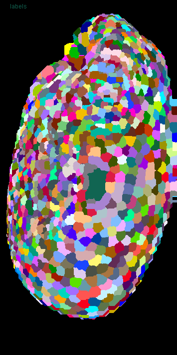
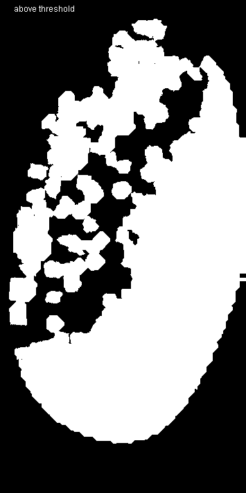
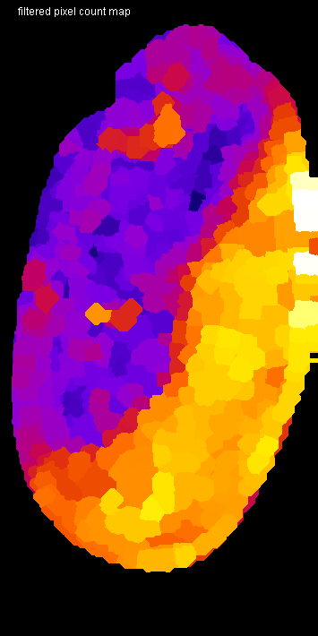
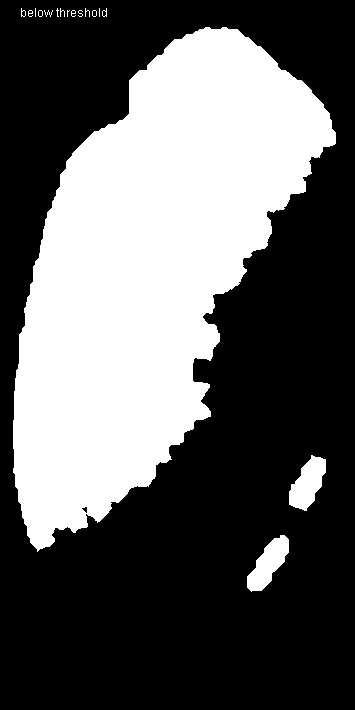

# Superpixel segmentation
Author: Robert Haase
        April 2020

[Source](https://github.com/clij/clij2-docs/tree/master/src/main/macro/superpixel_segmentation.ijm)

Initialize/clean up ImageJ and graphics card:

<pre class="highlight">
run("Close All");

run("CLIJ2 Macro Extensions", "cl_device=[GeForce RTX 2060 SUPER]");
Ext.CLIJ2_clear();

// time measurements
time = getTime();
Ext.CLIJ2_startTimeTracing();
</pre>

## Load a data set
The raw dataset is available [online](https://git.mpi-cbg.de/rhaase/neubias_academy_clij2/blob/master/data/lund1051_resampled.tif).
It shows a Tribolium castaneum embryo imaged using a custom light sheet microscope using a wavelength of 488nm (Imaging credits: Daniela Vorkel, Myers lab, MPI CBG). 
The data set has been resampled to a voxel size of 1x1x1 microns. The embryo expresses nuclei-GFP. We will use it for detecting nuclei and generating an estimated cell-segmentation first.

Furthermore, we use a label map of segmented cells, which was generated using [this macro](https://github.com/clij/clij2-docs/tree/master/src/main/macro/tribolium_morphometry.ijm).

All processing steps are performed in 3D, for visualisation purposes, we're looking at maximum intensity projections in Z: 

<pre class="highlight">
path = "C:/structure/teaching/neubias_academy_clij2/data/";

// load data
open(path + "lund1051_resampled.tif");
input = getTitle();
open(path + "lund1051_labelled.tif");
labels = getTitle();

// push images to GPU
Ext.CLIJ2_push(input);
Ext.CLIJ2_push(labels);

// clean up imageJ
run("Close All");
</pre>

## Inspecting input data
The processed data is 3D, for visualisation purposes, we look at maximum projections:

<pre class="highlight">
show(input, "input");
show(labels, "labels");
run("glasbey_on_dark");
</pre>

## Determine neighborhood relationships between segmented objects
To process neighboring pixels, we need to derive a touch-matrix from the label map:

<pre class="highlight">
Ext.<a href="https://clij.github.io/clij2-docs/reference_generateTouchMatrix">CLIJ2_generateTouchMatrix</a>(labels, touch_matrix);

// visualise the touch matrix
Ext.CLIJ2_pull(touch_matrix);
</pre>

## Measure statistics
We now measure statistics of labelled objects. The statistis are shown in a results table. From this table, we push the column PIXEL_SIZE back to the GPU as image:

<pre class="highlight">
run("Clear Results");
Ext.<a href="https://clij.github.io/clij2-docs/reference_statisticsOfBackgroundAndLabelledPixels">CLIJ2_statisticsOfBackgroundAndLabelledPixels</a>(input, labels);
Ext.<a href="https://clij.github.io/clij2-docs/reference_pushResultsTableColumn">CLIJ2_pushResultsTableColumn</a>(pixel_count, "PIXEL_COUNT");
run("Clear Results");

// show the pixel count vector image
Ext.CLIJ2_pull(pixel_count);
</pre>

## Visualise measurements in space
We now colour code the measurents on the label map: 

<pre class="highlight">
Ext.<a href="https://clij.github.io/clij2-docs/reference_replaceIntensities">CLIJ2_replaceIntensities</a>(labels, pixel_count, pixel_count_map);
show(pixel_count_map, "pixel count map");
run("Fire");

</pre>

## Thresholding based on derived features
We segment the image now by differentiating large and small objects using a pixel count threshold. 
The visualised binary images overlap, because we look at maximum projections of three dimensional binary image stacks:

<pre class="highlight">
pixel_count_threshold = 4000;

threshold_vector_and_visualise(pixel_count, labels, pixel_count_threshold);

// This function takes a vector, binarizes it using a threshold and 
// visualises the results as parametric image using a given labelmap
function threshold_vector_and_visualise(vector, labelmap, threshold) {

	// threshold the vector in two vectors:
	Ext.<a href="https://clij.github.io/clij2-docs/reference_smallerConstant">CLIJ2_smallerConstant</a>(vector, small_objects, threshold);
	Ext.<a href="https://clij.github.io/clij2-docs/reference_greaterOrEqualConstant">CLIJ2_greaterOrEqualConstant</a>(vector, large_objects, threshold);
	// alternative: use binaryNot
	
	// visualise resulting binary images
	Ext.<a href="https://clij.github.io/clij2-docs/reference_replaceIntensities">CLIJ2_replaceIntensities</a>(labelmap, small_objects, small_objects_map);
	Ext.<a href="https://clij.github.io/clij2-docs/reference_replaceIntensities">CLIJ2_replaceIntensities</a>(labelmap, large_objects, large_objects_map);
	show(small_objects_map, "below threshold");
	show(large_objects_map, "above threshold");
}
</pre>

## Improving segmentation results using filtering superpixels
We can make the difference between the two regions in the dataset more clear by filtering the pixel count factor
using the corresponding neighborhood:

<pre class="highlight">

// for every object, determine the minimum pixel count in its local neighbor hood
Ext.<a href="https://clij.github.io/clij2-docs/reference_minimumOfTouchingNeighbors">CLIJ2_minimumOfTouchingNeighbors</a>(pixel_count, touch_matrix, filtered_pixel_count);

// we also make a parametric image out of that filtered vector
Ext.<a href="https://clij.github.io/clij2-docs/reference_replaceIntensities">CLIJ2_replaceIntensities</a>(labels, filtered_pixel_count, filtered_pixel_count_map);
show(filtered_pixel_count_map, "filtered pixel count map");
run("Fire");
</pre>

## Thresholding filtered features
For thresholding the filtered vector, we reuse the macro function from above:

<pre class="highlight">
threshold_vector_and_visualise(filtered_pixel_count, labels, pixel_count_threshold);
</pre>

## Visualisation of segmentation as ROIs
We can also show the different regions using ImageJs ROIs and Overlays

<pre class="highlight">
threshold_vector_and_visualise_as_rois(filtered_pixel_count, labels, input, pixel_count_threshold);

// This function takes a vector, binarizes it using a threshold and 
// visualises the results as regions of interest
function threshold_vector_and_visualise_as_rois(vector, labelmap, input_image, threshold) {

	// threshold the vector in two vectors:
	Ext.<a href="https://clij.github.io/clij2-docs/reference_smallerConstant">CLIJ2_smallerConstant</a>(vector, small_objects, threshold);
	Ext.<a href="https://clij.github.io/clij2-docs/reference_greaterOrEqualConstant">CLIJ2_greaterOrEqualConstant</a>(vector, large_objects, threshold);
	// alternative: use binaryNot

	show(input, "Input with rois");
	
	// visualise resulting binary images
	Ext.<a href="https://clij.github.io/clij2-docs/reference_replaceIntensities">CLIJ2_replaceIntensities</a>(labelmap, small_objects, small_objects_map);
	Ext.<a href="https://clij.github.io/clij2-docs/reference_replaceIntensities">CLIJ2_replaceIntensities</a>(labelmap, large_objects, large_objects_map);

	Ext.<a href="https://clij.github.io/clij2-docs/reference_maximumZProjection">CLIJ2_maximumZProjection</a>(small_objects_map, small_objects_map_projected);
	Ext.<a href="https://clij.github.io/clij2-docs/reference_maximumZProjection">CLIJ2_maximumZProjection</a>(large_objects_map, large_objects_map_projected);

	// pull a binary image from the GPU as ROI
	Ext.<a href="https://clij.github.io/clij2-docs/reference_pullAsROI">CLIJ2_pullAsROI</a>(small_objects_map_projected);
	run("Enlarge...", "enlarge=-1"); // prevent overlapping outlines
	Overlay.addSelection("green");

	// pull a binary image from the GPU as ROI
	Ext.<a href="https://clij.github.io/clij2-docs/reference_pullAsROI">CLIJ2_pullAsROI</a>(large_objects_map_projected);
	run("Enlarge...", "enlarge=-1"); // prevent overlapping outlines
	Overlay.addSelection("magenta");

	temp = getTitle();
	run("Flatten");
	selectWindow(temp);
	close();
}
</pre>

## Performance evaluation
Finally a time measurement. Note that performing this workflow with ImageJ macro markdown is slower 
as intermediate results are save to disc.

<pre class="highlight">
print("The whole workflow took " + (getTime() - time) + " msec");
</pre>
<pre>
> The whole workflow took 3254 msec
</pre>

### Detailed time tracing for all operations

<pre class="highlight">
Ext.CLIJ2_stopTimeTracing();
Ext.CLIJ2_getTimeTracing(time_traces);
print(time_traces);
</pre>
<pre>
> > timeTracing
>  > MaximumZProjection
>  < MaximumZProjection           1.5613 ms
>  > MaximumZProjection
>  < MaximumZProjection           1.6007 ms
>  > GenerateTouchMatrix
>   > Set
>   < Set                         0.8962 ms
>  < GenerateTouchMatrix          3.6236 ms
>  > StatisticsOfBackgroundAndLabelledPixels
>   > MaximumOfAllPixels
>    > MaximumZProjection
>    < MaximumZProjection         1.4118 ms
>    > MaximumYProjection
>    < MaximumYProjection         0.2816 ms
>    > MaximumXProjection
>    < MaximumXProjection         0.2322 ms
>   < MaximumOfAllPixels          2.4237 ms
>   > StatisticsOfLabelledPixels
>    > CopySlice
>    < CopySlice                  0.7834 ms
>    > CopySlice
>    < CopySlice                  0.2177 ms
>    > CopySlice
>    < CopySlice                  0.7316 ms
>    > CopySlice
>    < CopySlice                  0.2588 ms
>    > CopySlice
>    < CopySlice                  0.6959 ms
>    > CopySlice
>    < CopySlice                  0.2096 ms
>    > CopySlice
>    < CopySlice                  0.7777 ms
>    > CopySlice
>    < CopySlice                  0.2828 ms
>    > CopySlice
>    < CopySlice                  0.7157 ms
>    > CopySlice
>    < CopySlice                  0.2608 ms
>    > CopySlice
>    < CopySlice                  0.6218 ms
>    > CopySlice
>    < CopySlice                  0.2138 ms
>    > CopySlice
>    < CopySlice                  0.6161 ms
>    > CopySlice
>    < CopySlice                  0.1838 ms
>    > CopySlice
>    < CopySlice                  0.5839 ms
>    > CopySlice
>    < CopySlice                  0.1963 ms
>    > CopySlice
>    < CopySlice                  0.6041 ms
>    > CopySlice
>    < CopySlice                  0.1795 ms
>    > CopySlice
>    < CopySlice                  0.6001 ms
>    > CopySlice
>    < CopySlice                  0.1824 ms
>    > CopySlice
>    < CopySlice                  0.6226 ms
>    > CopySlice
>    < CopySlice                  0.1637 ms
>    > CopySlice
>    < CopySlice                  0.77 ms
>    > CopySlice
>    < CopySlice                  0.2255 ms
>    > CopySlice
>    < CopySlice                  0.8361 ms
>    > CopySlice
>    < CopySlice                  0.187 ms
>    > CopySlice
>    < CopySlice                  0.6529 ms
>    > CopySlice
>    < CopySlice                  0.1853 ms
>    > CopySlice
>    < CopySlice                  0.6308 ms
>    > CopySlice
>    < CopySlice                  0.1627 ms
>    > CopySlice
>    < CopySlice                  0.6728 ms
>    > CopySlice
>    < CopySlice                  0.1865 ms
>    > CopySlice
>    < CopySlice                  0.6812 ms
>    > CopySlice
>    < CopySlice                  0.1692 ms
>    > CopySlice
>    < CopySlice                  0.5567 ms
>    > CopySlice
>    < CopySlice                  0.1748 ms
>    > CopySlice
>    < CopySlice                  0.5723 ms
>    > CopySlice
>    < CopySlice                  0.171 ms
>    > CopySlice
>    < CopySlice                  0.5426 ms
>    > CopySlice
>    < CopySlice                  0.1778 ms
>    > CopySlice
>    < CopySlice                  0.5425 ms
>    > CopySlice
>    < CopySlice                  0.1944 ms
>    > CopySlice
>    < CopySlice                  0.542 ms
>    > CopySlice
>    < CopySlice                  0.2385 ms
>    > CopySlice
>    < CopySlice                  0.5911 ms
>    > CopySlice
>    < CopySlice                  0.1807 ms
>    > CopySlice
>    < CopySlice                  0.5482 ms
>    > CopySlice
>    < CopySlice                  0.1746 ms
>    > CopySlice
>    < CopySlice                  0.5573 ms
>    > CopySlice
>    < CopySlice                  0.1823 ms
>    > CopySlice
>    < CopySlice                  0.5993 ms
>    > CopySlice
>    < CopySlice                  0.1645 ms
>    > CopySlice
>    < CopySlice                  0.5947 ms
>    > CopySlice
>    < CopySlice                  0.1613 ms
>    > CopySlice
>    < CopySlice                  0.4885 ms
>    > CopySlice
>    < CopySlice                  0.1573 ms
>    > CopySlice
>    < CopySlice                  0.5459 ms
>    > CopySlice
>    < CopySlice                  0.1977 ms
>    > CopySlice
>    < CopySlice                  0.5372 ms
>    > CopySlice
>    < CopySlice                  0.1798 ms
>    > CopySlice
>    < CopySlice                  0.5811 ms
>    > CopySlice
>    < CopySlice                  0.1657 ms
>    > CopySlice
>    < CopySlice                  0.5207 ms
>    > CopySlice
>    < CopySlice                  0.1812 ms
>    > CopySlice
>    < CopySlice                  0.6993 ms
>    > CopySlice
>    < CopySlice                  0.1815 ms
>    > CopySlice
>    < CopySlice                  0.6086 ms
>    > CopySlice
>    < CopySlice                  0.1861 ms
>    > CopySlice
>    < CopySlice                  0.5781 ms
>    > CopySlice
>    < CopySlice                  0.1945 ms
>    > CopySlice
>    < CopySlice                  0.6194 ms
>    > CopySlice
>    < CopySlice                  0.2023 ms
>    > CopySlice
>    < CopySlice                  0.6942 ms
>    > CopySlice
>    < CopySlice                  0.2062 ms
>    > CopySlice
>    < CopySlice                  0.8026 ms
>    > CopySlice
>    < CopySlice                  0.191 ms
>    > CopySlice
>    < CopySlice                  0.8127 ms
>    > CopySlice
>    < CopySlice                  0.1671 ms
>    > CopySlice
>    < CopySlice                  0.502 ms
>    > CopySlice
>    < CopySlice                  0.1954 ms
>    > CopySlice
>    < CopySlice                  0.5294 ms
>    > CopySlice
>    < CopySlice                  0.202 ms
>    > CopySlice
>    < CopySlice                  0.5957 ms
>    > CopySlice
>    < CopySlice                  0.2546 ms
>    > CopySlice
>    < CopySlice                  0.6508 ms
>    > CopySlice
>    < CopySlice                  0.1663 ms
>    > CopySlice
>    < CopySlice                  0.6076 ms
>    > CopySlice
>    < CopySlice                  0.1591 ms
>    > CopySlice
>    < CopySlice                  0.6204 ms
>    > CopySlice
>    < CopySlice                  0.2835 ms
>    > CopySlice
>    < CopySlice                  0.7562 ms
>    > CopySlice
>    < CopySlice                  0.2036 ms
>    > CopySlice
>    < CopySlice                  1.3271 ms
>    > CopySlice
>    < CopySlice                  0.1925 ms
>    > CopySlice
>    < CopySlice                  0.5361 ms
>    > CopySlice
>    < CopySlice                  0.153 ms
>    > CopySlice
>    < CopySlice                  0.6355 ms
>    > CopySlice
>    < CopySlice                  0.1859 ms
>    > CopySlice
>    < CopySlice                  0.5937 ms
>    > CopySlice
>    < CopySlice                  0.1609 ms
>    > CopySlice
>    < CopySlice                  0.623 ms
>    > CopySlice
>    < CopySlice                  0.2356 ms
>    > CopySlice
>    < CopySlice                  0.7602 ms
>    > CopySlice
>    < CopySlice                  0.1631 ms
>    > CopySlice
>    < CopySlice                  0.6383 ms
>    > CopySlice
>    < CopySlice                  0.1947 ms
>    > CopySlice
>    < CopySlice                  0.6603 ms
>    > CopySlice
>    < CopySlice                  0.2464 ms
>    > CopySlice
>    < CopySlice                  0.855 ms
>    > CopySlice
>    < CopySlice                  0.1853 ms
>    > CopySlice
>    < CopySlice                  1.0098 ms
>    > CopySlice
>    < CopySlice                  0.208 ms
>    > CopySlice
>    < CopySlice                  0.7043 ms
>    > CopySlice
>    < CopySlice                  0.2061 ms
>    > CopySlice
>    < CopySlice                  0.6558 ms
>    > CopySlice
>    < CopySlice                  0.1947 ms
>    > CopySlice
>    < CopySlice                  0.6284 ms
>    > CopySlice
>    < CopySlice                  0.1835 ms
>    > CopySlice
>    < CopySlice                  0.7092 ms
>    > CopySlice
>    < CopySlice                  0.2191 ms
>    > CopySlice
>    < CopySlice                  0.6495 ms
>    > CopySlice
>    < CopySlice                  0.1951 ms
>    > CopySlice
>    < CopySlice                  0.5856 ms
>    > CopySlice
>    < CopySlice                  0.2364 ms
>    > CopySlice
>    < CopySlice                  0.7129 ms
>    > CopySlice
>    < CopySlice                  0.1842 ms
>    > CopySlice
>    < CopySlice                  0.6083 ms
>    > CopySlice
>    < CopySlice                  0.2317 ms
>    > CopySlice
>    < CopySlice                  0.7381 ms
>    > CopySlice
>    < CopySlice                  0.2412 ms
>    > CopySlice
>    < CopySlice                  0.5914 ms
>    > CopySlice
>    < CopySlice                  0.2302 ms
>    > CopySlice
>    < CopySlice                  0.6321 ms
>    > CopySlice
>    < CopySlice                  0.1793 ms
>    > CopySlice
>    < CopySlice                  0.6214 ms
>    > CopySlice
>    < CopySlice                  0.1917 ms
>    > CopySlice
>    < CopySlice                  0.6659 ms
>    > CopySlice
>    < CopySlice                  0.2131 ms
>    > CopySlice
>    < CopySlice                  0.8759 ms
>    > CopySlice
>    < CopySlice                  0.1926 ms
>    > CopySlice
>    < CopySlice                  0.7903 ms
>    > CopySlice
>    < CopySlice                  0.1985 ms
>    > CopySlice
>    < CopySlice                  0.6331 ms
>    > CopySlice
>    < CopySlice                  0.1941 ms
>    > CopySlice
>    < CopySlice                  0.7021 ms
>    > CopySlice
>    < CopySlice                  0.2015 ms
>    > CopySlice
>    < CopySlice                  0.8611 ms
>    > CopySlice
>    < CopySlice                  0.2029 ms
>    > CopySlice
>    < CopySlice                  0.6622 ms
>    > CopySlice
>    < CopySlice                  0.2106 ms
>    > CopySlice
>    < CopySlice                  0.7035 ms
>    > CopySlice
>    < CopySlice                  0.189 ms
>    > CopySlice
>    < CopySlice                  0.6117 ms
>    > CopySlice
>    < CopySlice                  0.1843 ms
>    > CopySlice
>    < CopySlice                  0.6132 ms
>    > CopySlice
>    < CopySlice                  0.1985 ms
>    > CopySlice
>    < CopySlice                  0.6282 ms
>    > CopySlice
>    < CopySlice                  0.2035 ms
>    > CopySlice
>    < CopySlice                  0.6755 ms
>    > CopySlice
>    < CopySlice                  0.1916 ms
>    > CopySlice
>    < CopySlice                  0.6163 ms
>    > CopySlice
>    < CopySlice                  0.1852 ms
>    > CopySlice
>    < CopySlice                  0.6766 ms
>    > CopySlice
>    < CopySlice                  0.2045 ms
>    > CopySlice
>    < CopySlice                  0.6135 ms
>    > CopySlice
>    < CopySlice                  0.1677 ms
>    > CopySlice
>    < CopySlice                  0.6106 ms
>    > CopySlice
>    < CopySlice                  0.1892 ms
>    > CopySlice
>    < CopySlice                  0.6179 ms
>    > CopySlice
>    < CopySlice                  0.1888 ms
>    > CopySlice
>    < CopySlice                  0.5647 ms
>    > CopySlice
>    < CopySlice                  0.1602 ms
>    > CopySlice
>    < CopySlice                  0.6516 ms
>    > CopySlice
>    < CopySlice                  0.1973 ms
>    > CopySlice
>    < CopySlice                  0.7001 ms
>    > CopySlice
>    < CopySlice                  0.2003 ms
>    > CopySlice
>    < CopySlice                  0.7678 ms
>    > CopySlice
>    < CopySlice                  0.1854 ms
>    > CopySlice
>    < CopySlice                  0.5942 ms
>    > CopySlice
>    < CopySlice                  0.1726 ms
>    > CopySlice
>    < CopySlice                  0.6617 ms
>    > CopySlice
>    < CopySlice                  0.206 ms
>    > CopySlice
>    < CopySlice                  0.5546 ms
>    > CopySlice
>    < CopySlice                  0.1837 ms
>    > CopySlice
>    < CopySlice                  0.5696 ms
>    > CopySlice
>    < CopySlice                  0.2054 ms
>    > CopySlice
>    < CopySlice                  0.6426 ms
>    > CopySlice
>    < CopySlice                  0.2013 ms
>    > CopySlice
>    < CopySlice                  0.6403 ms
>    > CopySlice
>    < CopySlice                  0.1678 ms
>    > CopySlice
>    < CopySlice                  0.5843 ms
>    > CopySlice
>    < CopySlice                  0.1913 ms
>    > CopySlice
>    < CopySlice                  0.6304 ms
>    > CopySlice
>    < CopySlice                  0.1819 ms
>    > CopySlice
>    < CopySlice                  0.6103 ms
>    > CopySlice
>    < CopySlice                  0.191 ms
>    > CopySlice
>    < CopySlice                  0.5797 ms
>    > CopySlice
>    < CopySlice                  0.1851 ms
>    > CopySlice
>    < CopySlice                  0.6278 ms
>    > CopySlice
>    < CopySlice                  0.1888 ms
>    > CopySlice
>    < CopySlice                  0.5831 ms
>    > CopySlice
>    < CopySlice                  0.1957 ms
>    > CopySlice
>    < CopySlice                  0.5773 ms
>    > CopySlice
>    < CopySlice                  0.2029 ms
>    > CopySlice
>    < CopySlice                  0.611 ms
>    > CopySlice
>    < CopySlice                  0.1996 ms
>    > CopySlice
>    < CopySlice                  0.6085 ms
>    > CopySlice
>    < CopySlice                  0.1909 ms
>    > CopySlice
>    < CopySlice                  0.6087 ms
>    > CopySlice
>    < CopySlice                  0.1864 ms
>    > CopySlice
>    < CopySlice                  0.5243 ms
>    > CopySlice
>    < CopySlice                  0.1959 ms
>    > CopySlice
>    < CopySlice                  0.7308 ms
>    > CopySlice
>    < CopySlice                  0.2141 ms
>    > CopySlice
>    < CopySlice                  0.6071 ms
>    > CopySlice
>    < CopySlice                  0.2002 ms
>    > CopySlice
>    < CopySlice                  0.5984 ms
>    > CopySlice
>    < CopySlice                  0.1836 ms
>    > CopySlice
>    < CopySlice                  0.6232 ms
>    > CopySlice
>    < CopySlice                  0.1924 ms
>    > CopySlice
>    < CopySlice                  0.6654 ms
>    > CopySlice
>    < CopySlice                  0.1952 ms
>    > CopySlice
>    < CopySlice                  0.584 ms
>    > CopySlice
>    < CopySlice                  0.1763 ms
>    > CopySlice
>    < CopySlice                  0.6006 ms
>    > CopySlice
>    < CopySlice                  0.2119 ms
>    > CopySlice
>    < CopySlice                  0.7973 ms
>    > CopySlice
>    < CopySlice                  0.1675 ms
>    > CopySlice
>    < CopySlice                  0.5401 ms
>    > CopySlice
>    < CopySlice                  0.1586 ms
>    > CopySlice
>    < CopySlice                  0.6137 ms
>    > CopySlice
>    < CopySlice                  0.1866 ms
>    > CopySlice
>    < CopySlice                  0.618 ms
>    > CopySlice
>    < CopySlice                  0.1878 ms
>    > CopySlice
>    < CopySlice                  0.592 ms
>    > CopySlice
>    < CopySlice                  0.1628 ms
>    > CopySlice
>    < CopySlice                  0.508 ms
>    > CopySlice
>    < CopySlice                  0.1947 ms
>    > CopySlice
>    < CopySlice                  0.5507 ms
>    > CopySlice
>    < CopySlice                  0.3276 ms
>    > CopySlice
>    < CopySlice                  0.6565 ms
>    > CopySlice
>    < CopySlice                  0.1931 ms
>    > CopySlice
>    < CopySlice                  0.6316 ms
>    > CopySlice
>    < CopySlice                  0.2099 ms
>    > CopySlice
>    < CopySlice                  0.6594 ms
>    > CopySlice
>    < CopySlice                  0.2028 ms
>    > CopySlice
>    < CopySlice                  0.5893 ms
>    > CopySlice
>    < CopySlice                  0.1798 ms
>    > CopySlice
>    < CopySlice                  0.5957 ms
>    > CopySlice
>    < CopySlice                  0.1896 ms
>    > CopySlice
>    < CopySlice                  0.6275 ms
>    > CopySlice
>    < CopySlice                  0.1691 ms
>    > CopySlice
>    < CopySlice                  0.6913 ms
>    > CopySlice
>    < CopySlice                  0.2123 ms
>    > CopySlice
>    < CopySlice                  0.6119 ms
>    > CopySlice
>    < CopySlice                  0.1618 ms
>    > CopySlice
>    < CopySlice                  0.5943 ms
>    > CopySlice
>    < CopySlice                  0.1612 ms
>    > CopySlice
>    < CopySlice                  0.6139 ms
>    > CopySlice
>    < CopySlice                  0.1862 ms
>    > CopySlice
>    < CopySlice                  0.6269 ms
>    > CopySlice
>    < CopySlice                  0.1919 ms
>    > CopySlice
>    < CopySlice                  0.6319 ms
>    > CopySlice
>    < CopySlice                  0.1782 ms
>    > CopySlice
>    < CopySlice                  0.6357 ms
>    > CopySlice
>    < CopySlice                  0.2012 ms
>    > CopySlice
>    < CopySlice                  0.7468 ms
>    > CopySlice
>    < CopySlice                  0.2537 ms
>    > CopySlice
>    < CopySlice                  0.8225 ms
>    > CopySlice
>    < CopySlice                  0.1972 ms
>    > CopySlice
>    < CopySlice                  0.5504 ms
>    > CopySlice
>    < CopySlice                  0.2065 ms
>    > CopySlice
>    < CopySlice                  0.5987 ms
>    > CopySlice
>    < CopySlice                  0.1915 ms
>    > CopySlice
>    < CopySlice                  0.8812 ms
>    > CopySlice
>    < CopySlice                  0.1787 ms
>    > CopySlice
>    < CopySlice                  0.7482 ms
>    > CopySlice
>    < CopySlice                  0.213 ms
>    > CopySlice
>    < CopySlice                  0.6483 ms
>    > CopySlice
>    < CopySlice                  0.2028 ms
>    > CopySlice
>    < CopySlice                  0.5951 ms
>    > CopySlice
>    < CopySlice                  0.2051 ms
>    > CopySlice
>    < CopySlice                  0.6989 ms
>    > CopySlice
>    < CopySlice                  0.3147 ms
>    > CopySlice
>    < CopySlice                  0.7101 ms
>    > CopySlice
>    < CopySlice                  0.1988 ms
>    > CopySlice
>    < CopySlice                  0.6016 ms
>    > CopySlice
>    < CopySlice                  0.1606 ms
>    > CopySlice
>    < CopySlice                  0.5108 ms
>    > CopySlice
>    < CopySlice                  0.1673 ms
>    > CopySlice
>    < CopySlice                  0.5683 ms
>    > CopySlice
>    < CopySlice                  0.1968 ms
>    > CopySlice
>    < CopySlice                  0.6011 ms
>    > CopySlice
>    < CopySlice                  0.1906 ms
>    > CopySlice
>    < CopySlice                  0.6195 ms
>    > CopySlice
>    < CopySlice                  0.2563 ms
>    > CopySlice
>    < CopySlice                  0.524 ms
>    > CopySlice
>    < CopySlice                  0.1905 ms
>    > CopySlice
>    < CopySlice                  0.5185 ms
>    > CopySlice
>    < CopySlice                  0.171 ms
>    > CopySlice
>    < CopySlice                  0.5358 ms
>    > CopySlice
>    < CopySlice                  0.2045 ms
>    > CopySlice
>    < CopySlice                  0.6209 ms
>    > CopySlice
>    < CopySlice                  0.1842 ms
>    > CopySlice
>    < CopySlice                  0.5505 ms
>    > CopySlice
>    < CopySlice                  0.205 ms
>    > CopySlice
>    < CopySlice                  0.5781 ms
>    > CopySlice
>    < CopySlice                  0.1875 ms
>    > CopySlice
>    < CopySlice                  0.602 ms
>    > CopySlice
>    < CopySlice                  0.1581 ms
>    > CopySlice
>    < CopySlice                  0.6114 ms
>    > CopySlice
>    < CopySlice                  0.1744 ms
>    > CopySlice
>    < CopySlice                  0.6165 ms
>    > CopySlice
>    < CopySlice                  0.2372 ms
>    > CopySlice
>    < CopySlice                  0.669 ms
>    > CopySlice
>    < CopySlice                  0.1978 ms
>    > CopySlice
>    < CopySlice                  0.6272 ms
>    > CopySlice
>    < CopySlice                  0.1934 ms
>    > CopySlice
>    < CopySlice                  0.6502 ms
>    > CopySlice
>    < CopySlice                  0.1684 ms
>    > CopySlice
>    < CopySlice                  0.6566 ms
>    > CopySlice
>    < CopySlice                  0.2174 ms
>    > CopySlice
>    < CopySlice                  0.5854 ms
>    > CopySlice
>    < CopySlice                  0.2302 ms
>    > CopySlice
>    < CopySlice                  0.576 ms
>    > CopySlice
>    < CopySlice                  0.2185 ms
>    > CopySlice
>    < CopySlice                  0.5875 ms
>    > CopySlice
>    < CopySlice                  0.1984 ms
>    > CopySlice
>    < CopySlice                  0.6206 ms
>    > CopySlice
>    < CopySlice                  0.2388 ms
>    > CopySlice
>    < CopySlice                  0.5858 ms
>    > CopySlice
>    < CopySlice                  0.2252 ms
>    > CopySlice
>    < CopySlice                  0.563 ms
>    > CopySlice
>    < CopySlice                  0.1671 ms
>    > CopySlice
>    < CopySlice                  0.5955 ms
>    > CopySlice
>    < CopySlice                  0.2051 ms
>    > CopySlice
>    < CopySlice                  0.9262 ms
>    > CopySlice
>    < CopySlice                  0.3732 ms
>    > CopySlice
>    < CopySlice                  0.9306 ms
>    > CopySlice
>    < CopySlice                  0.2191 ms
>    > CopySlice
>    < CopySlice                  0.5817 ms
>    > CopySlice
>    < CopySlice                  0.163 ms
>    > CopySlice
>    < CopySlice                  0.4617 ms
>    > CopySlice
>    < CopySlice                  0.2636 ms
>    > CopySlice
>    < CopySlice                  0.5336 ms
>    > CopySlice
>    < CopySlice                  0.1988 ms
>    > CopySlice
>    < CopySlice                  0.593 ms
>    > CopySlice
>    < CopySlice                  0.1629 ms
>    > CopySlice
>    < CopySlice                  0.5282 ms
>    > CopySlice
>    < CopySlice                  0.1872 ms
>    > CopySlice
>    < CopySlice                  0.5446 ms
>    > CopySlice
>    < CopySlice                  0.2621 ms
>    > CopySlice
>    < CopySlice                  0.5421 ms
>    > CopySlice
>    < CopySlice                  0.1761 ms
>    > CopySlice
>    < CopySlice                  0.6027 ms
>    > CopySlice
>    < CopySlice                  0.1749 ms
>    > CopySlice
>    < CopySlice                  0.5032 ms
>    > CopySlice
>    < CopySlice                  0.1663 ms
>    > CopySlice
>    < CopySlice                  0.5272 ms
>    > CopySlice
>    < CopySlice                  0.1857 ms
>    > CopySlice
>    < CopySlice                  0.5445 ms
>    > CopySlice
>    < CopySlice                  0.1729 ms
>    > CopySlice
>    < CopySlice                  0.5693 ms
>    > CopySlice
>    < CopySlice                  0.1851 ms
>    > CopySlice
>    < CopySlice                  0.5626 ms
>    > CopySlice
>    < CopySlice                  0.181 ms
>    > CopySlice
>    < CopySlice                  0.5019 ms
>    > CopySlice
>    < CopySlice                  0.1757 ms
>    > CopySlice
>    < CopySlice                  0.6225 ms
>    > CopySlice
>    < CopySlice                  0.2194 ms
>    > CopySlice
>    < CopySlice                  0.5589 ms
>    > CopySlice
>    < CopySlice                  0.1682 ms
>    > CopySlice
>    < CopySlice                  0.6632 ms
>    > CopySlice
>    < CopySlice                  0.1904 ms
>    > CopySlice
>    < CopySlice                  0.5191 ms
>    > CopySlice
>    < CopySlice                  0.2603 ms
>    > CopySlice
>    < CopySlice                  0.5721 ms
>    > CopySlice
>    < CopySlice                  0.1932 ms
>    > CopySlice
>    < CopySlice                  0.6083 ms
>    > CopySlice
>    < CopySlice                  0.1896 ms
>    > CopySlice
>    < CopySlice                  0.5273 ms
>    > CopySlice
>    < CopySlice                  0.1792 ms
>    > CopySlice
>    < CopySlice                  0.7062 ms
>    > CopySlice
>    < CopySlice                  0.1732 ms
>    > CopySlice
>    < CopySlice                  0.5182 ms
>    > CopySlice
>    < CopySlice                  0.1641 ms
>    > CopySlice
>    < CopySlice                  0.5178 ms
>    > CopySlice
>    < CopySlice                  0.1598 ms
>    > CopySlice
>    < CopySlice                  0.5216 ms
>    > CopySlice
>    < CopySlice                  0.1805 ms
>    > CopySlice
>    < CopySlice                  0.5788 ms
>    > CopySlice
>    < CopySlice                  0.1927 ms
>    > CopySlice
>    < CopySlice                  0.5641 ms
>    > CopySlice
>    < CopySlice                  0.2398 ms
>    > CopySlice
>    < CopySlice                  0.6114 ms
>    > CopySlice
>    < CopySlice                  0.1631 ms
>    > CopySlice
>    < CopySlice                  0.5298 ms
>    > CopySlice
>    < CopySlice                  0.2129 ms
>    > CopySlice
>    < CopySlice                  0.5392 ms
>    > CopySlice
>    < CopySlice                  0.1704 ms
>    > CopySlice
>    < CopySlice                  0.5292 ms
>    > CopySlice
>    < CopySlice                  0.2005 ms
>    > CopySlice
>    < CopySlice                  0.5973 ms
>    > CopySlice
>    < CopySlice                  0.1885 ms
>    > CopySlice
>    < CopySlice                  0.6051 ms
>    > CopySlice
>    < CopySlice                  0.1795 ms
>    > CopySlice
>    < CopySlice                  0.5356 ms
>    > CopySlice
>    < CopySlice                  0.1791 ms
>    > CopySlice
>    < CopySlice                  0.5468 ms
>    > CopySlice
>    < CopySlice                  0.1983 ms
>    > CopySlice
>    < CopySlice                  0.6079 ms
>    > CopySlice
>    < CopySlice                  0.1693 ms
>    > CopySlice
>    < CopySlice                  0.6213 ms
>    > CopySlice
>    < CopySlice                  0.1782 ms
>    > CopySlice
>    < CopySlice                  0.5437 ms
>    > CopySlice
>    < CopySlice                  0.2298 ms
>    > CopySlice
>    < CopySlice                  0.551 ms
>    > CopySlice
>    < CopySlice                  0.1825 ms
>    > CopySlice
>    < CopySlice                  0.5151 ms
>    > CopySlice
>    < CopySlice                  0.1609 ms
>    > CopySlice
>    < CopySlice                  0.5272 ms
>    > CopySlice
>    < CopySlice                  0.1557 ms
>    > CopySlice
>    < CopySlice                  0.6163 ms
>    > CopySlice
>    < CopySlice                  0.1846 ms
>    > CopySlice
>    < CopySlice                  0.5096 ms
>    > CopySlice
>    < CopySlice                  0.217 ms
>   < StatisticsOfLabelledPixels  821.9041 ms
>  < StatisticsOfBackgroundAndLabelledPixels825.5685 ms
>  > PushResultsTableColumn
>   > Copy
>   < Copy                        0.3296 ms
>  < PushResultsTableColumn       1.0162 ms
>  > ReplaceIntensities
>  < ReplaceIntensities           8.1844 ms
>  > MaximumZProjection
>  < MaximumZProjection           0.7806 ms
>  > SmallerConstant
>  < SmallerConstant              0.418 ms
>  > GreaterOrEqualConstant
>  < GreaterOrEqualConstant       0.241 ms
>  > ReplaceIntensities
>  < ReplaceIntensities           8.1346 ms
>  > ReplaceIntensities
>  < ReplaceIntensities           7.9832 ms
>  > MaximumZProjection
>  < MaximumZProjection           0.7712 ms
>  > MaximumZProjection
>  < MaximumZProjection           0.7789 ms
>  > MinimumOfTouchingNeighbors
>  < MinimumOfTouchingNeighbors   2.4597 ms
>  > ReplaceIntensities
>  < ReplaceIntensities           8.2245 ms
>  > MaximumZProjection
>  < MaximumZProjection           0.782 ms
>  > SmallerConstant
>  < SmallerConstant              0.3996 ms
>  > GreaterOrEqualConstant
>  < GreaterOrEqualConstant       0.277 ms
>  > ReplaceIntensities
>  < ReplaceIntensities           8.1196 ms
>  > ReplaceIntensities
>  < ReplaceIntensities           8.0759 ms
>  > MaximumZProjection
>  < MaximumZProjection           0.8014 ms
>  > MaximumZProjection
>  < MaximumZProjection           0.9063 ms
>  > SmallerConstant
>  < SmallerConstant              0.3751 ms
>  > GreaterOrEqualConstant
>  < GreaterOrEqualConstant       0.24 ms
>  > MaximumZProjection
>  < MaximumZProjection           0.74 ms
>  > ReplaceIntensities
>  < ReplaceIntensities           8.686 ms
>  > ReplaceIntensities
>  < ReplaceIntensities           7.9233 ms
>  > MaximumZProjection
>  < MaximumZProjection           0.8943 ms
>  > MaximumZProjection
>  < MaximumZProjection           0.7635 ms
>  > PullAsROI
>  < PullAsROI                    4.015 ms
>  > PullAsROI
>  < PullAsROI                    3.7553 ms
> < timeTracing                   3256.0889 ms
>  
</pre>

Also let's see how much memory this workflow used. Cleaning up by the end is also important.

<pre class="highlight">
Ext.CLIJ2_reportMemory();

// clean up finally.
Ext.CLIJ2_clear();
</pre>
<pre>
> GPU contains 21 images.
> - CLIJ2_pushResultsTableColumn_result280[net.haesleinhuepf.clij.clearcl.ClearCLPeerPointer@3bd92547] 5.9 kb
> - lund1051_labelled.tif[net.haesleinhuepf.clij.clearcl.ClearCLPeerPointer@1da7c19] 204.8 Mb
> - CLIJ2_greaterOrEqualConstant_result284[net.haesleinhuepf.clij.clearcl.ClearCLPeerPointer@21295f14] 5.9 kb
> - CLIJ2_replaceIntensities_result295[net.haesleinhuepf.clij.clearcl.ClearCLPeerPointer@5f2017a3] 204.8 Mb
> - CLIJ2_smallerConstant_result298[net.haesleinhuepf.clij.clearcl.ClearCLPeerPointer@2d21f21d] 5.9 kb
> - CLIJ2_replaceIntensities_result294[net.haesleinhuepf.clij.clearcl.ClearCLPeerPointer@7f496914] 204.8 Mb
> - CLIJ2_smallerConstant_result292[net.haesleinhuepf.clij.clearcl.ClearCLPeerPointer@14f35816] 5.9 kb
> - CLIJ2_replaceIntensities_result290[net.haesleinhuepf.clij.clearcl.ClearCLPeerPointer@4b31d824] 204.8 Mb
> - CLIJ2_greaterOrEqualConstant_result299[net.haesleinhuepf.clij.clearcl.ClearCLPeerPointer@69226a45] 5.9 kb
> - CLIJ2_generateTouchMatrix_result279[net.haesleinhuepf.clij.clearcl.ClearCLPeerPointer@5d97afbc] 8.6 Mb
> - CLIJ2_maximumZProjection_result303[net.haesleinhuepf.clij.clearcl.ClearCLPeerPointer@53aa6ff0] 984.6 kb
> - CLIJ2_maximumZProjection_result304[net.haesleinhuepf.clij.clearcl.ClearCLPeerPointer@161f7d59] 984.6 kb
> - CLIJ2_greaterOrEqualConstant_result293[net.haesleinhuepf.clij.clearcl.ClearCLPeerPointer@6c155d9d] 5.9 kb
> - lund1051_resampled.tif[net.haesleinhuepf.clij.clearcl.ClearCLPeerPointer@c9fe5ec] 204.8 Mb
> - CLIJ2_minimumOfTouchingNeighbors_result289[net.haesleinhuepf.clij.clearcl.ClearCLPeerPointer@ccace60] 5.9 kb
> - CLIJ2_replaceIntensities_result301[net.haesleinhuepf.clij.clearcl.ClearCLPeerPointer@61528f15] 204.8 Mb
> - CLIJ2_replaceIntensities_result302[net.haesleinhuepf.clij.clearcl.ClearCLPeerPointer@27edcf17] 204.8 Mb
> - CLIJ2_replaceIntensities_result286[net.haesleinhuepf.clij.clearcl.ClearCLPeerPointer@542efe83] 204.8 Mb
> - CLIJ2_replaceIntensities_result285[net.haesleinhuepf.clij.clearcl.ClearCLPeerPointer@ecd83a8] 204.8 Mb
> - CLIJ2_replaceIntensities_result281[net.haesleinhuepf.clij.clearcl.ClearCLPeerPointer@7b128f43] 204.8 Mb
> - CLIJ2_smallerConstant_result283[net.haesleinhuepf.clij.clearcl.ClearCLPeerPointer@32ce7241] 5.9 kb
> = 2.0 Gb
>  
</pre>

The following are convienence methods for proper visualisation in a noteboook:

<pre class="highlight">
function show(input, text) {
	Ext.<a href="https://clij.github.io/clij2-docs/reference_maximumZProjection">CLIJ2_maximumZProjection</a>(input, max_projection);
	Ext.CLIJ2_pull(max_projection);
	setColor(100000);
	drawString(text, 20, 20);
	Ext.CLIJ2_release(max_projection);
}
</pre>

