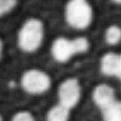
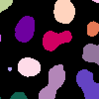

# Combining meausrements in tables

This notebook demonstrates how measurements from CLIJ2 methods can
be combined in ImageJs results tables.

Author: Robert Haase
January 2021

## Load example data

<pre class="highlight">
// clean up first
run("Close All");
run("Clear Results");

// Get test data
//run("Blobs (25K)");
open("C:/structure/data/blobs.tif");
getDimensions(width, height, channels, slices, frames);
input = getTitle();
makeRectangle(74, 44, 100, 100);
run("Crop");
</pre>

## Initialize GPU and segment the image

<pre class="highlight">
run("CLIJ2 Macro Extensions", "cl_device=");
Ext.<a href="https://clij.github.io/clij2-docs/reference_clear">CLIJ2_clear</a>();
Ext.<a href="https://clij.github.io/clij2-docs/reference_push">CLIJ2_push</a>(input);
Ext.<a href="https://clij.github.io/clij2-docs/reference_thresholdOtsu">CLIJ2_thresholdOtsu</a>(input, binary);
Ext.<a href="https://clij.github.io/clij2-docs/reference_connectedComponentsLabeling">CLIJ2_connectedComponentsLabeling</a>(binary, labels);
Ext.<a href="https://clij.github.io/clij2-docs/reference_pull">CLIJ2_pull</a>(labels);
run("glasbey_on_dark");
</pre>

## Measurements

We perform a measurement which results in a table. 
To keep the resulting example table simple, we delete all columns but IDENTIFIER and MEAN_INTENSITY.
Note, the first row corresponds to measurement resulting from label 0, corresponding to background.

<pre class="highlight">
// put many columns in
Ext.<a href="https://clij.github.io/clij2-docs/reference_statisticsOfBackgroundAndLabelledPixels">CLIJ2_statisticsOfBackgroundAndLabelledPixels</a>(input, labels);
// remove all columns but one
headings = split(Table.headings(), "	");
for (i = 0; i < lengthOf(headings); i++) {
	column_name = headings[i];
	if (column_name != "MEAN_INTENSITY" && column_name != "IDENTIFIER" && column_name != " ") {
		Table.deleteColumn(column_name);
	}
}
</pre>
<table>
<tr><th>IDENTIFIER</th><th>MEAN_INTENSITY</th></tr>
<tr><td>0</td><td>54.885</td></tr>
<tr><td>1</td><td>167.857</td></tr>
<tr><td>2</td><td>210.679</td></tr>
<tr><td>3</td><td>160.000</td></tr>
<tr><td>4</td><td>195.953</td></tr>
<tr><td>5</td><td>184.619</td></tr>
<tr><td>6</td><td>201.840</td></tr>
<tr><td>7</td><td>137.143</td></tr>
<tr><td>8</td><td>196.889</td></tr>
<tr><td>9</td><td>197.208</td></tr>
<tr><td>10</td><td>189.802</td></tr>
<tr><td>11</td><td>138.857</td></tr>
<tr><td>12</td><td>195.151</td></tr>
<tr><td>13</td><td>180.417</td></tr>
<tr><td>14</td><td>136.000</td></tr>
</table>

## Adding a column

We will now measure the centroid distance of every label to the 
nearest neighbor and put it in the table as a new column:

<pre class="highlight">
// determine nearest neighbor distance
Ext.<a href="https://clij.github.io/clij2-docs/reference_centroidsOfLabels">CLIJ2_centroidsOfLabels</a>(labels, centroids);
Ext.<a href="https://clij.github.io/clij2-docs/reference_generateDistanceMatrix">CLIJ2_generateDistanceMatrix</a>(centroids, centroids, distance_matrix);
Ext.<a href="https://clij.github.io/clij2-docs/reference_averageDistanceOfNClosestPoints">CLIJ2_averageDistanceOfNClosestPoints</a>(distance_matrix, distance_list, 1);

// save measurements to table in new column
append_new_rows = false;
Ext.CLIJx_pullToResultsTableColumn(distance_list, "nearest_neighbor_distance", append_new_rows);
</pre>
<table>
<tr><th>IDENTIFIER</th><th>MEAN_INTENSITY</th><th>nearest_neighbor_distance</th></tr>
<tr><td>0</td><td>54.885</td><td>0.000</td></tr>
<tr><td>1</td><td>167.857</td><td>32.002</td></tr>
<tr><td>2</td><td>210.679</td><td>29.744</td></tr>
<tr><td>3</td><td>160.000</td><td>28.212</td></tr>
<tr><td>4</td><td>195.953</td><td>26.458</td></tr>
<tr><td>5</td><td>184.619</td><td>24.928</td></tr>
<tr><td>6</td><td>201.840</td><td>29.744</td></tr>
<tr><td>7</td><td>137.143</td><td>26.458</td></tr>
<tr><td>8</td><td>196.889</td><td>24.928</td></tr>
<tr><td>9</td><td>197.208</td><td>19.415</td></tr>
<tr><td>10</td><td>189.802</td><td>29.255</td></tr>
<tr><td>11</td><td>138.857</td><td>19.415</td></tr>
<tr><td>12</td><td>195.151</td><td>31.551</td></tr>
<tr><td>13</td><td>180.417</td><td>18.719</td></tr>
<tr><td>14</td><td>136.000</td><td>18.719</td></tr>
</table>

We will now determine if labels are on the edge of the image and add
a column with 1 if the label touches an edge and 0 if not.

<pre class="highlight">
Ext.CLIJx_flagLabelsOnEdges(labels, flag_vector);

append_new_rows = false;
Ext.CLIJx_pullToResultsTableColumn(flag_vector, "is_on_image_edge", append_new_rows);
</pre>
<table>
<tr><th>IDENTIFIER</th><th>MEAN_INTENSITY</th><th>nearest_neighbor_distance</th><th>is_on_image_edge</th></tr>
<tr><td>0</td><td>54.885</td><td>0.000</td><td>1</td></tr>
<tr><td>1</td><td>167.857</td><td>32.002</td><td>1</td></tr>
<tr><td>2</td><td>210.679</td><td>29.744</td><td>1</td></tr>
<tr><td>3</td><td>160.000</td><td>28.212</td><td>1</td></tr>
<tr><td>4</td><td>195.953</td><td>26.458</td><td>0</td></tr>
<tr><td>5</td><td>184.619</td><td>24.928</td><td>1</td></tr>
<tr><td>6</td><td>201.840</td><td>29.744</td><td>0</td></tr>
<tr><td>7</td><td>137.143</td><td>26.458</td><td>1</td></tr>
<tr><td>8</td><td>196.889</td><td>24.928</td><td>1</td></tr>
<tr><td>9</td><td>197.208</td><td>19.415</td><td>0</td></tr>
<tr><td>10</td><td>189.802</td><td>29.255</td><td>1</td></tr>
<tr><td>11</td><td>138.857</td><td>19.415</td><td>0</td></tr>
<tr><td>12</td><td>195.151</td><td>31.551</td><td>1</td></tr>
<tr><td>13</td><td>180.417</td><td>18.719</td><td>1</td></tr>
<tr><td>14</td><td>136.000</td><td>18.719</td><td>1</td></tr>
</table>

Last but not least, we clean up GPU memory :-)

<pre class="highlight">
Ext.<a href="https://clij.github.io/clij2-docs/reference_clear">CLIJ2_clear</a>();

</pre>

