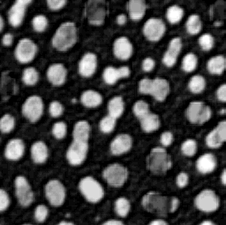

# Time tracing
Author: Robert Haase
April 2020

[Source](https://github.com/clij/clij2-docs/tree/master/src/main/macro/time_tracing.ijm)

This macro shows how to trace time of image processing workflows. 
When doing this, we can also see which filters underly operations such
as the top-hat filter.

When executing this script, execute it twice! 
You may observe that the second execution is faster because of the 
[warm-up effect](https://stackoverflow.com/questions/36198278/why-does-the-jvm-require-warmup).

<pre class="highlight">
// Cleanup first

run ("Close All");

// Get test data
run("Blobs (25K)");
run("Invert LUT");
input = getTitle();

</pre>

## Initialize GPU and push image to GPU memory

<pre class="highlight">
run("CLIJ2 Macro Extensions", "cl_device=");
Ext.CLIJ2_clear();

// push images to GPU
Ext.CLIJ2_push(input);

// CleanUp ImageJ
close();

</pre>

## Start time tracing
Before we run the actual workflow or filter, we start time tracing.

<pre class="highlight">
Ext.CLIJ2_startTimeTracing();

radius = 10;

Ext.<a href="https://clij.github.io/clij2-docs/reference_topHatBox">CLIJ2_topHatBox</a>(input, background_subtacted, radius, radius, 0);

// show result
Ext.CLIJ2_pull(background_subtacted);

</pre>

## Stop and inspect time tracing
After finishing the workflow, we can take a look at which operations called which other operations
and how long they took:

<pre class="highlight">
Ext.CLIJ2_stopTimeTracing();
Ext.CLIJ2_getTimeTracing(time_traces);
print(time_traces);

</pre>
<pre>
> > timeTracing
>  > TopHatBox
>   > Minimum2DBox
>   < Minimum2DBox                                              3.1902 ms
>   > Maximum2DBox
>   < Maximum2DBox                                              4.5699 ms
>   > SubtractImages
>   < SubtractImages                                            0.699 ms
>  < TopHatBox                                                  8.7592 ms
> < timeTracing                                                 113.9269 ms
>  
</pre>

For documentation purposes, we should also report which GPU was used

<pre class="highlight">
Ext.CLIJ2_getGPUProperties(gpu, memory, opencl_version);
print("GPU: " + gpu);
print("Memory in GB: " + (memory / 1024 / 1024 / 1024) );
print("OpenCL version: " + opencl_version);

</pre>
<pre>
> GPU: Intel(R) UHD Graphics 620
> Memory in GB: 6.3017
> OpenCL version: 2
</pre>

Cleanup by the end

<pre class="highlight">
Ext.CLIJ2_clear();
</pre>

