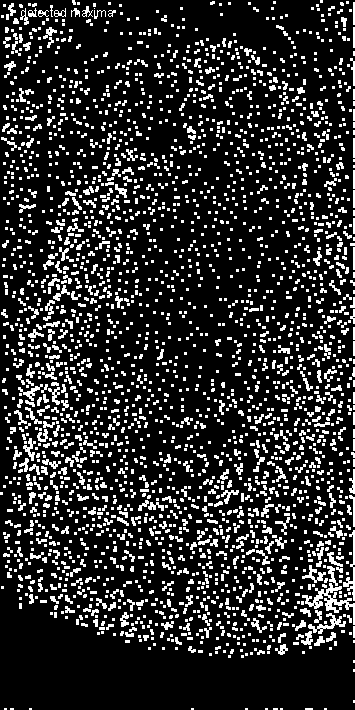
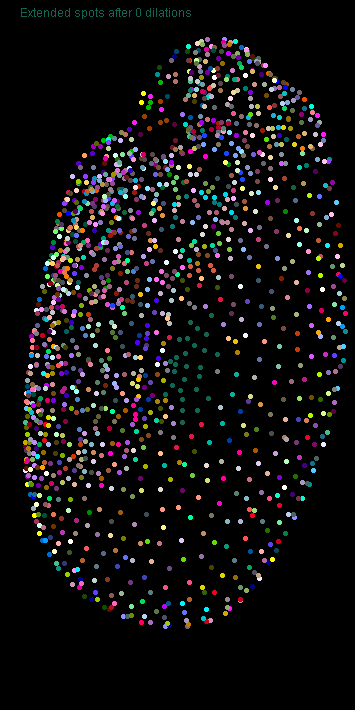
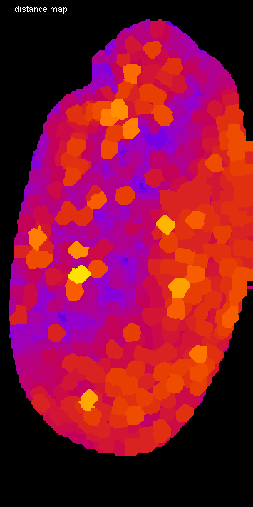
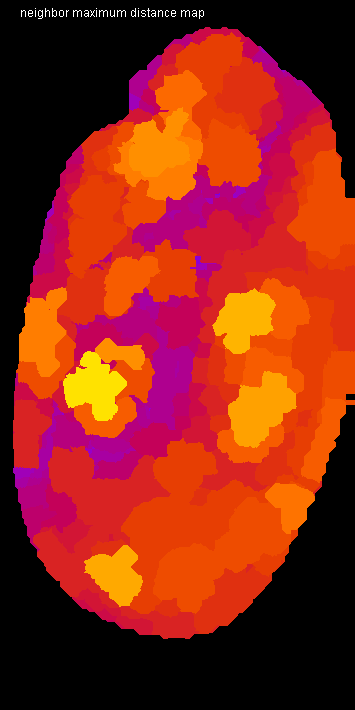

# Tribolium morphometry


Author: Robert Haase
        April 2020

This script is heavy GPU-accelerated processing. It is recommended to use a dedicated
graphics card with at least 8 GB of GDDR6 memory. It may otherwise be quite slow.

Let's initialize that graphics card and mesure the start time.

```java
run("CLIJ2 Macro Extensions", "cl_device=[GeForce RTX 2060 SUPER]");
Ext.CLIJ2_clear();

run("Close All");
time = getTime();
```

## Load a data set
The dataset is available [online](https://git.mpi-cbg.de/rhaase/neubias_academy_clij2/data/lund1051_resampled.tif). 
It shows a Tribolium castaneum embryo imaged using a custom light sheet microscope using a wavelength of 488nm. 
The data set has been resampled to a voxel size of 1x1x1 microns. The embryo expresses nuclei-GFP. We will use it for detecting nuclei and generating an estimated cell-segmentation first.

All processing steps are performed in 3D, for visualisation purposes, we're looking at maximum intensity projections in Z: 

```java
open("C:/structure/teaching/neubias_academy_clij2/data/lund1051_resampled.tif");
input = getTitle();

print("Loading took " + (getTime() - time) + " msec");

Ext.CLIJ2_push(input);
run("Close All");

// visualise the dataset
show(input, "input");
```
<pre>
> Loading took 249 msec
</pre>
<a href="image_1587408723644.png"></a>

## Spot detection
After some noise removal / smoothing, we perform local maximum detection:

```java
// gaussian blur
sigma = 2;
Ext.<a href="https://clij.github.io/clij2-docs/reference_gaussianBlur3D">CLIJ2_gaussianBlur3D</a>(input, blurred, sigma, sigma, sigma);

// detect maxima
radius = 2.0;
Ext.<a href="https://clij.github.io/clij2-docs/reference_detectMaximaBox">CLIJ2_detectMaximaBox</a>(blurred, detected_maxima, radius);
show_spots(detected_maxima, "detected maxima");
```
<a href="image_1587408724032.png"></a>

## Spot curation
We now remove spots which are below a certain intensity and label the remaining spots.

```java
// threshold
threshold = 300.0;
Ext.<a href="https://clij.github.io/clij2-docs/reference_threshold">CLIJ2_threshold</a>(blurred, thresholded, threshold);

// mask
Ext.<a href="https://clij.github.io/clij2-docs/reference_mask">CLIJ2_mask</a>(detected_maxima, thresholded, masked_spots);

// label spots
Ext.<a href="https://clij.github.io/clij2-docs/reference_labelSpots">CLIJ2_labelSpots</a>(masked_spots, labelled_spots);
show_spots(labelled_spots, "selected, labelled spots");
run("glasbey_on_dark");
```
<a href="image_1587408724363.png"></a>

Let's see how many spots are there:

```java
Ext.<a href="https://clij.github.io/clij2-docs/reference_getMaximumOfAllPixels">CLIJ2_getMaximumOfAllPixels</a>(labelled_spots, number_of_spots);
print("Number of detected spots: " + number_of_spots);
```
<pre>
> Number of detected spots: 1501
</pre>

## Expanding labelled spots
We next extend the numbered spots spatially by applying a maximum filter.

```java
// labelmap closing
number_of_dilations = 10;
number_of_erosions = 4;
Ext.<a href="https://clij.github.io/clij2-docs/reference_copy">CLIJ2_copy</a>(labelled_spots, flip);
for (i = 0; i < number_of_dilations; i++) {
	Ext.<a href="https://clij.github.io/clij2-docs/reference_onlyzeroOverwriteMaximumBox">CLIJ2_onlyzeroOverwriteMaximumBox</a>(flip, flop);
	Ext.<a href="https://clij.github.io/clij2-docs/reference_onlyzeroOverwriteMaximumDiamond">CLIJ2_onlyzeroOverwriteMaximumDiamond</a>(flop, flip);
	if (i % 2 == 0) {
		show(flip, "Extended spots after " + (i * 2) + " dilations");
		run("glasbey_on_dark");
	}
}
```
<a href="image_1587408724906.png"></a>
<a href="image_1587408724975.png"></a>
<a href="image_1587408725026.png"></a>
<a href="image_1587408725059.png"></a>
<a href="image_1587408725088.png"></a>

Afterwards, we erode the label map again and get the final result of the cell segementation

```java
Ext.<a href="https://clij.github.io/clij2-docs/reference_threshold">CLIJ2_threshold</a>(flip, flap, 1);
for (i = 0; i < number_of_erosions; i++) {
	Ext.<a href="https://clij.github.io/clij2-docs/reference_erodeBox">CLIJ2_erodeBox</a>(flap, flop);
	Ext.<a href="https://clij.github.io/clij2-docs/reference_erodeBox">CLIJ2_erodeBox</a>(flop, flap);
}
Ext.<a href="https://clij.github.io/clij2-docs/reference_mask">CLIJ2_mask</a>(flip, flap, labels);
show(labels, "cell segmentation");
run("glasbey_on_dark");
```
<a href="image_1587408725243.png"></a>

## Draw connectivity of the cells as mesh
We then read out the positions of the detected nuclei. 
Furthermore, using this pointlist, we can generate a distance matrix of all nuclei to each other:

```java
Ext.<a href="https://clij.github.io/clij2-docs/reference_labelledSpotsToPointList">CLIJ2_labelledSpotsToPointList</a>(labelled_spots, pointlist);
Ext.<a href="https://clij.github.io/clij2-docs/reference_generateDistanceMatrix">CLIJ2_generateDistanceMatrix</a>(pointlist, pointlist, distance_matrix);
show(distance_matrix, "distance matrix");
```
<a href="image_1587408725366.png"></a>

Starting from the label map of the cells, we can generate a touch matrix:

```java
Ext.<a href="https://clij.github.io/clij2-docs/reference_generateTouchMatrix">CLIJ2_generateTouchMatrix</a>(labels, touch_matrix);

// we set the first column in the touch matrix to zero because we want to ignore that spots touch the background (background label 0, first column)
Ext.<a href="https://clij.github.io/clij2-docs/reference_setColumn">CLIJ2_setColumn</a>(touch_matrix, 0, 0);
show_spots(touch_matrix, "touch matrix");
```
<a href="image_1587408726325.png"></a>

By element-wise multiplication of distance matrix and touch matrix, we know the length of 
each edge. We can use this information to draw a mesh with colour doing distance (between 0 and 50 micron):

```java
Ext.<a href="https://clij.github.io/clij2-docs/reference_multiplyImages">CLIJ2_multiplyImages</a>(touch_matrix, distance_matrix, touch_matrix_with_distances);
Ext.<a href="https://clij.github.io/clij2-docs/reference_getDimensions">CLIJ2_getDimensions</a>(input, width, height, depth);
Ext.CLIJ2_create3D(mesh, width, height, depth, 32);
Ext.<a href="https://clij.github.io/clij2-docs/reference_touchMatrixToMesh">CLIJ2_touchMatrixToMesh</a>(pointlist, touch_matrix_with_distances, mesh);
show(mesh, "distance mesh");
run("Green Fire Blue");
setMinAndMax(0, 50);
```
<a href="image_1587408726622.png"></a>

## Quantitative analysis of distances between neighbors
We next determine the averge distance between a node and all of its neighbors. Th result is
a vector with as many entries as nodes in the graph. We use this vector to colour-code the 
label map of the cell segmentation. This means, we replace label 1 with the average distance to 
node 1 and label 2 with the average distance to node 2.

```java
Ext.<a href="https://clij.github.io/clij2-docs/reference_averageDistanceOfTouchingNeighbors">CLIJ2_averageDistanceOfTouchingNeighbors</a>(distance_matrix, touch_matrix, distances_vector);
Ext.<a href="https://clij.github.io/clij2-docs/reference_replaceIntensities">CLIJ2_replaceIntensities</a>(labels, distances_vector, distance_map);
show(distance_map, "distance map");
run("Fire");
setMinAndMax(0, 50);

```
<a href="image_1587408726870.png"></a>

Now we measure the mean of the neighbors neighbord to their neigbors and visualise it as above.

```java
Ext.<a href="https://clij.github.io/clij2-docs/reference_meanOfTouchingNeighbors">CLIJ2_meanOfTouchingNeighbors</a>(distances_vector, touch_matrix, local_mean_distances_vector);
Ext.<a href="https://clij.github.io/clij2-docs/reference_replaceIntensities">CLIJ2_replaceIntensities</a>(labels, local_mean_distances_vector, local_mean_pixel_count_map);
show(local_mean_pixel_count_map, "neighbor mean distance map");
run("Fire");
setMinAndMax(0, 50);
```
<a href="image_1587408726995.png"></a>

We can do the same with minimum, median and maximum distances:

```java
Ext.<a href="https://clij.github.io/clij2-docs/reference_minimumOfTouchingNeighbors">CLIJ2_minimumOfTouchingNeighbors</a>(distances_vector, touch_matrix, local_minimum_distances_vector);
Ext.<a href="https://clij.github.io/clij2-docs/reference_replaceIntensities">CLIJ2_replaceIntensities</a>(labels, local_minimum_distances_vector, local_minimum_pixel_count_map);
show(local_minimum_pixel_count_map, "neighbor minimum distance map");
run("Fire");
setMinAndMax(0, 50);

Ext.<a href="https://clij.github.io/clij2-docs/reference_medianOfTouchingNeighbors">CLIJ2_medianOfTouchingNeighbors</a>(distances_vector, touch_matrix, local_median_distances_vector);
Ext.<a href="https://clij.github.io/clij2-docs/reference_replaceIntensities">CLIJ2_replaceIntensities</a>(labels, local_median_distances_vector, local_median_pixel_count_map);
show(local_median_pixel_count_map, "neighbor median distance map");
run("Fire");
setMinAndMax(0, 50);

Ext.<a href="https://clij.github.io/clij2-docs/reference_maximumOfTouchingNeighbors">CLIJ2_maximumOfTouchingNeighbors</a>(distances_vector, touch_matrix, local_maximum_distances_vector);
Ext.<a href="https://clij.github.io/clij2-docs/reference_replaceIntensities">CLIJ2_replaceIntensities</a>(labels, local_maximum_distances_vector, local_maximum_pixel_count_map);
show(local_maximum_pixel_count_map, "neighbor maximum distance map");
run("Fire");
setMinAndMax(0, 50);
```
<a href="image_1587408727291.png"></a>
<a href="image_1587408727338.png"></a>
<a href="image_1587408727386.png"></a>

# Performance evaluation
Finally a time measurement. Note that performing this workflow with ImageJ macro markdown is slower 
as intermediate results are save to disc.

```java
print("The whole workflow took " + (getTime() - time) + " msec");

```
<pre>
> The whole workflow took 4343 msec
</pre>

Also let's see how much memory this workflow used. Cleaning up by the end is also important.

```java
Ext.CLIJ2_reportMemory();

```
<pre>
> GPU contains 25 images.
> - CLIJ2_copy_result491[net.haesleinhuepf.clij.clearcl.ClearCLPeerPointer@69c4ce57] 204.8 Mb
> - CLIJ2_onlyzeroOverwriteMaximumBox_result492[net.haesleinhuepf.clij.clearcl.ClearCLPeerPointer@52e80c4a] 204.8 Mb
> - CLIJ2_minimumOfTouchingNeighbors_result516[net.haesleinhuepf.clij.clearcl.ClearCLPeerPointer@4b430331] 5.9 kb
> - CLIJ2_threshold_result486[net.haesleinhuepf.clij.clearcl.ClearCLPeerPointer@751492a2] 204.8 Mb
> - CLIJ2_mask_result487[net.haesleinhuepf.clij.clearcl.ClearCLPeerPointer@3a6d4c21] 204.8 Mb
> - CLIJ2_meanOfTouchingNeighbors_result513[net.haesleinhuepf.clij.clearcl.ClearCLPeerPointer@28f59d7a] 5.9 kb
> - CLIJ2_replaceIntensities_result517[net.haesleinhuepf.clij.clearcl.ClearCLPeerPointer@7bfc49de] 204.8 Mb
> - CLIJ2_averageDistanceOfTouchingNeighbors_result510[net.haesleinhuepf.clij.clearcl.ClearCLPeerPointer@2a2c4581] 5.9 kb
> - CLIJ2_replaceIntensities_result514[net.haesleinhuepf.clij.clearcl.ClearCLPeerPointer@7a7008a1] 204.8 Mb
> - CLIJ2_medianOfTouchingNeighbors_result519[net.haesleinhuepf.clij.clearcl.ClearCLPeerPointer@7eea54d8] 5.9 kb
> - CLIJ2_replaceIntensities_result511[net.haesleinhuepf.clij.clearcl.ClearCLPeerPointer@67c14062] 204.8 Mb
> - CLIJ2_labelledSpotsToPointList_result501[net.haesleinhuepf.clij.clearcl.ClearCLPeerPointer@2f890156] 17.6 kb
> - CLIJ2_create3D_result508[net.haesleinhuepf.clij.clearcl.ClearCLPeerPointer@55463106] 204.8 Mb
> - CLIJ2_generateTouchMatrix_result504[net.haesleinhuepf.clij.clearcl.ClearCLPeerPointer@79a6f3e2] 8.6 Mb
> - CLIJ2_generateDistanceMatrix_result502[net.haesleinhuepf.clij.clearcl.ClearCLPeerPointer@14096ee4] 8.6 Mb
> - CLIJ2_gaussianBlur3D_result482[net.haesleinhuepf.clij.clearcl.ClearCLPeerPointer@73ed5e82] 204.8 Mb
> - CLIJ2_threshold_result498[net.haesleinhuepf.clij.clearcl.ClearCLPeerPointer@17c79ff8] 204.8 Mb
> - CLIJ2_maximumOfTouchingNeighbors_result522[net.haesleinhuepf.clij.clearcl.ClearCLPeerPointer@59b05701] 5.9 kb
> - CLIJ2_mask_result499[net.haesleinhuepf.clij.clearcl.ClearCLPeerPointer@6917c9d] 204.8 Mb
> - lund1051_resampled.tif[net.haesleinhuepf.clij.clearcl.ClearCLPeerPointer@1f913b83] 204.8 Mb
> - CLIJ2_labelSpots_result488[net.haesleinhuepf.clij.clearcl.ClearCLPeerPointer@4e184c1a] 204.8 Mb
> - CLIJ2_replaceIntensities_result523[net.haesleinhuepf.clij.clearcl.ClearCLPeerPointer@34024fd6] 204.8 Mb
> - CLIJ2_replaceIntensities_result520[net.haesleinhuepf.clij.clearcl.ClearCLPeerPointer@6f511e08] 204.8 Mb
> - CLIJ2_multiplyImages_result507[net.haesleinhuepf.clij.clearcl.ClearCLPeerPointer@6229f2eb] 8.6 Mb
> - CLIJ2_detectMaximaBox_result483[net.haesleinhuepf.clij.clearcl.ClearCLPeerPointer@7472900e] 204.8 Mb
> = 3.2 Gb
>  
</pre>

The following are convienence methods for proper visualisation in a noteboook:

```java
function show(input, text) {
	Ext.<a href="https://clij.github.io/clij2-docs/reference_maximumZProjection">CLIJ2_maximumZProjection</a>(input, max_projection);
	Ext.CLIJ2_pull(max_projection);
	setColor(100000);
	drawString(text, 20, 20);
	Ext.CLIJ2_release(max_projection);
}

function show_spots(input, text) {
	Ext.<a href="https://clij.github.io/clij2-docs/reference_maximum3DBox">CLIJ2_maximum3DBox</a>(input, extended, 1, 1, 0);
	Ext.<a href="https://clij.github.io/clij2-docs/reference_maximumZProjection">CLIJ2_maximumZProjection</a>(extended, max_projection);
	Ext.CLIJ2_pull(max_projection);
	setColor(100000);
	drawString(text, 20, 20);
	Ext.CLIJ2_release(extended);
	Ext.CLIJ2_release(max_projection);
}
```


```
```
