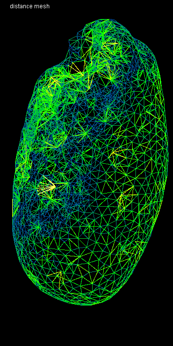

# Tribolium embryo morphometry
Author: Robert Haase
        April 2020

[Source](https://github.com/clij/clij2-docs/tree/master/src/main/macro/tribolium_morphometry.ijm)

This script is heavy GPU-accelerated processing. It is recommended to use a dedicated
graphics card with at least 8 GB of GDDR6 memory. It may otherwise be quite slow.

Let's initialize that graphics card and mesure the start time.

<pre class="highlight">
run("CLIJ2 Macro Extensions", "cl_device=[GeForce RTX 2060 SUPER]");
Ext.CLIJ2_clear();

run("Close All");
time = getTime();
Ext.CLIJ2_startTimeTracing();
</pre>

## Load a data set
The dataset is available [online](https://git.mpi-cbg.de/rhaase/neubias_academy_clij2/blob/master/data/lund1051_resampled.tif).
It shows a Tribolium castaneum embryo imaged using a custom light sheet microscope using a wavelength of 488nm. 
The data set has been resampled to a voxel size of 1x1x1 microns. The embryo expresses nuclei-GFP. We will use it for detecting nuclei and generating an estimated cell-segmentation first.

All processing steps are performed in 3D, for visualisation purposes, we're looking at maximum intensity projections in Z: 

<pre class="highlight">
open("C:/structure/teaching/neubias_academy_clij2/data/lund1051_resampled.tif");
input = getTitle();

print("Loading took " + (getTime() - time) + " msec");

Ext.CLIJ2_push(input);
run("Close All");

// visualise the dataset
show(input, "input");
</pre>
<pre>
> Loading took 314 msec
</pre>

## Spot detection
After some noise removal / smoothing, we perform local maximum detection:

<pre class="highlight">
// gaussian blur
sigma = 2;
Ext.<a href="https://clij.github.io/clij2-docs/reference_gaussianBlur3D">CLIJ2_gaussianBlur3D</a>(input, blurred, sigma, sigma, sigma);

// detect maxima
radius = 2.0;
Ext.<a href="https://clij.github.io/clij2-docs/reference_detectMaximaBox">CLIJ2_detectMaximaBox</a>(blurred, detected_maxima, radius);
show_spots(detected_maxima, "detected maxima");
</pre>

## Spot curation
We now remove spots which are below a certain intensity and label the remaining spots.

<pre class="highlight">
// threshold
threshold = 300.0;
Ext.<a href="https://clij.github.io/clij2-docs/reference_threshold">CLIJ2_threshold</a>(blurred, thresholded, threshold);

// mask
Ext.<a href="https://clij.github.io/clij2-docs/reference_mask">CLIJ2_mask</a>(detected_maxima, thresholded, masked_spots);

// label spots
Ext.<a href="https://clij.github.io/clij2-docs/reference_labelSpots">CLIJ2_labelSpots</a>(masked_spots, labelled_spots);
show_spots(labelled_spots, "selected, labelled spots");
run("glasbey_on_dark");
</pre>

Let's see how many spots are there:

<pre class="highlight">
Ext.<a href="https://clij.github.io/clij2-docs/reference_getMaximumOfAllPixels">CLIJ2_getMaximumOfAllPixels</a>(labelled_spots, number_of_spots);
print("Number of detected spots: " + number_of_spots);
</pre>
<pre>
> Number of detected spots: 1501
</pre>

## Expanding labelled spots
We next extend the numbered spots spatially by applying a maximum filter.

<pre class="highlight">
// labelmap closing
number_of_dilations = 10;
number_of_erosions = 4;
Ext.<a href="https://clij.github.io/clij2-docs/reference_copy">CLIJ2_copy</a>(labelled_spots, flip);
for (i = 0; i < number_of_dilations; i++) {
	Ext.<a href="https://clij.github.io/clij2-docs/reference_onlyzeroOverwriteMaximumBox">CLIJ2_onlyzeroOverwriteMaximumBox</a>(flip, flop);
	Ext.<a href="https://clij.github.io/clij2-docs/reference_onlyzeroOverwriteMaximumDiamond">CLIJ2_onlyzeroOverwriteMaximumDiamond</a>(flop, flip);
	if (i % 2 == 0) {
		show(flip, "Extended spots after " + (i * 2) + " dilations");
		run("glasbey_on_dark");
	}
}
</pre>

Afterwards, we erode the label map again and get the final result of the cell segementation

<pre class="highlight">
Ext.<a href="https://clij.github.io/clij2-docs/reference_threshold">CLIJ2_threshold</a>(flip, flap, 1);
for (i = 0; i < number_of_erosions; i++) {
	Ext.<a href="https://clij.github.io/clij2-docs/reference_erodeBox">CLIJ2_erodeBox</a>(flap, flop);
	Ext.<a href="https://clij.github.io/clij2-docs/reference_erodeBox">CLIJ2_erodeBox</a>(flop, flap);
}
Ext.<a href="https://clij.github.io/clij2-docs/reference_mask">CLIJ2_mask</a>(flip, flap, labels);
show(labels, "cell segmentation");
run("glasbey_on_dark");
</pre>

## Draw connectivity of the cells as mesh
We then read out the positions of the detected nuclei. 
Furthermore, using this pointlist, we can generate a distance matrix of all nuclei to each other:

<pre class="highlight">
Ext.<a href="https://clij.github.io/clij2-docs/reference_labelledSpotsToPointList">CLIJ2_labelledSpotsToPointList</a>(labelled_spots, pointlist);
Ext.<a href="https://clij.github.io/clij2-docs/reference_generateDistanceMatrix">CLIJ2_generateDistanceMatrix</a>(pointlist, pointlist, distance_matrix);
show(distance_matrix, "distance matrix");
</pre>

Starting from the label map of the cells, we can generate a touch matrix:

<pre class="highlight">
Ext.<a href="https://clij.github.io/clij2-docs/reference_generateTouchMatrix">CLIJ2_generateTouchMatrix</a>(labels, touch_matrix);

// we set the first column in the touch matrix to zero because we want to ignore that spots touch the background (background label 0, first column)
Ext.<a href="https://clij.github.io/clij2-docs/reference_setColumn">CLIJ2_setColumn</a>(touch_matrix, 0, 0);
show_spots(touch_matrix, "touch matrix");
</pre>

By element-wise multiplication of distance matrix and touch matrix, we know the length of 
each edge. We can use this information to draw a mesh with colour doing distance (between 0 and 50 micron):

<pre class="highlight">
Ext.<a href="https://clij.github.io/clij2-docs/reference_multiplyImages">CLIJ2_multiplyImages</a>(touch_matrix, distance_matrix, touch_matrix_with_distances);
Ext.<a href="https://clij.github.io/clij2-docs/reference_getDimensions">CLIJ2_getDimensions</a>(input, width, height, depth);
Ext.CLIJ2_create3D(mesh, width, height, depth, 32);
Ext.<a href="https://clij.github.io/clij2-docs/reference_touchMatrixToMesh">CLIJ2_touchMatrixToMesh</a>(pointlist, touch_matrix_with_distances, mesh);
show(mesh, "distance mesh");
run("Green Fire Blue");
setMinAndMax(0, 50);
</pre>

## Quantitative analysis of distances between neighbors
We next determine the averge distance between a node and all of its neighbors. Th result is
a vector with as many entries as nodes in the graph. We use this vector to colour-code the 
label map of the cell segmentation. This means, we replace label 1 with the average distance to 
node 1 and label 2 with the average distance to node 2.

<pre class="highlight">
Ext.<a href="https://clij.github.io/clij2-docs/reference_averageDistanceOfTouchingNeighbors">CLIJ2_averageDistanceOfTouchingNeighbors</a>(distance_matrix, touch_matrix, distances_vector);
Ext.<a href="https://clij.github.io/clij2-docs/reference_replaceIntensities">CLIJ2_replaceIntensities</a>(labels, distances_vector, distance_map);
show(distance_map, "distance map");
run("Fire");
setMinAndMax(0, 50);

</pre>

Now we measure the mean of the neighbors neighbord to their neigbors and visualise it as above.

<pre class="highlight">
Ext.<a href="https://clij.github.io/clij2-docs/reference_meanOfTouchingNeighbors">CLIJ2_meanOfTouchingNeighbors</a>(distances_vector, touch_matrix, local_mean_distances_vector);
Ext.<a href="https://clij.github.io/clij2-docs/reference_replaceIntensities">CLIJ2_replaceIntensities</a>(labels, local_mean_distances_vector, local_mean_pixel_count_map);
show(local_mean_pixel_count_map, "neighbor mean distance map");
run("Fire");
setMinAndMax(0, 50);
</pre>

We can do the same with minimum, median and maximum distances:

<pre class="highlight">
Ext.<a href="https://clij.github.io/clij2-docs/reference_minimumOfTouchingNeighbors">CLIJ2_minimumOfTouchingNeighbors</a>(distances_vector, touch_matrix, local_minimum_distances_vector);
Ext.<a href="https://clij.github.io/clij2-docs/reference_replaceIntensities">CLIJ2_replaceIntensities</a>(labels, local_minimum_distances_vector, local_minimum_pixel_count_map);
show(local_minimum_pixel_count_map, "neighbor minimum distance map");
run("Fire");
setMinAndMax(0, 50);

Ext.<a href="https://clij.github.io/clij2-docs/reference_medianOfTouchingNeighbors">CLIJ2_medianOfTouchingNeighbors</a>(distances_vector, touch_matrix, local_median_distances_vector);
Ext.<a href="https://clij.github.io/clij2-docs/reference_replaceIntensities">CLIJ2_replaceIntensities</a>(labels, local_median_distances_vector, local_median_pixel_count_map);
show(local_median_pixel_count_map, "neighbor median distance map");
run("Fire");
setMinAndMax(0, 50);

Ext.<a href="https://clij.github.io/clij2-docs/reference_maximumOfTouchingNeighbors">CLIJ2_maximumOfTouchingNeighbors</a>(distances_vector, touch_matrix, local_maximum_distances_vector);
Ext.<a href="https://clij.github.io/clij2-docs/reference_replaceIntensities">CLIJ2_replaceIntensities</a>(labels, local_maximum_distances_vector, local_maximum_pixel_count_map);
show(local_maximum_pixel_count_map, "neighbor maximum distance map");
run("Fire");
setMinAndMax(0, 50);
</pre>

## Performance evaluation
Finally a time measurement. Note that performing this workflow with ImageJ macro markdown is slower 
as intermediate results are save to disc.

<pre class="highlight">
print("The whole workflow took " + (getTime() - time) + " msec");

</pre>
<pre>
> The whole workflow took 4514 msec
</pre>

### Detailed time tracing for all operations

<pre class="highlight">
Ext.CLIJ2_stopTimeTracing();
Ext.CLIJ2_getTimeTracing(time_traces);
print(time_traces);

</pre>
<pre>
> > timeTracing
>  > MaximumZProjection
>  < MaximumZProjection                                         1.976 ms
>  > Copy
>  < Copy                                                       9.2935 ms
>  > GaussianBlur3D
>  < GaussianBlur3D                                             52.4937 ms
>  > DetectMaximaBox
>  < DetectMaximaBox                                            46.9902 ms
>  > Maximum3DBox
>   > Copy
>   < Copy                                                      8.9676 ms
>  < Maximum3DBox                                               35.3107 ms
>  > MaximumZProjection
>  < MaximumZProjection                                         1.2515 ms
>  > Threshold
>   > GreaterOrEqualConstant
>   < GreaterOrEqualConstant                                    8.3245 ms
>  < Threshold                                                  8.3358 ms
>  > Mask
>  < Mask                                                       8.2521 ms
>  > LabelSpots
>   > SumXProjection
>   < SumXProjection                                            4.4547 ms
>   > SumYProjection
>   < SumYProjection                                            0.85 ms
>  < LabelSpots                                                 29.9039 ms
>  > Maximum3DBox
>   > Copy
>   < Copy                                                      8.5447 ms
>  < Maximum3DBox                                               34.7372 ms
>  > MaximumZProjection
>  < MaximumZProjection                                         1.3535 ms
>  > GetMaximumOfAllPixels
>   > MaximumOfAllPixels
>    > MaximumZProjection
>    < MaximumZProjection                                       1.5169 ms
>    > MaximumYProjection
>    < MaximumYProjection                                       0.4589 ms
>    > MaximumXProjection
>    < MaximumXProjection                                       0.3648 ms
>   < MaximumOfAllPixels                                        3.0058 ms
>  < GetMaximumOfAllPixels                                      3.0134 ms
>  > Copy
>  < Copy                                                       8.1798 ms
>  > OnlyzeroOverwriteMaximumBox
>  < OnlyzeroOverwriteMaximumBox                                12.4976 ms
>  > OnlyzeroOverwriteMaximumDiamond
>  < OnlyzeroOverwriteMaximumDiamond                            3.4574 ms
>  > MaximumZProjection
>  < MaximumZProjection                                         1.2882 ms
>  > OnlyzeroOverwriteMaximumBox
>  < OnlyzeroOverwriteMaximumBox                                5.8637 ms
>  > OnlyzeroOverwriteMaximumDiamond
>  < OnlyzeroOverwriteMaximumDiamond                            4.1556 ms
>  > OnlyzeroOverwriteMaximumBox
>  < OnlyzeroOverwriteMaximumBox                                5.8008 ms
>  > OnlyzeroOverwriteMaximumDiamond
>  < OnlyzeroOverwriteMaximumDiamond                            3.4836 ms
>  > MaximumZProjection
>  < MaximumZProjection                                         1.6263 ms
>  > OnlyzeroOverwriteMaximumBox
>  < OnlyzeroOverwriteMaximumBox                                6.2615 ms
>  > OnlyzeroOverwriteMaximumDiamond
>  < OnlyzeroOverwriteMaximumDiamond                            3.9589 ms
>  > OnlyzeroOverwriteMaximumBox
>  < OnlyzeroOverwriteMaximumBox                                6.674 ms
>  > OnlyzeroOverwriteMaximumDiamond
>  < OnlyzeroOverwriteMaximumDiamond                            3.4196 ms
>  > MaximumZProjection
>  < MaximumZProjection                                         1.2481 ms
>  > OnlyzeroOverwriteMaximumBox
>  < OnlyzeroOverwriteMaximumBox                                5.8067 ms
>  > OnlyzeroOverwriteMaximumDiamond
>  < OnlyzeroOverwriteMaximumDiamond                            3.8291 ms
>  > OnlyzeroOverwriteMaximumBox
>  < OnlyzeroOverwriteMaximumBox                                6.0439 ms
>  > OnlyzeroOverwriteMaximumDiamond
>  < OnlyzeroOverwriteMaximumDiamond                            3.5083 ms
>  > MaximumZProjection
>  < MaximumZProjection                                         1.367 ms
>  > OnlyzeroOverwriteMaximumBox
>  < OnlyzeroOverwriteMaximumBox                                5.8064 ms
>  > OnlyzeroOverwriteMaximumDiamond
>  < OnlyzeroOverwriteMaximumDiamond                            3.357 ms
>  > OnlyzeroOverwriteMaximumBox
>  < OnlyzeroOverwriteMaximumBox                                6.1368 ms
>  > OnlyzeroOverwriteMaximumDiamond
>  < OnlyzeroOverwriteMaximumDiamond                            3.3575 ms
>  > MaximumZProjection
>  < MaximumZProjection                                         1.1684 ms
>  > OnlyzeroOverwriteMaximumBox
>  < OnlyzeroOverwriteMaximumBox                                5.3341 ms
>  > OnlyzeroOverwriteMaximumDiamond
>  < OnlyzeroOverwriteMaximumDiamond                            3.9266 ms
>  > Threshold
>   > GreaterOrEqualConstant
>   < GreaterOrEqualConstant                                    8.3773 ms
>  < Threshold                                                  8.393 ms
>  > ErodeBox
>  < ErodeBox                                                   4.9311 ms
>  > ErodeBox
>  < ErodeBox                                                   5.2055 ms
>  > ErodeBox
>  < ErodeBox                                                   4.3919 ms
>  > ErodeBox
>  < ErodeBox                                                   4.1747 ms
>  > ErodeBox
>  < ErodeBox                                                   4.0757 ms
>  > ErodeBox
>  < ErodeBox                                                   4.0453 ms
>  > ErodeBox
>  < ErodeBox                                                   3.8684 ms
>  > ErodeBox
>  < ErodeBox                                                   4.0242 ms
>  > Mask
>  < Mask                                                       8.7965 ms
>  > MaximumZProjection
>  < MaximumZProjection                                         1.5649 ms
>  > LabelledSpotsToPointList
>  < LabelledSpotsToPointList                                   2.7089 ms
>  > GenerateDistanceMatrix
>  < GenerateDistanceMatrix                                     2.115 ms
>  > MaximumZProjection
>  < MaximumZProjection                                         1.1656 ms
>  > GenerateTouchMatrix
>   > Set
>   < Set                                                       1.4424 ms
>  < GenerateTouchMatrix                                        5.1694 ms
>  > SetColumn
>  < SetColumn                                                  0.4158 ms
>  > Maximum3DBox
>  < Maximum3DBox                                               2.8135 ms
>  > MaximumZProjection
>  < MaximumZProjection                                         1.0497 ms
>  > MultiplyImages
>  < MultiplyImages                                             1.5521 ms
>  > GetDimensions
>  < GetDimensions                                              0.0072 ms
>  > TouchMatrixToMesh
>  < TouchMatrixToMesh                                          9.6596 ms
>  > MaximumZProjection
>  < MaximumZProjection                                         0.9003 ms
>  > AverageDistanceOfTouchingNeighbors
>  < AverageDistanceOfTouchingNeighbors                         1.2294 ms
>  > ReplaceIntensities
>  < ReplaceIntensities                                         10.1926 ms
>  > MaximumZProjection
>  < MaximumZProjection                                         1.3714 ms
>  > MeanOfTouchingNeighbors
>  < MeanOfTouchingNeighbors                                    1.3671 ms
>  > ReplaceIntensities
>  < ReplaceIntensities                                         10.2983 ms
>  > MaximumZProjection
>  < MaximumZProjection                                         1.0356 ms
>  > MinimumOfTouchingNeighbors
>  < MinimumOfTouchingNeighbors                                 1.4962 ms
>  > ReplaceIntensities
>  < ReplaceIntensities                                         10.0332 ms
>  > MaximumZProjection
>  < MaximumZProjection                                         0.8838 ms
>  > MedianOfTouchingNeighbors
>  < MedianOfTouchingNeighbors                                  1.3002 ms
>  > ReplaceIntensities
>  < ReplaceIntensities                                         10.4358 ms
>  > MaximumZProjection
>  < MaximumZProjection                                         1.2201 ms
>  > MaximumOfTouchingNeighbors
>  < MaximumOfTouchingNeighbors                                 1.3442 ms
>  > ReplaceIntensities
>  < ReplaceIntensities                                         10.7161 ms
>  > MaximumZProjection
>  < MaximumZProjection                                         0.9276 ms
> < timeTracing                                                 4518.4064 ms
>  
</pre>

Also let's see how much memory this workflow used. Cleaning up by the end is also important.

<pre class="highlight">
Ext.CLIJ2_reportMemory();

// clean up finally.
Ext.CLIJ2_clear();

</pre>
<pre>
> GPU contains 25 images.
> - CLIJ2_replaceIntensities_result87[net.haesleinhuepf.clij.clearcl.ClearCLPeerPointer@58592be3] 204.8 Mb
> - CLIJ2_labelSpots_result61[net.haesleinhuepf.clij.clearcl.ClearCLPeerPointer@73a0737a] 204.8 Mb
> - CLIJ2_mask_result72[net.haesleinhuepf.clij.clearcl.ClearCLPeerPointer@14135853] 204.8 Mb
> - CLIJ2_replaceIntensities_result84[net.haesleinhuepf.clij.clearcl.ClearCLPeerPointer@3089928f] 204.8 Mb
> - CLIJ2_copy_result64[net.haesleinhuepf.clij.clearcl.ClearCLPeerPointer@3c1ee0b9] 204.8 Mb
> - CLIJ2_gaussianBlur3D_result55[net.haesleinhuepf.clij.clearcl.ClearCLPeerPointer@2d09d2ea] 204.8 Mb
> - CLIJ2_maximumOfTouchingNeighbors_result95[net.haesleinhuepf.clij.clearcl.ClearCLPeerPointer@23d6c6d8] 5.9 kb
> - CLIJ2_averageDistanceOfTouchingNeighbors_result83[net.haesleinhuepf.clij.clearcl.ClearCLPeerPointer@5fb735c7] 5.9 kb
> - CLIJ2_generateDistanceMatrix_result75[net.haesleinhuepf.clij.clearcl.ClearCLPeerPointer@14670da0] 8.6 Mb
> - CLIJ2_detectMaximaBox_result56[net.haesleinhuepf.clij.clearcl.ClearCLPeerPointer@779a0344] 204.8 Mb
> - CLIJ2_replaceIntensities_result90[net.haesleinhuepf.clij.clearcl.ClearCLPeerPointer@62effb69] 204.8 Mb
> - CLIJ2_mask_result60[net.haesleinhuepf.clij.clearcl.ClearCLPeerPointer@410e3fe] 204.8 Mb
> - CLIJ2_onlyzeroOverwriteMaximumBox_result65[net.haesleinhuepf.clij.clearcl.ClearCLPeerPointer@28b6f4d1] 204.8 Mb
> - CLIJ2_threshold_result71[net.haesleinhuepf.clij.clearcl.ClearCLPeerPointer@f1152a0] 204.8 Mb
> - CLIJ2_replaceIntensities_result93[net.haesleinhuepf.clij.clearcl.ClearCLPeerPointer@1238d498] 204.8 Mb
> - CLIJ2_replaceIntensities_result96[net.haesleinhuepf.clij.clearcl.ClearCLPeerPointer@1134ca32] 204.8 Mb
> - lund1051_resampled.tif[net.haesleinhuepf.clij.clearcl.ClearCLPeerPointer@ebba4b9] 204.8 Mb
> - CLIJ2_multiplyImages_result80[net.haesleinhuepf.clij.clearcl.ClearCLPeerPointer@bba639c] 8.6 Mb
> - CLIJ2_threshold_result59[net.haesleinhuepf.clij.clearcl.ClearCLPeerPointer@5ff2ea67] 204.8 Mb
> - CLIJ2_medianOfTouchingNeighbors_result92[net.haesleinhuepf.clij.clearcl.ClearCLPeerPointer@6820cef1] 5.9 kb
> - CLIJ2_minimumOfTouchingNeighbors_result89[net.haesleinhuepf.clij.clearcl.ClearCLPeerPointer@3bed3120] 5.9 kb
> - CLIJ2_create3D_result81[net.haesleinhuepf.clij.clearcl.ClearCLPeerPointer@63931342] 204.8 Mb
> - CLIJ2_meanOfTouchingNeighbors_result86[net.haesleinhuepf.clij.clearcl.ClearCLPeerPointer@2b7a7c85] 5.9 kb
> - CLIJ2_generateTouchMatrix_result77[net.haesleinhuepf.clij.clearcl.ClearCLPeerPointer@4543785d] 8.6 Mb
> - CLIJ2_labelledSpotsToPointList_result74[net.haesleinhuepf.clij.clearcl.ClearCLPeerPointer@177535e4] 17.6 kb
> = 3.2 Gb
>  
</pre>

The following are convienence methods for proper visualisation in a noteboook:

<pre class="highlight">
function show(input, text) {
	Ext.<a href="https://clij.github.io/clij2-docs/reference_maximumZProjection">CLIJ2_maximumZProjection</a>(input, max_projection);
	Ext.CLIJ2_pull(max_projection);
	setColor(100000);
	drawString(text, 20, 20);
	Ext.CLIJ2_release(max_projection);
}

function show_spots(input, text) {
	Ext.<a href="https://clij.github.io/clij2-docs/reference_maximum3DBox">CLIJ2_maximum3DBox</a>(input, extended, 1, 1, 0);
	Ext.<a href="https://clij.github.io/clij2-docs/reference_maximumZProjection">CLIJ2_maximumZProjection</a>(extended, max_projection);
	Ext.CLIJ2_pull(max_projection);
	setColor(100000);
	drawString(text, 20, 20);
	Ext.CLIJ2_release(extended);
	Ext.CLIJ2_release(max_projection);
}
</pre>

