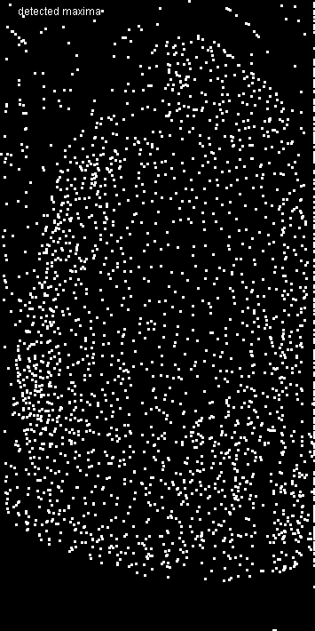
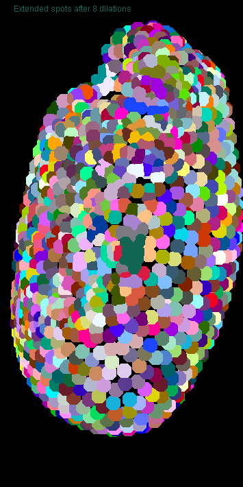
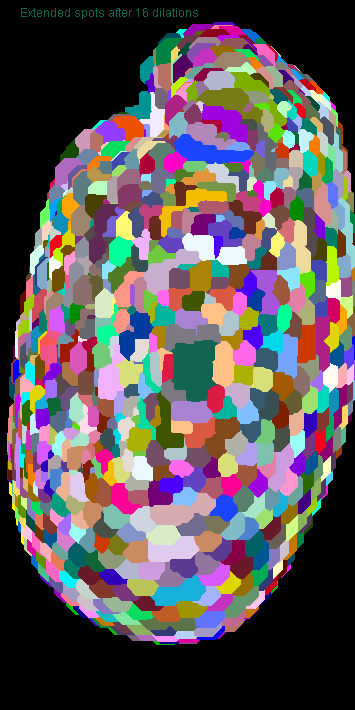
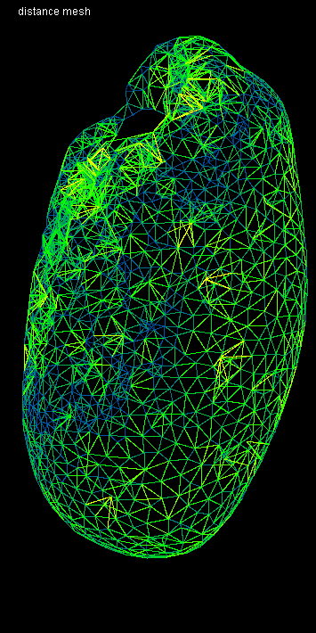
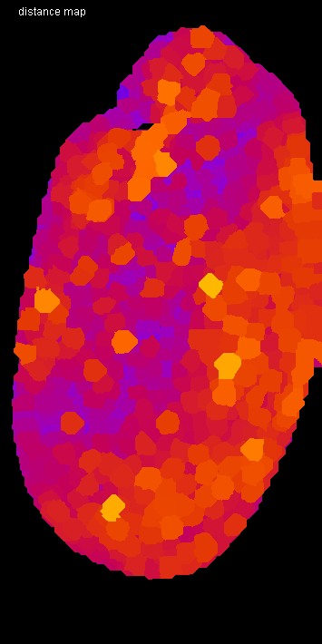
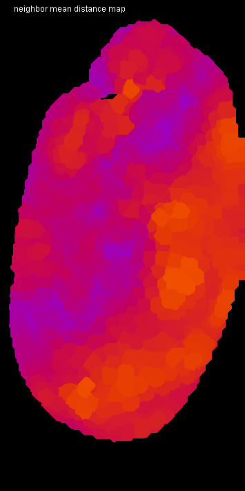
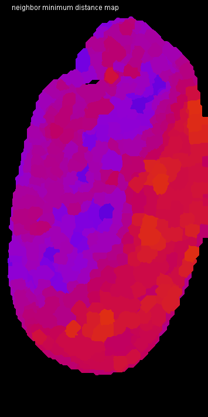
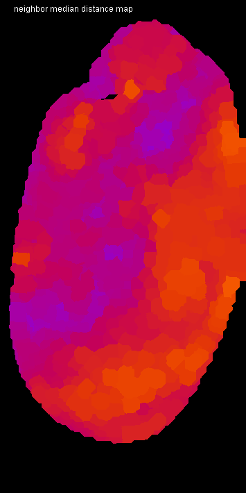
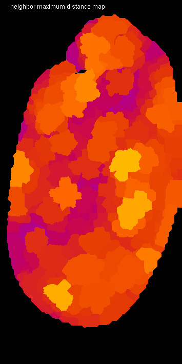

# Tribolium embryo morphometry
Authors: Robert Haase, Daniela Vorkel, April 2020

[Source](https://github.com/clij/clij2-docs/tree/master/src/main/macro/tribolium_morphometry.ijm)

This script is an example of heavy GPU-accelerated processing. It is recommended to use a dedicated
graphics card with at least 8 GB of GDDR6 memory. Otherwise, it may be quite slow.

Let's initialize that graphics card and mesure the start time.

<pre class="highlight">
run("CLIJ2 Macro Extensions", "cl_device=[GeForce RTX 2060 SUPER]");
Ext.<a href="https://clij.github.io/clij2-docs/reference_clear">CLIJ2_clear</a>();

run("Close All");
time = getTime();
Ext.CLIJ2_startTimeTracing();
</pre>

## Load a data set
The dataset is available [online](https://git.mpi-cbg.de/rhaase/clij2_example_data/blob/master/lund1051_resampled.tif).
It shows a *Tribolium castaneum* embryo, imaged by a custom light sheet microscope, at a wavelength of 488nm (Imaging credits: Daniela Vorkel, Myers lab, MPI CBG). 
The data set has been resampled to a voxel size of 1x1x1 microns. The embryo expresses nuclei-GFP. We will use the dataset to detect nuclei and to generate an estimated cell-segmentation.

All processing steps are performed in 3D space. For visualization purpose, we are using the maximum intensity projection in Z: 

<pre class="highlight">
path = "C:/structure/teaching/clij2_example_data/";
open(path + "lund1051_resampled.tif");
input = getTitle();

print("Loading took " + (getTime() - time) + " msec");

Ext.<a href="https://clij.github.io/clij2-docs/reference_push">CLIJ2_push</a>(input);
run("Close All");

// visualize the dataset
show(input, "input");
</pre>
<pre>
> Loading took 265 msec
</pre>

## Spot detection
After some noise removal/smoothing, we perform a local maximum detection:

<pre class="highlight">
// gaussian blur
sigma = 2;
Ext.<a href="https://clij.github.io/clij2-docs/reference_gaussianBlur3D">CLIJ2_gaussianBlur3D</a>(input, blurred, sigma, sigma, sigma);

// detect maxima
radius = 2.0;
Ext.<a href="https://clij.github.io/clij2-docs/reference_detectMaximaBox">CLIJ2_detectMaximaBox</a>(blurred, detected_maxima, radius);
show_spots(detected_maxima, "detected maxima");
</pre>

## Spot curation
Now, we remove spots with values below a certain intensity and label the remaining spots.

<pre class="highlight">
// threshold
threshold = 300.0;
Ext.<a href="https://clij.github.io/clij2-docs/reference_threshold">CLIJ2_threshold</a>(blurred, thresholded, threshold);

// mask
Ext.<a href="https://clij.github.io/clij2-docs/reference_mask">CLIJ2_mask</a>(detected_maxima, thresholded, masked_spots);

// label spots
Ext.<a href="https://clij.github.io/clij2-docs/reference_labelSpots">CLIJ2_labelSpots</a>(masked_spots, labelled_spots);
show_spots(labelled_spots, "selected, labelled spots");
run("glasbey_on_dark");
</pre>

Let's see how many spots are left:

<pre class="highlight">
Ext.<a href="https://clij.github.io/clij2-docs/reference_getMaximumOfAllPixels">CLIJ2_getMaximumOfAllPixels</a>(labelled_spots, number_of_spots);
print("Number of detected spots: " + number_of_spots);
</pre>
<pre>
> Number of detected spots: 1131
</pre>

## Expanding labelled spots
Next, we spatially extend the labelled spots by applying a maximum filter.

<pre class="highlight">
// label map closing
number_of_dilations = 10;
number_of_erosions = 4;
Ext.<a href="https://clij.github.io/clij2-docs/reference_copy">CLIJ2_copy</a>(labelled_spots, flip);
for (i = 0; i < number_of_dilations; i++) {
	Ext.<a href="https://clij.github.io/clij2-docs/reference_onlyzeroOverwriteMaximumBox">CLIJ2_onlyzeroOverwriteMaximumBox</a>(flip, flop);
	Ext.<a href="https://clij.github.io/clij2-docs/reference_onlyzeroOverwriteMaximumDiamond">CLIJ2_onlyzeroOverwriteMaximumDiamond</a>(flop, flip);
	if (i % 2 == 0) {
		show(flip, "Extended spots after " + (i * 2) + " dilations");
		run("glasbey_on_dark");
	}
}
</pre>

Afterwards, we erode all labels in the map and get a final result of cell segementation.

<pre class="highlight">
Ext.<a href="https://clij.github.io/clij2-docs/reference_threshold">CLIJ2_threshold</a>(flip, flap, 1);
for (i = 0; i < number_of_erosions; i++) {
	Ext.<a href="https://clij.github.io/clij2-docs/reference_erodeBox">CLIJ2_erodeBox</a>(flap, flop);
	Ext.<a href="https://clij.github.io/clij2-docs/reference_erodeBox">CLIJ2_erodeBox</a>(flop, flap);
}
Ext.<a href="https://clij.github.io/clij2-docs/reference_mask">CLIJ2_mask</a>(flip, flap, labels);
show(labels, "cell segmentation");
run("glasbey_on_dark");
</pre>

We also save all labels to disc to use them as starting point in other notebooks, later.

<pre class="highlight">
Ext.<a href="https://clij.github.io/clij2-docs/reference_pull">CLIJ2_pull</a>(labels);
saveAs("TIF", path + "lund1051_labelled.tif");
close();

</pre>

## Draw connectivity of the cells as a mesh
We then read out all current positions of detected nuclei as a pointlist to generate 
a distance matrix of all nuclei towards each other:

<pre class="highlight">
Ext.<a href="https://clij.github.io/clij2-docs/reference_labelledSpotsToPointList">CLIJ2_labelledSpotsToPointList</a>(labelled_spots, pointlist);
Ext.<a href="https://clij.github.io/clij2-docs/reference_generateDistanceMatrix">CLIJ2_generateDistanceMatrix</a>(pointlist, pointlist, distance_matrix);
show(distance_matrix, "distance matrix");
</pre>

Starting from the label map of segmented cells, we generate a touch matrix:

<pre class="highlight">
Ext.<a href="https://clij.github.io/clij2-docs/reference_generateTouchMatrix">CLIJ2_generateTouchMatrix</a>(labels, touch_matrix);

// touch matrix:
show_spots(touch_matrix, "touch matrix");
</pre>

Using element by element multiplication of a distance matrix and a touch matrix, we calculate the length of 
each edge. We use this result to draw a mesh with a color gradient of distance (between 0 and 50 micron):

<pre class="highlight">
Ext.<a href="https://clij.github.io/clij2-docs/reference_multiplyImages">CLIJ2_multiplyImages</a>(touch_matrix, distance_matrix, touch_matrix_with_distances);
Ext.<a href="https://clij.github.io/clij2-docs/reference_getDimensions">CLIJ2_getDimensions</a>(input, width, height, depth);
Ext.<a href="https://clij.github.io/clij2-docs/reference_create3D">CLIJ2_create3D</a>(mesh, width, height, depth, 32);
Ext.<a href="https://clij.github.io/clij2-docs/reference_touchMatrixToMesh">CLIJ2_touchMatrixToMesh</a>(pointlist, touch_matrix_with_distances, mesh);
show(mesh, "distance mesh");
run("Green Fire Blue");
setMinAndMax(0, 50);
</pre>

## Quantitative analysis of distance between neighbors
Next, we determine the average distance between a node and of all its neighbors. The resulting 
vector has as many entries as nodes in the graph. We use this vector to color-code the 
label map of segmented cells. This means, label 1 gets replaced by the average distance to 
node 1, label 2 by the average distance to node 2, et cetera.

<pre class="highlight">
Ext.<a href="https://clij.github.io/clij2-docs/reference_setColumn">CLIJ2_setColumn</a>(touch_matrix, 0, 0);

Ext.<a href="https://clij.github.io/clij2-docs/reference_averageDistanceOfTouchingNeighbors">CLIJ2_averageDistanceOfTouchingNeighbors</a>(distance_matrix, touch_matrix, distances_vector);
// we replace NaN values with zeros so that later maximum-projections work.
Ext.<a href="https://clij.github.io/clij2-docs/reference_copy">CLIJ2_copy</a>(distances_vector, distances_vector1);
Ext.<a href="https://clij.github.io/clij2-docs/reference_undefinedToZero">CLIJ2_undefinedToZero</a>(distances_vector1, distances_vector);

Ext.<a href="https://clij.github.io/clij2-docs/reference_replaceIntensities">CLIJ2_replaceIntensities</a>(labels, distances_vector, distance_map);
show(distance_map, "distance map");
run("Fire");
setMinAndMax(0, 50);

</pre>

Now, we measure the mean between neighbors and visualize it as above.

<pre class="highlight">
Ext.<a href="https://clij.github.io/clij2-docs/reference_meanOfTouchingNeighbors">CLIJ2_meanOfTouchingNeighbors</a>(distances_vector, touch_matrix, local_mean_distances_vector);
Ext.<a href="https://clij.github.io/clij2-docs/reference_replaceIntensities">CLIJ2_replaceIntensities</a>(labels, local_mean_distances_vector, local_mean_pixel_count_map);
show(local_mean_pixel_count_map, "neighbor mean distance map");
run("Fire");
setMinAndMax(0, 50);
</pre>

We can also use the minimum, median and maximum to measure distances:

<pre class="highlight">
Ext.<a href="https://clij.github.io/clij2-docs/reference_minimumOfTouchingNeighbors">CLIJ2_minimumOfTouchingNeighbors</a>(distances_vector, touch_matrix, local_minimum_distances_vector);
Ext.<a href="https://clij.github.io/clij2-docs/reference_replaceIntensities">CLIJ2_replaceIntensities</a>(labels, local_minimum_distances_vector, local_minimum_pixel_count_map);
show(local_minimum_pixel_count_map, "neighbor minimum distance map");
run("Fire");
setMinAndMax(0, 50);

Ext.<a href="https://clij.github.io/clij2-docs/reference_medianOfTouchingNeighbors">CLIJ2_medianOfTouchingNeighbors</a>(distances_vector, touch_matrix, local_median_distances_vector);
Ext.<a href="https://clij.github.io/clij2-docs/reference_replaceIntensities">CLIJ2_replaceIntensities</a>(labels, local_median_distances_vector, local_median_pixel_count_map);
show(local_median_pixel_count_map, "neighbor median distance map");
run("Fire");
setMinAndMax(0, 50);

Ext.<a href="https://clij.github.io/clij2-docs/reference_maximumOfTouchingNeighbors">CLIJ2_maximumOfTouchingNeighbors</a>(distances_vector, touch_matrix, local_maximum_distances_vector);
Ext.<a href="https://clij.github.io/clij2-docs/reference_replaceIntensities">CLIJ2_replaceIntensities</a>(labels, local_maximum_distances_vector, local_maximum_pixel_count_map);
show(local_maximum_pixel_count_map, "neighbor maximum distance map");
run("Fire");
setMinAndMax(0, 50);

Ext.<a href="https://clij.github.io/clij2-docs/reference_standardDeviationOfTouchingNeighbors">CLIJ2_standardDeviationOfTouchingNeighbors</a>(distances_vector, touch_matrix, local_stddev_distances_vector);
Ext.<a href="https://clij.github.io/clij2-docs/reference_replaceIntensities">CLIJ2_replaceIntensities</a>(labels, local_stddev_distances_vector, local_stddev_pixel_count_map);
show(local_stddev_pixel_count_map, "neighbor standard deviation distance map");
run("Fire");
setMinAndMax(0, 50);

</pre>

## Performance evaluation
Finally, a time measurement. Note that performing this workflow in ImageJ macro markdown is slower, 
because intermediate results are saved to disc.

<pre class="highlight">
print("The whole workflow took " + (getTime() - time) + " msec");

</pre>
<pre>
> The whole workflow took 4245 msec
</pre>

### Detailed time tracing for all operations

<pre class="highlight">
Ext.CLIJ2_stopTimeTracing();
Ext.CLIJ2_getTimeTracing(time_traces);
print(time_traces);

</pre>
<pre>
> > timeTracing
>  > MaximumZProjection
>  < MaximumZProjection           2.9759 ms
>  > Copy
>  < Copy                         9.0152 ms
>  > GaussianBlur3D
>  < GaussianBlur3D               44.7836 ms
>  > DetectMaximaBox
>   > Mean3DBox
>   < Mean3DBox                   37.0359 ms
>  < DetectMaximaBox              53.6302 ms
>  > Maximum3DBox
>   > Copy
>   < Copy                        8.4579 ms
>  < Maximum3DBox                 35.7375 ms
>  > MaximumZProjection
>  < MaximumZProjection           1.5405 ms
>  > Threshold
>   > GreaterOrEqualConstant
>   < GreaterOrEqualConstant      7.437 ms
>  < Threshold                    7.449 ms
>  > Mask
>  < Mask                         7.8011 ms
>  > LabelSpots
>   > Set
>   < Set                         7.2574 ms
>   > SumXProjection
>   < SumXProjection              4.1411 ms
>   > SumYProjection
>   < SumYProjection              0.6554 ms
>  < LabelSpots                   24.7585 ms
>  > Maximum3DBox
>   > Copy
>   < Copy                        7.7649 ms
>  < Maximum3DBox                 32.5717 ms
>  > MaximumZProjection
>  < MaximumZProjection           1.173 ms
>  > GetMaximumOfAllPixels
>   > MaximumOfAllPixels
>    > MaximumZProjection
>    < MaximumZProjection         1.283 ms
>    > MaximumYProjection
>    < MaximumYProjection         0.3715 ms
>    > MaximumXProjection
>    < MaximumXProjection         0.3312 ms
>   < MaximumOfAllPixels          2.9054 ms
>  < GetMaximumOfAllPixels        2.9123 ms
>  > Copy
>  < Copy                         7.2455 ms
>  > OnlyzeroOverwriteMaximumBox
>  < OnlyzeroOverwriteMaximumBox  11.9568 ms
>  > OnlyzeroOverwriteMaximumDiamond
>  < OnlyzeroOverwriteMaximumDiamond2.5826 ms
>  > MaximumZProjection
>  < MaximumZProjection           1.253 ms
>  > OnlyzeroOverwriteMaximumBox
>  < OnlyzeroOverwriteMaximumBox  5.0572 ms
>  > OnlyzeroOverwriteMaximumDiamond
>  < OnlyzeroOverwriteMaximumDiamond2.5588 ms
>  > OnlyzeroOverwriteMaximumBox
>  < OnlyzeroOverwriteMaximumBox  4.7444 ms
>  > OnlyzeroOverwriteMaximumDiamond
>  < OnlyzeroOverwriteMaximumDiamond2.6358 ms
>  > MaximumZProjection
>  < MaximumZProjection           1.5018 ms
>  > OnlyzeroOverwriteMaximumBox
>  < OnlyzeroOverwriteMaximumBox  5.0227 ms
>  > OnlyzeroOverwriteMaximumDiamond
>  < OnlyzeroOverwriteMaximumDiamond2.5737 ms
>  > OnlyzeroOverwriteMaximumBox
>  < OnlyzeroOverwriteMaximumBox  4.7476 ms
>  > OnlyzeroOverwriteMaximumDiamond
>  < OnlyzeroOverwriteMaximumDiamond2.5303 ms
>  > MaximumZProjection
>  < MaximumZProjection           1.2085 ms
>  > OnlyzeroOverwriteMaximumBox
>  < OnlyzeroOverwriteMaximumBox  4.7258 ms
>  > OnlyzeroOverwriteMaximumDiamond
>  < OnlyzeroOverwriteMaximumDiamond2.478 ms
>  > OnlyzeroOverwriteMaximumBox
>  < OnlyzeroOverwriteMaximumBox  4.663 ms
>  > OnlyzeroOverwriteMaximumDiamond
>  < OnlyzeroOverwriteMaximumDiamond2.5056 ms
>  > MaximumZProjection
>  < MaximumZProjection           1.3752 ms
>  > OnlyzeroOverwriteMaximumBox
>  < OnlyzeroOverwriteMaximumBox  4.6049 ms
>  > OnlyzeroOverwriteMaximumDiamond
>  < OnlyzeroOverwriteMaximumDiamond2.5639 ms
>  > OnlyzeroOverwriteMaximumBox
>  < OnlyzeroOverwriteMaximumBox  4.6176 ms
>  > OnlyzeroOverwriteMaximumDiamond
>  < OnlyzeroOverwriteMaximumDiamond2.5136 ms
>  > MaximumZProjection
>  < MaximumZProjection           1.1664 ms
>  > OnlyzeroOverwriteMaximumBox
>  < OnlyzeroOverwriteMaximumBox  4.4245 ms
>  > OnlyzeroOverwriteMaximumDiamond
>  < OnlyzeroOverwriteMaximumDiamond2.5655 ms
>  > Threshold
>   > GreaterOrEqualConstant
>   < GreaterOrEqualConstant      7.9888 ms
>  < Threshold                    8.0028 ms
>  > ErodeBox
>  < ErodeBox                     3.1491 ms
>  > ErodeBox
>  < ErodeBox                     2.9736 ms
>  > ErodeBox
>  < ErodeBox                     2.8717 ms
>  > ErodeBox
>  < ErodeBox                     2.7934 ms
>  > ErodeBox
>  < ErodeBox                     2.7161 ms
>  > ErodeBox
>  < ErodeBox                     2.7864 ms
>  > ErodeBox
>  < ErodeBox                     2.593 ms
>  > ErodeBox
>  < ErodeBox                     2.5627 ms
>  > Mask
>  < Mask                         7.6373 ms
>  > MaximumZProjection
>  < MaximumZProjection           1.6464 ms
>  > LabelledSpotsToPointList
>  < LabelledSpotsToPointList     1.3793 ms
>  > GenerateDistanceMatrix
>  < GenerateDistanceMatrix       1.9646 ms
>  > MaximumZProjection
>  < MaximumZProjection           1.1825 ms
>  > GenerateTouchMatrix
>   > Set
>   < Set                         1.0726 ms
>  < GenerateTouchMatrix          2.9299 ms
>  > Maximum3DBox
>  < Maximum3DBox                 2.2232 ms
>  > MaximumZProjection
>  < MaximumZProjection           0.8365 ms
>  > MultiplyImages
>  < MultiplyImages               1.0607 ms
>  > GetDimensions
>  < GetDimensions                0.0028 ms
>  > TouchMatrixToMesh
>  < TouchMatrixToMesh            7.4039 ms
>  > MaximumZProjection
>  < MaximumZProjection           0.7299 ms
>  > SetColumn
>  < SetColumn                    0.4095 ms
>  > AverageDistanceOfTouchingNeighbors
>  < AverageDistanceOfTouchingNeighbors0.759 ms
>  > Copy
>  < Copy                         0.2599 ms
>  > UndefinedToZero
>  < UndefinedToZero              0.2419 ms
>  > ReplaceIntensities
>  < ReplaceIntensities           7.5108 ms
>  > MaximumZProjection
>  < MaximumZProjection           0.6875 ms
>  > MeanOfTouchingNeighbors
>  < MeanOfTouchingNeighbors      0.8507 ms
>  > ReplaceIntensities
>  < ReplaceIntensities           7.505 ms
>  > MaximumZProjection
>  < MaximumZProjection           0.6716 ms
>  > MinimumOfTouchingNeighbors
>  < MinimumOfTouchingNeighbors   1.1877 ms
>  > ReplaceIntensities
>  < ReplaceIntensities           7.9356 ms
>  > MaximumZProjection
>  < MaximumZProjection           0.8287 ms
>  > MedianOfTouchingNeighbors
>  < MedianOfTouchingNeighbors    1.0459 ms
>  > ReplaceIntensities
>  < ReplaceIntensities           7.8399 ms
>  > MaximumZProjection
>  < MaximumZProjection           0.7293 ms
>  > MaximumOfTouchingNeighbors
>  < MaximumOfTouchingNeighbors   0.9384 ms
>  > ReplaceIntensities
>  < ReplaceIntensities           7.7835 ms
>  > MaximumZProjection
>  < MaximumZProjection           0.7976 ms
>  > ReplaceIntensities
>  < ReplaceIntensities           7.8999 ms
>  > MaximumZProjection
>  < MaximumZProjection           0.6905 ms
> < timeTracing                   4249.9027 ms
>  
</pre>

Also, let's see how much of GPU memory got used by this workflow. At the end, cleaning up remains important.

<pre class="highlight">
Ext.<a href="https://clij.github.io/clij2-docs/reference_reportMemory">CLIJ2_reportMemory</a>();

// finally, clean up
Ext.<a href="https://clij.github.io/clij2-docs/reference_clear">CLIJ2_clear</a>();

</pre>
<pre>
> GPU contains 28 images.
> - CLIJ2_threshold_result102[net.haesleinhuepf.clij.clearcl.ClearCLPeerPointer@34952cde] 204.8 Mb
> - CLIJ2_maximumOfTouchingNeighbors_result139[net.haesleinhuepf.clij.clearcl.ClearCLPeerPointer@553a28fd] 4.4 kb
> - CLIJ2_generateTouchMatrix_result120[net.haesleinhuepf.clij.clearcl.ClearCLPeerPointer@68258ac7] 4.9 Mb
> - CLIJ2_mask_result103[net.haesleinhuepf.clij.clearcl.ClearCLPeerPointer@22f19cba] 204.8 Mb
> - CLIJ2_minimumOfTouchingNeighbors_result133[net.haesleinhuepf.clij.clearcl.ClearCLPeerPointer@3f9fa7e6] 4.4 kb
> - CLIJ2_onlyzeroOverwriteMaximumBox_result108[net.haesleinhuepf.clij.clearcl.ClearCLPeerPointer@3be61d28] 204.8 Mb
> - CLIJ2_standardDeviationOfTouchingNeighbors_result142[net.haesleinhuepf.clij.clearcl.ClearCLPeerPointer@7fd1db21] 4.4 kb
> - CLIJ2_gaussianBlur3D_result98[net.haesleinhuepf.clij.clearcl.ClearCLPeerPointer@51eb8c2d] 204.8 Mb
> - CLIJ2_replaceIntensities_result137[net.haesleinhuepf.clij.clearcl.ClearCLPeerPointer@1389b161] 204.8 Mb
> - CLIJ2_detectMaximaBox_result99[net.haesleinhuepf.clij.clearcl.ClearCLPeerPointer@188df165] 204.8 Mb
> - CLIJ2_replaceIntensities_result134[net.haesleinhuepf.clij.clearcl.ClearCLPeerPointer@69743986] 204.8 Mb
> - CLIJ2_copy_result107[net.haesleinhuepf.clij.clearcl.ClearCLPeerPointer@64f35a61] 204.8 Mb
> - CLIJ2_copy_result127[net.haesleinhuepf.clij.clearcl.ClearCLPeerPointer@3a2fed27] 4.4 kb
> - CLIJ2_replaceIntensities_result131[net.haesleinhuepf.clij.clearcl.ClearCLPeerPointer@4dde25de] 204.8 Mb
> - CLIJ2_threshold_result114[net.haesleinhuepf.clij.clearcl.ClearCLPeerPointer@5ae9dea] 204.8 Mb
> - CLIJ2_medianOfTouchingNeighbors_result136[net.haesleinhuepf.clij.clearcl.ClearCLPeerPointer@7b70ff6c] 4.4 kb
> - CLIJ2_create3D_result124[net.haesleinhuepf.clij.clearcl.ClearCLPeerPointer@3ef363f0] 204.8 Mb
> - lund1051_resampled.tif[net.haesleinhuepf.clij.clearcl.ClearCLPeerPointer@2bf5125] 204.8 Mb
> - CLIJ2_multiplyImages_result123[net.haesleinhuepf.clij.clearcl.ClearCLPeerPointer@730fdd55] 4.9 Mb
> - CLIJ2_labelSpots_result104[net.haesleinhuepf.clij.clearcl.ClearCLPeerPointer@f78d7c7] 204.8 Mb
> - CLIJ2_mask_result115[net.haesleinhuepf.clij.clearcl.ClearCLPeerPointer@2ab1d93b] 204.8 Mb
> - CLIJ2_averageDistanceOfTouchingNeighbors_result126[net.haesleinhuepf.clij.clearcl.ClearCLPeerPointer@527f9331] 4.4 kb
> - CLIJ2_meanOfTouchingNeighbors_result130[net.haesleinhuepf.clij.clearcl.ClearCLPeerPointer@5f17195e] 4.4 kb
> - CLIJ2_replaceIntensities_result128[net.haesleinhuepf.clij.clearcl.ClearCLPeerPointer@16183b94] 204.8 Mb
> - CLIJ2_labelledSpotsToPointList_result117[net.haesleinhuepf.clij.clearcl.ClearCLPeerPointer@32c4506d] 13.3 kb
> - CLIJ2_replaceIntensities_result143[net.haesleinhuepf.clij.clearcl.ClearCLPeerPointer@1c0cab1f] 204.8 Mb
> - CLIJ2_replaceIntensities_result140[net.haesleinhuepf.clij.clearcl.ClearCLPeerPointer@7b369c29] 204.8 Mb
> - CLIJ2_generateDistanceMatrix_result118[net.haesleinhuepf.clij.clearcl.ClearCLPeerPointer@2ca5dc40] 4.9 Mb
> = 3.4 Gb
>  
</pre>

Following methods are convenient for a proper visualization in a notebook:

<pre class="highlight">
function show(input, text) {
	Ext.<a href="https://clij.github.io/clij2-docs/reference_maximumZProjection">CLIJ2_maximumZProjection</a>(input, max_projection);
	Ext.<a href="https://clij.github.io/clij2-docs/reference_pull">CLIJ2_pull</a>(max_projection);
	setColor(100000);
	drawString(text, 20, 20);
	Ext.<a href="https://clij.github.io/clij2-docs/reference_release">CLIJ2_release</a>(max_projection);
}

function show_spots(input, text) {
	Ext.<a href="https://clij.github.io/clij2-docs/reference_maximum3DBox">CLIJ2_maximum3DBox</a>(input, extended, 1, 1, 0);
	Ext.<a href="https://clij.github.io/clij2-docs/reference_maximumZProjection">CLIJ2_maximumZProjection</a>(extended, max_projection);
	Ext.<a href="https://clij.github.io/clij2-docs/reference_pull">CLIJ2_pull</a>(max_projection);
	setColor(100000);
	drawString(text, 20, 20);
	Ext.<a href="https://clij.github.io/clij2-docs/reference_release">CLIJ2_release</a>(extended);
	Ext.<a href="https://clij.github.io/clij2-docs/reference_release">CLIJ2_release</a>(max_projection);
}
</pre>

</pre>
