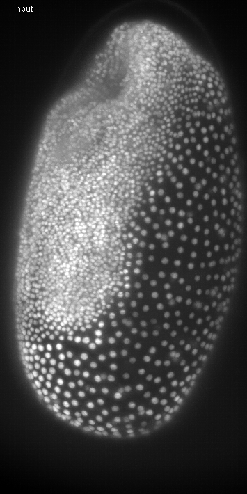
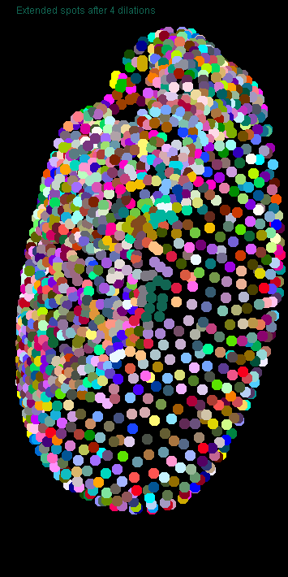
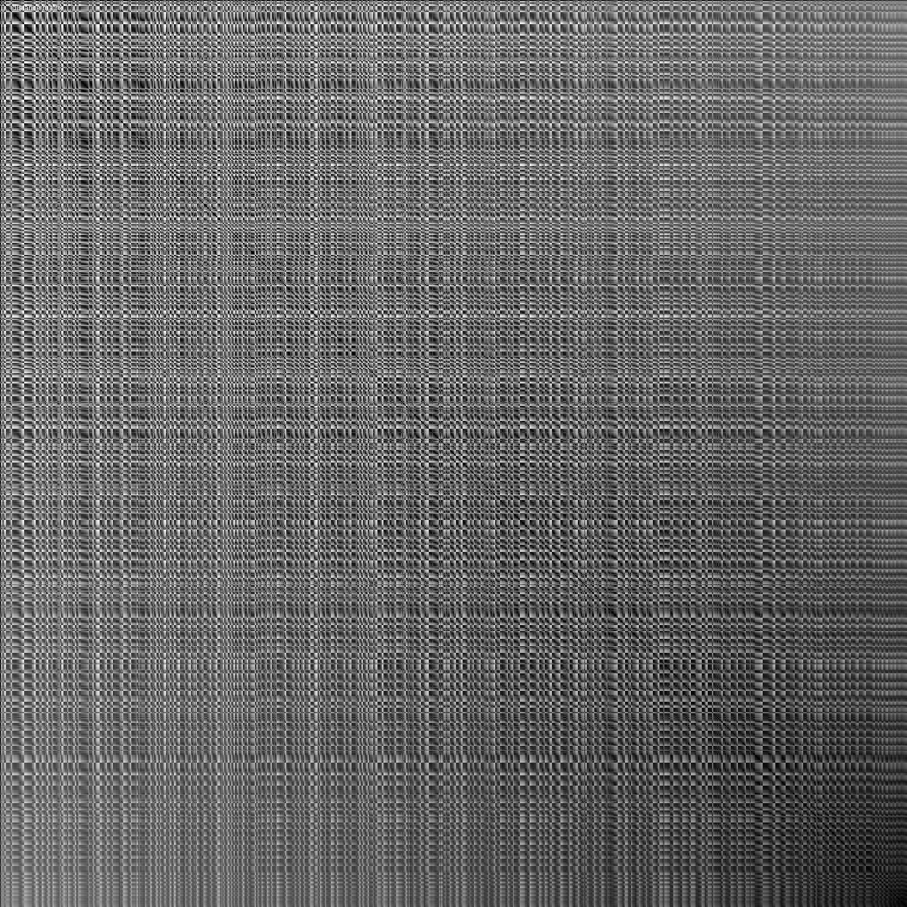

# Tribolium embryo morphometry
Author: Robert Haase
        April 2020

[Source](https://github.com/clij/clij2-docs/tree/master/src/main/macro/tribolium_morphometry.ijm)

This script is heavy GPU-accelerated processing. It is recommended to use a dedicated
graphics card with at least 8 GB of GDDR6 memory. It may otherwise be quite slow.

Let's initialize that graphics card and mesure the start time.

```java
run("CLIJ2 Macro Extensions", "cl_device=[GeForce RTX 2060 SUPER]");
Ext.CLIJ2_clear();

run("Close All");
time = getTime();
Ext.CLIJ2_startTimeTracing();
```

## Load a data set
The dataset is available [online](https://git.mpi-cbg.de/rhaase/neubias_academy_clij2/blob/master/data/lund1051_resampled.tif).
It shows a Tribolium castaneum embryo imaged using a custom light sheet microscope using a wavelength of 488nm (Imaging credits: Daniela Vorkel, Myers lab, MPI CBG). 
The data set has been resampled to a voxel size of 1x1x1 microns. The embryo expresses nuclei-GFP. We will use it for detecting nuclei and generating an estimated cell-segmentation first.

All processing steps are performed in 3D, for visualisation purposes, we're looking at maximum intensity projections in Z: 

```java
path = "C:/structure/teaching/neubias_academy_clij2/data/";
open(path + "lund1051_resampled.tif");
input = getTitle();

print("Loading took " + (getTime() - time) + " msec");

Ext.CLIJ2_push(input);
run("Close All");

// visualise the dataset
show(input, "input");
```
<pre>
> Loading took 352 msec
</pre>
<a href="image_1587983957241.png"></a>

## Spot detection
After some noise removal / smoothing, we perform local maximum detection:

```java
// gaussian blur
sigma = 2;
Ext.CLIJ2_gaussianBlur3D(input, blurred, sigma, sigma, sigma);

// detect maxima
radius = 2.0;
Ext.CLIJ2_detectMaximaBox(blurred, detected_maxima, radius);
show_spots(detected_maxima, "detected maxima");
```
<a href="image_1587983957579.png"></a>

## Spot curation
We now remove spots which are below a certain intensity and label the remaining spots.

```java
// threshold
threshold = 300.0;
Ext.CLIJ2_threshold(blurred, thresholded, threshold);

// mask
Ext.CLIJ2_mask(detected_maxima, thresholded, masked_spots);

// label spots
Ext.CLIJ2_labelSpots(masked_spots, labelled_spots);
show_spots(labelled_spots, "selected, labelled spots");
run("glasbey_on_dark");
```
<a href="image_1587983957882.png"></a>

Let's see how many spots are there:

```java
Ext.CLIJ2_getMaximumOfAllPixels(labelled_spots, number_of_spots);
print("Number of detected spots: " + number_of_spots);
```
<pre>
> Number of detected spots: 1501
</pre>

## Expanding labelled spots
We next extend the numbered spots spatially by applying a maximum filter.

```java
// labelmap closing
number_of_dilations = 10;
number_of_erosions = 4;
Ext.CLIJ2_copy(labelled_spots, flip);
for (i = 0; i < number_of_dilations; i++) {
	Ext.CLIJ2_onlyzeroOverwriteMaximumBox(flip, flop);
	Ext.CLIJ2_onlyzeroOverwriteMaximumDiamond(flop, flip);
	if (i % 2 == 0) {
		show(flip, "Extended spots after " + (i * 2) + " dilations");
		run("glasbey_on_dark");
	}
}
```
<a href="image_1587983958382.png"></a>
<a href="image_1587983958451.png"></a>
<a href="image_1587983958502.png"></a>
<a href="image_1587983958533.png"></a>
<a href="image_1587983958562.png"></a>

Afterwards, we erode the label map again and get the final result of the cell segementation

```java
Ext.CLIJ2_threshold(flip, flap, 1);
for (i = 0; i < number_of_erosions; i++) {
	Ext.CLIJ2_erodeBox(flap, flop);
	Ext.CLIJ2_erodeBox(flop, flap);
}
Ext.CLIJ2_mask(flip, flap, labels);
show(labels, "cell segmentation");
run("glasbey_on_dark");
```
<a href="image_1587983958701.png"></a>

We also save the labels to disc because other notebooks use them as starting point

```java
Ext.CLIJ2_pull(labels);
saveAs("TIF", path + "lund1051_labelled.tif");
close();

```

## Draw connectivity of the cells as mesh
We then read out the positions of the detected nuclei. 
Furthermore, using this pointlist, we can generate a distance matrix of all nuclei to each other:

```java
Ext.CLIJ2_labelledSpotsToPointList(labelled_spots, pointlist);
Ext.CLIJ2_generateDistanceMatrix(pointlist, pointlist, distance_matrix);
show(distance_matrix, "distance matrix");
```
<a href="image_1587983959641.png"></a>

Starting from the label map of the cells, we can generate a touch matrix:

```java
Ext.CLIJ2_generateTouchMatrix(labels, touch_matrix);

// we set the first column in the touch matrix to zero because we want to ignore that spots touch the background (background label 0, first column)
Ext.CLIJ2_setColumn(touch_matrix, 0, 0);
show_spots(touch_matrix, "touch matrix");
```
<a href="image_1587983960375.png"></a>

By element-wise multiplication of distance matrix and touch matrix, we know the length of 
each edge. We can use this information to draw a mesh with colour doing distance (between 0 and 50 micron):

```java
Ext.CLIJ2_multiplyImages(touch_matrix, distance_matrix, touch_matrix_with_distances);
Ext.CLIJ2_getDimensions(input, width, height, depth);
Ext.CLIJ2_create3D(mesh, width, height, depth, 32);
Ext.CLIJ2_touchMatrixToMesh(pointlist, touch_matrix_with_distances, mesh);
show(mesh, "distance mesh");
run("Green Fire Blue");
setMinAndMax(0, 50);
```
<a href="image_1587983960647.png"></a>

## Quantitative analysis of distances between neighbors
We next determine the averge distance between a node and all of its neighbors. Th result is
a vector with as many entries as nodes in the graph. We use this vector to colour-code the 
label map of the cell segmentation. This means, we replace label 1 with the average distance to 
node 1 and label 2 with the average distance to node 2.

```java
Ext.CLIJ2_averageDistanceOfTouchingNeighbors(distance_matrix, touch_matrix, distances_vector);
Ext.CLIJ2_replaceIntensities(labels, distances_vector, distance_map);
show(distance_map, "distance map");
run("Fire");
setMinAndMax(0, 50);

```
<a href="image_1587983960882.png"></a>

Now we measure the mean of the neighbors neighbord to their neigbors and visualise it as above.

```java
Ext.CLIJ2_meanOfTouchingNeighbors(distances_vector, touch_matrix, local_mean_distances_vector);
Ext.CLIJ2_replaceIntensities(labels, local_mean_distances_vector, local_mean_pixel_count_map);
show(local_mean_pixel_count_map, "neighbor mean distance map");
run("Fire");
setMinAndMax(0, 50);
```
<a href="image_1587983961002.png"></a>

We can do the same with minimum, median and maximum distances:

```java
Ext.CLIJ2_minimumOfTouchingNeighbors(distances_vector, touch_matrix, local_minimum_distances_vector);
Ext.CLIJ2_replaceIntensities(labels, local_minimum_distances_vector, local_minimum_pixel_count_map);
show(local_minimum_pixel_count_map, "neighbor minimum distance map");
run("Fire");
setMinAndMax(0, 50);

Ext.CLIJ2_medianOfTouchingNeighbors(distances_vector, touch_matrix, local_median_distances_vector);
Ext.CLIJ2_replaceIntensities(labels, local_median_distances_vector, local_median_pixel_count_map);
show(local_median_pixel_count_map, "neighbor median distance map");
run("Fire");
setMinAndMax(0, 50);

Ext.CLIJ2_maximumOfTouchingNeighbors(distances_vector, touch_matrix, local_maximum_distances_vector);
Ext.CLIJ2_replaceIntensities(labels, local_maximum_distances_vector, local_maximum_pixel_count_map);
show(local_maximum_pixel_count_map, "neighbor maximum distance map");
run("Fire");
setMinAndMax(0, 50);
```
<a href="image_1587983961297.png"></a>
<a href="image_1587983961344.png"></a>
<a href="image_1587983961390.png"></a>

## Performance evaluation
Finally a time measurement. Note that performing this workflow with ImageJ macro markdown is slower 
as intermediate results are save to disc.

```java
print("The whole workflow took " + (getTime() - time) + " msec");

```
<pre>
> The whole workflow took 4878 msec
</pre>

### Detailed time tracing for all operations

```java
Ext.CLIJ2_stopTimeTracing();
Ext.CLIJ2_getTimeTracing(time_traces);
print(time_traces);

```
<pre>
> > timeTracing
>  > MaximumZProjection
>  < MaximumZProjection           1.8314 ms
>  > Copy
>  < Copy                         11.9354 ms
>  > GaussianBlur3D
>  < GaussianBlur3D               60.914 ms
>  > DetectMaximaBox
>  < DetectMaximaBox              54.3966 ms
>  > Maximum3DBox
>   > Copy
>   < Copy                        9.663 ms
>  < Maximum3DBox                 36.9839 ms
>  > MaximumZProjection
>  < MaximumZProjection           1.3251 ms
>  > Threshold
>   > GreaterOrEqualConstant
>   < GreaterOrEqualConstant      8.112 ms
>  < Threshold                    8.1191 ms
>  > Mask
>  < Mask                         8.5782 ms
>  > LabelSpots
>   > SumXProjection
>   < SumXProjection              3.6931 ms
>   > SumYProjection
>   < SumYProjection              0.772 ms
>  < LabelSpots                   27.6702 ms
>  > Maximum3DBox
>   > Copy
>   < Copy                        7.9996 ms
>  < Maximum3DBox                 33.2455 ms
>  > MaximumZProjection
>  < MaximumZProjection           1.2857 ms
>  > GetMaximumOfAllPixels
>   > MaximumOfAllPixels
>    > MaximumZProjection
>    < MaximumZProjection         1.5033 ms
>    > MaximumYProjection
>    < MaximumYProjection         0.3307 ms
>    > MaximumXProjection
>    < MaximumXProjection         0.2822 ms
>   < MaximumOfAllPixels          2.8497 ms
>  < GetMaximumOfAllPixels        2.853 ms
>  > Copy
>  < Copy                         7.6838 ms
>  > OnlyzeroOverwriteMaximumBox
>  < OnlyzeroOverwriteMaximumBox  12.2556 ms
>  > OnlyzeroOverwriteMaximumDiamond
>  < OnlyzeroOverwriteMaximumDiamond3.5328 ms
>  > MaximumZProjection
>  < MaximumZProjection           1.3024 ms
>  > OnlyzeroOverwriteMaximumBox
>  < OnlyzeroOverwriteMaximumBox  5.5316 ms
>  > OnlyzeroOverwriteMaximumDiamond
>  < OnlyzeroOverwriteMaximumDiamond3.3213 ms
>  > OnlyzeroOverwriteMaximumBox
>  < OnlyzeroOverwriteMaximumBox  5.5543 ms
>  > OnlyzeroOverwriteMaximumDiamond
>  < OnlyzeroOverwriteMaximumDiamond3.4918 ms
>  > MaximumZProjection
>  < MaximumZProjection           1.3056 ms
>  > OnlyzeroOverwriteMaximumBox
>  < OnlyzeroOverwriteMaximumBox  5.4981 ms
>  > OnlyzeroOverwriteMaximumDiamond
>  < OnlyzeroOverwriteMaximumDiamond3.2993 ms
>  > OnlyzeroOverwriteMaximumBox
>  < OnlyzeroOverwriteMaximumBox  5.7242 ms
>  > OnlyzeroOverwriteMaximumDiamond
>  < OnlyzeroOverwriteMaximumDiamond3.3111 ms
>  > MaximumZProjection
>  < MaximumZProjection           1.0834 ms
>  > OnlyzeroOverwriteMaximumBox
>  < OnlyzeroOverwriteMaximumBox  5.4963 ms
>  > OnlyzeroOverwriteMaximumDiamond
>  < OnlyzeroOverwriteMaximumDiamond3.5496 ms
>  > OnlyzeroOverwriteMaximumBox
>  < OnlyzeroOverwriteMaximumBox  5.4232 ms
>  > OnlyzeroOverwriteMaximumDiamond
>  < OnlyzeroOverwriteMaximumDiamond3.3376 ms
>  > MaximumZProjection
>  < MaximumZProjection           1.5244 ms
>  > OnlyzeroOverwriteMaximumBox
>  < OnlyzeroOverwriteMaximumBox  5.554 ms
>  > OnlyzeroOverwriteMaximumDiamond
>  < OnlyzeroOverwriteMaximumDiamond3.2925 ms
>  > OnlyzeroOverwriteMaximumBox
>  < OnlyzeroOverwriteMaximumBox  5.316 ms
>  > OnlyzeroOverwriteMaximumDiamond
>  < OnlyzeroOverwriteMaximumDiamond3.4267 ms
>  > MaximumZProjection
>  < MaximumZProjection           1.2454 ms
>  > OnlyzeroOverwriteMaximumBox
>  < OnlyzeroOverwriteMaximumBox  5.2776 ms
>  > OnlyzeroOverwriteMaximumDiamond
>  < OnlyzeroOverwriteMaximumDiamond3.1786 ms
>  > Threshold
>   > GreaterOrEqualConstant
>   < GreaterOrEqualConstant      8.2316 ms
>  < Threshold                    8.2367 ms
>  > ErodeBox
>  < ErodeBox                     4.5459 ms
>  > ErodeBox
>  < ErodeBox                     4.3615 ms
>  > ErodeBox
>  < ErodeBox                     4.2456 ms
>  > ErodeBox
>  < ErodeBox                     4.0463 ms
>  > ErodeBox
>  < ErodeBox                     3.917 ms
>  > ErodeBox
>  < ErodeBox                     3.814 ms
>  > ErodeBox
>  < ErodeBox                     3.7001 ms
>  > ErodeBox
>  < ErodeBox                     3.712 ms
>  > Mask
>  < Mask                         8.2385 ms
>  > MaximumZProjection
>  < MaximumZProjection           2.3052 ms
>  > LabelledSpotsToPointList
>  < LabelledSpotsToPointList     4.1808 ms
>  > GenerateDistanceMatrix
>  < GenerateDistanceMatrix       2.4192 ms
>  > MaximumZProjection
>  < MaximumZProjection           1.3112 ms
>  > GenerateTouchMatrix
>   > Set
>   < Set                         1.2894 ms
>  < GenerateTouchMatrix          4.9767 ms
>  > SetColumn
>  < SetColumn                    0.9266 ms
>  > Maximum3DBox
>  < Maximum3DBox                 2.9903 ms
>  > MaximumZProjection
>  < MaximumZProjection           0.9882 ms
>  > MultiplyImages
>  < MultiplyImages               1.4794 ms
>  > GetDimensions
>  < GetDimensions                0.0021 ms
>  > TouchMatrixToMesh
>  < TouchMatrixToMesh            9.3699 ms
>  > MaximumZProjection
>  < MaximumZProjection           0.86 ms
>  > AverageDistanceOfTouchingNeighbors
>  < AverageDistanceOfTouchingNeighbors1.3879 ms
>  > ReplaceIntensities
>  < ReplaceIntensities           10.8685 ms
>  > MaximumZProjection
>  < MaximumZProjection           0.8299 ms
>  > MeanOfTouchingNeighbors
>  < MeanOfTouchingNeighbors      1.3048 ms
>  > ReplaceIntensities
>  < ReplaceIntensities           10.3282 ms
>  > MaximumZProjection
>  < MaximumZProjection           0.8031 ms
>  > MinimumOfTouchingNeighbors
>  < MinimumOfTouchingNeighbors   1.6479 ms
>  > ReplaceIntensities
>  < ReplaceIntensities           10.1399 ms
>  > MaximumZProjection
>  < MaximumZProjection           0.8756 ms
>  > MedianOfTouchingNeighbors
>  < MedianOfTouchingNeighbors    1.129 ms
>  > ReplaceIntensities
>  < ReplaceIntensities           9.9865 ms
>  > MaximumZProjection
>  < MaximumZProjection           0.8457 ms
>  > MaximumOfTouchingNeighbors
>  < MaximumOfTouchingNeighbors   1.222 ms
>  > ReplaceIntensities
>  < ReplaceIntensities           9.7237 ms
>  > MaximumZProjection
>  < MaximumZProjection           0.8222 ms
> < timeTracing                   4882.4704 ms
>  
</pre>

Also let's see how much memory this workflow used. Cleaning up by the end is also important.

```java
Ext.CLIJ2_reportMemory();

// clean up finally.
Ext.CLIJ2_clear();

```
<pre>
> GPU contains 25 images.
> - CLIJ2_detectMaximaBox_result335[net.haesleinhuepf.clij.clearcl.ClearCLPeerPointer@cca3590] 204.8 Mb
> - CLIJ2_multiplyImages_result359[net.haesleinhuepf.clij.clearcl.ClearCLPeerPointer@2fc7592b] 8.6 Mb
> - CLIJ2_maximumOfTouchingNeighbors_result374[net.haesleinhuepf.clij.clearcl.ClearCLPeerPointer@62f4c268] 5.9 kb
> - CLIJ2_mask_result339[net.haesleinhuepf.clij.clearcl.ClearCLPeerPointer@53b99e6a] 204.8 Mb
> - CLIJ2_averageDistanceOfTouchingNeighbors_result362[net.haesleinhuepf.clij.clearcl.ClearCLPeerPointer@e824738] 5.9 kb
> - CLIJ2_replaceIntensities_result375[net.haesleinhuepf.clij.clearcl.ClearCLPeerPointer@1b1949c2] 204.8 Mb
> - CLIJ2_replaceIntensities_result372[net.haesleinhuepf.clij.clearcl.ClearCLPeerPointer@5f3a3f4b] 204.8 Mb
> - CLIJ2_onlyzeroOverwriteMaximumBox_result344[net.haesleinhuepf.clij.clearcl.ClearCLPeerPointer@40efb008] 204.8 Mb
> - CLIJ2_copy_result343[net.haesleinhuepf.clij.clearcl.ClearCLPeerPointer@5c4894aa] 204.8 Mb
> - CLIJ2_minimumOfTouchingNeighbors_result368[net.haesleinhuepf.clij.clearcl.ClearCLPeerPointer@d4e81b8] 5.9 kb
> - CLIJ2_medianOfTouchingNeighbors_result371[net.haesleinhuepf.clij.clearcl.ClearCLPeerPointer@300373d] 5.9 kb
> - CLIJ2_generateTouchMatrix_result356[net.haesleinhuepf.clij.clearcl.ClearCLPeerPointer@3ed2a8a5] 8.6 Mb
> - CLIJ2_mask_result351[net.haesleinhuepf.clij.clearcl.ClearCLPeerPointer@26a79611] 204.8 Mb
> - CLIJ2_create3D_result360[net.haesleinhuepf.clij.clearcl.ClearCLPeerPointer@5f1d903c] 204.8 Mb
> - CLIJ2_labelSpots_result340[net.haesleinhuepf.clij.clearcl.ClearCLPeerPointer@3065d086] 204.8 Mb
> - CLIJ2_threshold_result350[net.haesleinhuepf.clij.clearcl.ClearCLPeerPointer@5da6ed3d] 204.8 Mb
> - lund1051_resampled.tif[net.haesleinhuepf.clij.clearcl.ClearCLPeerPointer@761ae1ac] 204.8 Mb
> - CLIJ2_meanOfTouchingNeighbors_result365[net.haesleinhuepf.clij.clearcl.ClearCLPeerPointer@6c17f660] 5.9 kb
> - CLIJ2_replaceIntensities_result369[net.haesleinhuepf.clij.clearcl.ClearCLPeerPointer@5fb807ae] 204.8 Mb
> - CLIJ2_replaceIntensities_result366[net.haesleinhuepf.clij.clearcl.ClearCLPeerPointer@359dd661] 204.8 Mb
> - CLIJ2_replaceIntensities_result363[net.haesleinhuepf.clij.clearcl.ClearCLPeerPointer@14ab46ff] 204.8 Mb
> - CLIJ2_labelledSpotsToPointList_result353[net.haesleinhuepf.clij.clearcl.ClearCLPeerPointer@475c16fc] 17.6 kb
> - CLIJ2_generateDistanceMatrix_result354[net.haesleinhuepf.clij.clearcl.ClearCLPeerPointer@58c6ecce] 8.6 Mb
> - CLIJ2_threshold_result338[net.haesleinhuepf.clij.clearcl.ClearCLPeerPointer@3331769] 204.8 Mb
> - CLIJ2_gaussianBlur3D_result334[net.haesleinhuepf.clij.clearcl.ClearCLPeerPointer@4de1254e] 204.8 Mb
> = 3.2 Gb
>  
</pre>

The following are convienence methods for proper visualisation in a noteboook:

```java
function show(input, text) {
	Ext.CLIJ2_maximumZProjection(input, max_projection);
	Ext.CLIJ2_pull(max_projection);
	setColor(100000);
	drawString(text, 20, 20);
	Ext.CLIJ2_release(max_projection);
}

function show_spots(input, text) {
	Ext.CLIJ2_maximum3DBox(input, extended, 1, 1, 0);
	Ext.CLIJ2_maximumZProjection(extended, max_projection);
	Ext.CLIJ2_pull(max_projection);
	setColor(100000);
	drawString(text, 20, 20);
	Ext.CLIJ2_release(extended);
	Ext.CLIJ2_release(max_projection);
}
```


```
```
