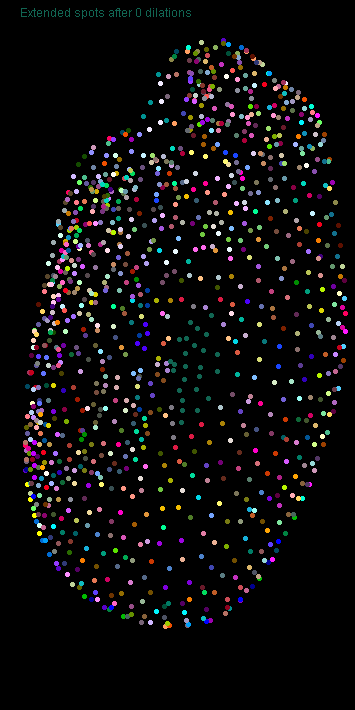
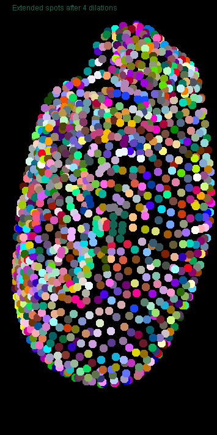
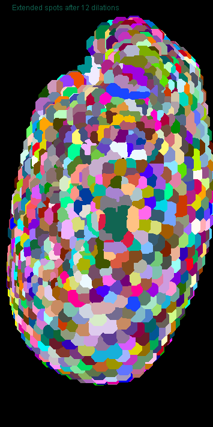
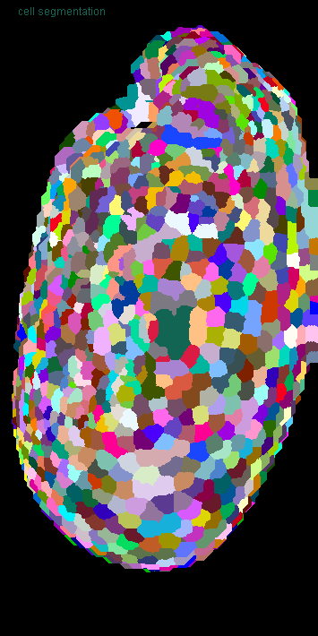
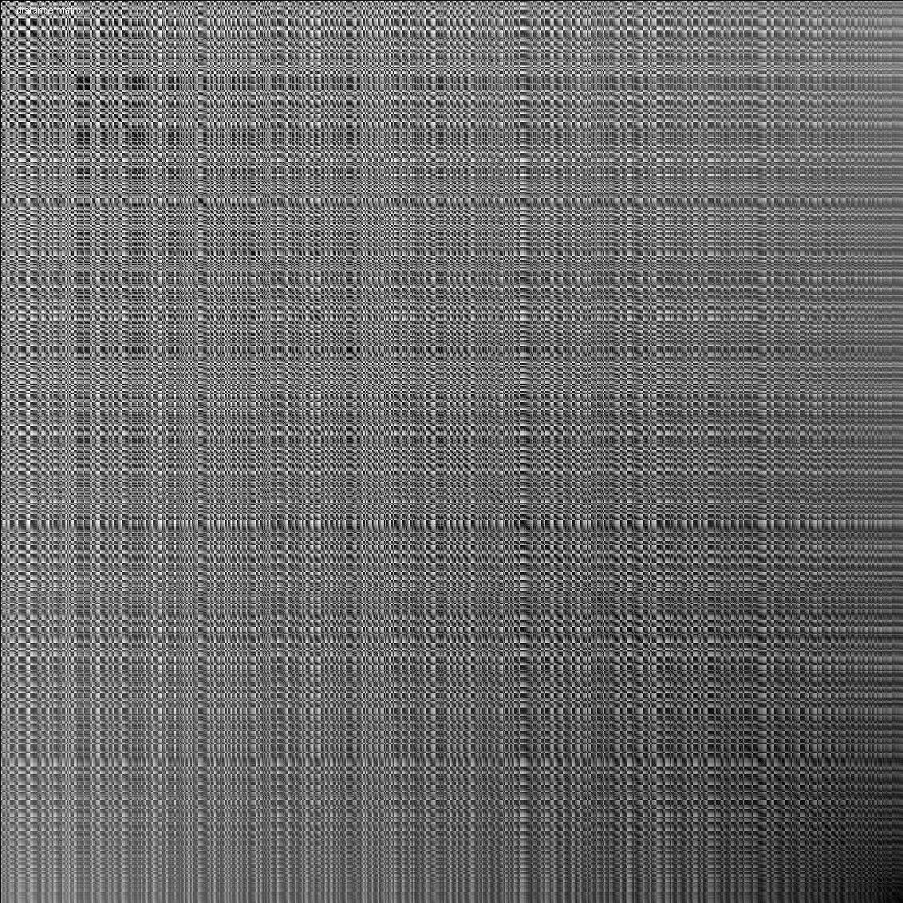
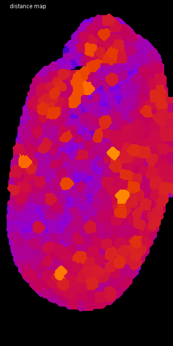
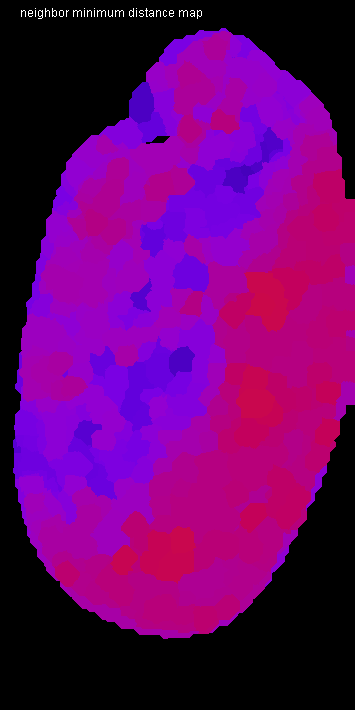
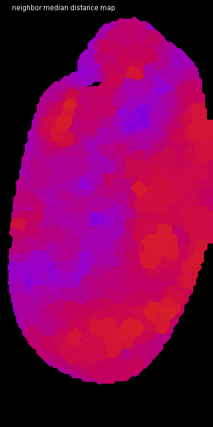
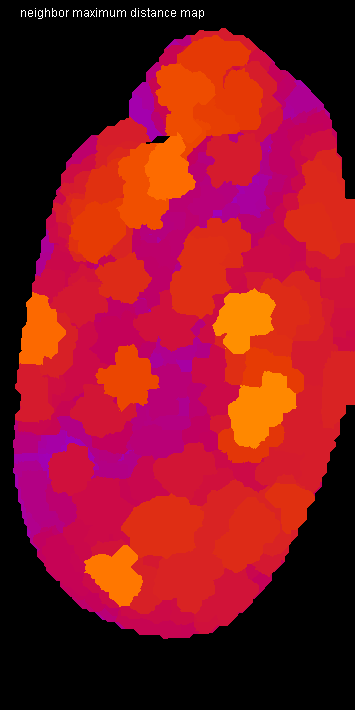
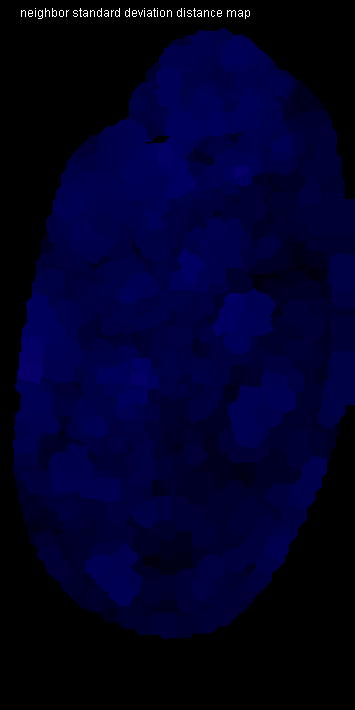

# Tribolium embryo morphometry
Authors: Robert Haase, Daniela Vorkel, April 2020

[Source](https://github.com/clij/clij2-docs/tree/master/src/main/macro/tribolium_morphometry.ijm)

This script is an example of heavy GPU-accelerated processing. It is recommended to use a dedicated
graphics card with at least 8 GB of GDDR6 memory. Otherwise, it may be quite slow.

Let's initialize that graphics card and mesure the start time.

<pre class="highlight">
run("CLIJ2 Macro Extensions", "cl_device=[GeForce RTX 2060 SUPER]");
Ext.<a href="https://clij.github.io/clij2-docs/reference_clear">CLIJ2_clear</a>();

run("Close All");
time = getTime();
Ext.CLIJ2_startTimeTracing();
</pre>

## Load a data set
The dataset is available [online](https://git.mpi-cbg.de/rhaase/clij2_example_data/blob/master/lund1051_resampled.tif).
It shows a *Tribolium castaneum* embryo, imaged by a custom light sheet microscope, at a wavelength of 488nm (Imaging credits: Daniela Vorkel, Myers lab, MPI CBG). 
The data set has been resampled to a voxel size of 1x1x1 microns. The embryo expresses nuclei-GFP. We will use the dataset to detect nuclei and to generate an estimated cell-segmentation.

All processing steps are performed in 3D space. For visualization purpose, we are using the maximum intensity projection in Z: 

<pre class="highlight">
path = "C:/structure/teaching/clij2_example_data/";
open(path + "lund1051_resampled.tif");
input = getTitle();

print("Loading took " + (getTime() - time) + " msec");

Ext.<a href="https://clij.github.io/clij2-docs/reference_push">CLIJ2_push</a>(input);
run("Close All");

// visualize the dataset
show(input, "input");
</pre>
<pre>
> Loading took 262 msec
</pre>

## Spot detection
After some noise removal/smoothing, we perform a local maximum detection:

<pre class="highlight">
// gaussian blur
sigma = 2;
Ext.<a href="https://clij.github.io/clij2-docs/reference_gaussianBlur3D">CLIJ2_gaussianBlur3D</a>(input, blurred, sigma, sigma, sigma);

// detect maxima
radius = 2.0;
Ext.<a href="https://clij.github.io/clij2-docs/reference_detectMaximaBox">CLIJ2_detectMaximaBox</a>(blurred, detected_maxima, radius);
show_spots(detected_maxima, "detected maxima");
</pre>

## Spot curation
Now, we remove spots with values below a certain intensity and label the remaining spots.

<pre class="highlight">
// threshold
threshold = 300.0;
Ext.<a href="https://clij.github.io/clij2-docs/reference_threshold">CLIJ2_threshold</a>(blurred, thresholded, threshold);

// mask
Ext.<a href="https://clij.github.io/clij2-docs/reference_mask">CLIJ2_mask</a>(detected_maxima, thresholded, masked_spots);

// label spots
Ext.<a href="https://clij.github.io/clij2-docs/reference_labelSpots">CLIJ2_labelSpots</a>(masked_spots, labelled_spots);
show_spots(labelled_spots, "selected, labelled spots");
run("glasbey_on_dark");
</pre>

Let's see how many spots are left:

<pre class="highlight">
Ext.<a href="https://clij.github.io/clij2-docs/reference_getMaximumOfAllPixels">CLIJ2_getMaximumOfAllPixels</a>(labelled_spots, number_of_spots);
print("Number of detected spots: " + number_of_spots);
</pre>
<pre>
> Number of detected spots: 1131
</pre>

## Expanding labelled spots
Next, we spatially extend the labelled spots by applying a maximum filter.

<pre class="highlight">
// label map closing
number_of_dilations = 10;
number_of_erosions = 4;
Ext.<a href="https://clij.github.io/clij2-docs/reference_copy">CLIJ2_copy</a>(labelled_spots, flip);
for (i = 0; i < number_of_dilations; i++) {
	Ext.<a href="https://clij.github.io/clij2-docs/reference_onlyzeroOverwriteMaximumBox">CLIJ2_onlyzeroOverwriteMaximumBox</a>(flip, flop);
	Ext.<a href="https://clij.github.io/clij2-docs/reference_onlyzeroOverwriteMaximumDiamond">CLIJ2_onlyzeroOverwriteMaximumDiamond</a>(flop, flip);
	if (i % 2 == 0) {
		show(flip, "Extended spots after " + (i * 2) + " dilations");
		run("glasbey_on_dark");
	}
}
</pre>

Afterwards, we erode all labels in the map and get a final result of cell segementation.

<pre class="highlight">
Ext.<a href="https://clij.github.io/clij2-docs/reference_threshold">CLIJ2_threshold</a>(flip, flap, 1);
for (i = 0; i < number_of_erosions; i++) {
	Ext.<a href="https://clij.github.io/clij2-docs/reference_erodeBox">CLIJ2_erodeBox</a>(flap, flop);
	Ext.<a href="https://clij.github.io/clij2-docs/reference_erodeBox">CLIJ2_erodeBox</a>(flop, flap);
}
Ext.<a href="https://clij.github.io/clij2-docs/reference_mask">CLIJ2_mask</a>(flip, flap, labels);
show(labels, "cell segmentation");
run("glasbey_on_dark");
</pre>

We also save all labels to disc to use them as starting point in other notebooks, later.

<pre class="highlight">
Ext.<a href="https://clij.github.io/clij2-docs/reference_pull">CLIJ2_pull</a>(labels);
saveAs("TIF", path + "lund1051_labelled.tif");
close();

</pre>

## Draw connectivity of the cells as a mesh
We then read out all current positions of detected nuclei as a pointlist to generate 
a distance matrix of all nuclei towards each other:

<pre class="highlight">
Ext.<a href="https://clij.github.io/clij2-docs/reference_labelledSpotsToPointList">CLIJ2_labelledSpotsToPointList</a>(labelled_spots, pointlist);
Ext.<a href="https://clij.github.io/clij2-docs/reference_generateDistanceMatrix">CLIJ2_generateDistanceMatrix</a>(pointlist, pointlist, distance_matrix);
show(distance_matrix, "distance matrix");
</pre>

Starting from the label map of segmented cells, we generate a touch matrix:

<pre class="highlight">
Ext.<a href="https://clij.github.io/clij2-docs/reference_generateTouchMatrix">CLIJ2_generateTouchMatrix</a>(labels, touch_matrix);

// touch matrix:
show_spots(touch_matrix, "touch matrix");
</pre>

Using element by element multiplication of a distance matrix and a touch matrix, we calculate the length of 
each edge. We use this result to draw a mesh with a color gradient of distance (between 0 and 50 micron):

<pre class="highlight">
Ext.<a href="https://clij.github.io/clij2-docs/reference_multiplyImages">CLIJ2_multiplyImages</a>(touch_matrix, distance_matrix, touch_matrix_with_distances);
Ext.<a href="https://clij.github.io/clij2-docs/reference_getDimensions">CLIJ2_getDimensions</a>(input, width, height, depth);
Ext.<a href="https://clij.github.io/clij2-docs/reference_create3D">CLIJ2_create3D</a>(mesh, width, height, depth, 32);
Ext.<a href="https://clij.github.io/clij2-docs/reference_touchMatrixToMesh">CLIJ2_touchMatrixToMesh</a>(pointlist, touch_matrix_with_distances, mesh);
show(mesh, "distance mesh");
run("Green Fire Blue");
setMinAndMax(0, 50);
</pre>

## Quantitative analysis of distance between neighbors
Next, we determine the averge distance between a node and of all its neighbors. The resulting 
vector has as many entries as nodes in the graph. We use this vector to color-code the 
label map of segmented cells. This means, label 1 gets replaced by the average distance to 
node 1, label 2 by the average distance to node 2, et cetera.

<pre class="highlight">

Ext.<a href="https://clij.github.io/clij2-docs/reference_averageDistanceOfTouchingNeighbors">CLIJ2_averageDistanceOfTouchingNeighbors</a>(distance_matrix, touch_matrix, distances_vector);
// set the first column to zero to ignore all object touching the background
Ext.<a href="https://clij.github.io/clij2-docs/reference_setColumn">CLIJ2_setColumn</a>(distances_vector, 0, 0);
Ext.<a href="https://clij.github.io/clij2-docs/reference_setColumn">CLIJ2_setColumn</a>(touch_matrix, 0, 0);

Ext.<a href="https://clij.github.io/clij2-docs/reference_replaceIntensities">CLIJ2_replaceIntensities</a>(labels, distances_vector, distance_map);
show(distance_map, "distance map");
run("Fire");
setMinAndMax(0, 50);

</pre>

Now, we measure the mean between neighbors and visualize it as above.

<pre class="highlight">
Ext.<a href="https://clij.github.io/clij2-docs/reference_meanOfTouchingNeighbors">CLIJ2_meanOfTouchingNeighbors</a>(distances_vector, touch_matrix, local_mean_distances_vector);
Ext.<a href="https://clij.github.io/clij2-docs/reference_replaceIntensities">CLIJ2_replaceIntensities</a>(labels, local_mean_distances_vector, local_mean_pixel_count_map);
show(local_mean_pixel_count_map, "neighbor mean distance map");
run("Fire");
setMinAndMax(0, 50);
</pre>

We can also use the minimum, median and maximum to measure distances:

<pre class="highlight">
Ext.<a href="https://clij.github.io/clij2-docs/reference_minimumOfTouchingNeighbors">CLIJ2_minimumOfTouchingNeighbors</a>(distances_vector, touch_matrix, local_minimum_distances_vector);
Ext.<a href="https://clij.github.io/clij2-docs/reference_replaceIntensities">CLIJ2_replaceIntensities</a>(labels, local_minimum_distances_vector, local_minimum_pixel_count_map);
show(local_minimum_pixel_count_map, "neighbor minimum distance map");
run("Fire");
setMinAndMax(0, 50);

Ext.<a href="https://clij.github.io/clij2-docs/reference_medianOfTouchingNeighbors">CLIJ2_medianOfTouchingNeighbors</a>(distances_vector, touch_matrix, local_median_distances_vector);
Ext.<a href="https://clij.github.io/clij2-docs/reference_replaceIntensities">CLIJ2_replaceIntensities</a>(labels, local_median_distances_vector, local_median_pixel_count_map);
show(local_median_pixel_count_map, "neighbor median distance map");
run("Fire");
setMinAndMax(0, 50);

Ext.<a href="https://clij.github.io/clij2-docs/reference_maximumOfTouchingNeighbors">CLIJ2_maximumOfTouchingNeighbors</a>(distances_vector, touch_matrix, local_maximum_distances_vector);
Ext.<a href="https://clij.github.io/clij2-docs/reference_replaceIntensities">CLIJ2_replaceIntensities</a>(labels, local_maximum_distances_vector, local_maximum_pixel_count_map);
show(local_maximum_pixel_count_map, "neighbor maximum distance map");
run("Fire");
setMinAndMax(0, 50);

Ext.<a href="https://clij.github.io/clij2-docs/reference_standardDeviationOfTouchingNeighbors">CLIJ2_standardDeviationOfTouchingNeighbors</a>(distances_vector, touch_matrix, local_stddev_distances_vector);
Ext.<a href="https://clij.github.io/clij2-docs/reference_replaceIntensities">CLIJ2_replaceIntensities</a>(labels, local_stddev_distances_vector, local_stddev_pixel_count_map);
show(local_stddev_pixel_count_map, "neighbor standard deviation distance map");
run("Fire");
setMinAndMax(0, 50);

</pre>

## Performance evaluation
Finally, a time measurement. Note that performing this workflow in ImageJ macro markdown is slower, 
because intermediate results are saved to disc.

<pre class="highlight">
print("The whole workflow took " + (getTime() - time) + " msec");

</pre>
<pre>
> The whole workflow took 4212 msec
</pre>

### Detailed time tracing for all operations

<pre class="highlight">
Ext.CLIJ2_stopTimeTracing();
Ext.CLIJ2_getTimeTracing(time_traces);
print(time_traces);

</pre>
<pre>
> > timeTracing
>  > MaximumZProjection
>  < MaximumZProjection           3.0558 ms
>  > Copy
>  < Copy                         8.9253 ms
>  > GaussianBlur3D
>  < GaussianBlur3D               43.3455 ms
>  > DetectMaximaBox
>   > Mean3DBox
>   < Mean3DBox                   38.1869 ms
>  < DetectMaximaBox              55.5149 ms
>  > Maximum3DBox
>   > Copy
>   < Copy                        8.2141 ms
>  < Maximum3DBox                 37.1333 ms
>  > MaximumZProjection
>  < MaximumZProjection           1.693 ms
>  > Threshold
>   > GreaterOrEqualConstant
>   < GreaterOrEqualConstant      8.5761 ms
>  < Threshold                    8.5929 ms
>  > Mask
>  < Mask                         8.7313 ms
>  > LabelSpots
>   > SumXProjection
>   < SumXProjection              3.9176 ms
>   > SumYProjection
>   < SumYProjection              0.7147 ms
>  < LabelSpots                   26.6493 ms
>  > Maximum3DBox
>   > Copy
>   < Copy                        8.6593 ms
>  < Maximum3DBox                 33.8808 ms
>  > MaximumZProjection
>  < MaximumZProjection           1.1092 ms
>  > GetMaximumOfAllPixels
>   > MaximumOfAllPixels
>    > MaximumZProjection
>    < MaximumZProjection         1.3519 ms
>    > MaximumYProjection
>    < MaximumYProjection         0.3098 ms
>    > MaximumXProjection
>    < MaximumXProjection         0.2627 ms
>   < MaximumOfAllPixels          2.6475 ms
>  < GetMaximumOfAllPixels        2.6851 ms
>  > Copy
>  < Copy                         8.5598 ms
>  > OnlyzeroOverwriteMaximumBox
>  < OnlyzeroOverwriteMaximumBox  12.406 ms
>  > OnlyzeroOverwriteMaximumDiamond
>  < OnlyzeroOverwriteMaximumDiamond2.8357 ms
>  > MaximumZProjection
>  < MaximumZProjection           2.3949 ms
>  > OnlyzeroOverwriteMaximumBox
>  < OnlyzeroOverwriteMaximumBox  7.3341 ms
>  > OnlyzeroOverwriteMaximumDiamond
>  < OnlyzeroOverwriteMaximumDiamond2.766 ms
>  > OnlyzeroOverwriteMaximumBox
>  < OnlyzeroOverwriteMaximumBox  5.1185 ms
>  > OnlyzeroOverwriteMaximumDiamond
>  < OnlyzeroOverwriteMaximumDiamond2.7779 ms
>  > MaximumZProjection
>  < MaximumZProjection           1.3575 ms
>  > OnlyzeroOverwriteMaximumBox
>  < OnlyzeroOverwriteMaximumBox  5.5389 ms
>  > OnlyzeroOverwriteMaximumDiamond
>  < OnlyzeroOverwriteMaximumDiamond3.5037 ms
>  > OnlyzeroOverwriteMaximumBox
>  < OnlyzeroOverwriteMaximumBox  5.1248 ms
>  > OnlyzeroOverwriteMaximumDiamond
>  < OnlyzeroOverwriteMaximumDiamond2.6955 ms
>  > MaximumZProjection
>  < MaximumZProjection           1.1574 ms
>  > OnlyzeroOverwriteMaximumBox
>  < OnlyzeroOverwriteMaximumBox  7.4495 ms
>  > OnlyzeroOverwriteMaximumDiamond
>  < OnlyzeroOverwriteMaximumDiamond2.6414 ms
>  > OnlyzeroOverwriteMaximumBox
>  < OnlyzeroOverwriteMaximumBox  4.9034 ms
>  > OnlyzeroOverwriteMaximumDiamond
>  < OnlyzeroOverwriteMaximumDiamond2.6411 ms
>  > MaximumZProjection
>  < MaximumZProjection           1.5875 ms
>  > OnlyzeroOverwriteMaximumBox
>  < OnlyzeroOverwriteMaximumBox  5.1241 ms
>  > OnlyzeroOverwriteMaximumDiamond
>  < OnlyzeroOverwriteMaximumDiamond4.6976 ms
>  > OnlyzeroOverwriteMaximumBox
>  < OnlyzeroOverwriteMaximumBox  4.8146 ms
>  > OnlyzeroOverwriteMaximumDiamond
>  < OnlyzeroOverwriteMaximumDiamond2.4198 ms
>  > MaximumZProjection
>  < MaximumZProjection           1.1578 ms
>  > OnlyzeroOverwriteMaximumBox
>  < OnlyzeroOverwriteMaximumBox  4.9954 ms
>  > OnlyzeroOverwriteMaximumDiamond
>  < OnlyzeroOverwriteMaximumDiamond2.6583 ms
>  > Threshold
>   > GreaterOrEqualConstant
>   < GreaterOrEqualConstant      8.351 ms
>  < Threshold                    8.363 ms
>  > ErodeBox
>  < ErodeBox                     3.4206 ms
>  > ErodeBox
>  < ErodeBox                     3.239 ms
>  > ErodeBox
>  < ErodeBox                     3.1064 ms
>  > ErodeBox
>  < ErodeBox                     3.0109 ms
>  > ErodeBox
>  < ErodeBox                     2.9036 ms
>  > ErodeBox
>  < ErodeBox                     3.4393 ms
>  > ErodeBox
>  < ErodeBox                     2.7671 ms
>  > ErodeBox
>  < ErodeBox                     2.6015 ms
>  > Mask
>  < Mask                         8.0967 ms
>  > MaximumZProjection
>  < MaximumZProjection           2.5803 ms
>  > LabelledSpotsToPointList
>  < LabelledSpotsToPointList     1.3268 ms
>  > GenerateDistanceMatrix
>  < GenerateDistanceMatrix       1.8559 ms
>  > MaximumZProjection
>  < MaximumZProjection           0.9692 ms
>  > GenerateTouchMatrix
>   > Set
>   < Set                         0.9494 ms
>  < GenerateTouchMatrix          2.6988 ms
>  > Maximum3DBox
>  < Maximum3DBox                 2.241 ms
>  > MaximumZProjection
>  < MaximumZProjection           0.761 ms
>  > MultiplyImages
>  < MultiplyImages               0.996 ms
>  > GetDimensions
>  < GetDimensions                0.0041 ms
>  > TouchMatrixToMesh
>  < TouchMatrixToMesh            7.7129 ms
>  > MaximumZProjection
>  < MaximumZProjection           0.6681 ms
>  > AverageDistanceOfTouchingNeighbors
>  < AverageDistanceOfTouchingNeighbors1.1876 ms
>  > SetColumn
>  < SetColumn                    0.2574 ms
>  > SetColumn
>  < SetColumn                    0.2081 ms
>  > ReplaceIntensities
>  < ReplaceIntensities           7.4843 ms
>  > MaximumZProjection
>  < MaximumZProjection           0.8063 ms
>  > MeanOfTouchingNeighbors
>  < MeanOfTouchingNeighbors      0.8213 ms
>  > ReplaceIntensities
>  < ReplaceIntensities           7.4974 ms
>  > MaximumZProjection
>  < MaximumZProjection           0.7669 ms
>  > MinimumOfTouchingNeighbors
>  < MinimumOfTouchingNeighbors   1.218 ms
>  > ReplaceIntensities
>  < ReplaceIntensities           8.851 ms
>  > MaximumZProjection
>  < MaximumZProjection           0.6656 ms
>  > MedianOfTouchingNeighbors
>  < MedianOfTouchingNeighbors    0.8338 ms
>  > ReplaceIntensities
>  < ReplaceIntensities           7.4886 ms
>  > MaximumZProjection
>  < MaximumZProjection           0.698 ms
>  > MaximumOfTouchingNeighbors
>  < MaximumOfTouchingNeighbors   0.8146 ms
>  > ReplaceIntensities
>  < ReplaceIntensities           7.6241 ms
>  > MaximumZProjection
>  < MaximumZProjection           0.7418 ms
>  > ReplaceIntensities
>  < ReplaceIntensities           10.055 ms
>  > MaximumZProjection
>  < MaximumZProjection           0.6769 ms
> < timeTracing                   4217.3629 ms
>  
</pre>

Also, let's see how much of GPU memory got used by this workflow. At the end, cleaning up remains important.

<pre class="highlight">
Ext.<a href="https://clij.github.io/clij2-docs/reference_reportMemory">CLIJ2_reportMemory</a>();

// finally, clean up
Ext.<a href="https://clij.github.io/clij2-docs/reference_clear">CLIJ2_clear</a>();

</pre>
<pre>
> GPU contains 27 images.
> - CLIJ2_threshold_result147[net.haesleinhuepf.clij.clearcl.ClearCLPeerPointer@4aed9ac6] 204.8 Mb
> - CLIJ2_copy_result152[net.haesleinhuepf.clij.clearcl.ClearCLPeerPointer@647e2cd9] 204.8 Mb
> - CLIJ2_mask_result160[net.haesleinhuepf.clij.clearcl.ClearCLPeerPointer@5e1e67e5] 204.8 Mb
> - CLIJ2_medianOfTouchingNeighbors_result180[net.haesleinhuepf.clij.clearcl.ClearCLPeerPointer@1bc7d684] 4.4 kb
> - CLIJ2_onlyzeroOverwriteMaximumBox_result153[net.haesleinhuepf.clij.clearcl.ClearCLPeerPointer@278423e9] 204.8 Mb
> - CLIJ2_generateTouchMatrix_result165[net.haesleinhuepf.clij.clearcl.ClearCLPeerPointer@24ba7420] 4.9 Mb
> - CLIJ2_mask_result148[net.haesleinhuepf.clij.clearcl.ClearCLPeerPointer@3cdbad4f] 204.8 Mb
> - CLIJ2_minimumOfTouchingNeighbors_result177[net.haesleinhuepf.clij.clearcl.ClearCLPeerPointer@75664d18] 4.4 kb
> - CLIJ2_standardDeviationOfTouchingNeighbors_result186[net.haesleinhuepf.clij.clearcl.ClearCLPeerPointer@5c0e5669] 4.4 kb
> - CLIJ2_replaceIntensities_result178[net.haesleinhuepf.clij.clearcl.ClearCLPeerPointer@714abdf4] 204.8 Mb
> - CLIJ2_generateDistanceMatrix_result163[net.haesleinhuepf.clij.clearcl.ClearCLPeerPointer@5079f7bb] 4.9 Mb
> - CLIJ2_replaceIntensities_result175[net.haesleinhuepf.clij.clearcl.ClearCLPeerPointer@11e8e0d2] 204.8 Mb
> - CLIJ2_replaceIntensities_result172[net.haesleinhuepf.clij.clearcl.ClearCLPeerPointer@611620cf] 204.8 Mb
> - CLIJ2_labelledSpotsToPointList_result162[net.haesleinhuepf.clij.clearcl.ClearCLPeerPointer@422d7f4] 13.3 kb
> - CLIJ2_threshold_result159[net.haesleinhuepf.clij.clearcl.ClearCLPeerPointer@7fb9001e] 204.8 Mb
> - CLIJ2_gaussianBlur3D_result143[net.haesleinhuepf.clij.clearcl.ClearCLPeerPointer@32ac0328] 204.8 Mb
> - lund1051_resampled.tif[net.haesleinhuepf.clij.clearcl.ClearCLPeerPointer@31d3243a] 204.8 Mb
> - CLIJ2_create3D_result169[net.haesleinhuepf.clij.clearcl.ClearCLPeerPointer@75c28e4a] 204.8 Mb
> - CLIJ2_labelSpots_result149[net.haesleinhuepf.clij.clearcl.ClearCLPeerPointer@4520f753] 204.8 Mb
> - CLIJ2_multiplyImages_result168[net.haesleinhuepf.clij.clearcl.ClearCLPeerPointer@7a4ff104] 4.9 Mb
> - CLIJ2_meanOfTouchingNeighbors_result174[net.haesleinhuepf.clij.clearcl.ClearCLPeerPointer@3ffb545a] 4.4 kb
> - CLIJ2_averageDistanceOfTouchingNeighbors_result171[net.haesleinhuepf.clij.clearcl.ClearCLPeerPointer@17583c7a] 4.4 kb
> - CLIJ2_maximumOfTouchingNeighbors_result183[net.haesleinhuepf.clij.clearcl.ClearCLPeerPointer@1aadc27d] 4.4 kb
> - CLIJ2_replaceIntensities_result187[net.haesleinhuepf.clij.clearcl.ClearCLPeerPointer@16483813] 204.8 Mb
> - CLIJ2_replaceIntensities_result184[net.haesleinhuepf.clij.clearcl.ClearCLPeerPointer@788ff501] 204.8 Mb
> - CLIJ2_replaceIntensities_result181[net.haesleinhuepf.clij.clearcl.ClearCLPeerPointer@60404005] 204.8 Mb
> - CLIJ2_detectMaximaBox_result144[net.haesleinhuepf.clij.clearcl.ClearCLPeerPointer@7faff5ba] 204.8 Mb
> = 3.4 Gb
>  
</pre>

Following methods are convenient for a proper visualization in a notebook:

<pre class="highlight">
function show(input, text) {
	Ext.<a href="https://clij.github.io/clij2-docs/reference_maximumZProjection">CLIJ2_maximumZProjection</a>(input, max_projection);
	Ext.<a href="https://clij.github.io/clij2-docs/reference_pull">CLIJ2_pull</a>(max_projection);
	setColor(100000);
	drawString(text, 20, 20);
	Ext.<a href="https://clij.github.io/clij2-docs/reference_release">CLIJ2_release</a>(max_projection);
}

function show_spots(input, text) {
	Ext.<a href="https://clij.github.io/clij2-docs/reference_maximum3DBox">CLIJ2_maximum3DBox</a>(input, extended, 1, 1, 0);
	Ext.<a href="https://clij.github.io/clij2-docs/reference_maximumZProjection">CLIJ2_maximumZProjection</a>(extended, max_projection);
	Ext.<a href="https://clij.github.io/clij2-docs/reference_pull">CLIJ2_pull</a>(max_projection);
	setColor(100000);
	drawString(text, 20, 20);
	Ext.<a href="https://clij.github.io/clij2-docs/reference_release">CLIJ2_release</a>(extended);
	Ext.<a href="https://clij.github.io/clij2-docs/reference_release">CLIJ2_release</a>(max_projection);
}
</pre>

