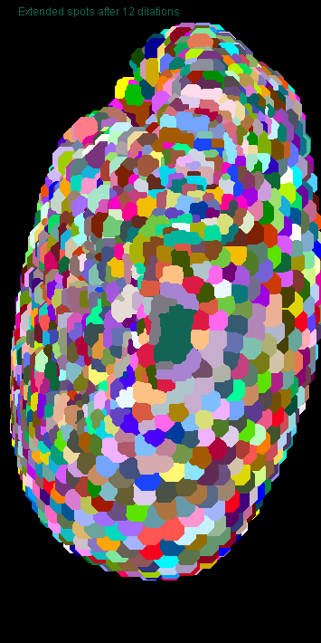
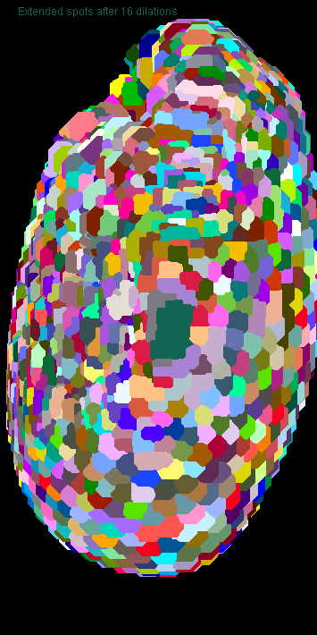
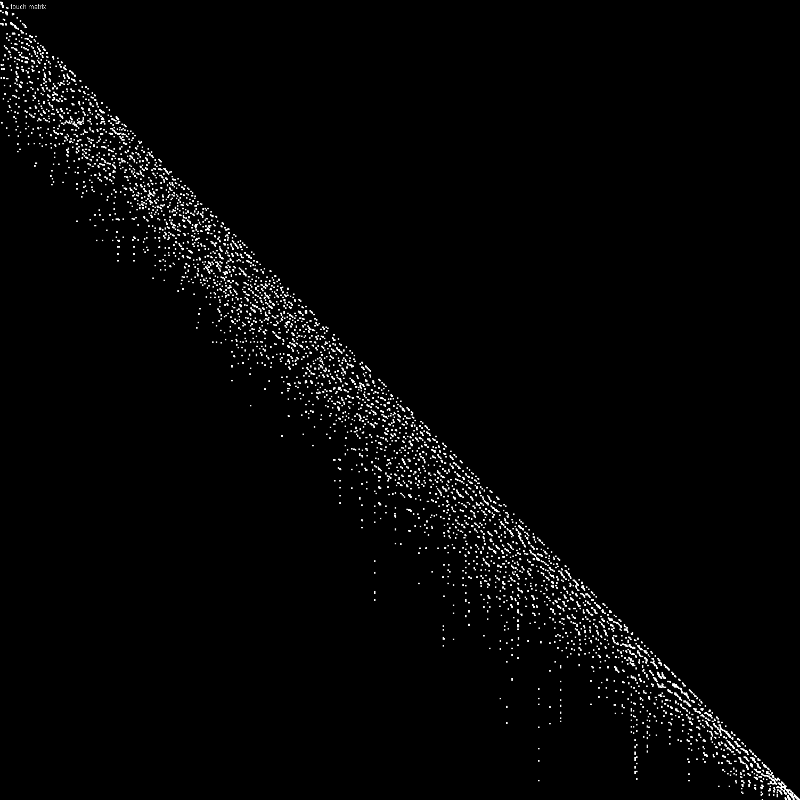
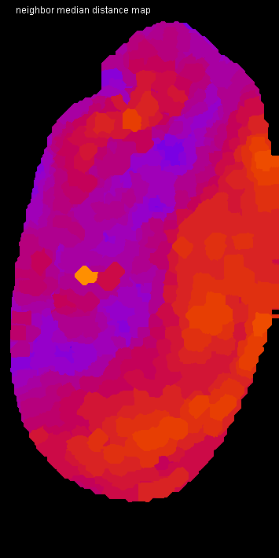

# Tribolium morphometry


Author: Robert Haase
        April 2020

This script is heavy GPU-accelerated processing. It is recommended to use a dedicated
graphics card with at least 8 GB of GDDR6 memory. It may otherwise be quite slow.

Let's initialize that graphics card and mesure the start time.

```java
run("CLIJ2 Macro Extensions", "cl_device=[GeForce RTX 2060 SUPER]");
Ext.CLIJ2_clear();

run("Close All");
time = getTime();
```

## Load a data set
The dataset is available [online](https://git.mpi-cbg.de/rhaase/neubias_academy_clij2/data/lund1051_resampled.tif). 
It shows a Tribolium castaneum embryo imaged using a custom light sheet microscope using a wavelength of 488nm. 
The data set has been resampled to a voxel size of 1x1x1 microns. The embryo expresses nuclei-GFP. We will use it for detecting nuclei and generating an estimated cell-segmentation first.

All processing steps are performed in 3D, for visualisation purposes, we're looking at maximum intensity projections in Z: 

```java
open("C:/structure/teaching/neubias_academy_clij2/data/lund1051_resampled.tif");
input = getTitle();

print("Loading took " + (getTime() - time) + " msec");

Ext.CLIJ2_push(input);
run("Close All");

// visualise the dataset
show(input, "input");
```
<pre>
> Loading took 526 msec
</pre>
<a href="image_1587413049809.png"></a>

## Spot detection
After some noise removal / smoothing, we perform local maximum detection:

```java
// gaussian blur
sigma = 2;
Ext.CLIJ2_gaussianBlur3D(input, blurred, sigma, sigma, sigma);

// detect maxima
radius = 2.0;
Ext.CLIJ2_detectMaximaBox(blurred, detected_maxima, radius);
show_spots(detected_maxima, "detected maxima");
```
<a href="image_1587413050175.png"></a>

## Spot curation
We now remove spots which are below a certain intensity and label the remaining spots.

```java
// threshold
threshold = 300.0;
Ext.CLIJ2_threshold(blurred, thresholded, threshold);

// mask
Ext.CLIJ2_mask(detected_maxima, thresholded, masked_spots);

// label spots
Ext.CLIJ2_labelSpots(masked_spots, labelled_spots);
show_spots(labelled_spots, "selected, labelled spots");
run("glasbey_on_dark");
```
<a href="image_1587413050508.png"></a>

Let's see how many spots are there:

```java
Ext.CLIJ2_getMaximumOfAllPixels(labelled_spots, number_of_spots);
print("Number of detected spots: " + number_of_spots);
```
<pre>
> Number of detected spots: 1501
</pre>

## Expanding labelled spots
We next extend the numbered spots spatially by applying a maximum filter.

```java
// labelmap closing
number_of_dilations = 10;
number_of_erosions = 4;
Ext.CLIJ2_copy(labelled_spots, flip);
for (i = 0; i < number_of_dilations; i++) {
	Ext.CLIJ2_onlyzeroOverwriteMaximumBox(flip, flop);
	Ext.CLIJ2_onlyzeroOverwriteMaximumDiamond(flop, flip);
	if (i % 2 == 0) {
		show(flip, "Extended spots after " + (i * 2) + " dilations");
		run("glasbey_on_dark");
	}
}
```
<a href="image_1587413051039.png"></a>
<a href="image_1587413051121.png"></a>
<a href="image_1587413051179.png"></a>
<a href="image_1587413051214.png"></a>
<a href="image_1587413051244.png"></a>

Afterwards, we erode the label map again and get the final result of the cell segementation

```java
Ext.CLIJ2_threshold(flip, flap, 1);
for (i = 0; i < number_of_erosions; i++) {
	Ext.CLIJ2_erodeBox(flap, flop);
	Ext.CLIJ2_erodeBox(flop, flap);
}
Ext.CLIJ2_mask(flip, flap, labels);
show(labels, "cell segmentation");
run("glasbey_on_dark");
```
<a href="image_1587413051392.png"></a>

## Draw connectivity of the cells as mesh
We then read out the positions of the detected nuclei. 
Furthermore, using this pointlist, we can generate a distance matrix of all nuclei to each other:

```java
Ext.CLIJ2_labelledSpotsToPointList(labelled_spots, pointlist);
Ext.CLIJ2_generateDistanceMatrix(pointlist, pointlist, distance_matrix);
show(distance_matrix, "distance matrix");
```
<a href="image_1587413051521.png"></a>

Starting from the label map of the cells, we can generate a touch matrix:

```java
Ext.CLIJ2_generateTouchMatrix(labels, touch_matrix);

// we set the first column in the touch matrix to zero because we want to ignore that spots touch the background (background label 0, first column)
Ext.CLIJ2_setColumn(touch_matrix, 0, 0);
show_spots(touch_matrix, "touch matrix");
```
<a href="image_1587413052305.png"></a>

By element-wise multiplication of distance matrix and touch matrix, we know the length of 
each edge. We can use this information to draw a mesh with colour doing distance (between 0 and 50 micron):

```java
Ext.CLIJ2_multiplyImages(touch_matrix, distance_matrix, touch_matrix_with_distances);
Ext.CLIJ2_getDimensions(input, width, height, depth);
Ext.CLIJ2_create3D(mesh, width, height, depth, 32);
Ext.CLIJ2_touchMatrixToMesh(pointlist, touch_matrix_with_distances, mesh);
show(mesh, "distance mesh");
run("Green Fire Blue");
setMinAndMax(0, 50);
```
<a href="image_1587413052652.png"></a>

## Quantitative analysis of distances between neighbors
We next determine the averge distance between a node and all of its neighbors. Th result is
a vector with as many entries as nodes in the graph. We use this vector to colour-code the 
label map of the cell segmentation. This means, we replace label 1 with the average distance to 
node 1 and label 2 with the average distance to node 2.

```java
Ext.CLIJ2_averageDistanceOfTouchingNeighbors(distance_matrix, touch_matrix, distances_vector);
Ext.CLIJ2_replaceIntensities(labels, distances_vector, distance_map);
show(distance_map, "distance map");
run("Fire");
setMinAndMax(0, 50);

```
<a href="image_1587413052901.png"></a>

Now we measure the mean of the neighbors neighbord to their neigbors and visualise it as above.

```java
Ext.CLIJ2_meanOfTouchingNeighbors(distances_vector, touch_matrix, local_mean_distances_vector);
Ext.CLIJ2_replaceIntensities(labels, local_mean_distances_vector, local_mean_pixel_count_map);
show(local_mean_pixel_count_map, "neighbor mean distance map");
run("Fire");
setMinAndMax(0, 50);
```
<a href="image_1587413053033.png"></a>

We can do the same with minimum, median and maximum distances:

```java
Ext.CLIJ2_minimumOfTouchingNeighbors(distances_vector, touch_matrix, local_minimum_distances_vector);
Ext.CLIJ2_replaceIntensities(labels, local_minimum_distances_vector, local_minimum_pixel_count_map);
show(local_minimum_pixel_count_map, "neighbor minimum distance map");
run("Fire");
setMinAndMax(0, 50);

Ext.CLIJ2_medianOfTouchingNeighbors(distances_vector, touch_matrix, local_median_distances_vector);
Ext.CLIJ2_replaceIntensities(labels, local_median_distances_vector, local_median_pixel_count_map);
show(local_median_pixel_count_map, "neighbor median distance map");
run("Fire");
setMinAndMax(0, 50);

Ext.CLIJ2_maximumOfTouchingNeighbors(distances_vector, touch_matrix, local_maximum_distances_vector);
Ext.CLIJ2_replaceIntensities(labels, local_maximum_distances_vector, local_maximum_pixel_count_map);
show(local_maximum_pixel_count_map, "neighbor maximum distance map");
run("Fire");
setMinAndMax(0, 50);
```
<a href="image_1587413053340.png"></a>
<a href="image_1587413053385.png"></a>
<a href="image_1587413053432.png"></a>

# Performance evaluation
Finally a time measurement. Note that performing this workflow with ImageJ macro markdown is slower 
as intermediate results are save to disc.

```java
print("The whole workflow took " + (getTime() - time) + " msec");

```
<pre>
> The whole workflow took 4627 msec
</pre>

Also let's see how much memory this workflow used. Cleaning up by the end is also important.

```java
Ext.CLIJ2_reportMemory();

```
<pre>
> GPU contains 25 images.
> - CLIJ2_threshold_result542[net.haesleinhuepf.clij.clearcl.ClearCLPeerPointer@6ef50bfc] 204.8 Mb
> - CLIJ2_mask_result543[net.haesleinhuepf.clij.clearcl.ClearCLPeerPointer@7dca5e2c] 204.8 Mb
> - CLIJ2_create3D_result552[net.haesleinhuepf.clij.clearcl.ClearCLPeerPointer@66de2436] 204.8 Mb
> - CLIJ2_medianOfTouchingNeighbors_result563[net.haesleinhuepf.clij.clearcl.ClearCLPeerPointer@7e470a95] 5.9 kb
> - CLIJ2_meanOfTouchingNeighbors_result557[net.haesleinhuepf.clij.clearcl.ClearCLPeerPointer@382b544a] 5.9 kb
> - CLIJ2_labelSpots_result532[net.haesleinhuepf.clij.clearcl.ClearCLPeerPointer@68ac249f] 204.8 Mb
> - CLIJ2_multiplyImages_result551[net.haesleinhuepf.clij.clearcl.ClearCLPeerPointer@17bf565d] 8.6 Mb
> - CLIJ2_averageDistanceOfTouchingNeighbors_result554[net.haesleinhuepf.clij.clearcl.ClearCLPeerPointer@d72f08] 5.9 kb
> - CLIJ2_replaceIntensities_result558[net.haesleinhuepf.clij.clearcl.ClearCLPeerPointer@46029e25] 204.8 Mb
> - CLIJ2_replaceIntensities_result555[net.haesleinhuepf.clij.clearcl.ClearCLPeerPointer@24e90bab] 204.8 Mb
> - CLIJ2_labelledSpotsToPointList_result545[net.haesleinhuepf.clij.clearcl.ClearCLPeerPointer@4989acd5] 17.6 kb
> - CLIJ2_gaussianBlur3D_result526[net.haesleinhuepf.clij.clearcl.ClearCLPeerPointer@709f7583] 204.8 Mb
> - CLIJ2_generateTouchMatrix_result548[net.haesleinhuepf.clij.clearcl.ClearCLPeerPointer@22be3e03] 8.6 Mb
> - CLIJ2_generateDistanceMatrix_result546[net.haesleinhuepf.clij.clearcl.ClearCLPeerPointer@4ee6cdac] 8.6 Mb
> - CLIJ2_detectMaximaBox_result527[net.haesleinhuepf.clij.clearcl.ClearCLPeerPointer@4a8d2fa1] 204.8 Mb
> - CLIJ2_threshold_result530[net.haesleinhuepf.clij.clearcl.ClearCLPeerPointer@4135681e] 204.8 Mb
> - CLIJ2_mask_result531[net.haesleinhuepf.clij.clearcl.ClearCLPeerPointer@1228081d] 204.8 Mb
> - CLIJ2_maximumOfTouchingNeighbors_result566[net.haesleinhuepf.clij.clearcl.ClearCLPeerPointer@6adb2c59] 5.9 kb
> - CLIJ2_minimumOfTouchingNeighbors_result560[net.haesleinhuepf.clij.clearcl.ClearCLPeerPointer@4988f684] 5.9 kb
> - lund1051_resampled.tif[net.haesleinhuepf.clij.clearcl.ClearCLPeerPointer@23170233] 204.8 Mb
> - CLIJ2_replaceIntensities_result567[net.haesleinhuepf.clij.clearcl.ClearCLPeerPointer@712d8eac] 204.8 Mb
> - CLIJ2_replaceIntensities_result564[net.haesleinhuepf.clij.clearcl.ClearCLPeerPointer@4227dd34] 204.8 Mb
> - CLIJ2_replaceIntensities_result561[net.haesleinhuepf.clij.clearcl.ClearCLPeerPointer@4c952f22] 204.8 Mb
> - CLIJ2_copy_result535[net.haesleinhuepf.clij.clearcl.ClearCLPeerPointer@5708ba19] 204.8 Mb
> - CLIJ2_onlyzeroOverwriteMaximumBox_result536[net.haesleinhuepf.clij.clearcl.ClearCLPeerPointer@4a4d16ba] 204.8 Mb
> = 3.2 Gb
>  
</pre>

The following are convienence methods for proper visualisation in a noteboook:

```java
function show(input, text) {
	Ext.CLIJ2_maximumZProjection(input, max_projection);
	Ext.CLIJ2_pull(max_projection);
	setColor(100000);
	drawString(text, 20, 20);
	Ext.CLIJ2_release(max_projection);
}

function show_spots(input, text) {
	Ext.CLIJ2_maximum3DBox(input, extended, 1, 1, 0);
	Ext.CLIJ2_maximumZProjection(extended, max_projection);
	Ext.CLIJ2_pull(max_projection);
	setColor(100000);
	drawString(text, 20, 20);
	Ext.CLIJ2_release(extended);
	Ext.CLIJ2_release(max_projection);
}
```


```
```
