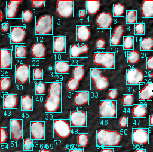

# Working with ROIs 
Authors: Robert Haase, Daniela Vorkel, April 2020

[Source](https://github.com/clij/clij2-docs/tree/master/src/main/macro/working_with_rois.ijm)

This macro shows how to apply an automated 
threshold method, how to use connected components labeling, 
and how to visualize / measure bounding boxes of objects .

<pre class="highlight">
// clean up first
run("Close All");
run("Clear Results");
if (roiManager("count") > 0) {
	roiManager("deselect");
	roiManager("delete");
}

</pre>

Get test data:

<pre class="highlight">
run("Blobs (25K)");
run("Invert LUT");
input = getTitle();

</pre>

## Initialize GPU and push image data to GPU memory

<pre class="highlight">
run("CLIJ2 Macro Extensions", "cl_device=");
Ext.CLIJ2_clear();

// push data to GPU
Ext.CLIJ2_push(input);

</pre>

## Image segmentation and labelling
Together with a threshold method, we apply a connected components analysis to separate objects.

<pre class="highlight">
Ext.<a href="https://clij.github.io/clij2-docs/reference_thresholdOtsu">CLIJ2_thresholdOtsu</a>(input, mask);
Ext.<a href="https://clij.github.io/clij2-docs/reference_connectedComponentsLabelingBox">CLIJ2_connectedComponentsLabelingBox</a>(mask, labelmap);

</pre>

## Visualization of labelled objects

<pre class="highlight">
// show the image
Ext.CLIJ2_pull(input);
// show label as ROIs on top of the image
Ext.<a href="https://clij.github.io/clij2-docs/reference_pullLabelsToROIManager">CLIJ2_pullLabelsToROIManager</a>(labelmap);
roiManager("show all");
show();
</pre>

## Analyzing labelled objects from label map and measuring their bounding box area:

<pre class="highlight">

// how many objects are in the label map?
Ext.<a href="https://clij.github.io/clij2-docs/reference_getMaximumOfAllPixels">CLIJ2_getMaximumOfAllPixels</a>(labelmap, number_of_objects);

for (i = 0; i < number_of_objects; i++) {
	// cut label map into individual masks
	Ext.<a href="https://clij.github.io/clij2-docs/reference_labelToMask">CLIJ2_labelToMask</a>(labelmap, binaryImage, i + 1); // 0 is background, 1 is the first label
	// put bounding boxes in the ROI manager
	Ext.<a href="https://clij.github.io/clij2-docs/reference_getBoundingBox">CLIJ2_getBoundingBox</a>(binaryImage, x, y, z, w, h, d);

	// draw the bounding box
	makeRectangle(x, y, w, h);
	Roi.setStrokeColor("cyan");
	roiManager("add");

	// draw the ROI number of the bounding box
	makeText("" + (i + 1), x, y + h);
	Roi.setStrokeColor("cyan");
	roiManager("add");

	// save measurements as a table
	setResult("ROI_number", i, i + 1);
	setResult("Bounding_Box_Area", i, w * h);
}

</pre>

## Bounding box visualization

<pre class="highlight">

// show the image
Ext.CLIJ2_pull(input);

// show all label as ROIs on top of the image
roiManager("show all");
show();

</pre>

At the end of the macro, clean up:

<pre class="highlight">
Ext.CLIJ2_clear();

</pre>

This is just convenient method to show images properly in the notebook: 

<pre class="highlight">

function show() {
	run("Flatten");
}
</pre>

