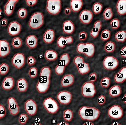
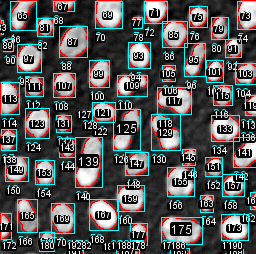

# Working with ROIs 
Author: Robert Haase
        April 2020

[Source](https://github.com/clij/clij2-docs/tree/master/src/main/macro/working_with_rois.ijm)

This macro shows how to apply an automatic 
threshold method, use connected 
components labeling
 and visualize / measure bounding boxes of objects .

<pre class="highlight">
// clean up first
run("Close All");
run("Clear Results");
if (roiManager("count") > 0) {
	roiManager("deselect");
	roiManager("delete");
}

</pre>

Get test data

<pre class="highlight">
run("Blobs (25K)");
run("Invert LUT");
input = getTitle();

</pre>

## Initialize GPU and push push image data to GPU memory

<pre class="highlight">
run("CLIJ2 Macro Extensions", "cl_device=");
Ext.CLIJ2_clear();

// push data to GPU
Ext.CLIJ2_push(input);

</pre>

## Image segmentation + labelling
We now apply a threshold method and connected components analysis to separate objects.

<pre class="highlight">
Ext.<a href="https://clij.github.io/clij2-docs/reference_thresholdOtsu">CLIJ2_thresholdOtsu</a>(input, mask);
Ext.<a href="https://clij.github.io/clij2-docs/reference_connectedComponentsLabelingBox">CLIJ2_connectedComponentsLabelingBox</a>(mask, labelmap);

</pre>

## Visualize the labelled objects

<pre class="highlight">
// show the image
Ext.CLIJ2_pull(input);
// show the labels as ROIs on top of the image
Ext.<a href="https://clij.github.io/clij2-docs/reference_pullLabelsToROIManager">CLIJ2_pullLabelsToROIManager</a>(labelmap);
roiManager("show all");
show();
</pre>

## We now go through the labelled objects in the label map and measure their bounding box area:

<pre class="highlight">

// how many objects are in the labelmap?
Ext.<a href="https://clij.github.io/clij2-docs/reference_getMaximumOfAllPixels">CLIJ2_getMaximumOfAllPixels</a>(labelmap, number_of_objects);

for (i = 0; i < number_of_objects; i++) {
	// cut label map into individual masks
	Ext.<a href="https://clij.github.io/clij2-docs/reference_labelToMask">CLIJ2_labelToMask</a>(labelmap, binaryImage, i + 1); // 0 is background, 1 is the first label
	// put bounding boxes in the ROI manager
	Ext.<a href="https://clij.github.io/clij2-docs/reference_getBoundingBox">CLIJ2_getBoundingBox</a>(binaryImage, x, y, z, w, h, d);

	// draw the bounding box
	makeRectangle(x, y, w, h);
	Roi.setStrokeColor("cyan");
	roiManager("add");

	// draw the number of the bounding box
	makeText("" + (i + 1), x, y + h);
	Roi.setStrokeColor("cyan");
	roiManager("add");

	// save measurements to a table
	setResult("ROI_number", i, i + 1);
	setResult("Bounding_Box_Area", i, w * h);
}

</pre>
<table>
<tr><th>ROI_number</th><th>Bounding_Box_Area</th></tr>
<tr><td>1</td><td>754</td></tr>
<tr><td>2</td><td>210</td></tr>
<tr><td>3</td><td>729</td></tr>
<tr><td>4</td><td>506</td></tr>
<tr><td>5</td><td>532</td></tr>
<tr><td>6</td><td>378</td></tr>
<tr><td>7</td><td>99</td></tr>
<tr><td>8</td><td>374</td></tr>
<tr><td>9</td><td>288</td></tr>
<tr><td>10</td><td>28</td></tr>
<tr><td>11</td><td>650</td></tr>
<tr><td>12</td><td>868</td></tr>
<tr><td>13</td><td>120</td></tr>
<tr><td>14</td><td>288</td></tr>
<tr><td>15</td><td>572</td></tr>
<tr><td>16</td><td>693</td></tr>
<tr><td>17</td><td>672</td></tr>
<tr><td>18</td><td>540</td></tr>
<tr><td>19</td><td>374</td></tr>
<tr><td>20</td><td>441</td></tr>
<tr><td>21</td><td>208</td></tr>
<tr><td>22</td><td>528</td></tr>
<tr><td>23</td><td>630</td></tr>
<tr><td>24</td><td>342</td></tr>
<tr><td>25</td><td>576</td></tr>
<tr><td>26</td><td>380</td></tr>
<tr><td>27</td><td>918</td></tr>
<tr><td>28</td><td>220</td></tr>
<tr><td>29</td><td>460</td></tr>
<tr><td>30</td><td>720</td></tr>
<tr><td>31</td><td>1107</td></tr>
<tr><td>32</td><td>16</td></tr>
<tr><td>33</td><td>1044</td></tr>
<tr><td>34</td><td>255</td></tr>
<tr><td>35</td><td>728</td></tr>
<tr><td>36</td><td>30</td></tr>
<tr><td>37</td><td>315</td></tr>
<tr><td>38</td><td>1350</td></tr>
<tr><td>39</td><td>690</td></tr>
<tr><td>40</td><td>304</td></tr>
<tr><td>41</td><td>208</td></tr>
<tr><td>42</td><td>529</td></tr>
<tr><td>43</td><td>552</td></tr>
<tr><td>44</td><td>323</td></tr>
<tr><td>45</td><td>456</td></tr>
<tr><td>46</td><td>783</td></tr>
<tr><td>47</td><td>484</td></tr>
<tr><td>48</td><td>702</td></tr>
<tr><td>49</td><td>102</td></tr>
<tr><td>50</td><td>221</td></tr>
<tr><td>51</td><td>660</td></tr>
<tr><td>52</td><td>899</td></tr>
<tr><td>53</td><td>690</td></tr>
<tr><td>54</td><td>260</td></tr>
<tr><td>55</td><td>702</td></tr>
<tr><td>56</td><td>1107</td></tr>
<tr><td>57</td><td>374</td></tr>
<tr><td>58</td><td>285</td></tr>
<tr><td>59</td><td>4</td></tr>
<tr><td>60</td><td>1</td></tr>
<tr><td>61</td><td>114</td></tr>
<tr><td>62</td><td>115</td></tr>
<tr><td>63</td><td>80</td></tr>
<tr><td>64</td><td>68</td></tr>
</table>

## Bounding box visualisation

<pre class="highlight">

// show the image
Ext.CLIJ2_pull(input);

// show all labels as ROIs on top of the image
roiManager("show all");
show();

</pre>

Clean up by the end

<pre class="highlight">
Ext.CLIJ2_clear();

</pre>

This is just a convenience method for showing images properly in the notebook 

<pre class="highlight">

function show() {
	run("Flatten");
}
</pre>

