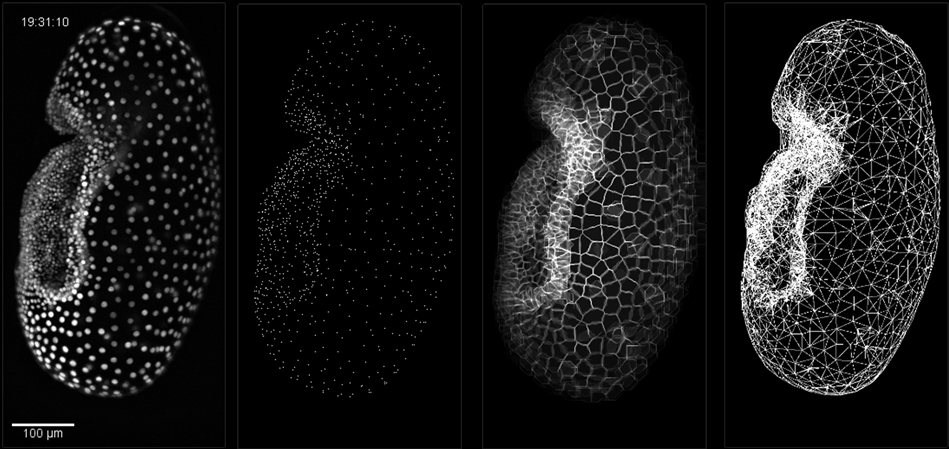
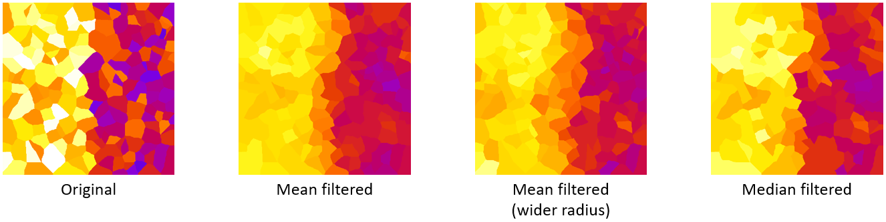
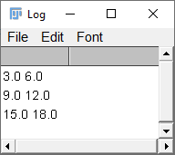
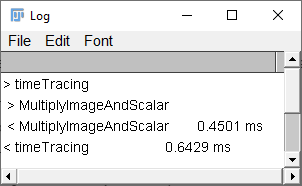
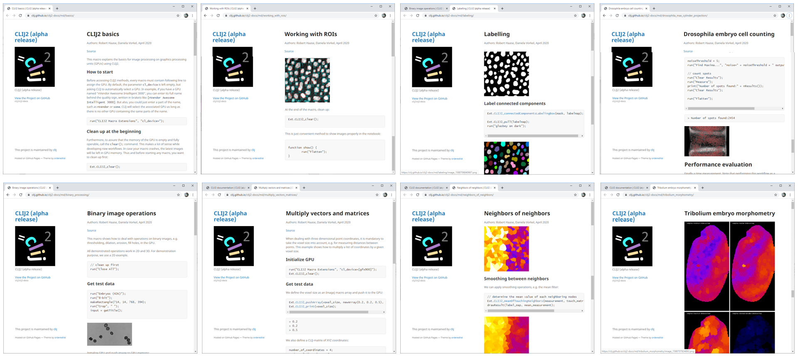
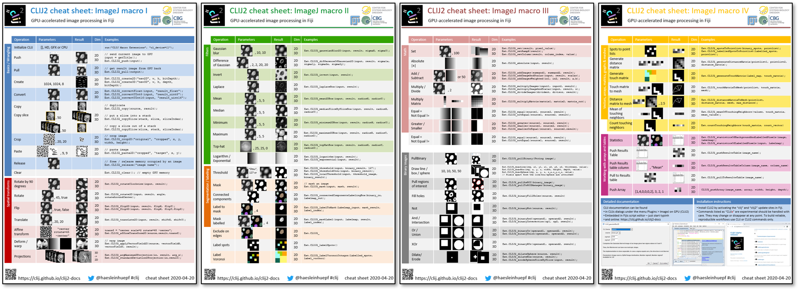

# CLIJ2 - a quick tour

 

CLIJ2 is a [Fiji](https://fiji.sc) plugin for GPU-accelerated image processing based on [OpenCL](https://opencl.prg). 
However, it is not necessary to learn OpenCL. 
CLIJ2 has about 300 predefined functions allowing you to process your images on the GPU.

It is recommended to use it from Fiji script editor using the ImageJ macro language. 
For the ease of use, auto-completion is enabled for editing CLIJ2 workflows.


Furthermore, CLIJ2 has its own menu: `Plugins > ImageJ on GPU (CLIJ2)` with sub menus offering all CLIJ functionality.


When clicking on the menu, you see a dialog asking for the parameters of the specific CLIJ operation. Furthermore, user documentation and parameter exlanation is given in the same dialog.


CLIJ is fully macro-recordable. After recording your workflow, it can be executed right away. 

[Download video](images/clij_macro_recorder.mp4)

### Vectors, matrices, pointlists, meshes and corresponding operations
CLIJ2 has various new operations for processing data structures such as 
[vectors and matrices](https://clij.github.io/clij2-docs/md/multiply_vectors_matrices), 
[for working with graphs](https://clij.github.io/clij2-docs/md/spots_pointlists_matrices_tables/) and 
[meshes](https://clij.github.io/clij2-docs/md/tribolium_morphometry/).
 

### Non-square shaped pixels, a.k.a. cells
Furthermore, CLIJ2 offers operations for [filtering images with non-square shaped pixels](https://clij.github.io/clij2-docs/md/neighbors_of_neighbors) managed using the new graph-based processing operations.
 

### ByRef
CLIJ2 operations use the [by-reference](https://en.wikipedia.org/wiki/Evaluation_strategy#Call_by_reference) concept which is well known in ImageJ macro for images and other parameters. Undefined variables can be passed over and will hold values after the operation finished. This allows simplifying code.
```
// CLIJ
Ext.CLIJ_centerOfMass(binary);
mx = getResult("MassX", nResults() - 1);
my = getResult("MassY", nResults() - 1);

// --------------------------
// CLIJ2
Ext.CLIJ2_getCenterOfMass(binary, mx, my, _);
```

### Easier debugging
CLIJ2 offers various methods for easier workflow debugging such has handling arrays and strings

```
// push array as 2x3 image
array = newArray(1, 2, 3, 4, 5, 6);
Ext.CLIJ2_pushArray(input, array, 2, 3, 1);

// do something with it
Ext.CLIJ2_multiplyImageAndScalar(input, result, 3);

// print output image
Ext.CLIJ2_print(result);
```
 

### Time tracing
To find out which operations take how much time, you can collect time traces:
```// do something while recording processing duration
Ext.CLIJ2_startTimeTracing();
Ext.CLIJ2_multiplyImageAndScalar(input, result, 3);
Ext.CLIJ2_stopTimeTracing();

// print out how long operations took
Ext.CLIJ2_getTimeTracing(time_traces);
print(time_traces);
```
 

### Memory management for Java/Jython/Groovy/JavasSript developers
Developers can name images and buffers and list memory consumption
```
CLIJ2 clij2 = CLIJ2.getInstance();

ClearCLBuffer data = clij2.create(100, 100);
data.setName("My data");

System.out.println(clij2.reportMemory());
```

Output:
```
GPU contains 1 images.
- My data 39.0 kB [My data ClearCLBuffer [mClearCLContext=ClearCLContext [device=ClearCLDevice [mClearCLPlatform=ClearCLPlatform [name=NVIDIA CUDA], name=GeForce RTX 2060 SUPER]], mNativeType=Float, mNumberOfChannels=1, mDimensions=[100, 100], getMemAllocMode()=Best, getHostAccessType()=ReadWrite, getKernelAccessType()=ReadWrite, getBackend()=net.haesleinhuepf.clij.clearcl.backend.jocl.ClearCLBackendJOCL@63e2203c, getPeerPointer()=net.haesleinhuepf.clij.clearcl.ClearCLPeerPointer@1efed156]] 39.0 kB
= 39.0 kB
```

Also the method `clij2.clear();` is new compared to CLIJ, it releases all images/buffers in GPU memory. 

## Documentation
The [CLIJ2 website](https://clij.github.io/clij2-docs/) offers extensive documentation and tutorials.
 

### New cheat sheets
The [cheat sheets](https://clij.github.io/clij2-docs/CLIJ2-cheatsheet_V3.pdf) have been updated to list new CLIJ2 operations.
 

### Installation
Update your [Fiji with the clij and clij2](https://clij.github.io/clij2-docs/installationInFiji) update sites activated, search for ["Clicy" in the Icy search bar](http://icy.bioimageanalysis.org/plugin/clicy-blocks/) or check the [installation instructions for Matlab](https://clij.github.io/clatlab/).

For exploring CLIJ further, it is recommended to read the [introduction for macro programmers](https://clij.github.io/clij2-docs/macro_intro), at the [tutorials](https://clij.github.io/clij2-docs/) and have a look at the [code examples](https://clij.github.io/clij2-docs/src/main/macro);

[Back to CLIJ documentation](https://clij.github.io/)

[Imprint](https://clij.github.io/imprint)